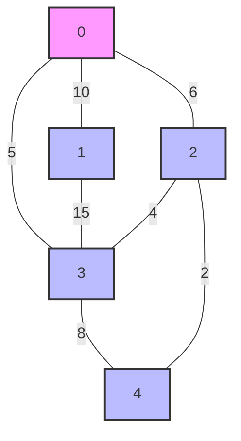
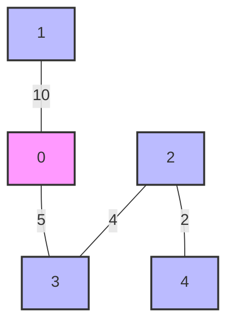

# Minimum Spanning Tree

## Introduction

A Minimum Spanning Tree (MST) is a fundamental concept in graph theory with wide-ranging applications in network design, clustering, and optimization problems. In essence, an MST is a subset of edges from an undirected, weighted graph that connects all vertices while minimizing the total edge weight—all without creating any cycles.

Imagine you're designing a road network connecting several cities. You want to ensure all cities are connected while minimizing the total road length (or cost). This is a classic minimum spanning tree problem!

## Key Properties of Minimum Spanning Trees

Before diving into algorithms, let's understand some essential properties:

1. **Connects all vertices**: An MST includes exactly enough edges to connect all vertices.
2. **Contains no cycles**: As a tree, MST has no cycles.
3. **Has exactly (n-1) edges**: Where n is the number of vertices.
4. **Minimizes total weight**: Among all possible spanning trees.
5. **Not necessarily unique**: A graph may have multiple valid MSTs with the same total weight.

## MST Algorithms

We'll explore two classic algorithms for finding minimum spanning trees:

1. Kruskal's Algorithm
2. Prim's Algorithm

### Kruskal's Algorithm

Kruskal's algorithm builds the MST by considering edges in ascending order of weight, adding them to the growing forest as long as they don't create a cycle.

#### Steps:

1. Sort all edges in non-decreasing order of weight.
2. Initialize an empty MST.
3. For each edge in the sorted order:
   - If adding it doesn't create a cycle, include it in the MST.
   - Otherwise, discard it.
4. Continue until the MST has (n-1) edges.

To detect cycles, we use a disjoint set (union-find) data structure.

#### Implementation in Python:

```python
# Kruskal's algorithm for finding Minimum Spanning Tree
class DisjointSet:
    def __init__(self, n):
        self.parent = list(range(n))
        self.rank = [0] * n
    
    def find(self, x):
        if self.parent[x] != x:
            self.parent[x] = self.find(self.parent[x])  # Path compression
        return self.parent[x]
    
    def union(self, x, y):
        root_x = self.find(x)
        root_y = self.find(y)
        
        if root_x == root_y:
            return False
            
        if self.rank[root_x] < self.rank[root_y]:
            self.parent[root_x] = root_y
        else:
            self.parent[root_y] = root_x
            if self.rank[root_x] == self.rank[root_y]:
                self.rank[root_x] += 1
                
        return True

def kruskal_mst(vertices, edges):
    # Sort edges by weight
    edges.sort(key=lambda x: x[2])
    
    ds = DisjointSet(vertices)
    mst = []
    mst_weight = 0
    
    for u, v, weight in edges:
        if ds.union(u, v):  # If adding this edge doesn't form a cycle
            mst.append((u, v, weight))
            mst_weight += weight
            
        if len(mst) == vertices - 1:
            break
            
    return mst, mst_weight
```

#### Example:

```python
# Example graph
vertices = 5
edges = [
    (0, 1, 10),
    (0, 2, 6),
    (0, 3, 5),
    (1, 3, 15),
    (2, 3, 4),
    (3, 4, 8),
    (2, 4, 2)
]

mst, total_weight = kruskal_mst(vertices, edges)
print("Edges in MST:")
for u, v, w in mst:
    print(f"{u} -- {v} with weight {w}")
print(f"Total MST weight: {total_weight}")
```

**Output:**
```
Edges in MST:
2 -- 4 with weight 2
2 -- 3 with weight 4
0 -- 3 with weight 5
3 -- 4 with weight 8
Total MST weight: 19
```

### Prim's Algorithm

While Kruskal's builds the MST by considering edges, Prim's algorithm builds it by growing from a single vertex, adding the minimum edge that connects a vertex in the MST to a vertex outside it.

#### Steps:

1. Start with an arbitrary vertex.
2. Grow the MST by one edge: choose the minimum-weight edge that connects a vertex in the MST to a vertex outside.
3. Add the chosen edge and vertex to the MST.
4. Repeat steps 2-3 until all vertices are included.

#### Implementation in Python:

```python
import heapq

def prim_mst(vertices, adj_list):
    # Start with vertex 0
    start_vertex = 0
    
    # Track visited vertices
    visited = [False] * vertices
    
    # Result MST edges and weight
    mst = []
    mst_weight = 0
    
    # Priority queue to get minimum weight edge
    # Format: (weight, vertex, parent)
    pq = [(0, start_vertex, -1)]
    
    while pq:
        weight, vertex, parent = heapq.heappop(pq)
        
        if visited[vertex]:
            continue
            
        visited[vertex] = True
        
        if parent != -1:  # Not the starting vertex
            mst.append((parent, vertex, weight))
            mst_weight += weight
            
        # Add all adjacent vertices to the priority queue
        for adj_vertex, edge_weight in adj_list[vertex]:
            if not visited[adj_vertex]:
                heapq.heappush(pq, (edge_weight, adj_vertex, vertex))
                
    return mst, mst_weight
```

#### Example with Prim's Algorithm:

```python
# Create adjacency list from edges
def create_adjacency_list(vertices, edges):
    adj_list = [[] for _ in range(vertices)]
    for u, v, w in edges:
        adj_list[u].append((v, w))
        adj_list[v].append((u, w))
    return adj_list

# Same example graph
vertices = 5
edges = [
    (0, 1, 10),
    (0, 2, 6),
    (0, 3, 5),
    (1, 3, 15),
    (2, 3, 4),
    (3, 4, 8),
    (2, 4, 2)
]

adj_list = create_adjacency_list(vertices, edges)
mst, total_weight = prim_mst(vertices, adj_list)

print("Edges in MST (Prim's):")
for u, v, w in mst:
    print(f"{u} -- {v} with weight {w}")
print(f"Total MST weight: {total_weight}")
```

**Output:**
```
Edges in MST (Prim's):
0 -- 3 with weight 5
3 -- 2 with weight 4
2 -- 4 with weight 2
0 -- 1 with weight 10
Total MST weight: 21
```

> **Note**: The specific edges in the MST might differ between Kruskal's and Prim's if there are multiple valid MSTs, but the total weight will be the same.

## Visualizing MST

Let's visualize our example graph and the resulting MST:



And the resulting MST (one possible solution):



## Time Complexity

Let's analyze the time complexity of both algorithms:

1. **Kruskal's Algorithm**:
   - Sorting edges: O(E log E)
   - Union-find operations: O(E log V)
   - Overall: O(E log E) or O(E log V) since E ≤ V²

2. **Prim's Algorithm**:
   - Using binary heap: O((V+E) log V)
   - Using Fibonacci heap: O(E + V log V)

## Real-World Applications

MST algorithms find applications in various domains:

1. **Network Design**: Minimizing the cost of laying cable or pipeline to connect multiple locations.
   
2. **Cluster Analysis**: In machine learning, MST can help identify clusters by creating a tree and then removing the most expensive edges.

3. **Approximation Algorithms**: MSTs can help solve approximation versions of harder problems like the Traveling Salesman Problem.

4. **Circuit Design**: Minimizing the total wire length in electrical circuit design.

### Example: Network Infrastructure Design

Suppose you're designing a computer network connecting five buildings on a campus:

```python
buildings = ['Admin', 'Library', 'Science', 'Arts', 'Dorms']
distances = [
    ('Admin', 'Library', 100),  # Distance in meters
    ('Admin', 'Science', 150),
    ('Admin', 'Arts', 200),
    ('Library', 'Science', 80),
    ('Library', 'Dorms', 120),
    ('Science', 'Arts', 70),
    ('Science', 'Dorms', 140),
    ('Arts', 'Dorms', 90)
]

# Convert building names to indices for our algorithm
building_to_idx = {building: idx for idx, building in enumerate(buildings)}
edges = [(building_to_idx[u], building_to_idx[v], w) for u, v, w in distances]

mst, total_length = kruskal_mst(len(buildings), edges)

print("Network connections:")
for u, v, w in mst:
    print(f"{buildings[u]} <--> {buildings[v]}, {w}m of cable")
print(f"Total cable required: {total_length}m")
```

**Output:**
```
Network connections:
Science <--> Arts, 70m of cable
Library <--> Science, 80m of cable
Arts <--> Dorms, 90m of cable
Library <--> Dorms, 120m of cable
Total cable required: 360m
```

## Common Variations and Extensions

1. **Maximum Spanning Tree**: Finding a spanning tree that maximizes the total weight.
2. **Bottleneck Spanning Tree**: Minimizing the maximum edge weight in the tree.
3. **Degree-Constrained Spanning Tree**: Finding an MST where each vertex has at most k edges.
4. **Multi-objective MST**: Optimizing for multiple weight metrics simultaneously.

## Summary

Minimum Spanning Trees provide an optimal way to connect all vertices in an undirected, weighted graph while minimizing the total edge weight. We explored two classic algorithms:

- **Kruskal's Algorithm**: Sorts edges by weight and builds the MST using a union-find data structure.
- **Prim's Algorithm**: Grows the MST from a single vertex, always adding the minimum edge to a new vertex.

Both algorithms are greedy approaches and guaranteed to find the optimal solution. The choice between them often depends on the graph's density:
- For sparse graphs, Kruskal's is often more efficient.
- For dense graphs, Prim's typically performs better.

MST algorithms have diverse applications in network design, clustering, and optimization problems, making them essential tools in a programmer's algorithmic toolkit.

## Practice Exercises

1. **Basic MST**: Implement both Kruskal's and Prim's algorithms and compare their performance on various graph sizes.
2. **MST Variations**: Try implementing a maximum spanning tree algorithm.
3. **Second-Best MST**: Find the second-best MST in a graph (one with total weight just larger than the optimal MST).
4. **Problem Solving**: Solve problems like "connecting cities with minimum road cost" using MST.
5. **Visualization**: Create an interactive visualization of MST algorithms to better understand how they work step-by-step.

## Additional Resources

- "Introduction to Algorithms" by Cormen, Leiserson, Rivest, and Stein (CLRS) - Chapters on MST algorithms
- Graph algorithms courses on platforms like Coursera, edX, or Khan Academy
- Interactive MST visualizations on algorithm visualization websites

Understanding Minimum Spanning Trees is a crucial step toward mastering graph algorithms and opens the door to solving a wide range of real-world network optimization problems!