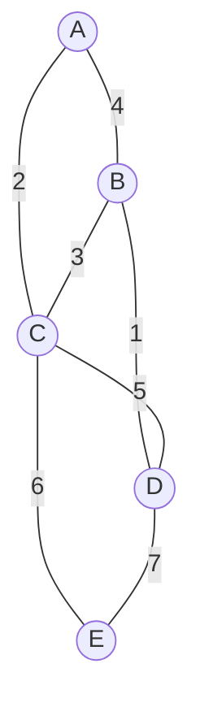

# Prim's Algorithm

## Introduction

Prim's algorithm is a greedy algorithm used for finding the **Minimum Spanning Tree (MST)** of a weighted undirected graph. A spanning tree is a subset of edges that connects all vertices in a graph without forming cycles, and a minimum spanning tree is a spanning tree with the lowest total edge weight.

Developed by computer scientist Robert C. Prim in 1957, this algorithm builds the MST by always adding the lowest-weight edge that connects a vertex in the growing MST to a vertex outside it. This approach ensures we find the optimal spanning tree that minimizes the total cost of connections.

## Why Learn Prim's Algorithm?

Understanding Prim's algorithm provides valuable insights into:

1. **Efficient network design** - Helps in designing cost-effective networks
2. **Optimization problems** - Solves problems requiring minimal resource utilization
3. **Greedy algorithm paradigm** - Demonstrates how making locally optimal choices can lead to a globally optimal solution
4. **Graph theory fundamentals** - Builds understanding of graph properties and traversals

## How Prim's Algorithm Works

Prim's algorithm works by growing the MST one vertex at a time, starting from an arbitrary vertex. Here's the step-by-step process:

1. Start with a single vertex (any vertex can be chosen as the starting point)
2. Add the lowest-weight edge connecting a vertex in our current tree to a vertex not yet in our tree
3. Repeat step 2 until all vertices are included in the tree

Let's visualize how Prim's algorithm progresses:



### Step-by-Step Example

Let's trace through the algorithm with the graph shown above, starting from vertex A:

1. Start with vertex A in our MST
2. Consider all edges from A: (A-B with weight 4) and (A-C with weight 2)
   - Choose A-C (weight 2)
3. MST now has vertices A and C
4. Consider all edges from A and C to outside vertices: (A-B with weight 4), (C-B with weight 3), (C-E with weight 6), (C-D with weight 5)
   - Choose C-B (weight 3)
5. MST now has vertices A, C, and B
6. Consider all edges from A, C, and B to outside vertices: (B-D with weight 1), (C-E with weight 6), (C-D with weight 5)
   - Choose B-D (weight 1)
7. MST now has vertices A, C, B, and D
8. Consider all edges to the last vertex E: (C-E with weight 6), (D-E with weight 7)
   - Choose C-E (weight 6)
9. All vertices are now included, and our MST is complete

The resulting MST has edges: A-C, C-B, B-D, and C-E with a total weight of 2 + 3 + 1 + 6 = 12.

## Implementation

Let's implement Prim's algorithm in Python. We'll represent the graph using an adjacency list for efficiency:

```python
import heapq

def prim_mst(graph):
    """
    Implementation of Prim's algorithm to find Minimum Spanning Tree
    
    Args:
        graph: Dictionary representing adjacency list with weights
               e.g., {
                    'A': {'B': 4, 'C': 2},
                    'B': {'A': 4, 'C': 3, 'D': 1},
                    'C': {'A': 2, 'B': 3, 'D': 5, 'E': 6},
                    'D': {'B': 1, 'C': 5, 'E': 7},
                    'E': {'C': 6, 'D': 7}
                }
    
    Returns:
        Dictionary containing MST parent relationships and total weight
    """
    # Arbitrarily choose first vertex as starting point
    start_vertex = next(iter(graph))
    
    # Track vertices in MST
    mst_vertices = set([start_vertex])
    
    # Track edges in MST
    mst_edges = []
    
    # Priority queue for edges
    edges = [(weight, start_vertex, to_vertex) 
             for to_vertex, weight in graph[start_vertex].items()]
    heapq.heapify(edges)
    
    total_weight = 0
    
    # Continue until all vertices are included in MST
    while edges and len(mst_vertices) < len(graph):
        weight, from_vertex, to_vertex = heapq.heappop(edges)
        
        # If the destination vertex is not in MST yet
        if to_vertex not in mst_vertices:
            mst_vertices.add(to_vertex)
            mst_edges.append((from_vertex, to_vertex, weight))
            total_weight += weight
            
            # Add all edges from the new vertex
            for next_vertex, next_weight in graph[to_vertex].items():
                if next_vertex not in mst_vertices:
                    heapq.heappush(edges, (next_weight, to_vertex, next_vertex))
    
    return {
        "edges": mst_edges,
        "total_weight": total_weight
    }

# Example usage
graph = {
    'A': {'B': 4, 'C': 2},
    'B': {'A': 4, 'C': 3, 'D': 1},
    'C': {'A': 2, 'B': 3, 'D': 5, 'E': 6},
    'D': {'B': 1, 'C': 5, 'E': 7},
    'E': {'C': 6, 'D': 7}
}

result = prim_mst(graph)
print(f"MST Edges: {result['edges']}")
print(f"Total Weight: {result['total_weight']}")
```

### Expected Output:

```
MST Edges: [('A', 'C', 2), ('C', 'B', 3), ('B', 'D', 1), ('C', 'E', 6)]
Total Weight: 12
```

## Time and Space Complexity

The time complexity of Prim's algorithm depends on the data structures used:

- Using a binary heap (priority queue) for edge selection: **O(E log V)** where E is the number of edges and V is the number of vertices
- Using an array for edge selection: **O(V²)**

The space complexity is **O(V + E)** to store the graph and the priority queue.

## Practical Applications

Prim's algorithm has many real-world applications:

### 1. Network Design

When designing computer networks, telephone networks, or utility grids, we often need to connect all points with minimum total cable length.

```python
def design_network(locations, connection_costs):
    """
    Design a network connecting all locations with minimum total cost
    
    Args:
        locations: List of location names
        connection_costs: Dictionary of costs between locations
    
    Returns:
        Optimal network design
    """
    # Convert to graph format
    graph = {loc: {} for loc in locations}
    for (loc1, loc2), cost in connection_costs.items():
        graph[loc1][loc2] = cost
        graph[loc2][loc1] = cost
    
    # Run Prim's algorithm
    mst = prim_mst(graph)
    
    return mst
```

### 2. Circuit Design

When designing circuits, minimizing the total wire length can reduce manufacturing costs and signal propagation delays.

### 3. Clustering Algorithms

Some clustering algorithms use MST as an intermediate step to identify clusters.

### 4. Image Segmentation

In computer vision, Prim's algorithm can help in segmenting images by treating pixels as vertices and using color differences as edge weights.

## Prim's vs. Kruskal's Algorithm

Another popular algorithm for finding MST is Kruskal's algorithm. Here's how they compare:

1. **Approach**: 
   - Prim's algorithm grows a single tree
   - Kruskal's algorithm may work with multiple trees that eventually merge

2. **Edge Selection**:
   - Prim's selects the cheapest edge connecting tree to a new vertex
   - Kruskal's selects globally cheapest edges that don't create cycles

3. **Performance**:
   - Prim's is better for dense graphs (many edges)
   - Kruskal's is better for sparse graphs (fewer edges)

## Common Pitfalls and Tips

1. **Disconnected Graphs**: Prim's algorithm only works on connected graphs. For disconnected graphs, you need to find MSTs for each component separately.

2. **Handling Ties**: If there are multiple edges with the same weight, any can be chosen without affecting the total MST weight (though the specific tree structure may differ).

3. **Negative Weights**: Prim's algorithm works with negative edge weights, unlike some shortest path algorithms.

4. **Optimization**: For dense graphs, using a Fibonacci heap instead of a binary heap can improve theoretical performance to O(E + V log V).

## Summary

Prim's algorithm is a powerful greedy approach for finding the minimum spanning tree of a weighted, undirected graph. It works by iteratively growing a tree, always adding the lowest-weight edge that connects the current tree to a new vertex.

Key points to remember:
- It always produces a correct MST for connected graphs
- The time complexity is O(E log V) when implemented with a binary heap
- It has many practical applications in network design, clustering, and more

By understanding and implementing Prim's algorithm, you've gained an important tool for solving graph optimization problems efficiently.

## Exercises

1. Modify the provided implementation to print the MST edges in order of selection.
2. Implement Prim's algorithm using an adjacency matrix instead of an adjacency list.
3. Create a function to visualize the progress of Prim's algorithm step by step.
4. Implement a function that detects whether a graph is connected before applying Prim's algorithm.
5. Design an algorithm that uses Prim's MST to approximately solve the Traveling Salesman Problem.

## Additional Resources

- "Introduction to Algorithms" by Cormen, Leiserson, Rivest, and Stein
- "Algorithms" by Robert Sedgewick and Kevin Wayne
- "Graph Theory and Its Applications" by Jonathan L. Gross and Jay Yellen

Happy coding!