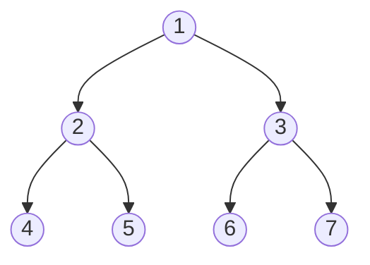

# Tree Traversals

## Introduction

Tree traversal is the process of visiting (reading or processing) each node in a tree data structure exactly once. Unlike linear data structures such as arrays or linked lists which have a single clear path for traversal, trees can be traversed in multiple ways due to their hierarchical nature.

Understanding tree traversals is fundamental for many programming tasks, from file system navigation to expression evaluation and search algorithms. In this guide, we'll explore the most common traversal methods with clear examples and practical implementations.

## Types of Tree Traversals

There are four primary ways to traverse a tree:

1. **Pre-order** (NLR): Visit the **N**ode first, then traverse **L**eft subtree, then traverse **R**ight subtree
2. **In-order** (LNR): Traverse **L**eft subtree first, then visit the **N**ode, then traverse **R**ight subtree
3. **Post-order** (LRN): Traverse **L**eft subtree first, then traverse **R**ight subtree, then visit the **N**ode
4. **Level-order**: Visit nodes level by level, from left to right

Let's visualize these methods with a simple binary tree:



## Depth-First Traversals

The first three traversal methods (pre-order, in-order, and post-order) are all forms of depth-first traversal, meaning we explore as far down a branch as possible before backtracking.

### Pre-order Traversal (NLR)

In pre-order traversal, we:
1. Visit the current node
2. Recursively traverse the left subtree
3. Recursively traverse the right subtree

```python
def preorder(node):
    if node is None:
        return
    
    print(node.value, end=" ")  # Visit node
    preorder(node.left)         # Traverse left subtree
    preorder(node.right)        # Traverse right subtree
```

For our example tree, pre-order traversal yields: `1 2 4 5 3 6 7`

### In-order Traversal (LNR)

In in-order traversal, we:
1. Recursively traverse the left subtree
2. Visit the current node
3. Recursively traverse the right subtree

```python
def inorder(node):
    if node is None:
        return
    
    inorder(node.left)         # Traverse left subtree
    print(node.value, end=" ")  # Visit node
    inorder(node.right)        # Traverse right subtree
```

For our example tree, in-order traversal yields: `4 2 5 1 6 3 7`

### Post-order Traversal (LRN)

In post-order traversal, we:
1. Recursively traverse the left subtree
2. Recursively traverse the right subtree
3. Visit the current node

```python
def postorder(node):
    if node is None:
        return
    
    postorder(node.left)        # Traverse left subtree
    postorder(node.right)       # Traverse right subtree
    print(node.value, end=" ")   # Visit node
```

For our example tree, post-order traversal yields: `4 5 2 6 7 3 1`

## Breadth-First Traversal

### Level-order Traversal

Level-order traversal visits nodes level by level, from top to bottom and left to right. This is a breadth-first approach that requires a queue to implement:

```python
from collections import deque

def levelorder(root):
    if root is None:
        return
    
    queue = deque([root])
    
    while queue:
        node = queue.popleft()
        print(node.value, end=" ")
        
        if node.left:
            queue.append(node.left)
        if node.right:
            queue.append(node.right)
```

For our example tree, level-order traversal yields: `1 2 3 4 5 6 7`

## Sample Implementation: Binary Tree Node Class

Let's create a complete binary tree implementation with all traversal methods:

```python
class TreeNode:
    def __init__(self, value):
        self.value = value
        self.left = None
        self.right = None

class BinaryTree:
    def __init__(self):
        self.root = None
    
    def insert_level_order(self, arr):
        """Insert array values in level order to create a complete binary tree"""
        if not arr:
            return None
            
        self.root = TreeNode(arr[0])
        queue = deque([self.root])
        i = 1
        
        while i < len(arr):
            node = queue.popleft()
            
            # Add left child
            if i < len(arr):
                node.left = TreeNode(arr[i])
                queue.append(node.left)
                i += 1
            
            # Add right child
            if i < len(arr):
                node.right = TreeNode(arr[i])
                queue.append(node.right)
                i += 1
    
    def preorder_traversal(self):
        result = []
        
        def preorder(node):
            if node:
                result.append(node.value)  # Visit node
                preorder(node.left)        # Traverse left
                preorder(node.right)       # Traverse right
                
        preorder(self.root)
        return result
    
    def inorder_traversal(self):
        result = []
        
        def inorder(node):
            if node:
                inorder(node.left)         # Traverse left
                result.append(node.value)  # Visit node
                inorder(node.right)        # Traverse right
                
        inorder(self.root)
        return result
    
    def postorder_traversal(self):
        result = []
        
        def postorder(node):
            if node:
                postorder(node.left)       # Traverse left
                postorder(node.right)      # Traverse right
                result.append(node.value)  # Visit node
                
        postorder(self.root)
        return result
    
    def levelorder_traversal(self):
        if not self.root:
            return []
            
        result = []
        queue = deque([self.root])
        
        while queue:
            node = queue.popleft()
            result.append(node.value)
            
            if node.left:
                queue.append(node.left)
            if node.right:
                queue.append(node.right)
                
        return result
```

## Example Usage

```python
# Create a tree from our example
tree = BinaryTree()
tree.insert_level_order([1, 2, 3, 4, 5, 6, 7])

# Perform traversals
print("Pre-order traversal:", tree.preorder_traversal())
print("In-order traversal:", tree.inorder_traversal())
print("Post-order traversal:", tree.postorder_traversal())
print("Level-order traversal:", tree.levelorder_traversal())
```

Output:
```
Pre-order traversal: [1, 2, 4, 5, 3, 6, 7]
In-order traversal: [4, 2, 5, 1, 6, 3, 7]
Post-order traversal: [4, 5, 2, 6, 7, 3, 1]
Level-order traversal: [1, 2, 3, 4, 5, 6, 7]
```

## Practical Applications

### 1. Expression Tree Evaluation

In-order traversal of an expression tree gives the infix notation, while post-order traversal gives the postfix (RPN) notation.

```python
# Expression tree for (2 + 3) * 4
#      *
#     / \
#    +   4
#   / \
#  2   3

expr_tree = BinaryTree()
expr_tree.root = TreeNode("*")
expr_tree.root.left = TreeNode("+")
expr_tree.root.right = TreeNode(4)
expr_tree.root.left.left = TreeNode(2)
expr_tree.root.left.right = TreeNode(3)

# Infix expression: 2 + 3 * 4
print("Infix expression:", " ".join(map(str, expr_tree.inorder_traversal())))

# Postfix expression: 2 3 + 4 *
print("Postfix expression:", " ".join(map(str, expr_tree.postorder_traversal())))
```

### 2. File System Navigation

Directory structures are hierarchical like trees. Different traversals can be used for different operations:

- Pre-order: Create a copy of a directory structure
- Post-order: Calculate the size of each directory (must process files before directories)
- Level-order: Display directory structure level by level

### 3. Binary Search Tree (BST) Operations

In-order traversal of a BST yields elements in sorted order, which is very useful for many operations.

```python
# If our tree was a BST, in-order traversal would print values in sorted order
bst = BinaryTree()
# Assume we've inserted values to create a valid BST
# bst.insert_bst(5)
# bst.insert_bst(3)
# bst.insert_bst(7)
# bst.insert_bst(2)
# bst.insert_bst(4)

# In-order traversal yields sorted elements: 2, 3, 4, 5, 7
print("Sorted elements:", bst.inorder_traversal())
```

## Non-recursive Implementations

While recursive implementations are elegant, they can be problematic for deep trees due to stack overflow. Here's how to implement tree traversals iteratively:

### Iterative Pre-order Traversal

```python
def iterative_preorder(root):
    if not root:
        return []
        
    result = []
    stack = [root]
    
    while stack:
        node = stack.pop()
        result.append(node.value)
        
        # Push right first so left gets processed first (LIFO stack)
        if node.right:
            stack.append(node.right)
        if node.left:
            stack.append(node.left)
            
    return result
```

### Iterative In-order Traversal

```python
def iterative_inorder(root):
    if not root:
        return []
        
    result = []
    stack = []
    current = root
    
    while current or stack:
        # Reach the leftmost node
        while current:
            stack.append(current)
            current = current.left
            
        # Current is now None, pop from stack
        current = stack.pop()
        result.append(current.value)
        
        # Visit right subtree
        current = current.right
        
    return result
```

### Iterative Post-order Traversal

Post-order is more complex iteratively and can be implemented with two stacks:

```python
def iterative_postorder(root):
    if not root:
        return []
        
    result = []
    stack1 = [root]
    stack2 = []
    
    # First create reverse post-order in stack2
    while stack1:
        node = stack1.pop()
        stack2.append(node)
        
        if node.left:
            stack1.append(node.left)
        if node.right:
            stack1.append(node.right)
    
    # Pop from stack2 to get post-order
    while stack2:
        node = stack2.pop()
        result.append(node.value)
        
    return result
```

## Time and Space Complexity

For all traversal methods:
- **Time Complexity**: O(n), where n is the number of nodes (each node is visited exactly once)
- **Space Complexity**:
  - Recursive methods: O(h), where h is the height of the tree (for the call stack)
  - Iterative methods: O(h) for in-order and post-order, as we might need to store at most h nodes
  - Level-order: O(w), where w is the maximum width of the tree (maximum queue size)

For a balanced binary tree, h = log(n), but in the worst case (skewed tree), h can be n.

## Summary

Tree traversals are fundamental techniques for processing hierarchical data structures. We've explored:

- **Depth-first traversals**:
  - Pre-order (NLR): Process current node before children
  - In-order (LNR): Process left subtree, current node, then right subtree
  - Post-order (LRN): Process children before current node

- **Breadth-first traversal**:
  - Level-order: Process nodes level by level from top to bottom

Each traversal method has specific applications and use cases, from expression evaluation to directory navigation and sorted data access. While recursive implementations are intuitive, iterative methods are more efficient for large trees.

## Exercises

1. Implement a function to count the number of leaf nodes in a binary tree.
2. Write a function to find the height (maximum depth) of a binary tree.
3. Implement a function to check if two binary trees are identical.
4. Create a function that returns the mirror image of a binary tree.
5. Implement a zigzag level order traversal, where alternate levels are traversed from left-to-right and right-to-left.
6. Find the sum of all nodes in a binary tree.
7. Write a function to print all paths from root to leaf nodes.

## Additional Resources

- [Visualizing Tree Traversals](https://visualgo.net/en/bst)
- "Introduction to Algorithms" by Cormen, Leiserson, Rivest, and Stein
- "Algorithms, 4th Edition" by Robert Sedgewick and Kevin Wayne
- LeetCode Tree Problems Collection for practice
- HackerRank Tree Data Structure challenges

Happy coding and tree traversing!