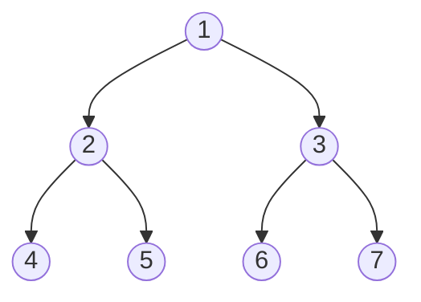

# Inorder Traversal

## Introduction

Inorder traversal is one of the fundamental tree traversal algorithms in computer science. It systematically visits all nodes in a binary tree by following a specific order: **left subtree, root node, right subtree**. This traversal method is particularly important because when applied to a Binary Search Tree (BST), it visits nodes in ascending order, making it valuable for various applications.

In this tutorial, we'll explore inorder traversal in depth, starting with basic concepts and moving to implementation, optimizations, and practical applications.

## What is Inorder Traversal?

Inorder traversal follows this simple rule:
1. Recursively traverse the left subtree
2. Visit the root node
3. Recursively traverse the right subtree

Let's visualize this with a simple binary tree:



When we perform an inorder traversal on this tree, we visit the nodes in this order: **4, 2, 5, 1, 6, 3, 7**

## Implementing Inorder Traversal

### Recursive Implementation

The recursive implementation of inorder traversal is elegant and straightforward:

```java
// Definition for a binary tree node
class TreeNode {
    int val;
    TreeNode left;
    TreeNode right;
    
    TreeNode(int x) { 
        val = x; 
    }
}

public void inorderTraversal(TreeNode root) {
    if (root == null) {
        return;
    }
    
    // Traverse left subtree
    inorderTraversal(root.left);
    
    // Visit root node
    System.out.print(root.val + " ");
    
    // Traverse right subtree
    inorderTraversal(root.right);
}
```

**Input:**
```
    1
   / \
  2   3
 / \ / \
4  5 6  7
```

**Output:**
```
4 2 5 1 6 3 7
```

### Iterative Implementation

While the recursive solution is elegant, it can lead to stack overflow for very deep trees. Let's implement an iterative version using an explicit stack:

```java
import java.util.Stack;

public void inorderTraversalIterative(TreeNode root) {
    Stack<TreeNode> stack = new Stack<>();
    TreeNode current = root;
    
    while (current != null || !stack.isEmpty()) {
        // Reach the leftmost node of the current subtree
        while (current != null) {
            stack.push(current);
            current = current.left;
        }
        
        // Current is now null, pop from stack
        current = stack.pop();
        
        // Visit the node
        System.out.print(current.val + " ");
        
        // Move to the right subtree
        current = current.right;
    }
}
```

Both implementations produce the same result, but the iterative version uses an explicit stack instead of the call stack.

## Morris Traversal (Advanced)

For those interested in an advanced approach, Morris Traversal allows inorder traversal using **O(1) space complexity** without using a stack or recursion:

```java
public void morrisInorderTraversal(TreeNode root) {
    TreeNode current = root;
    
    while (current != null) {
        if (current.left == null) {
            // If no left subtree, visit current and move right
            System.out.print(current.val + " ");
            current = current.right;
        } else {
            // Find the inorder predecessor
            TreeNode predecessor = current.left;
            while (predecessor.right != null && predecessor.right != current) {
                predecessor = predecessor.right;
            }
            
            if (predecessor.right == null) {
                // Create a link from predecessor to current
                predecessor.right = current;
                current = current.left;
            } else {
                // Restore the tree structure
                predecessor.right = null;
                System.out.print(current.val + " ");
                current = current.right;
            }
        }
    }
}
```

This method uses temporary modification of the tree structure to achieve O(1) space complexity.

## Step-by-Step Analysis

Let's walk through the inorder traversal process for our example tree:


1. Start at the root (1).
2. Go to the left child (2).
3. Go to the left child of 2, which is (4).
4. Node 4 has no left child, so visit 4: Output = `4`
5. Move back to node 2 and visit it: Output = `4 2`
6. Visit the right child of 2, which is 5: Output = `4 2 5`
7. Move back to the root (1) and visit it: Output = `4 2 5 1`
8. Go to the right child of root, which is 3.
9. Visit the left child of 3, which is 6: Output = `4 2 5 1 6`
10. Move back to node 3 and visit it: Output = `4 2 5 1 6 3`
11. Visit the right child of 3, which is 7: Output = `4 2 5 1 6 3 7`

## Practical Applications

### 1. Binary Search Trees

When applied to a Binary Search Tree, inorder traversal produces nodes in sorted order. This property is fundamental in many BST operations.

```java
// Creating an inorder traversal from a BST to get sorted elements
public List<Integer> getSortedElements(TreeNode root) {
    List<Integer> result = new ArrayList<>();
    inorderHelper(root, result);
    return result;
}

private void inorderHelper(TreeNode node, List<Integer> result) {
    if (node == null) return;
    inorderHelper(node.left, result);
    result.add(node.val);
    inorderHelper(node.right, result);
}
```

### 2. Building Expression Trees

Inorder traversal is useful when working with expression trees. For example, if we have a tree representing an arithmetic expression, an inorder traversal (with parentheses) will give us the original infix expression.

```java
public String getInfixExpression(ExpressionNode root) {
    if (root == null) return "";
    
    StringBuilder result = new StringBuilder();
    
    // Add parentheses for non-leaf nodes
    boolean needParentheses = root.left != null || root.right != null;
    
    if (needParentheses) result.append("(");
    
    result.append(getInfixExpression(root.left));
    result.append(root.value); // Operator or operand
    result.append(getInfixExpression(root.right));
    
    if (needParentheses) result.append(")");
    
    return result.toString();
}
```

### 3. Tree Validation

Inorder traversal can be used to validate if a binary tree is a valid Binary Search Tree:

```java
public boolean isValidBST(TreeNode root) {
    List<Integer> values = new ArrayList<>();
    inorderHelper(root, values);
    
    // Check if the list is sorted
    for (int i = 1; i < values.size(); i++) {
        if (values.get(i) <= values.get(i - 1)) {
            return false;
        }
    }
    return true;
}
```

## Time and Space Complexity

- **Time Complexity**: O(n) - Each node is visited exactly once.
- **Space Complexity**:
  - Recursive: O(h) where h is the height of the tree (due to the call stack)
  - Iterative: O(h) using an explicit stack
  - Morris Traversal: O(1) with temporary tree modifications

## Common Mistakes and Edge Cases

1. **Forgetting the empty tree case**: Always check if the root is null before starting traversal.
2. **Not handling unbalanced trees**: In the worst case (a skewed tree), the space complexity can become O(n).
3. **Infinite loops**: When implementing Morris traversal, be careful with the temporary links to avoid creating cycles.

## Summary

Inorder traversal is a fundamental tree algorithm that visits nodes in the order: left subtree, root, right subtree. It has several key characteristics:

- Produces sorted output when applied to Binary Search Trees
- Can be implemented recursively or iteratively
- Has applications in sorted data retrieval, expression evaluation, and tree validation
- Morris traversal offers an O(1) space solution for advanced use cases

Understanding inorder traversal is essential for working with tree data structures and forms the foundation for more complex tree algorithms.

## Exercises

1. Implement a function that returns the kth smallest element in a BST using inorder traversal.
2. Modify the inorder traversal to print only nodes within a given range [low, high].
3. Implement a function that checks if two BSTs are identical using inorder traversal.
4. Write a function that converts a BST to a sorted doubly linked list in-place using inorder traversal.
5. Implement an iterative inorder traversal without using a stack (Morris traversal) and explain how it works step by step.

## Additional Resources

- [Binary Tree Traversals Visualized](https://visualgo.net/en/bst)
- [LeetCode Problem: Binary Tree Inorder Traversal](https://leetcode.com/problems/binary-tree-inorder-traversal/)
- [Binary Search Tree Applications](https://en.wikipedia.org/wiki/Binary_search_tree)
- [Morris Traversal Detailed Explanation](https://www.educative.io/answers/what-is-morris-traversal)

Happy coding and tree traversing!