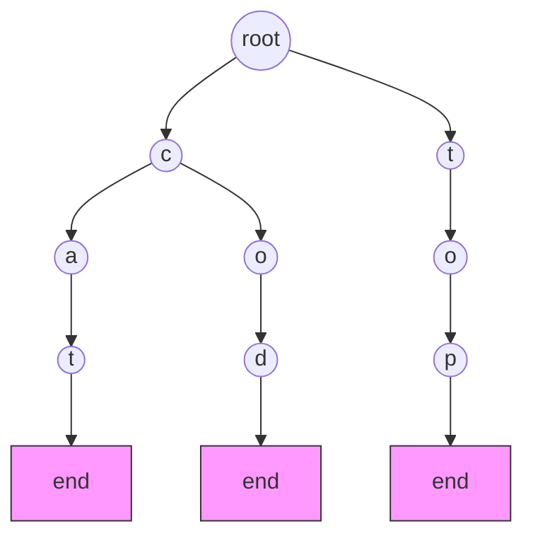
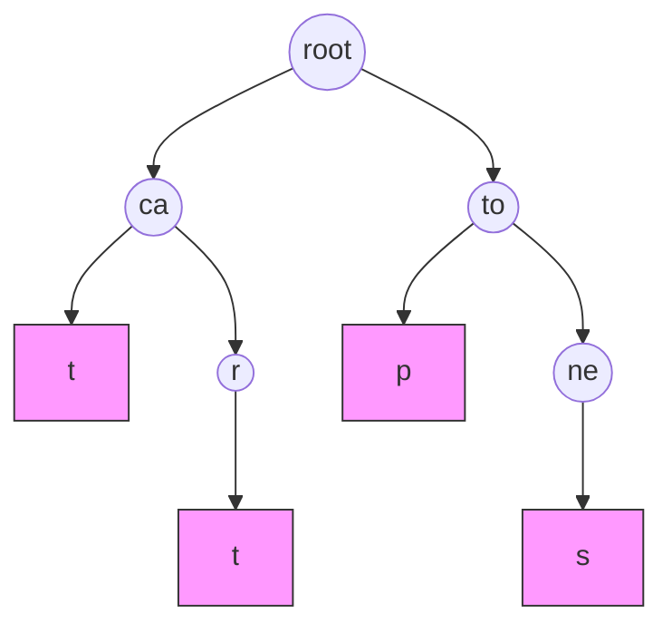

# Trie Data Structure

## Introduction

A Trie (pronounced "try" or "tree") is a specialized tree-based data structure that is particularly efficient for handling string operations. Unlike binary trees or other common tree structures, a trie is designed specifically for storing and retrieving keys in a dataset of strings. The name "trie" comes from the word "re**trie**val," highlighting its primary purpose.

Tries excel at tasks like autocomplete suggestions, spell checking, and IP routing because they enable fast prefix-based searches and insertions. Instead of comparing entire strings, tries navigate through characters one by one, making operations proportional to the length of the string rather than the size of the dataset.

## Understanding the Trie Structure

A trie consists of nodes where:
- Each node represents a single character
- Each path from the root to a marked node represents a complete word
- Children of a node are typically indexed by the character they represent
- Nodes often contain a boolean flag indicating if they represent the end of a valid word



In this example, the trie stores the words "cat", "cod", and "top". The pink nodes represent word endings.

## Basic Operations on a Trie

### 1. Insertion

To insert a word into a trie, we follow these steps:
1. Start from the root
2. Traverse the trie character by character
3. Create new nodes for characters that don't exist
4. Mark the last node as the end of a word

### 2. Search

To search for a word in a trie, we:
1. Start from the root
2. Traverse the trie character by character
3. If at any point a character doesn't exist, the word is not in the trie
4. If we reach the end of the word, check if the current node is marked as the end of a word

### 3. Prefix Search

One of the most powerful features of tries is prefix searching:
1. Start from the root
2. Traverse the trie following the characters of the prefix
3. If the entire prefix exists, we can find all words with that prefix by exploring all paths from that point

## Implementing a Trie in Code

Let's implement a basic trie in JavaScript:

```javascript
class TrieNode {
  constructor() {
    this.children = {};  // Maps characters to TrieNode
    this.isEndOfWord = false;  // Indicates if this node represents the end of a word
  }
}

class Trie {
  constructor() {
    this.root = new TrieNode();
  }
  
  // Insert a word into the trie
  insert(word) {
    let current = this.root;
    
    for (let char of word) {
      if (!current.children[char]) {
        current.children[char] = new TrieNode();
      }
      current = current.children[char];
    }
    
    current.isEndOfWord = true;
  }
  
  // Search for a word in the trie
  search(word) {
    let current = this.root;
    
    for (let char of word) {
      if (!current.children[char]) {
        return false;
      }
      current = current.children[char];
    }
    
    return current.isEndOfWord;
  }
  
  // Check if there is any word in the trie that starts with the given prefix
  startsWith(prefix) {
    let current = this.root;
    
    for (let char of prefix) {
      if (!current.children[char]) {
        return false;
      }
      current = current.children[char];
    }
    
    return true;
  }
  
  // Find all words with the given prefix
  findWordsWithPrefix(prefix) {
    const result = [];
    let current = this.root;
    
    // Navigate to the node representing the prefix
    for (let char of prefix) {
      if (!current.children[char]) {
        return result;
      }
      current = current.children[char];
    }
    
    // Use DFS to find all words starting from the prefix node
    this._collectWords(current, prefix, result);
    return result;
  }
  
  _collectWords(node, prefix, result) {
    if (node.isEndOfWord) {
      result.push(prefix);
    }
    
    for (let char in node.children) {
      this._collectWords(node.children[char], prefix + char, result);
    }
  }
}
```

Let's see how to use this implementation:

```javascript
// Create a new trie
const trie = new Trie();

// Insert some words
trie.insert("apple");
trie.insert("appreciate");
trie.insert("banana");
trie.insert("app");
trie.insert("application");

// Search for words
console.log(trie.search("apple"));      // true
console.log(trie.search("app"));        // true
console.log(trie.search("apples"));     // false

// Check prefixes
console.log(trie.startsWith("app"));    // true
console.log(trie.startsWith("ban"));    // true
console.log(trie.startsWith("cat"));    // false

// Find all words with prefix
console.log(trie.findWordsWithPrefix("app"));  
// Output: ["app", "apple", "application", "appreciate"]
```

## Time and Space Complexity

### Time Complexity
- **Insertion**: O(m) where m is the length of the word
- **Search**: O(m) where m is the length of the word
- **Prefix Search**: O(m) to find the prefix + O(n) to traverse all matching words, where n is the number of nodes in the subtree

### Space Complexity
- O(n * m) where n is the number of words and m is the average word length
- In the worst case, when there's no overlap between words, the trie can be quite space-intensive

## Optimizing Tries

### 1. Compressed Tries (Radix Trees)

To reduce space usage, we can compress paths that have only one child:



In this compressed trie, we store the words "cat", "cart", "top", and "tones".

### 2. Ternary Search Tries

A ternary search trie is a hybrid that combines features of binary search trees and tries, offering better space efficiency.

## Real-World Applications

### 1. Autocomplete Systems

When you type in a search engine or text editor, tries can efficiently find all words that start with the typed prefix.

```javascript
// Autocomplete example
function autocomplete(trie, prefix) {
  return trie.findWordsWithPrefix(prefix);
}

// Usage:
const searchEngine = new Trie();
// Add dictionary words
["apple", "application", "appreciate", "art", "banana", "ball", "cat", "car"].forEach(word => {
  searchEngine.insert(word);
});

console.log("Suggestions for 'ap':", autocomplete(searchEngine, "ap"));
// Output: ["apple", "application", "appreciate"]
```

### 2. Spell Checking

Tries can be used to efficiently check if a word exists in a dictionary:

```javascript
function spellCheck(trie, word) {
  return trie.search(word);
}

// Output for our example trie:
console.log(spellCheck(trie, "apple")); // true
console.log(spellCheck(trie, "aple"));  // false
```

### 3. IP Routing (CIDR) Tables

In networking, tries are used for routing table lookups using IP addresses as keys.

### 4. Text Prediction

Smartphone keyboards use tries for predicting the next word a user might type.

### 5. Word Games

Games like Scrabble use tries for quickly checking if a combination of letters forms a valid word.

## Implementing a Practical Example: Contact List Autocomplete

Let's build a simple contact list with autocomplete functionality:

```javascript
class ContactList {
  constructor() {
    this.trie = new Trie();
    this.contacts = {};
  }
  
  addContact(name, phoneNumber) {
    this.trie.insert(name.toLowerCase());
    this.contacts[name.toLowerCase()] = phoneNumber;
  }
  
  searchContact(name) {
    const exactName = name.toLowerCase();
    if (this.trie.search(exactName)) {
      return {
        name: name,
        phone: this.contacts[exactName]
      };
    }
    return null;
  }
  
  getSuggestions(prefix) {
    const names = this.trie.findWordsWithPrefix(prefix.toLowerCase());
    return names.map(name => ({
      name,
      phone: this.contacts[name]
    }));
  }
}

// Usage example
const contacts = new ContactList();

// Add some contacts
contacts.addContact("John Smith", "555-1234");
contacts.addContact("Jane Smith", "555-5678");
contacts.addContact("John Doe", "555-9012");
contacts.addContact("Jack Johnson", "555-3456");
contacts.addContact("Mary Johnson", "555-7890");

// Search for a contact
console.log(contacts.searchContact("John Smith"));
// Output: { name: "John Smith", phone: "555-1234" }

// Get autocomplete suggestions
console.log(contacts.getSuggestions("Jo"));
/* Output:
[
  { name: "john smith", phone: "555-1234" },
  { name: "john doe", phone: "555-9012" }
]
*/

console.log(contacts.getSuggestions("J"));
/* Output:
[
  { name: "john smith", phone: "555-1234" },
  { name: "jane smith", phone: "555-5678" },
  { name: "john doe", phone: "555-9012" },
  { name: "jack johnson", phone: "555-3456" }
]
*/
```

## Challenges and Limitations

1. **Memory Usage**: Tries can consume significant memory, especially with large datasets
2. **Implementation Complexity**: More complex to implement than simpler data structures
3. **Not Suitable for All String Operations**: While efficient for prefix operations, other structures may be better for different string tasks

## Summary

Tries are powerful tree-based data structures optimized for string operations:

- They excel at prefix-based operations like autocomplete and spell checking
- Operations have O(m) time complexity where m is the string length, not dependent on dataset size
- They can be space-intensive but offer unmatched speed for certain string operations
- Real-world applications include autocomplete, spell checking, and IP routing

Tries demonstrate how specialized data structures can dramatically improve performance for specific tasks, making them an essential tool in any programmer's toolkit when working with string collections.

## Exercises

1. Implement a function to delete a word from a trie
2. Modify the trie to count how many times each word has been inserted
3. Implement a function that returns the longest common prefix of all words in the trie
4. Build a spell-checker that suggests corrections for misspelled words (hint: allow for 1-2 character differences)
5. Create a compressed trie implementation to reduce memory usage

## Additional Resources

- [Tries on GeeksforGeeks](https://www.geeksforgeeks.org/trie-insert-and-search/)
- [Tries on LeetCode](https://leetcode.com/explore/learn/card/trie/)
- [Advanced Trie Concepts](https://www.toptal.com/algorithms/computational-linguistics-applications-of-tries)

Mastering tries will significantly improve your ability to work with string collections efficiently and is a valuable addition to your algorithmic toolkit.