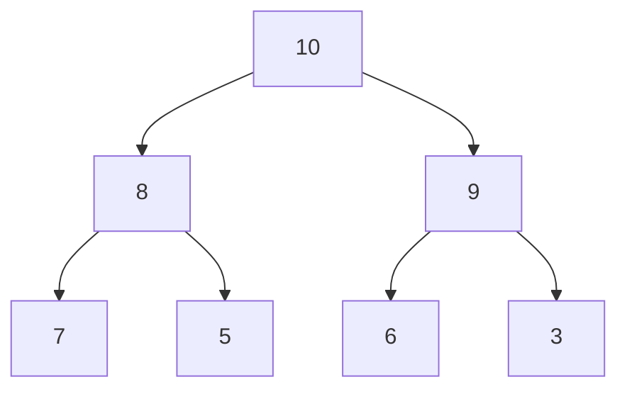

# Binary Heaps

## Introduction

A Binary Heap is a specialized tree-based data structure that satisfies the heap property. It's one of the most efficient implementations of priority queues, which are abstract data types that allow retrieving elements with the highest (or lowest) priority first.

Binary heaps are complete binary trees, meaning all levels are fully filled except possibly the last level, which is filled from left to right. This property makes them efficient to implement using arrays, eliminating the overhead of storing pointers to child nodes.

There are two types of binary heaps:

1. **Max Heap**: The value of each node is greater than or equal to the values of its children
2. **Min Heap**: The value of each node is less than or equal to the values of its children

## Visual Representation

A binary heap can be visualized as a binary tree:



*This is a max heap where each parent node is greater than its children.*

## Properties of Binary Heaps

1. **Structure Property**: A binary heap is a complete binary tree, which means all levels are completely filled except possibly the last level, which is filled from left to right.

2. **Heap Property**:
   - In a max heap, for any given node, the value of that node is greater than or equal to the values of its children.
   - In a min heap, for any given node, the value of that node is less than or equal to the values of its children.

3. **Height**: The height of a binary heap with n nodes is ⌊log₂(n)⌋.

## Array Representation

One of the most beautiful aspects of binary heaps is that they can be represented efficiently using arrays. For a zero-based array:

- The root element is at index 0
- For a node at index i:
  - Left child is at index 2*i + 1
  - Right child is at index 2*i + 2
  - Parent is at index ⌊(i-1)/2⌋

For example, the max heap shown above can be represented as:

```
[10, 8, 9, 7, 5, 6, 3]
```

## Implementing a Binary Heap

Let's implement a min heap in JavaScript. We'll focus on the core operations: insertion, extraction, and heapify.

```javascript
class MinHeap {
  constructor() {
    this.heap = [];
  }
  
  // Helper methods
  getParentIndex(i) {
    return Math.floor((i - 1) / 2);
  }
  
  getLeftChildIndex(i) {
    return 2 * i + 1;
  }
  
  getRightChildIndex(i) {
    return 2 * i + 2;
  }
  
  swap(i, j) {
    [this.heap[i], this.heap[j]] = [this.heap[j], this.heap[i]];
  }
  
  // Core operations
  insert(value) {
    this.heap.push(value);
    this.siftUp(this.heap.length - 1);
    return this;
  }
  
  siftUp(index) {
    let parent = this.getParentIndex(index);
    
    // If the parent is larger than the inserted element, swap them
    if (this.heap[parent] > this.heap[index]) {
      this.swap(parent, index);
      this.siftUp(parent);
    }
  }
  
  extractMin() {
    if (this.heap.length === 0) return null;
    
    const min = this.heap[0];
    const last = this.heap.pop();
    
    if (this.heap.length > 0) {
      this.heap[0] = last;
      this.siftDown(0);
    }
    
    return min;
  }
  
  siftDown(index) {
    let smallest = index;
    const left = this.getLeftChildIndex(index);
    const right = this.getRightChildIndex(index);
    
    // Find the smallest among the node and its children
    if (left < this.heap.length && this.heap[left] < this.heap[smallest]) {
      smallest = left;
    }
    
    if (right < this.heap.length && this.heap[right] < this.heap[smallest]) {
      smallest = right;
    }
    
    // If smallest is not the current node, swap them and continue sifting down
    if (smallest !== index) {
      this.swap(index, smallest);
      this.siftDown(smallest);
    }
  }
  
  peek() {
    return this.heap[0] || null;
  }
  
  size() {
    return this.heap.length;
  }
}
```

## Working with Binary Heaps

Let's see how our min heap implementation works with some examples:

```javascript
const minHeap = new MinHeap();

// Insert elements
minHeap.insert(10);
minHeap.insert(3);
minHeap.insert(7);
minHeap.insert(1);
minHeap.insert(5);

console.log("Heap after insertions:", minHeap.heap);
// Output: Heap after insertions: [1, 3, 7, 10, 5]

console.log("Min element (peek):", minHeap.peek());
// Output: Min element (peek): 1

console.log("Extract min:", minHeap.extractMin());
// Output: Extract min: 1

console.log("Heap after extraction:", minHeap.heap);
// Output: Heap after extraction: [3, 5, 7, 10]

console.log("Extract min again:", minHeap.extractMin());
// Output: Extract min again: 3

console.log("Final heap:", minHeap.heap);
// Output: Final heap: [5, 10, 7]
```

## Building a Heap from an Array

When building a heap from an existing array, we can use a process called "heapify" to efficiently transform the array into a heap structure:

```javascript
class MinHeap {
  // ... previous methods ...
  
  buildHeap(array) {
    this.heap = array;
    
    // Start from the last non-leaf node and heapify each node
    for (let i = Math.floor(this.heap.length / 2) - 1; i >= 0; i--) {
      this.siftDown(i);
    }
    
    return this;
  }
}

// Example usage
const heap = new MinHeap();
heap.buildHeap([10, 5, 7, 2, 4, 8, 1]);
console.log("Heapified array:", heap.heap);
// Output: Heapified array: [1, 2, 7, 5, 4, 8, 10]
```

## Time Complexity Analysis

The time complexity for key operations in a binary heap is:

1. **Insertion**: O(log n) - We might need to sift up through the height of the tree
2. **Extract Min/Max**: O(log n) - After removing the root, we need to sift down to reorganize the heap
3. **Peek (find min/max)**: O(1) - The minimum (or maximum) element is always at the root
4. **Heapify (build a heap)**: O(n) - Although it seems like it should be O(n log n), a careful analysis shows it's actually O(n)

## Real-World Applications

Binary heaps are used in many practical applications:

### 1. Priority Queues

The most common use of binary heaps is implementing priority queues, where elements are processed according to their priority rather than their insertion order.

```javascript
// Using our MinHeap as a priority queue
class PriorityQueue extends MinHeap {
  constructor() {
    super();
  }
  
  enqueue(element, priority) {
    // Insert object with element and its priority
    this.insert({ element, priority });
  }
  
  dequeue() {
    return this.extractMin()?.element;
  }
}
```

### 2. Dijkstra's Algorithm

Dijkstra's algorithm for finding the shortest path in a graph uses a priority queue typically implemented as a min heap:

```javascript
function dijkstra(graph, startVertex) {
  const distances = {};
  const pq = new MinHeap();
  
  // Initialize distances
  for (let vertex in graph) {
    distances[vertex] = vertex === startVertex ? 0 : Infinity;
  }
  
  pq.insert({ vertex: startVertex, distance: 0 });
  
  while (pq.size() > 0) {
    const { vertex, distance } = pq.extractMin();
    
    // If current distance is greater than stored distance, skip
    if (distance > distances[vertex]) continue;
    
    // Check neighbors
    for (let neighbor in graph[vertex]) {
      const newDistance = distance + graph[vertex][neighbor];
      
      if (newDistance < distances[neighbor]) {
        distances[neighbor] = newDistance;
        pq.insert({ vertex: neighbor, distance: newDistance });
      }
    }
  }
  
  return distances;
}
```

### 3. HeapSort Algorithm

Heaps can be used to implement an efficient sorting algorithm with O(n log n) complexity:

```javascript
function heapSort(array) {
  // Build a max heap
  buildMaxHeap(array);
  
  // Extract elements one by one
  for (let i = array.length - 1; i > 0; i--) {
    // Swap the root (max element) with the last item
    [array[0], array[i]] = [array[i], array[0]];
    
    // Call max heapify on the reduced heap
    maxHeapify(array, 0, i);
  }
  
  return array;
}

function buildMaxHeap(array) {
  const n = array.length;
  
  // Start from last non-leaf node
  for (let i = Math.floor(n / 2) - 1; i >= 0; i--) {
    maxHeapify(array, i, n);
  }
}

function maxHeapify(array, i, n) {
  const left = 2 * i + 1;
  const right = 2 * i + 2;
  let largest = i;
  
  if (left < n && array[left] > array[largest]) {
    largest = left;
  }
  
  if (right < n && array[right] > array[largest]) {
    largest = right;
  }
  
  if (largest !== i) {
    [array[i], array[largest]] = [array[largest], array[i]];
    maxHeapify(array, largest, n);
  }
}

// Example usage
const arr = [12, 11, 13, 5, 6, 7];
console.log("Original array:", arr);
heapSort(arr);
console.log("Sorted array:", arr);
// Output: Sorted array: [5, 6, 7, 11, 12, 13]
```

### 4. Median Maintenance

Using two heaps (a max heap and a min heap), we can efficiently find the median of a stream of numbers:

```javascript
class MedianFinder {
  constructor() {
    this.maxHeap = new MaxHeap(); // For elements <= median
    this.minHeap = new MinHeap(); // For elements > median
  }
  
  addNum(num) {
    // First element goes to max heap
    if (this.maxHeap.size() === 0) {
      this.maxHeap.insert(num);
      return;
    }
    
    if (num <= this.maxHeap.peek()) {
      // Add to left side (max heap)
      this.maxHeap.insert(num);
    } else {
      // Add to right side (min heap)
      this.minHeap.insert(num);
    }
    
    // Rebalance if needed
    if (this.maxHeap.size() > this.minHeap.size() + 1) {
      this.minHeap.insert(this.maxHeap.extractMax());
    } else if (this.minHeap.size() > this.maxHeap.size()) {
      this.maxHeap.insert(this.minHeap.extractMin());
    }
  }
  
  findMedian() {
    if (this.maxHeap.size() > this.minHeap.size()) {
      return this.maxHeap.peek();
    } else {
      return (this.maxHeap.peek() + this.minHeap.peek()) / 2;
    }
  }
}
```

## Summary

Binary heaps are versatile and efficient data structures with the following key properties:

- They maintain a partial ordering of elements that satisfies the heap property
- They offer efficient operations: O(1) for finding min/max and O(log n) for insertions and deletions
- They can be efficiently implemented using arrays without requiring pointers
- They serve as the foundation for priority queues, efficient sorting (HeapSort), and many graph algorithms

Binary heaps strike an excellent balance between simplicity and efficiency, making them one of the most widely used data structures in computer science.

## Exercises

1. Implement a max heap class similar to our min heap implementation.
2. Modify the heap implementation to support custom comparison functions.
3. Implement a function to check if an array represents a valid binary min heap.
4. Use a binary heap to find the k largest elements in an array.
5. Implement the HeapSort algorithm and compare its performance with other sorting algorithms.

## Additional Resources

- [Visualgo - Heap Visualization](https://visualgo.net/en/heap)
- "Introduction to Algorithms" by Cormen, Leiserson, Rivest, and Stein - Chapter on Heaps
- [GeeksforGeeks - Binary Heap](https://www.geeksforgeeks.org/binary-heap/)

By mastering binary heaps, you'll have added a powerful tool to your programming toolkit that will help you solve many complex problems efficiently!