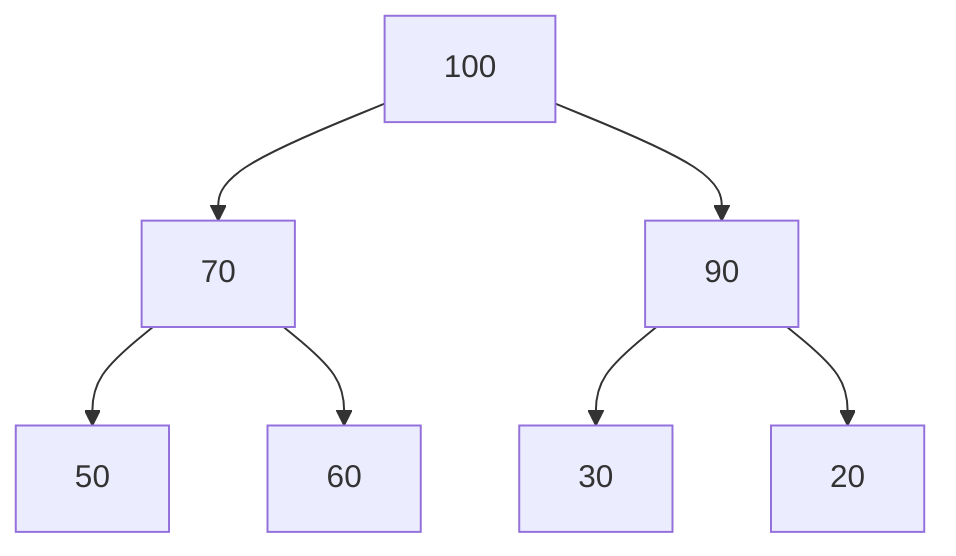

# Priority Queues

## Introduction

Ever waited in a line where some people got served first because they had special privileges or urgent needs? Priority queues work in a similar way in computer science. Unlike standard queues that follow the First-In-First-Out (FIFO) principle, priority queues serve elements based on their priority values, ensuring that higher priority elements are processed before lower priority ones.

A priority queue is an abstract data type that supports two principal operations:
- **Insert**: Add an element with an associated priority
- **Extract max/min**: Remove and return the element with the highest/lowest priority

This data structure is crucial in various algorithms and real-world applications, from operating system task scheduling to pathfinding algorithms like Dijkstra's.

## How Priority Queues Work

A priority queue maintains elements in order based on their priority values. The element with the highest priority (or lowest, depending on the implementation) stays at the front of the queue and is the first one to be removed.

There are several ways to implement a priority queue:

1. **Array or Linked List**: Simple but inefficient, with O(1) for insertion but O(n) for extraction.
2. **Binary Heap**: Most common implementation, with O(log n) for both insertion and extraction.
3. **Binary Search Tree**: Offers O(log n) for both operations but more complex to implement.
4. **Fibonacci Heap**: Advanced implementation with better theoretical performance.

In this lesson, we'll focus on implementing a priority queue using a binary heap.

## Binary Heap Implementation

A binary heap is a complete binary tree where each node has a higher (or lower) value than its children. For a max heap, each parent node has a value greater than or equal to its children. For a min heap, each parent has a value less than or equal to its children.

Here's how we can visualize a max heap:



### Implementing a Simple Priority Queue

Let's implement a basic priority queue using a binary max heap in JavaScript:

```javascript
class PriorityQueue {
  constructor() {
    this.heap = [];
  }
  
  // Helper methods for getting parent and child indices
  getParentIndex(childIndex) {
    return Math.floor((childIndex - 1) / 2);
  }
  
  getLeftChildIndex(parentIndex) {
    return 2 * parentIndex + 1;
  }
  
  getRightChildIndex(parentIndex) {
    return 2 * parentIndex + 2;
  }
  
  // Helper methods to check if elements exist
  hasParent(childIndex) {
    return this.getParentIndex(childIndex) >= 0;
  }
  
  hasLeftChild(parentIndex) {
    return this.getLeftChildIndex(parentIndex) < this.heap.length;
  }
  
  hasRightChild(parentIndex) {
    return this.getRightChildIndex(parentIndex) < this.heap.length;
  }
  
  // Helper methods to get element values
  parent(childIndex) {
    return this.heap[this.getParentIndex(childIndex)];
  }
  
  leftChild(parentIndex) {
    return this.heap[this.getLeftChildIndex(parentIndex)];
  }
  
  rightChild(parentIndex) {
    return this.heap[this.getRightChildIndex(parentIndex)];
  }
  
  // Method to swap two elements in the heap
  swap(indexOne, indexTwo) {
    const temp = this.heap[indexOne];
    this.heap[indexOne] = this.heap[indexTwo];
    this.heap[indexTwo] = temp;
  }
  
  // Returns the highest priority element without removing it
  peek() {
    if (this.heap.length === 0) {
      return null;
    }
    return this.heap[0];
  }
  
  // Inserts an element into the priority queue
  insert(item) {
    this.heap.push(item);
    this.heapifyUp();
    return this;
  }
  
  // Removes and returns the highest priority element
  extractMax() {
    if (this.heap.length === 0) {
      return null;
    }
    
    const max = this.heap[0];
    const lastItem = this.heap.pop();
    
    if (this.heap.length > 0) {
      this.heap[0] = lastItem;
      this.heapifyDown();
    }
    
    return max;
  }
  
  // Restore heap property going up (used after insertion)
  heapifyUp() {
    let index = this.heap.length - 1;
    
    while (this.hasParent(index) && this.parent(index) < this.heap[index]) {
      this.swap(this.getParentIndex(index), index);
      index = this.getParentIndex(index);
    }
  }
  
  // Restore heap property going down (used after extractMax)
  heapifyDown() {
    let index = 0;
    
    while (this.hasLeftChild(index)) {
      let largerChildIndex = this.getLeftChildIndex(index);
      
      if (this.hasRightChild(index) && this.rightChild(index) > this.leftChild(index)) {
        largerChildIndex = this.getRightChildIndex(index);
      }
      
      if (this.heap[index] > this.heap[largerChildIndex]) {
        break;
      } else {
        this.swap(index, largerChildIndex);
      }
      
      index = largerChildIndex;
    }
  }
  
  // Returns the size of the priority queue
  size() {
    return this.heap.length;
  }
  
  // Checks if the priority queue is empty
  isEmpty() {
    return this.heap.length === 0;
  }
}
```

### Example Usage

```javascript
// Create a new priority queue
const pq = new PriorityQueue();

// Insert elements with priorities
pq.insert(5);
pq.insert(10);
pq.insert(3);
pq.insert(8);
pq.insert(2);

// Print the current state of the heap
console.log("Priority Queue:", pq.heap);
// Output: Priority Queue: [10, 8, 3, 5, 2]

// Extract highest priority elements
console.log("Highest priority:", pq.extractMax());
// Output: Highest priority: 10
console.log("Next highest priority:", pq.extractMax());
// Output: Next highest priority: 8

// Current state after extractions
console.log("Priority Queue after extraction:", pq.heap);
// Output: Priority Queue after extraction: [5, 2, 3]
```

## Key Operations and Time Complexity

| Operation | Time Complexity | Description |
|-----------|----------------|------------|
| Insert | O(log n) | Add element and restore heap property |
| Extract Max/Min | O(log n) | Remove highest/lowest priority element |
| Peek | O(1) | View highest/lowest priority without removing |
| isEmpty | O(1) | Check if queue has elements |
| Size | O(1) | Get number of elements in queue |

## Min-Priority Queue

The implementation above is for a max-priority queue. To create a min-priority queue, where the smallest element has the highest priority, we simply need to flip the comparisons in `heapifyUp()` and `heapifyDown()`:

```javascript
// In heapifyUp for a min heap
while (this.hasParent(index) && this.parent(index) > this.heap[index]) {
  this.swap(this.getParentIndex(index), index);
  index = this.getParentIndex(index);
}

// In heapifyDown for a min heap
let smallerChildIndex = this.getLeftChildIndex(index);
if (this.hasRightChild(index) && this.rightChild(index) < this.leftChild(index)) {
  smallerChildIndex = this.getRightChildIndex(index);
}
```

## Priority Queue with Custom Priority

In many practical applications, we need to work with elements that have associated data, not just priority values. Here's how we can modify our implementation to handle elements with custom priorities:

```javascript
class PriorityQueueWithData {
  constructor() {
    this.heap = [];
  }
  
  // Similar helper methods as before
  
  // Insert element with data and priority
  insert(priority, data) {
    const element = { priority, data };
    this.heap.push(element);
    this.heapifyUp();
    return this;
  }
  
  heapifyUp() {
    let index = this.heap.length - 1;
    
    while (
      this.hasParent(index) && 
      this.parent(index).priority < this.heap[index].priority
    ) {
      this.swap(this.getParentIndex(index), index);
      index = this.getParentIndex(index);
    }
  }
  
  // Similarly modify heapifyDown to compare .priority
}
```

Example usage:

```javascript
const taskQueue = new PriorityQueueWithData();

taskQueue.insert(1, "Low priority task");
taskQueue.insert(5, "Critical task");
taskQueue.insert(3, "Medium priority task");

console.log(taskQueue.extractMax());
// Output: { priority: 5, data: "Critical task" }
```

## Real-World Applications

Priority queues are fundamental data structures with numerous applications:

### 1. Process Scheduling in Operating Systems

Operating systems use priority queues to determine which process to run next, with higher priority processes getting CPU time before lower priority ones.

```javascript
class Process {
  constructor(id, priority, executionTime) {
    this.id = id;
    this.priority = priority;
    this.executionTime = executionTime;
  }
}

function simulateProcessScheduling() {
  const processQueue = new PriorityQueueWithData();
  
  // Add processes with different priorities
  processQueue.insert(3, new Process(1, 3, 10));
  processQueue.insert(1, new Process(2, 1, 5));
  processQueue.insert(5, new Process(3, 5, 3));
  
  console.log("Executing processes in priority order:");
  while (!processQueue.isEmpty()) {
    const nextProcess = processQueue.extractMax().data;
    console.log(`Running process ${nextProcess.id} with priority ${nextProcess.priority} (Execution time: ${nextProcess.executionTime}ms)`);
  }
}

// Output:
// Executing processes in priority order:
// Running process 3 with priority 5 (Execution time: 3ms)
// Running process 1 with priority 3 (Execution time: 10ms)
// Running process 2 with priority 1 (Execution time: 5ms)
```

### 2. Dijkstra's Algorithm for Path Finding

Dijkstra's algorithm uses a priority queue to find the shortest path in a weighted graph.

```javascript
function dijkstra(graph, startNode) {
  const distances = {};
  const previous = {};
  const pq = new PriorityQueueWithData();
  
  // Initialize distances
  for (let vertex in graph) {
    if (vertex === startNode) {
      distances[vertex] = 0;
      pq.insert(0, vertex); // Priority is negated because we need a min-priority queue
    } else {
      distances[vertex] = Infinity;
      previous[vertex] = null;
    }
  }
  
  while (!pq.isEmpty()) {
    const current = pq.extractMax().data;
    
    // For each neighbor of current
    for (let neighbor in graph[current]) {
      const distance = distances[current] + graph[current][neighbor];
      
      if (distance < distances[neighbor]) {
        distances[neighbor] = distance;
        previous[neighbor] = current;
        pq.insert(-distance, neighbor); // Negative because we want min priority
      }
    }
  }
  
  return { distances, previous };
}
```

### 3. Huffman Coding for Data Compression

Priority queues are used in Huffman coding to build an optimal prefix tree for data compression.

### 4. Event-Driven Simulation

Events are processed in order of their scheduled occurrence time.

```javascript
class Event {
  constructor(time, type, data) {
    this.time = time;
    this.type = type;
    this.data = data;
  }
}

function simulateEvents() {
  // Assuming we have a MinPriorityQueue
  const eventQueue = new MinPriorityQueueWithData();
  
  // Schedule events
  eventQueue.insert(10, new Event(10, "customer_arrival", { id: 1 }));
  eventQueue.insert(5, new Event(5, "system_check", { status: "ok" }));
  eventQueue.insert(15, new Event(15, "customer_departure", { id: 1 }));
  
  // Process events in chronological order
  while (!eventQueue.isEmpty()) {
    const event = eventQueue.extractMin().data;
    console.log(`Time ${event.time}: Processing ${event.type}`);
    // Handle event logic here
  }
}

// Output:
// Time 5: Processing system_check
// Time 10: Processing customer_arrival
// Time 15: Processing customer_departure
```

## Additional Considerations

### Priority Queue vs. Heap

While heaps are the most common implementation of priority queues, it's important to understand that:

1. A priority queue is an abstract data type (ADT) that defines behavior.
2. A heap is a data structure that can be used to implement a priority queue.

Other implementations of priority queues exist, each with their own tradeoffs.

### Using JavaScript's Built-in Sort

For small datasets, you might implement a simple priority queue using JavaScript's array methods:

```javascript
class SimplePriorityQueue {
  constructor() {
    this.queue = [];
  }
  
  enqueue(item, priority) {
    this.queue.push({ item, priority });
    this.queue.sort((a, b) => b.priority - a.priority); // For max priority queue
  }
  
  dequeue() {
    if (this.isEmpty()) return null;
    return this.queue.shift().item;
  }
  
  isEmpty() {
    return this.queue.length === 0;
  }
}
```

This approach is inefficient for large datasets (O(n log n) for enqueue) but simple to understand.

## Summary

Priority queues are powerful data structures that maintain elements according to their priority values. They're typically implemented using binary heaps, providing efficient O(log n) operations for insertion and extraction.

Key points to remember:
- Priority queues serve elements based on priority, not insertion order
- The most common implementation uses binary heaps
- Max priority queues serve highest values first, min priority queues serve lowest values first
- Time complexity for insert and extract operations is O(log n)
- They're used in various algorithms and real-world applications like process scheduling, graph algorithms, and event simulation

## Exercises

1. Implement a min priority queue that returns the smallest element first.
2. Extend the priority queue to handle elements with the same priority using a FIFO approach for tie-breaking.
3. Write a function that sorts an array using a priority queue.
4. Implement Dijkstra's algorithm using your priority queue implementation.
5. Create a task scheduler that handles tasks with different priorities and execution times.

## Additional Resources

- [MIT OpenCourseWare: Priority Queues](https://ocw.mit.edu/courses/electrical-engineering-and-computer-science/6-006-introduction-to-algorithms-fall-2011/lecture-videos/lecture-4-heaps-and-heap-sort/)
- [Visualizing Binary Heaps](https://www.cs.usfca.edu/~galles/visualization/Heap.html)
- [Priority Queues in the C++ Standard Library](https://en.cppreference.com/w/cpp/container/priority_queue)
- [JavaScript Data Structures: Priority Queue & Heap](https://www.30secondsofcode.org/articles/s/js-data-structures-priority-queue)
- [Competitive Programming Algorithms: Priority Queue Applications](https://cp-algorithms.com/data_structures/heap.html)

Happy coding!