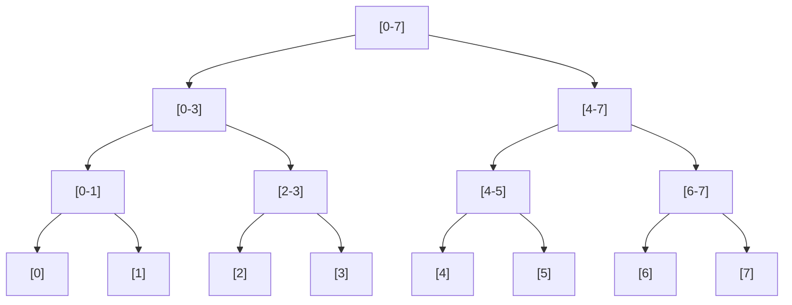

# Segment Trees

## Introduction

Have you ever faced a problem where you need to repeatedly perform operations on ranges of an array, like finding the sum or minimum value between indices i and j? A naive approach would require O(n) time for each query, which can be inefficient for large arrays or numerous queries. This is where **Segment Trees** come to the rescue!

A Segment Tree is a versatile and powerful tree data structure that allows us to efficiently perform range queries and updates on arrays. With segment trees, operations that would normally take O(n) time can be reduced to O(log n), making them invaluable for competitive programming and real-world applications that process large datasets.

In this tutorial, you'll learn:
- What segment trees are and how they work
- How to build a segment tree
- How to perform range queries (sum, minimum, maximum, etc.)
- How to update values in a segment tree
- Practical applications and optimizations

Let's dive in!

## Understanding Segment Trees

### What is a Segment Tree?

A segment tree is a binary tree where:
- Each node represents a segment (range) of the array
- The root represents the entire array [0, n-1]
- Each leaf node represents a single element of the array
- Each non-leaf node has two children that represent the left and right halves of its segment



Each node stores information about its range. For example, in a segment tree for range sum queries, each node stores the sum of all elements in its range.

### Properties of Segment Trees

1. **Height**: For an array of size n, the height of the segment tree is ⌈log₂(n)⌉
2. **Number of nodes**: A segment tree requires approximately 4*n memory spaces (nodes)
3. **Construction time**: O(n)
4. **Query time**: O(log n)
5. **Update time**: O(log n)

## Building a Segment Tree

Let's implement a segment tree for range sum queries. We'll start by defining the structure and building the tree.

```cpp
#include <iostream>
#include <vector>
using namespace std;

// Segment Tree structure
vector<int> tree;

// Function to build the segment tree
void buildSegmentTree(vector<int>& arr, int node, int start, int end) {
    // If leaf node, store the array element
    if (start == end) {
        tree[node] = arr[start];
        return;
    }
    
    int mid = start + (end - start) / 2;
    
    // Recursively build left and right children
    buildSegmentTree(arr, 2*node+1, start, mid);
    buildSegmentTree(arr, 2*node+2, mid+1, end);
    
    // Internal node stores the sum of its children
    tree[node] = tree[2*node+1] + tree[2*node+2];
}

// Initialize and build the segment tree
void initSegmentTree(vector<int>& arr) {
    int n = arr.size();
    // Height of segment tree = ceil(log₂(n))
    int height = ceil(log2(n));
    // Maximum size of segment tree = 2*2^height - 1
    int maxSize = 2 * pow(2, height) - 1;
    
    tree.resize(maxSize);
    buildSegmentTree(arr, 0, 0, n-1);
}
```

### Example

Let's use our segment tree implementation with an example array:

```cpp
int main() {
    vector<int> arr = {1, 3, 5, 7, 9, 11};
    initSegmentTree(arr);
    
    cout << "Segment Tree Array Representation:\n";
    for (int i = 0; i < tree.size(); i++) {
        if (tree[i] != 0) {
            cout << "Node " << i << ": " << tree[i] << "\n";
        }
    }
    
    return 0;
}
```

**Output:**
```
Segment Tree Array Representation:
Node 0: 36
Node 1: 16
Node 2: 20
Node 3: 4
Node 4: 12
Node 5: 9
Node 6: 11
Node 7: 1
Node 8: 3
Node 9: 5
Node 10: 7
```

In this representation, the internal nodes store the sum of their children, and the leaf nodes correspond to the original array elements.

## Performing Range Queries

Now that we have built our segment tree, let's implement the range sum query function:

```cpp
// Query for sum in range [queryStart, queryEnd]
int querySum(int node, int start, int end, int queryStart, int queryEnd) {
    // If segment is completely outside the query range
    if (start > queryEnd || end < queryStart)
        return 0;
    
    // If segment is completely inside the query range
    if (queryStart <= start && end <= queryEnd)
        return tree[node];
    
    // If segment is partially inside and partially outside the query range
    int mid = start + (end - start) / 2;
    int leftSum = querySum(2*node+1, start, mid, queryStart, queryEnd);
    int rightSum = querySum(2*node+2, mid+1, end, queryStart, queryEnd);
    
    return leftSum + rightSum;
}

// Wrapper function for querySum
int getSum(int n, int queryStart, int queryEnd) {
    // Check for invalid range
    if (queryStart < 0 || queryEnd > n-1 || queryStart > queryEnd) {
        cout << "Invalid range\n";
        return -1;
    }
    
    return querySum(0, 0, n-1, queryStart, queryEnd);
}
```

### How the Query Algorithm Works

1. We check if the current segment is completely outside the query range. If so, we return 0 (identity element for sum).
2. If the current segment is completely inside the query range, we return the value stored at the current node.
3. If the current segment is partially inside and partially outside, we split our query into two parts and recursively query the left and right children.

### Example

Let's query the sum for different ranges:

```cpp
int main() {
    vector<int> arr = {1, 3, 5, 7, 9, 11};
    int n = arr.size();
    initSegmentTree(arr);
    
    cout << "Sum in range [1, 3]: " << getSum(n, 1, 3) << "\n";
    cout << "Sum in range [2, 5]: " << getSum(n, 2, 5) << "\n";
    cout << "Sum in range [0, 5]: " << getSum(n, 0, 5) << "\n";
    
    return 0;
}
```

**Output:**
```
Sum in range [1, 3]: 15
Sum in range [2, 5]: 32
Sum in range [0, 5]: 36
```

## Updating Values in a Segment Tree

Now let's implement a function to update values in the segment tree:

```cpp
// Update value at a specific index
void updateValue(vector<int>& arr, int node, int start, int end, int idx, int newValue) {
    // If index is outside the current range
    if (idx < start || idx > end)
        return;
    
    // If leaf node (corresponding to the array element)
    if (start == end) {
        // Update array value
        arr[idx] = newValue;
        // Update tree node
        tree[node] = newValue;
        return;
    }
    
    // Recursively update the appropriate child
    int mid = start + (end - start) / 2;
    if (idx <= mid)
        updateValue(arr, 2*node+1, start, mid, idx, newValue);
    else
        updateValue(arr, 2*node+2, mid+1, end, idx, newValue);
    
    // Update current node after children are updated
    tree[node] = tree[2*node+1] + tree[2*node+2];
}

// Wrapper function for updateValue
void update(vector<int>& arr, int idx, int newValue) {
    int n = arr.size();
    
    // Check for invalid index
    if (idx < 0 || idx > n-1) {
        cout << "Invalid index\n";
        return;
    }
    
    updateValue(arr, 0, 0, n-1, idx, newValue);
}
```

### Example

Let's update some values and see how it affects our queries:

```cpp
int main() {
    vector<int> arr = {1, 3, 5, 7, 9, 11};
    int n = arr.size();
    initSegmentTree(arr);
    
    cout << "Original Sum in range [1, 3]: " << getSum(n, 1, 3) << "\n";
    
    // Update arr[2] from 5 to 10
    update(arr, 2, 10);
    cout << "After updating arr[2] to 10, Sum in range [1, 3]: " << getSum(n, 1, 3) << "\n";
    
    // Update arr[4] from 9 to 15
    update(arr, 4, 15);
    cout << "After updating arr[4] to 15, Sum in range [2, 5]: " << getSum(n, 2, 5) << "\n";
    
    return 0;
}
```

**Output:**
```
Original Sum in range [1, 3]: 15
After updating arr[2] to 10, Sum in range [1, 3]: 20
After updating arr[4] to 15, Sum in range [2, 5]: 43
```

## Beyond Sum Queries: Other Operations

Segment trees aren't limited to sum queries. They can be adapted for various operations:

### Minimum Range Query

```cpp
// Build segment tree for minimum value queries
void buildMinSegmentTree(vector<int>& arr, int node, int start, int end) {
    if (start == end) {
        tree[node] = arr[start];
        return;
    }
    
    int mid = start + (end - start) / 2;
    buildMinSegmentTree(arr, 2*node+1, start, mid);
    buildMinSegmentTree(arr, 2*node+2, mid+1, end);
    
    tree[node] = min(tree[2*node+1], tree[2*node+2]);
}

// Query for minimum value in range [queryStart, queryEnd]
int queryMin(int node, int start, int end, int queryStart, int queryEnd) {
    if (start > queryEnd || end < queryStart)
        return INT_MAX;  // Identity element for min
    
    if (queryStart <= start && end <= queryEnd)
        return tree[node];
    
    int mid = start + (end - start) / 2;
    int leftMin = queryMin(2*node+1, start, mid, queryStart, queryEnd);
    int rightMin = queryMin(2*node+2, mid+1, end, queryStart, queryEnd);
    
    return min(leftMin, rightMin);
}
```

### Maximum Range Query

```cpp
// Build segment tree for maximum value queries
void buildMaxSegmentTree(vector<int>& arr, int node, int start, int end) {
    if (start == end) {
        tree[node] = arr[start];
        return;
    }
    
    int mid = start + (end - start) / 2;
    buildMaxSegmentTree(arr, 2*node+1, start, mid);
    buildMaxSegmentTree(arr, 2*node+2, mid+1, end);
    
    tree[node] = max(tree[2*node+1], tree[2*node+2]);
}

// Query for maximum value in range [queryStart, queryEnd]
int queryMax(int node, int start, int end, int queryStart, int queryEnd) {
    if (start > queryEnd || end < queryStart)
        return INT_MIN;  // Identity element for max
    
    if (queryStart <= start && end <= queryEnd)
        return tree[node];
    
    int mid = start + (end - start) / 2;
    int leftMax = queryMax(2*node+1, start, mid, queryStart, queryEnd);
    int rightMax = queryMax(2*node+2, mid+1, end, queryStart, queryEnd);
    
    return max(leftMax, rightMax);
}
```

## Lazy Propagation: Optimizing Range Updates

One limitation of our current implementation is that updating a range of values requires multiple single-element updates, which is inefficient for large ranges. **Lazy propagation** is a technique that allows us to efficiently update entire ranges at once.

The key idea is to postpone updates to children nodes until they are needed, using a separate "lazy" array to store pending updates.

```cpp
vector<int> tree;
vector<int> lazy;  // Lazy array to store pending updates

// Initialize segment tree with lazy propagation
void initSegmentTreeLazy(vector<int>& arr) {
    int n = arr.size();
    int height = ceil(log2(n));
    int maxSize = 2 * pow(2, height) - 1;
    
    tree.resize(maxSize, 0);
    lazy.resize(maxSize, 0);
    buildSegmentTree(arr, 0, 0, n-1);
}

// Propagate lazy updates to children
void propagate(int node, int start, int end) {
    if (lazy[node] != 0) {
        // Update current node with pending lazy value
        tree[node] += (end - start + 1) * lazy[node];
        
        // If not leaf, propagate to children
        if (start != end) {
            lazy[2*node+1] += lazy[node];
            lazy[2*node+2] += lazy[node];
        }
        
        // Reset lazy value for current node
        lazy[node] = 0;
    }
}

// Range update with lazy propagation
void updateRange(int node, int start, int end, int updateStart, int updateEnd, int value) {
    // Propagate pending updates
    propagate(node, start, end);
    
    // If current range is outside the update range
    if (start > updateEnd || end < updateStart)
        return;
    
    // If current range is completely inside the update range
    if (start >= updateStart && end <= updateEnd) {
        // Update current node
        tree[node] += (end - start + 1) * value;
        
        // If not leaf, mark children for lazy update
        if (start != end) {
            lazy[2*node+1] += value;
            lazy[2*node+2] += value;
        }
        return;
    }
    
    // Partially inside and partially outside, so recurse
    int mid = start + (end - start) / 2;
    updateRange(2*node+1, start, mid, updateStart, updateEnd, value);
    updateRange(2*node+2, mid+1, end, updateStart, updateEnd, value);
    
    // Update current node after children are updated
    tree[node] = tree[2*node+1] + tree[2*node+2];
}

// Query with lazy propagation
int querySumLazy(int node, int start, int end, int queryStart, int queryEnd) {
    // If completely outside the query range
    if (start > queryEnd || end < queryStart)
        return 0;
    
    // Propagate pending updates
    propagate(node, start, end);
    
    // If completely inside the query range
    if (start >= queryStart && end <= queryEnd)
        return tree[node];
    
    // Partially inside and partially outside
    int mid = start + (end - start) / 2;
    int leftSum = querySumLazy(2*node+1, start, mid, queryStart, queryEnd);
    int rightSum = querySumLazy(2*node+2, mid+1, end, queryStart, queryEnd);
    
    return leftSum + rightSum;
}
```

## Real-World Applications

Segment trees have numerous practical applications:

### 1. Database Systems

Segment trees can efficiently handle range queries in database systems, such as finding the sum, minimum, or maximum value in a specific range of records.

```cpp
// Example: Database sum query for sales between dates
int getSalesBetweenDates(int startDate, int endDate) {
    return querySumLazy(0, 0, daysInYear-1, startDate, endDate);
}
```

### 2. Computational Geometry

Segment trees can be used for range searching problems in computational geometry, such as finding all points within a given rectangle.

### 3. Financial Analysis

For analyzing time-series financial data, segment trees can quickly compute metrics like moving averages, minimum/maximum prices, or total volume over different time periods.

```cpp
// Example: Calculate maximum stock price in a date range
int getMaxStockPrice(int startDate, int endDate) {
    return queryMax(0, 0, tradingDays-1, startDate, endDate);
}
```

### 4. Online Judge Systems

Many competitive programming problems involve range queries, making segment trees a go-to data structure for solving such problems efficiently.

## Performance Optimizations

Here are some ways to optimize segment tree implementations:

1. **Array-based implementation**: Using arrays instead of nodes can reduce memory overhead.
2. **Iterative construction**: Building segment trees iteratively instead of recursively can be faster.
3. **Compressed segment trees**: For sparse arrays, compressed segment trees can save memory.
4. **Persistent segment trees**: When maintaining multiple versions of the data structure is required.

## Summary

In this tutorial, we explored segment trees, a powerful data structure for efficient range queries and updates. We covered:

- The structure and properties of segment trees
- Building a segment tree for various operations (sum, min, max)
- Performing range queries in O(log n) time
- Updating single values and ranges using lazy propagation
- Real-world applications of segment trees

Segment trees are incredibly versatile and are a must-have in any programmer's toolkit for solving range query problems efficiently.

## Practice Exercises

1. Implement a segment tree for finding the GCD (Greatest Common Divisor) of a range.
2. Modify the segment tree to handle range multiplication updates.
3. Implement a 2D segment tree for range queries on a matrix.
4. Solve the "Range Minimum Query" problem using a segment tree.
5. Create a segment tree that can switch between different operations (sum, min, max) dynamically.

## Additional Resources

- "Competitive Programmer's Handbook" by Antti Laaksonen
- Introduction to Algorithms (CLRS) - Section on Advanced Data Structures
- [CP-Algorithms: Segment Tree](https://cp-algorithms.com/data_structures/segment_tree.html)
- [Codeforces: Efficient and easy segment trees](https://codeforces.com/blog/entry/18051)

With this knowledge, you're well-equipped to tackle complex range query problems efficiently using segment trees!