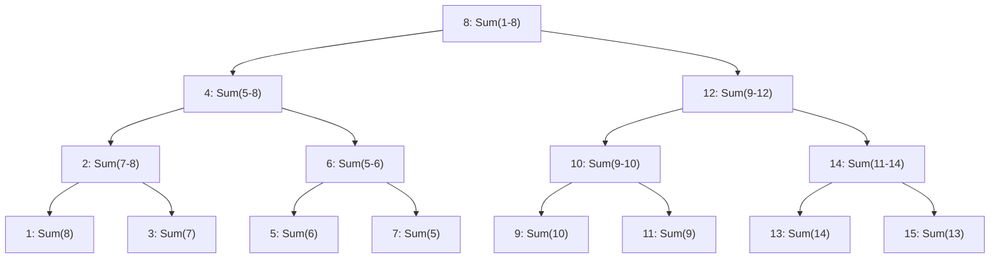

# Fenwick Trees

## Introduction

Fenwick Trees, also known as Binary Indexed Trees (BIT), are a powerful and memory-efficient data structure designed to efficiently perform two types of operations on an array:

1. Update the value at a specific position
2. Calculate prefix sums (the sum of elements from the beginning of the array up to a given position)

Developed by Peter Fenwick in 1994, this data structure offers a neat balance between implementation complexity and performance. While other structures like Segment Trees can solve similar problems, Fenwick Trees require less memory and are often easier to implement, making them particularly useful for competitive programming and real-world applications where efficient range queries are needed.

## Why Do We Need Fenwick Trees?

Let's consider a simple problem: We have an array of numbers, and we need to:
- Update values at certain indices
- Calculate the sum of elements from index 0 to index i (prefix sum)

With a standard array, we could:
- Update values in O(1) time
- Calculate prefix sums in O(n) time by summing all elements from 0 to i

For many applications, this becomes too slow, especially when we need to perform many operations on large arrays. Fenwick Trees allow us to perform both operations in O(log n) time, which is a significant improvement.

## How Fenwick Trees Work

The key insight behind Fenwick Trees is to represent an array as a virtual tree, where each node stores the sum of a specific range of elements.

### Binary Representation and Parent-Child Relationship

The magic of Fenwick Trees lies in how we use the binary representation of indices. Let's define:

- `p(i)` as the position obtained by removing the least significant bit from i

For example:
- p(12) = p(1100₂) = 1000₂ = 8
- p(10) = p(1010₂) = 1000₂ = 8
- p(6) = p(110₂) = 100₂ = 4

Each index i is responsible for storing the sum of elements from p(i) + 1 to i.



### Implementation

Let's implement a basic Fenwick Tree in C++:

```cpp
class FenwickTree {
private:
    vector<int> bit; // binary indexed tree
    int n;

public:
    FenwickTree(int size) {
        n = size;
        bit.assign(n + 1, 0); // 1-indexed
    }

    // Updates value at index idx by delta (adds delta)
    void update(int idx, int delta) {
        // index in BIT is 1-based
        for (; idx <= n; idx += idx & -idx) {
            bit[idx] += delta;
        }
    }

    // Returns sum of elements from 1 to idx (inclusive)
    int prefixSum(int idx) {
        int sum = 0;
        // index in BIT is 1-based
        for (; idx > 0; idx -= idx & -idx) {
            sum += bit[idx];
        }
        return sum;
    }

    // Returns sum of elements from l to r (inclusive)
    int rangeSum(int l, int r) {
        return prefixSum(r) - prefixSum(l - 1);
    }
};
```

In Python, the implementation looks like this:

```python
class FenwickTree:
    def __init__(self, n):
        self.n = n
        self.bit = [0] * (n + 1)  # 1-indexed
    
    def update(self, idx, delta):
        """Adds delta to element at index idx"""
        while idx <= self.n:
            self.bit[idx] += delta
            idx += idx & -idx
    
    def prefix_sum(self, idx):
        """Returns sum of elements from 1 to idx (inclusive)"""
        result = 0
        while idx > 0:
            result += self.bit[idx]
            idx -= idx & -idx
        return result
    
    def range_sum(self, left, right):
        """Returns sum of elements from left to right (inclusive)"""
        return self.prefix_sum(right) - self.prefix_sum(left - 1)
```

## Understanding the Operations

### The Update Operation

The `update` operation modifies the value at a specific index and updates all nodes in the tree that are affected by this change.

The key insight is:
- `idx & -idx` gives us the least significant bit of `idx`
- Adding this to `idx` gives us the next node in the tree that we need to update

```
update(5, 2):  // Add 2 to index 5
idx = 5 (101₂)
  bit[5] += 2
  idx = 5 + (5 & -5) = 5 + 1 = 6
  bit[6] += 2
  idx = 6 + (6 & -6) = 6 + 2 = 8
  bit[8] += 2
  idx = 8 + (8 & -8) = 8 + 8 = 16
  if 16 > n, stop.
```

### The Prefix Sum Operation

The `prefixSum` operation calculates the sum of elements from index 1 to `idx`.

The key insight here is:
- `idx - (idx & -idx)` gives us the parent of the current node
- We keep moving up the tree, adding the value at each node we visit

```
prefixSum(7):  // Sum elements from 1 to 7
idx = 7 (111₂)
  sum += bit[7]
  idx = 7 - (7 & -7) = 7 - 1 = 6
  sum += bit[6]
  idx = 6 - (6 & -6) = 6 - 2 = 4
  sum += bit[4]
  idx = 4 - (4 & -4) = 4 - 4 = 0
  Stop since idx = 0
```

## Example: Range Sum Queries

Let's see how we can use a Fenwick Tree to perform range sum queries efficiently.

```cpp
// Example usage
int main() {
    // Original array: [3, 2, -1, 6, 5, 4, -3, 3]
    int arr[] = {3, 2, -1, 6, 5, 4, -3, 3};
    int n = sizeof(arr) / sizeof(arr[0]);
    
    FenwickTree ft(n);
    
    // Build Fenwick Tree
    for (int i = 0; i < n; i++) {
        ft.update(i + 1, arr[i]);  // +1 because Fenwick is 1-indexed
    }
    
    cout << "Sum from index 1 to 5: " << ft.rangeSum(1, 5) << endl;  // Should be 15
    
    // Update arr[3] from 6 to 2 (decrease by 4)
    ft.update(4, -4);
    
    cout << "After update, sum from index 1 to 5: " << ft.rangeSum(1, 5) << endl;  // Should be 11
    
    return 0;
}
```

Output:
```
Sum from index 1 to 5: 15
After update, sum from index 1 to 5: 11
```

## Building a Fenwick Tree

There are two ways to build a Fenwick Tree:

1. Initialize an empty tree and use the `update` operation for each element:

```cpp
// Time complexity: O(n log n)
for (int i = 0; i < n; i++) {
    ft.update(i + 1, arr[i]);
}
```

2. Build it from the bottom up, which is more efficient:

```cpp
// Time complexity: O(n)
void build(vector<int>& arr) {
    bit.assign(n + 1, 0);
    for (int i = 0; i < n; i++) {
        bit[i + 1] = arr[i];
    }
    for (int i = 1; i <= n; i++) {
        int parent = i + (i & -i);
        if (parent <= n) {
            bit[parent] += bit[i];
        }
    }
}
```

## 2D Fenwick Trees

Fenwick Trees can be extended to handle 2D range queries, which is useful for problems involving rectangular regions:

```cpp
class FenwickTree2D {
private:
    vector<vector<int>> bit;
    int n, m;

public:
    FenwickTree2D(int n, int m) {
        this->n = n;
        this->m = m;
        bit.assign(n + 1, vector<int>(m + 1, 0));
    }

    void update(int x, int y, int delta) {
        for (int i = x; i <= n; i += i & -i) {
            for (int j = y; j <= m; j += j & -j) {
                bit[i][j] += delta;
            }
        }
    }

    int query(int x, int y) {
        int sum = 0;
        for (int i = x; i > 0; i -= i & -i) {
            for (int j = y; j > 0; j -= j & -j) {
                sum += bit[i][j];
            }
        }
        return sum;
    }

    // Returns sum in rectangle (x1,y1) to (x2,y2)
    int rangeQuery(int x1, int y1, int x2, int y2) {
        return query(x2, y2) - query(x1 - 1, y2) - 
               query(x2, y1 - 1) + query(x1 - 1, y1 - 1);
    }
};
```

## Real-World Applications

Fenwick Trees excel in various scenarios:

1. **Database Systems**: For fast computation of aggregate functions over ranges.

2. **Competitive Programming**: Many problems involve range queries and updates.

3. **Financial Analysis**: Computing cumulative sums over time series data.

4. **Game Development**: For efficient collision detection in 2D spaces.

5. **Text Editors**: For implementing features like line numbering with frequent insertions and deletions.

### Case Study: Online Voting System

Imagine an online voting system where:
- Users can vote for candidates
- Admins need real-time count of votes for each candidate
- Votes need to be categorized by demographic regions

A Fenwick Tree can efficiently:
1. Update vote counts when new votes come in
2. Query total votes for a candidate across specific regions
3. Support demographic analysis by efficiently calculating regional subtotals

## Common Extensions and Variations

### Range Updates with Point Queries

With a slight modification, Fenwick Trees can support range updates with point queries, which is the reverse of our original operations:

```cpp
// Add delta to all elements in range [l, r]
void rangeAdd(int l, int r, int delta) {
    update(l, delta);
    update(r + 1, -delta); // Cancel the effect after position r
}

// Get value at position pos
int pointQuery(int pos) {
    return prefixSum(pos);
}
```

### Fenwick Tree with Compression

For problems where the indices are large but sparse, we can use coordinate compression:

```cpp
// Compress coordinates
vector<int> coords = {/* distinct coordinates */};
sort(coords.begin(), coords.end());
coords.erase(unique(coords.begin(), coords.end()), coords.end());

// Get compressed index
int getIndex(int x) {
    return lower_bound(coords.begin(), coords.end(), x) - coords.begin() + 1;
}
```

## Performance Comparison

| Data Structure | Update   | Query    | Space | Implementation |
|----------------|----------|----------|-------|----------------|
| Array          | O(1)     | O(n)     | O(n)  | Very Simple    |
| Prefix Sum     | O(n)     | O(1)     | O(n)  | Simple         |
| Segment Tree   | O(log n) | O(log n) | O(n)  | Moderate       |
| Fenwick Tree   | O(log n) | O(log n) | O(n)  | Simple         |

## Summary

Fenwick Trees provide an elegant and efficient solution for problems requiring range sum queries and point updates, offering logarithmic time complexity for both operations. Their memory efficiency and relatively simple implementation make them a go-to choice for many practical applications.

Key points to remember:
- Fenwick Trees use the binary representation of indices to define parent-child relationships
- The critical operation is calculating the least significant bit (LSB) with `idx & -idx`
- Despite their simplicity, they offer powerful functionality for range queries
- They can be extended to higher dimensions and different types of queries

## Practice Problems

To master Fenwick Trees, try solving these problems:

1. Implement a dynamic array where you can insert/delete elements and find the sum of any subarray.
2. Count inversions in an array using a Fenwick Tree.
3. Implement a system to track and query the number of active users in different time intervals.
4. Design a 2D Fenwick Tree to handle rectangular range sum queries.
5. Modify a Fenwick Tree to find the minimum/maximum in a range instead of the sum.

## Additional Resources

- "Competitive Programmer's Handbook" by Antti Laaksonen
- "Introduction to Algorithms" by Cormen, Leiserson, Rivest, and Stein
- CP-Algorithms: [Fenwick Tree](https://cp-algorithms.com/data_structures/fenwick.html)
- USACO Guide: [Binary Indexed Trees](https://usaco.guide/gold/PURS)

Remember that the key to mastering Fenwick Trees is understanding how binary operations relate to the tree structure and practicing with various problems that leverage this powerful data structure.