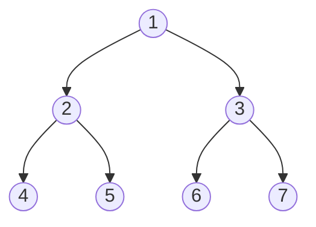

# Preorder Traversal

## Introduction

When working with tree data structures, we often need to visit each node in the tree in a systematic way. Tree traversal algorithms help us achieve this, and one of the fundamental traversal methods is **Preorder Traversal**.

Preorder traversal follows a specific sequence for visiting nodes in a tree:
1. Visit the current node (root)
2. Recursively traverse the left subtree
3. Recursively traverse the right subtree

This "root-left-right" approach makes preorder traversal particularly useful for creating copies of trees, evaluating expressions, and generating prefix notation of expressions.

## Understanding Preorder Traversal

Let's visualize how preorder traversal works with a simple binary tree:



In preorder traversal, we visit:
1. Root node first: `1`
2. Then the entire left subtree: `2 → 4 → 5`
3. Then the entire right subtree: `3 → 6 → 7`

The resulting traversal order is: `1, 2, 4, 5, 3, 6, 7`

## Implementing Preorder Traversal

### Recursive Approach

The recursive implementation of preorder traversal is elegant and intuitive:

```python
class TreeNode:
    def __init__(self, val=0, left=None, right=None):
        self.val = val
        self.left = left
        self.right = right

def preorder_traversal(root):
    result = []
    
    def dfs(node):
        if node is None:
            return
        
        # Process current node
        result.append(node.val)
        
        # Traverse left subtree
        dfs(node.left)
        
        # Traverse right subtree
        dfs(node.right)
    
    dfs(root)
    return result
```

### Iterative Approach

We can also implement preorder traversal iteratively using a stack:

```python
def preorder_traversal_iterative(root):
    if root is None:
        return []
    
    result = []
    stack = [root]
    
    while stack:
        # Pop the top node
        node = stack.pop()
        
        # Process the node
        result.append(node.val)
        
        # Push right child first (so it gets processed after the left child)
        if node.right:
            stack.append(node.right)
        
        # Push left child
        if node.left:
            stack.append(node.left)
    
    return result
```

## Example with Output

Let's see a complete example with the tree we visualized earlier:

```python
# Create the tree
#       1
#      / \
#     2   3
#    / \ / \
#   4  5 6  7

root = TreeNode(1)
root.left = TreeNode(2)
root.right = TreeNode(3)
root.left.left = TreeNode(4)
root.left.right = TreeNode(5)
root.right.left = TreeNode(6)
root.right.right = TreeNode(7)

# Recursive traversal
print("Recursive preorder traversal:", preorder_traversal(root))

# Iterative traversal
print("Iterative preorder traversal:", preorder_traversal_iterative(root))
```

Output:
```
Recursive preorder traversal: [1, 2, 4, 5, 3, 6, 7]
Iterative preorder traversal: [1, 2, 4, 5, 3, 6, 7]
```

## Variations and Extensions

### Preorder Traversal with N-ary Trees

Preorder traversal can be extended to trees with more than two children:

```python
class Node:
    def __init__(self, val=None, children=None):
        self.val = val
        self.children = children if children else []

def preorder_traversal_nary(root):
    result = []
    
    def dfs(node):
        if node is None:
            return
        
        # Process current node
        result.append(node.val)
        
        # Traverse all children
        for child in node.children:
            dfs(child)
    
    dfs(root)
    return result
```

### Iterative N-ary Tree Preorder Traversal

```python
def preorder_traversal_nary_iterative(root):
    if root is None:
        return []
    
    result = []
    stack = [root]
    
    while stack:
        node = stack.pop()
        result.append(node.val)
        
        # Add children in reverse order so they get processed in the correct order
        for child in reversed(node.children):
            stack.append(child)
    
    return result
```

## Real-World Applications

### 1. Creating a Copy of a Tree

Preorder traversal is perfect for creating exact copies of trees:

```python
def copy_tree(root):
    if root is None:
        return None
    
    # Create a new node with the same value (process current)
    new_root = TreeNode(root.val)
    
    # Recursively copy the left subtree
    new_root.left = copy_tree(root.left)
    
    # Recursively copy the right subtree
    new_root.right = copy_tree(root.right)
    
    return new_root
```

### 2. Serializing a Tree

Preorder traversal can be used to serialize a tree into a string or array format:

```python
def serialize_tree(root):
    result = []
    
    def dfs(node):
        if node is None:
            result.append("null")
            return
        
        result.append(str(node.val))
        dfs(node.left)
        dfs(node.right)
    
    dfs(root)
    return ",".join(result)
```

### 3. Expression Trees

For an expression tree, preorder traversal gives the prefix notation:

```python
def prefix_notation(root):
    if root is None:
        return ""
    
    # For an operator node
    if root.val in ['+', '-', '*', '/']:
        return f"{root.val} {prefix_notation(root.left)} {prefix_notation(root.right)}"
    
    # For an operand node
    return str(root.val)
```

For example, the expression tree for `(a + b) * c` in preorder gives `* + a b c`.

## Time and Space Complexity

- **Time Complexity**: O(n), where n is the number of nodes in the tree. We visit each node exactly once.
- **Space Complexity**: 
  - Recursive approach: O(h) where h is the height of the tree (due to the recursion stack)
  - Iterative approach: O(h) in the best case and O(n) in the worst case for the stack

## Common Mistakes and Tips

1. **Forgetting Base Case**: Always check if the current node is `None` before processing.
2. **Stack Order in Iterative Approach**: Remember to push the right child first, then the left child.
3. **Confusing with Other Traversals**: Preorder (root-left-right) is different from inorder (left-root-right) and postorder (left-right-root).

## Summary

Preorder traversal is a fundamental tree traversal algorithm that visits the root node first, followed by the left subtree, and finally the right subtree. It's particularly useful for:

- Creating copies of trees
- Serializing tree structures
- Converting expression trees to prefix notation
- Exploring hierarchical structures where the parent should be processed before its children

Both recursive and iterative implementations have their advantages, with recursion being more intuitive but potentially causing stack overflow for very deep trees.

## Practice Exercises

1. Implement a function to find the height of a binary tree using preorder traversal.
2. Modify the preorder traversal to print all nodes at a specific level in the tree.
3. Implement a preorder traversal that returns the path from root to a specific node.
4. Use preorder traversal to check if a given tree is a subtree of another tree.
5. Implement a function that converts a binary search tree to a sorted array using preorder traversal (hint: you'll need additional processing).

## Additional Resources

- [LeetCode Problem: Binary Tree Preorder Traversal](https://leetcode.com/problems/binary-tree-preorder-traversal/)
- [GeeksforGeeks: Tree Traversals](https://www.geeksforgeeks.org/tree-traversals-inorder-preorder-and-postorder/)
- [VisuAlgo: Tree Traversal Visualization](https://visualgo.net/en/bst)

Understanding preorder traversal is an important step in mastering tree algorithms and will give you a solid foundation for more complex tree operations and traversal techniques.