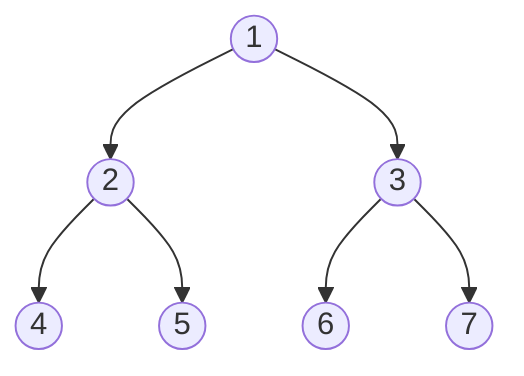
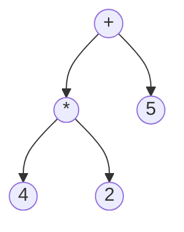

# Postorder Traversal

## Introduction

Postorder traversal is one of the three classic ways to explore a tree data structure (the others being preorder and inorder traversal). In postorder traversal, we visit nodes in a specific sequence: first the left subtree, then the right subtree, and finally the root node. This "left-right-root" pattern makes postorder traversal particularly useful for operations where we need to process children before their parents.

Think of postorder traversal as a bottom-up approach - we start from the leaves and work our way up to the root. This property makes it ideal for scenarios like deleting nodes from a tree or evaluating expressions in syntax trees.

## Understanding Postorder Traversal

To understand postorder traversal, let's break down the steps:

1. Recursively traverse the left subtree
2. Recursively traverse the right subtree
3. Visit the root node

This process ensures that for any node, all its descendants are processed before the node itself.

Let's visualize this with a simple binary tree:



In postorder traversal, we would visit these nodes in the following order: 4, 5, 2, 6, 7, 3, 1

Let's trace through the traversal:
- Start at node 1 (root)
- Before processing node 1, traverse left subtree (node 2 and its children)
  - Before processing node 2, traverse its left subtree (node 4)
    - Node 4 has no children, so visit node 4
  - Now traverse the right subtree of node 2 (node 5)
    - Node 5 has no children, so visit node 5
  - After traversing both subtrees, visit node 2
- Now traverse the right subtree of the root (node 3 and its children)
  - Before processing node 3, traverse its left subtree (node 6)
    - Node 6 has no children, so visit node 6
  - Now traverse the right subtree of node 3 (node 7)
    - Node 7 has no children, so visit node 7
  - After traversing both subtrees, visit node 3
- After traversing both the left and right subtrees, visit the root node (node 1)

## Implementing Postorder Traversal

### Recursive Implementation

The most intuitive way to implement postorder traversal is using recursion:

```python
class TreeNode:
    def __init__(self, value=0, left=None, right=None):
        self.value = value
        self.left = left
        self.right = right

def postorder_traversal(root):
    result = []
    
    def traverse(node):
        if node is None:
            return
        
        # First traverse left subtree
        traverse(node.left)
        
        # Then traverse right subtree
        traverse(node.right)
        
        # Finally visit the node
        result.append(node.value)
    
    traverse(root)
    return result

# Example usage
root = TreeNode(1, 
         TreeNode(2, TreeNode(4), TreeNode(5)), 
         TreeNode(3, TreeNode(6), TreeNode(7)))

print("Postorder traversal:", postorder_traversal(root))
# Output: Postorder traversal: [4, 5, 2, 6, 7, 3, 1]
```

### Iterative Implementation

Although recursive solutions are elegant, they can cause stack overflow for very deep trees. Here's an iterative approach using two stacks:

```python
def postorder_traversal_iterative(root):
    if not root:
        return []
    
    result = []
    stack1 = [root]
    stack2 = []
    
    # First stack is used to follow the pre-order traversal pattern
    # Second stack collects nodes in reverse order of postorder
    while stack1:
        node = stack1.pop()
        stack2.append(node)
        
        # Push left before right (opposite of preorder)
        if node.left:
            stack1.append(node.left)
        if node.right:
            stack1.append(node.right)
    
    # Process the second stack to get postorder
    while stack2:
        result.append(stack2.pop().value)
        
    return result

# Example usage with the same tree as above
print("Iterative postorder traversal:", postorder_traversal_iterative(root))
# Output: Iterative postorder traversal: [4, 5, 2, 6, 7, 3, 1]
```

Another iterative approach uses a single stack but requires additional tracking:

```javascript
function postorderTraversalOneStack(root) {
    const result = [];
    if (!root) return result;
    
    const stack = [];
    let current = root;
    let lastVisited = null;
    
    while (current || stack.length > 0) {
        // Go all the way to the left
        if (current) {
            stack.push(current);
            current = current.left;
        } else {
            // Peek at the top of stack
            const peek = stack[stack.length - 1];
            
            // If right child exists and is not processed yet, go right
            if (peek.right && lastVisited !== peek.right) {
                current = peek.right;
            } else {
                // Process the node if right subtree is processed or doesn't exist
                result.push(peek.value);
                lastVisited = stack.pop();
            }
        }
    }
    
    return result;
}
```

## Time and Space Complexity

- **Time Complexity**: O(n), where n is the number of nodes in the tree. We visit each node exactly once.
- **Space Complexity**: 
  - **Recursive**: O(h) where h is the height of the tree, due to the recursion stack.
  - **Iterative**: O(n) in the worst case, due to the stacks used.

## Practical Applications

Postorder traversal has several practical applications:

### 1. Tree Deletion

When deleting a tree, you must delete child nodes before parent nodes to avoid memory leaks. Postorder traversal naturally handles this requirement:

```python
def delete_tree(root):
    if not root:
        return
    
    # Delete left subtree
    delete_tree(root.left)
    
    # Delete right subtree
    delete_tree(root.right)
    
    # Delete the node itself
    print(f"Deleting node: {root.value}")
    del root
```

### 2. Expression Tree Evaluation

Postorder traversal is perfect for evaluating mathematical expression trees. Consider a tree where leaf nodes are operands and internal nodes are operators:



This represents (4 * 2) + 5. With postorder traversal, we'd process 4, 2, *, 5, +, which allows us to calculate (4 * 2) first, then add 5.

```python
def evaluate_expression_tree(root):
    if not root:
        return 0
    
    # Leaf node (operand)
    if not root.left and not root.right:
        return root.value
    
    # Evaluate left subtree
    left_val = evaluate_expression_tree(root.left)
    
    # Evaluate right subtree
    right_val = evaluate_expression_tree(root.right)
    
    # Apply the operator at the root
    if root.value == '+':
        return left_val + right_val
    elif root.value == '-':
        return left_val - right_val
    elif root.value == '*':
        return left_val * right_val
    elif root.value == '/':
        return left_val / right_val
```

### 3. Directory Size Calculation

Consider a file system where directories can contain files and subdirectories. To calculate the total size of a directory, you need the sizes of all its contents first - a perfect use case for postorder traversal:

```python
class FileSystemNode:
    def __init__(self, name, is_file=False, size=0):
        self.name = name
        self.is_file = is_file
        self.size = size  # Only relevant for files
        self.children = []  # Subdirectories and files
        
def calculate_directory_size(node):
    if node.is_file:
        return node.size
        
    total_size = 0
    # Calculate size of all children first
    for child in node.children:
        total_size += calculate_directory_size(child)
        
    print(f"Directory {node.name} has size {total_size}")
    return total_size
```

## Common Patterns and Techniques

### 1. Handling N-ary Trees

Postorder traversal works for trees with any number of children:

```python
class NaryTreeNode:
    def __init__(self, value=0):
        self.value = value
        self.children = []  # List of child nodes

def postorder_nary_tree(root):
    result = []
    
    def traverse(node):
        if not node:
            return
            
        # Process all children first
        for child in node.children:
            traverse(child)
            
        # Then process the node itself
        result.append(node.value)
        
    traverse(root)
    return result
```

### 2. Detecting Patterns from Bottom-Up

Some tree problems are easier to solve from the bottom-up using the natural flow of postorder traversal:

```python
def max_depth(root):
    if not root:
        return 0
        
    # Get the maximum depth of the left subtree
    left_depth = max_depth(root.left)
    
    # Get the maximum depth of the right subtree
    right_depth = max_depth(root.right)
    
    # Return the maximum of the two depths + 1 (for the current node)
    return max(left_depth, right_depth) + 1
```

## Summary

Postorder traversal is a powerful tree traversal technique with a "left-right-root" visiting pattern. It's particularly useful for operations that need to process child nodes before their parents, like tree deletion, expression evaluation, and bottom-up computations.

Key points to remember:
- The order is: left subtree, right subtree, root node
- Can be implemented recursively or iteratively
- Time complexity is O(n) where n is the number of nodes
- Ideal for bottom-up operations where children must be processed before parents

## Practice Exercises

1. **Basic Practice**: Implement both recursive and iterative postorder traversal for a binary tree.

2. **Tree Deletion**: Use postorder traversal to delete a binary tree while ensuring no memory leaks.

3. **Maximum Path Sum**: Find the maximum path sum from any node to any node in a binary tree using postorder traversal.

4. **Tree Serialization**: Serialize a binary tree into a string using postorder traversal, then deserialize it back.

5. **Expression Tree**: Build and evaluate an expression tree with operators (+, -, *, /) and numeric operands using postorder traversal.

6. **Tree Comparison**: Use postorder traversal to determine if two binary trees have the same structure and values.

Happy coding!