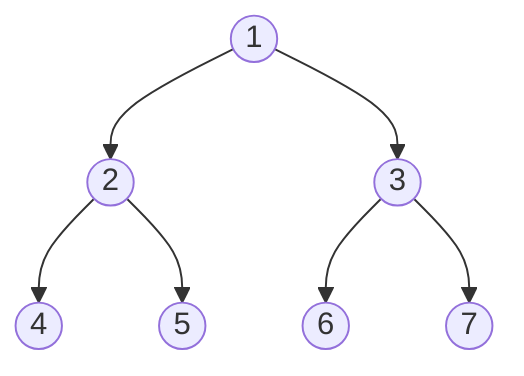

# Level Order Traversal

## Introduction

Level order traversal is a method of visiting all nodes in a tree data structure level by level, from left to right. Unlike depth-first traversals (like preorder, inorder, or postorder), level order traversal is a breadth-first approach, which means we explore all nodes at the current depth before moving on to nodes at the next depth level.

This traversal technique is particularly useful when you need to process nodes based on their distance from the root, or when you want to find the shortest path in an unweighted graph or tree.

## Understanding Level Order Traversal

In level order traversal:
1. We start at the root node (level 0)
2. We visit all nodes at the current level from left to right
3. We move to the next level and repeat the process
4. We continue until all levels have been traversed

Let's visualize this with a simple binary tree:



The level order traversal of this tree would be:
- Level 0: 1
- Level 1: 2, 3
- Level 2: 4, 5, 6, 7

So the complete level order traversal sequence is: `1, 2, 3, 4, 5, 6, 7`

## Implementing Level Order Traversal

### Queue-Based Approach

The most common implementation of level order traversal uses a queue data structure. This implementation follows these steps:

1. Create an empty queue
2. Enqueue the root node
3. While the queue is not empty:
   - Dequeue a node
   - Process the node (print its value, etc.)
   - Enqueue all of its children (from left to right)

Let's implement this in Python:

```python
from collections import deque

class TreeNode:
    def __init__(self, val=0, left=None, right=None):
        self.val = val
        self.left = left
        self.right = right

def levelOrderTraversal(root):
    if not root:
        return []
    
    result = []
    queue = deque([root])
    
    while queue:
        current_node = queue.popleft()
        result.append(current_node.val)
        
        if current_node.left:
            queue.append(current_node.left)
            
        if current_node.right:
            queue.append(current_node.right)
    
    return result

# Example usage
root = TreeNode(1)
root.left = TreeNode(2)
root.right = TreeNode(3)
root.left.left = TreeNode(4)
root.left.right = TreeNode(5)
root.right.left = TreeNode(6)
root.right.right = TreeNode(7)

print(levelOrderTraversal(root))  # Output: [1, 2, 3, 4, 5, 6, 7]
```

### Level-By-Level Approach

Sometimes, we want to keep track of the level information during traversal. For example, we might want to return the result as a list of lists, where each inner list represents one level:

```python
def levelOrderTraversalByLevel(root):
    if not root:
        return []
    
    result = []
    queue = deque([root])
    
    while queue:
        level_size = len(queue)
        current_level = []
        
        for _ in range(level_size):
            current_node = queue.popleft()
            current_level.append(current_node.val)
            
            if current_node.left:
                queue.append(current_node.left)
                
            if current_node.right:
                queue.append(current_node.right)
        
        result.append(current_level)
    
    return result

# Example usage with the same tree as before
print(levelOrderTraversalByLevel(root))
# Output: [[1], [2, 3], [4, 5, 6, 7]]
```

## Time and Space Complexity

- **Time Complexity**: O(n), where n is the number of nodes in the tree. Each node is processed exactly once.
- **Space Complexity**: O(w), where w is the maximum width of the tree. In the worst case, the queue might contain all nodes at the tree's widest level. For a complete binary tree, this can be up to n/2 nodes.

## Variations and Applications

### Zigzag Level Order Traversal

A variation of level order traversal is "zigzag" traversal, where nodes are visited in a zigzag pattern:
- Left to right for odd levels (level 1, 3, 5, ...)
- Right to left for even levels (level 0, 2, 4, ...)

```python
def zigzagLevelOrder(root):
    if not root:
        return []
    
    result = []
    queue = deque([root])
    left_to_right = True
    
    while queue:
        level_size = len(queue)
        current_level = []
        
        for _ in range(level_size):
            current_node = queue.popleft()
            current_level.append(current_node.val)
            
            if current_node.left:
                queue.append(current_node.left)
                
            if current_node.right:
                queue.append(current_node.right)
        
        if not left_to_right:
            current_level.reverse()
            
        result.append(current_level)
        left_to_right = not left_to_right
    
    return result
```

### Finding the Maximum Depth of a Tree

Level order traversal can be used to find the maximum depth (or height) of a tree:

```python
def maxDepth(root):
    if not root:
        return 0
    
    depth = 0
    queue = deque([root])
    
    while queue:
        level_size = len(queue)
        depth += 1
        
        for _ in range(level_size):
            current_node = queue.popleft()
            
            if current_node.left:
                queue.append(current_node.left)
                
            if current_node.right:
                queue.append(current_node.right)
    
    return depth
```

## Real-World Applications

### 1. Web Crawler

A web crawler can be implemented using a breadth-first approach similar to level order traversal. Starting from a seed URL (the root), it visits all linked pages (children) at the current depth before moving to the next level.

```python
def simple_web_crawler(seed_url, max_depth=2):
    visited = set()
    queue = deque([(seed_url, 0)])  # (url, depth)
    
    while queue:
        url, depth = queue.popleft()
        
        if url in visited or depth > max_depth:
            continue
        
        print(f"Visiting {url} at depth {depth}")
        visited.add(url)
        
        # In a real implementation, we would:
        # - Fetch the web page
        # - Extract links from the page
        # - Add them to the queue with depth+1
        
        # Simulating with dummy links
        if depth < max_depth:
            for i in range(1, 3):  # Simulating 2 links per page
                next_url = f"{url}/link{i}"
                queue.append((next_url, depth + 1))
```

### 2. Finding the Shortest Path in a Maze

Level order traversal can be used to find the shortest path in a maze or grid:

```python
def shortest_path(maze, start, end):
    rows, cols = len(maze), len(maze[0])
    visited = set([start])
    queue = deque([(start, 0)])  # (position, distance)
    directions = [(0, 1), (1, 0), (0, -1), (-1, 0)]  # right, down, left, up
    
    while queue:
        (x, y), distance = queue.popleft()
        
        if (x, y) == end:
            return distance
        
        for dx, dy in directions:
            nx, ny = x + dx, y + dy
            
            if (0 <= nx < rows and 0 <= ny < cols and 
                maze[nx][ny] != '#' and (nx, ny) not in visited):
                visited.add((nx, ny))
                queue.append(((nx, ny), distance + 1))
    
    return -1  # No path found
```

### 3. Level Order Operations in a Database

Level order traversal can be used in databases when dealing with hierarchical data structures like organization charts or category trees. For example, if you want to find all employees at a certain management level, you would use a level order traversal approach.

## Summary

Level order traversal is a breadth-first approach to visiting nodes in a tree. It processes all nodes level by level, from top to bottom, and from left to right within each level.

Key points to remember:
- It uses a queue data structure to keep track of nodes to visit
- It visits nodes level by level rather than branch by branch
- It's useful for problems involving the shortest path or level-based processing
- The time complexity is O(n) and the space complexity is O(w) where w is the maximum width of the tree

Level order traversal is a fundamental technique that's particularly valuable when the level information of nodes is important or when you need to process nodes based on their distance from the root.

## Exercises

1. Implement a function to print the average value of nodes at each level of a binary tree.
2. Modify the level order traversal to print nodes from right to left instead of left to right.
3. Implement a function that returns the level with the maximum sum in a binary tree.
4. Use level order traversal to determine if a binary tree is a complete binary tree.
5. Implement a function to find the leftmost value in the last row of a binary tree.

## Additional Resources

- [Binary Tree Data Structure](https://www.geeksforgeeks.org/binary-tree-data-structure/)
- [Breadth-First Search Algorithm](https://en.wikipedia.org/wiki/Breadth-first_search)
- [Tree Traversal Techniques](https://www.programiz.com/dsa/tree-traversal)
- [LeetCode Binary Tree Level Order Traversal](https://leetcode.com/problems/binary-tree-level-order-traversal/)

Happy coding!