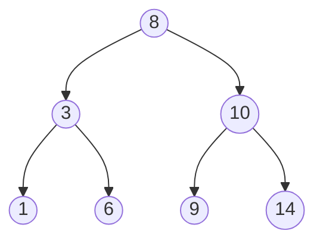
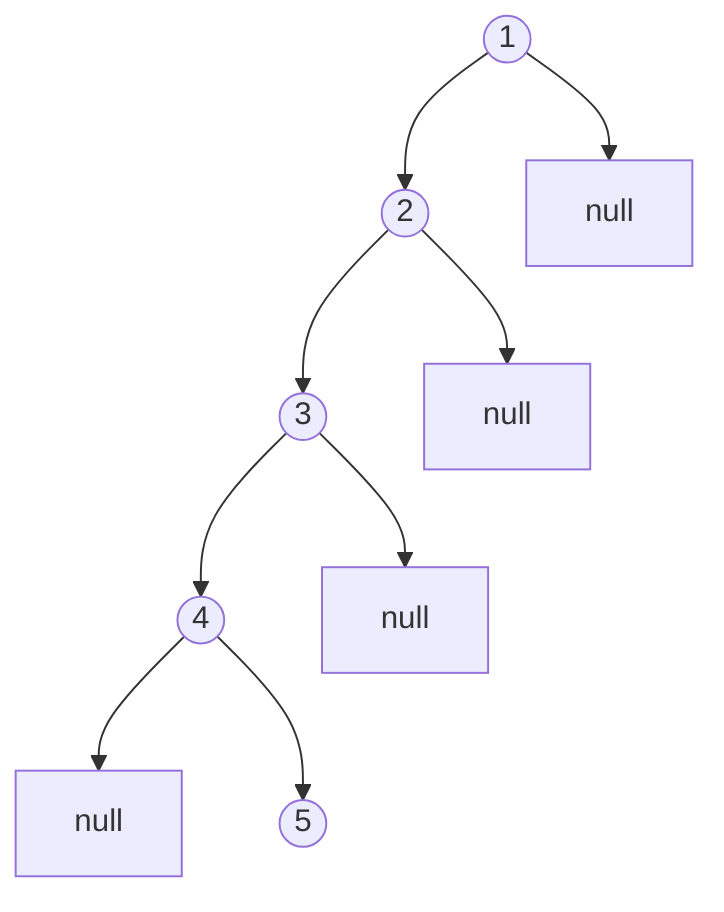

# Binary Search Trees

## Introduction

Binary Search Trees (BSTs) are fundamental data structures in computer science that allow efficient data storage, retrieval, and manipulation. A BST is a special type of binary tree that maintains an ordered structure, making operations like searching, insertion, and deletion much faster than in regular arrays or linked lists.

In this tutorial, you'll learn:
- What Binary Search Trees are and their key properties
- How to implement basic BST operations
- Common algorithms for traversing BSTs
- Practical applications of BSTs
- How to analyze BST performance

## What is a Binary Search Tree?

A Binary Search Tree is a tree data structure where each node has at most two children, referred to as the left child and right child. What makes it "binary search" is this key property:

**BST Property**: For any node in the tree:
- All nodes in its left subtree have values less than the node's value
- All nodes in its right subtree have values greater than the node's value

This ordering property is what gives BSTs their efficient search capability.

Here's what a simple Binary Search Tree looks like:



In this tree:
- 8 is the root node
- Any value less than 8 goes in the left subtree
- Any value greater than 8 goes in the right subtree
- The same rule applies recursively to all nodes in the tree

## Implementing a Binary Search Tree

Let's implement a basic Binary Search Tree in JavaScript:

```javascript
class Node {
  constructor(value) {
    this.value = value;
    this.left = null;
    this.right = null;
  }
}

class BinarySearchTree {
  constructor() {
    this.root = null;
  }
  
  // Methods will go here
}
```

### BST Operations

#### 1. Insertion

To insert a new value into a BST, we follow these steps:
1. Start at the root
2. Compare the value to be inserted with the current node
3. If the value is less, go left; if greater, go right
4. Repeat until finding an empty spot (null) where the new node should be placed

```javascript
insert(value) {
  const newNode = new Node(value);
  
  // If the tree is empty
  if (this.root === null) {
    this.root = newNode;
    return this;
  }
  
  let current = this.root;
  
  while (true) {
    // Handle duplicate values (optional)
    if (value === current.value) return undefined;
    
    // Go left
    if (value < current.value) {
      if (current.left === null) {
        current.left = newNode;
        return this;
      }
      current = current.left;
    } 
    // Go right
    else {
      if (current.right === null) {
        current.right = newNode;
        return this;
      }
      current = current.right;
    }
  }
}
```

#### 2. Searching

Searching in a BST is efficient due to the ordered property:

```javascript
search(value) {
  if (this.root === null) return false;
  
  let current = this.root;
  let found = false;
  
  while (current && !found) {
    if (value < current.value) {
      current = current.left;
    } else if (value > current.value) {
      current = current.right;
    } else {
      found = true;
    }
  }
  
  if (!found) return false;
  return current;
}
```

#### 3. Deletion

Deletion is the most complex operation in a BST because removing a node requires restructuring the tree to maintain the BST property. There are three cases to consider:

1. Deleting a leaf node (no children): Simply remove it
2. Deleting a node with one child: Replace the node with its child
3. Deleting a node with two children: Replace with the in-order successor (smallest value in the right subtree)

```javascript
remove(value) {
  this.root = this._removeNode(this.root, value);
  return this;
}

_removeNode(node, value) {
  // Base case: empty tree
  if (node === null) return null;
  
  // Navigate to the node to remove
  if (value < node.value) {
    node.left = this._removeNode(node.left, value);
    return node;
  } else if (value > node.value) {
    node.right = this._removeNode(node.right, value);
    return node;
  } 
  // Found the node to remove
  else {
    // Case 1: Leaf node (no children)
    if (node.left === null && node.right === null) {
      return null;
    }
    
    // Case 2: Node with only one child
    if (node.left === null) {
      return node.right;
    }
    if (node.right === null) {
      return node.left;
    }
    
    // Case 3: Node with two children
    // Find the minimum value in the right subtree
    let successor = this._findMin(node.right);
    node.value = successor.value;
    
    // Remove the successor
    node.right = this._removeNode(node.right, successor.value);
    return node;
  }
}

_findMin(node) {
  while (node.left !== null) {
    node = node.left;
  }
  return node;
}
```

## Tree Traversals

There are several ways to visit all nodes in a BST:

### 1. In-order Traversal

Visits nodes in ascending order (left, current, right)

```javascript
inOrder() {
  const result = [];
  
  function traverse(node) {
    if (node) {
      traverse(node.left);
      result.push(node.value);
      traverse(node.right);
    }
  }
  
  traverse(this.root);
  return result;
}
```

### 2. Pre-order Traversal

Visits the current node before its children (current, left, right)

```javascript
preOrder() {
  const result = [];
  
  function traverse(node) {
    if (node) {
      result.push(node.value);
      traverse(node.left);
      traverse(node.right);
    }
  }
  
  traverse(this.root);
  return result;
}
```

### 3. Post-order Traversal

Visits the current node after its children (left, right, current)

```javascript
postOrder() {
  const result = [];
  
  function traverse(node) {
    if (node) {
      traverse(node.left);
      traverse(node.right);
      result.push(node.value);
    }
  }
  
  traverse(this.root);
  return result;
}
```

## Example Usage

Let's see our BST in action:

```javascript
// Create a new BST
const bst = new BinarySearchTree();

// Insert values
bst.insert(8);
bst.insert(3);
bst.insert(10);
bst.insert(1);
bst.insert(6);
bst.insert(14);
bst.insert(9);

// Search for values
console.log(bst.search(6)); // Returns the node with value 6
console.log(bst.search(15)); // Returns false

// Traverse the tree
console.log(bst.inOrder()); // [1, 3, 6, 8, 9, 10, 14]
console.log(bst.preOrder()); // [8, 3, 1, 6, 10, 9, 14]
console.log(bst.postOrder()); // [1, 6, 3, 9, 14, 10, 8]

// Remove a value
bst.remove(3);
console.log(bst.inOrder()); // [1, 6, 8, 9, 10, 14]
```

## Performance Analysis

The time complexity of BST operations depends on the tree's height:

| Operation | Average Case | Worst Case |
|-----------|--------------|------------|
| Search    | O(log n)     | O(n)       |
| Insert    | O(log n)     | O(n)       |
| Delete    | O(log n)     | O(n)       |

In a balanced BST, operations are efficient with O(log n) complexity. However, if the tree becomes skewed (e.g., inserting sorted data), it degenerates into a linked list with O(n) performance.

For example, inserting values in ascending order [1, 2, 3, 4, 5] creates this skewed tree:



This is why self-balancing BST variants like AVL trees and Red-Black trees were developed to maintain O(log n) performance through automatic rebalancing.

## Practical Applications

Binary Search Trees are used in many real-world applications:

1. **Database Indexing**: BSTs and their balanced variants (B-trees) help databases quickly locate records.

2. **Priority Queues**: Implementing priority queues for task scheduling.

3. **Symbol Tables**: Compilers and interpreters use BSTs to store variable names and their attributes.

4. **Auto-complete and Spell Checking**: Finding words with similar prefixes.

5. **File System Organization**: Managing hierarchical file structures.

## Common BST Problems and Solutions

### 1. Height of a BST

The height is the longest path from the root to any leaf:

```javascript
height() {
  function calculateHeight(node) {
    if (node === null) return -1;
    
    const leftHeight = calculateHeight(node.left);
    const rightHeight = calculateHeight(node.right);
    
    return Math.max(leftHeight, rightHeight) + 1;
  }
  
  return calculateHeight(this.root);
}
```

### 2. Finding k-th Smallest Element

Using in-order traversal:

```javascript
kthSmallest(k) {
  let count = 0;
  let result = null;
  
  function traverse(node) {
    if (node === null || result !== null) return;
    
    traverse(node.left);
    
    count++;
    if (count === k) {
      result = node.value;
      return;
    }
    
    traverse(node.right);
  }
  
  traverse(this.root);
  return result;
}
```

## Summary

Binary Search Trees are powerful data structures that provide efficient operations for storing and retrieving ordered data. Their key advantages include:

- Fast search, insertion, and deletion operations (average O(log n) time)
- Maintaining data in sorted order
- Simple implementation compared to other balanced tree structures

However, they also have limitations:
- Can degenerate into linked lists with poor performance
- No O(1) operations like hash tables offer for exact lookups
- Need additional mechanisms for self-balancing to guarantee performance

Understanding BSTs is crucial for any programmer, as they form the foundation for many more advanced tree structures and algorithms.

## Practice Exercises

1. Implement a function to check if a binary tree is a valid BST.
2. Write a function to find the lowest common ancestor of two nodes in a BST.
3. Implement a range query function that returns all values in a given range [min, max].
4. Create a function to convert a sorted array to a balanced BST.
5. Implement a function to find the successor of a given node in a BST (the next larger value).

## Additional Resources

- **Books**: "Introduction to Algorithms" by Cormen, Leiserson, Rivest, and Stein
- **Online Courses**: Check out courses on algorithms and data structures on platforms like Coursera, edX, or Udemy
- **Practice**: Solve BST problems on coding challenge websites like LeetCode, HackerRank, or CodeSignal
- **Advanced Topics**: Look into self-balancing trees like AVL trees and Red-Black trees when you're comfortable with basic BSTs

By mastering Binary Search Trees, you'll have a solid foundation for understanding more complex tree structures and algorithms used in modern software development.