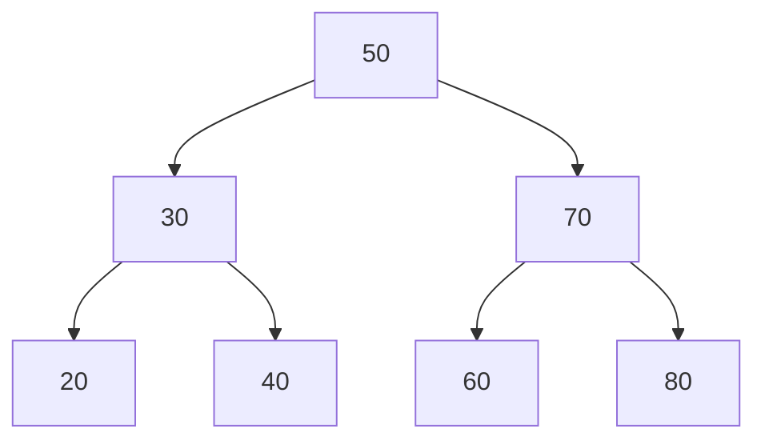
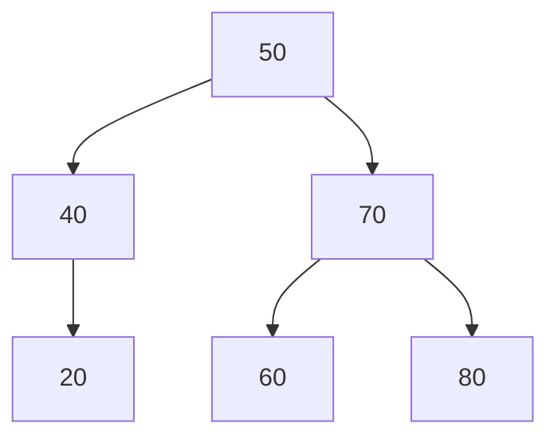

# BST Operations

## Introduction

Binary Search Trees (BSTs) are fundamental data structures in computer science that organize data in a hierarchical manner. Unlike regular binary trees, BSTs have a special property: for any node, all elements in its left subtree are less than the node's value, and all elements in its right subtree are greater than the node's value.

This simple property makes BSTs extremely useful for efficient data retrieval, insertion, and deletion operations. With a balanced BST, these operations can be performed in O(log n) time, making them much faster than linear data structures like arrays for large datasets.

In this tutorial, we'll explore the essential operations you can perform on a Binary Search Tree:
- Creating a BST
- Insertion of nodes
- Searching for values
- Traversing the tree
- Deletion of nodes
- Finding minimum and maximum values

Let's dive into each of these operations with clear examples and implementations.

## BST Structure

Before we begin with operations, let's define what a BST node looks like in code:

```java
class Node {
    int value;
    Node left;
    Node right;
    
    public Node(int value) {
        this.value = value;
        this.left = null;
        this.right = null;
    }
}

class BinarySearchTree {
    Node root;
    
    public BinarySearchTree() {
        this.root = null;
    }
    
    // BST operations will be implemented here
}
```

## Creating a BST

A BST starts with a root node and grows as we insert elements. Let's visualize a simple BST:



This tree follows the BST property: all nodes to the left of any node have smaller values, and all nodes to the right have larger values.

## BST Insertion

Insertion in a BST follows these steps:
1. Start at the root
2. Compare the value to be inserted with the current node's value
3. If the value is less, go to the left subtree
4. If the value is greater, go to the right subtree
5. Repeat until you find an empty spot (null) where you can insert the new node

Let's implement the insert operation:

```java
public void insert(int value) {
    root = insertRecursive(root, value);
}

private Node insertRecursive(Node root, int value) {
    // Base case: if the tree is empty
    if (root == null) {
        root = new Node(value);
        return root;
    }
    
    // Otherwise, recur down the tree
    if (value < root.value)
        root.left = insertRecursive(root.left, value);
    else if (value > root.value)
        root.right = insertRecursive(root.right, value);
    
    // Return the unchanged node pointer
    return root;
}
```

### Example: Building a BST

Let's insert the values `[50, 30, 70, 20, 40, 60, 80]` in order:

```
Step 1: Insert 50 → This becomes the root
Step 2: Insert 30 → Less than 50, so goes to the left
Step 3: Insert 70 → Greater than 50, so goes to the right
Step 4: Insert 20 → Less than 50, then less than 30, so goes to left of 30
Step 5: Insert 40 → Less than 50, then greater than 30, so goes to right of 30
Step 6: Insert 60 → Greater than 50, then less than 70, so goes to left of 70
Step 7: Insert 80 → Greater than 50, then greater than 70, so goes to right of 70
```

The result is the tree we visualized earlier.

## Searching in a BST

Searching in a BST is efficient because at each step, we eliminate half of the remaining tree. Here's how we search for a value:

```java
public boolean search(int value) {
    return searchRecursive(root, value);
}

private boolean searchRecursive(Node root, int value) {
    // Base cases: root is null or value is present at root
    if (root == null)
        return false;
    if (root.value == value)
        return true;
    
    // Value is greater than root's value
    if (root.value < value)
        return searchRecursive(root.right, value);
    
    // Value is less than root's value
    return searchRecursive(root.left, value);
}
```

### Example: Searching for a Value

Searching for 40 in our example BST:
```
Start at root (50)
40 < 50, so go left to 30
40 > 30, so go right to 40
Found 40!
```

Time complexity: O(h) where h is the height of the tree. In a balanced tree, this is O(log n).

## BST Traversal

There are three main ways to traverse a BST:

1. **In-order Traversal**: Left, Root, Right
2. **Pre-order Traversal**: Root, Left, Right
3. **Post-order Traversal**: Left, Right, Root

### In-order Traversal

In-order traversal visits nodes in ascending order, which is a key feature of BSTs.

```java
public void inorderTraversal() {
    inorderTraversal(root);
}

private void inorderTraversal(Node root) {
    if (root != null) {
        inorderTraversal(root.left);
        System.out.print(root.value + " ");
        inorderTraversal(root.right);
    }
}
```

For our example BST, in-order traversal gives: `20 30 40 50 60 70 80`

### Pre-order Traversal

Pre-order traversal is useful for creating a copy of the tree or prefix expression.

```java
public void preorderTraversal() {
    preorderTraversal(root);
}

private void preorderTraversal(Node root) {
    if (root != null) {
        System.out.print(root.value + " ");
        preorderTraversal(root.left);
        preorderTraversal(root.right);
    }
}
```

For our example BST, pre-order traversal gives: `50 30 20 40 70 60 80`

### Post-order Traversal

Post-order traversal is useful in deletion operations.

```java
public void postorderTraversal() {
    postorderTraversal(root);
}

private void postorderTraversal(Node root) {
    if (root != null) {
        postorderTraversal(root.left);
        postorderTraversal(root.right);
        System.out.print(root.value + " ");
    }
}
```

For our example BST, post-order traversal gives: `20 40 30 60 80 70 50`

## Finding Minimum and Maximum Values

In a BST, the minimum value is the leftmost node, and the maximum value is the rightmost node.

```java
public int findMin() {
    if (root == null)
        throw new IllegalStateException("BST is empty");
    
    Node current = root;
    while (current.left != null) {
        current = current.left;
    }
    return current.value;
}

public int findMax() {
    if (root == null)
        throw new IllegalStateException("BST is empty");
    
    Node current = root;
    while (current.right != null) {
        current = current.right;
    }
    return current.value;
}
```

In our example BST, the minimum value is 20 and the maximum is 80.

## Deleting a Node

Deletion is the most complex operation on a BST. There are three cases to consider:

1. **Deleting a leaf node** - Simply remove it
2. **Deleting a node with one child** - Replace the node with its child
3. **Deleting a node with two children** - Replace with its in-order successor (smallest node in right subtree)

Here's the implementation:

```java
public void delete(int value) {
    root = deleteRecursive(root, value);
}

private Node deleteRecursive(Node root, int value) {
    // Base case: If the tree is empty
    if (root == null) return null;
    
    // Traverse the tree
    if (value < root.value)
        root.left = deleteRecursive(root.left, value);
    else if (value > root.value)
        root.right = deleteRecursive(root.right, value);
    else {
        // Node with only one child or no child
        if (root.left == null)
            return root.right;
        else if (root.right == null)
            return root.left;
        
        // Node with two children, get the in-order successor
        root.value = minValue(root.right);
        
        // Delete the in-order successor
        root.right = deleteRecursive(root.right, root.value);
    }
    
    return root;
}

private int minValue(Node root) {
    int minValue = root.value;
    while (root.left != null) {
        minValue = root.left.value;
        root = root.left;
    }
    return minValue;
}
```

### Example: Deleting a Node

Let's delete 30 from our example tree:

```
Step 1: Find node with value 30
Step 2: Node has two children, so find the in-order successor (the minimum value in right subtree)
Step 3: The minimum value in right subtree of 30 is 40
Step 4: Replace 30 with 40
Step 5: Delete 40 from the right subtree (recursive call)
```

After deletion, our tree looks like:



## Real-World Applications

Binary Search Trees have numerous practical applications:

### 1. Database Indexing

Databases use BSTs (or variants like B-trees) to create indexes that speed up search operations. When you add an index to a database column, the database engine creates a tree-like structure to quickly locate records.

### 2. Priority Queues

BSTs can be used to implement priority queues, where elements with higher priorities are served before elements with lower priorities.

```java
// Using a BST as a simple priority queue
public void addTask(int priority) {
    insert(priority);
}

public int getHighestPriorityTask() {
    return findMax();
}

public int getLowestPriorityTask() {
    return findMin();
}
```

### 3. Symbol Tables in Compilers

Compilers use BSTs to store symbols (variables, function names, etc.) for quick lookup during compilation.

### 4. File System Organization

Some file systems use tree structures similar to BSTs to organize and quickly locate files and directories.

## BST Time Complexity Analysis

Here's the time complexity for common BST operations:

| Operation | Average Case | Worst Case |
|-----------|--------------|------------|
| Insertion | O(log n)     | O(n)       |
| Deletion  | O(log n)     | O(n)       |
| Search    | O(log n)     | O(n)       |
| Traversal | O(n)         | O(n)       |

The worst case occurs when the tree becomes skewed (essentially a linked list). This is why balanced BSTs like AVL trees and Red-Black trees are often used in practice.

## Summary

Binary Search Trees are powerful data structures that provide efficient insertion, deletion, and searching capabilities. The key points to remember are:

- BST property: Left child values < Parent value < Right child values
- Inorder traversal of a BST produces sorted output
- Operations typically take O(log n) time in balanced trees
- Deletion is the most complex operation with three cases
- BSTs are the foundation for more complex balanced tree structures

Understanding BST operations is crucial for any programmer, as they form the basis for many other advanced data structures and algorithms.

## Practice Exercises

1. Implement a function to check if a given binary tree is a valid BST
2. Create a function that converts a sorted array into a balanced BST
3. Implement a function to find the kth smallest element in a BST
4. Write a function to count the total number of nodes in a BST
5. Implement a function to find the height of a BST

## Additional Resources

- [Visualizing Data Structures and Algorithms](https://visualgo.net/en/bst) - Interactive BST visualizations
- [GeeksforGeeks BST Series](https://www.geeksforgeeks.org/binary-search-tree-data-structure/)
- "Introduction to Algorithms" by Cormen, Leiserson, Rivest, and Stein - Contains detailed explanations of BST operations

Remember that BSTs are just the beginning. Once you master these operations, you can explore more advanced tree structures like AVL trees, Red-Black trees, and B-trees, which maintain balance to ensure optimal performance.