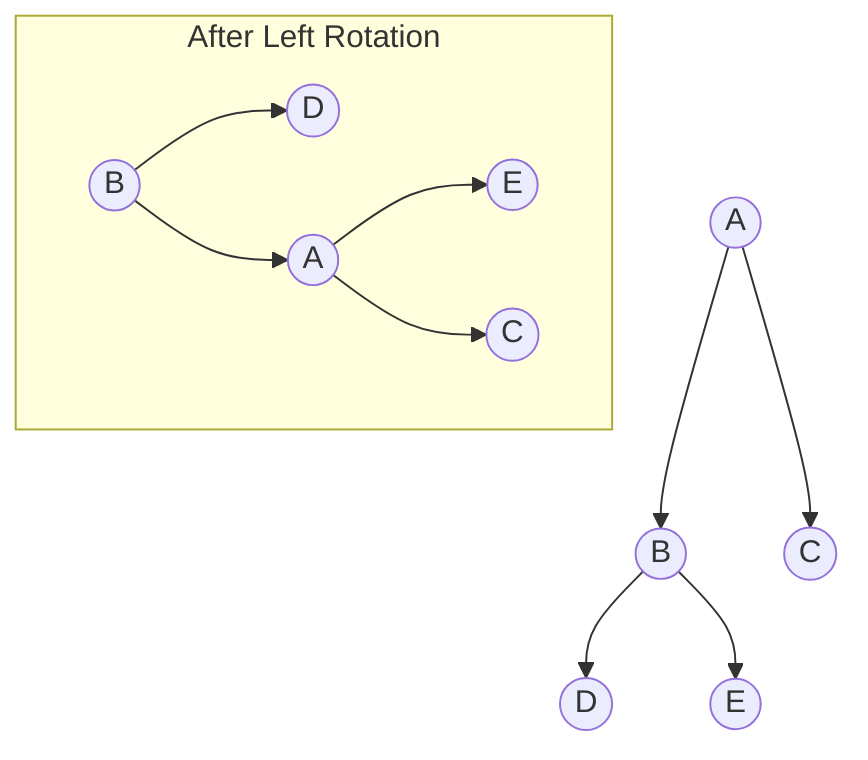
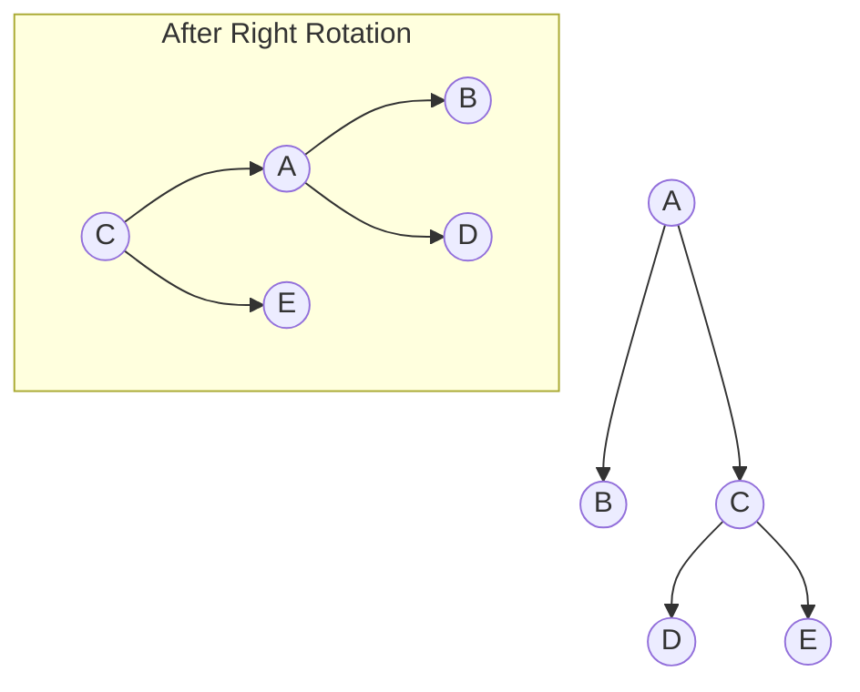
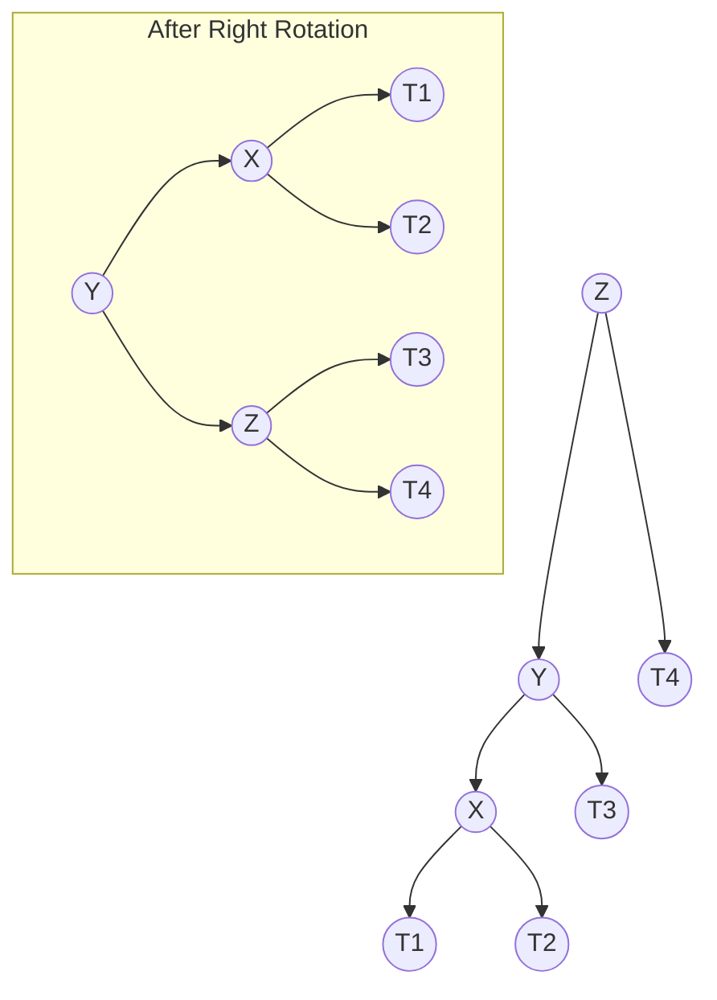
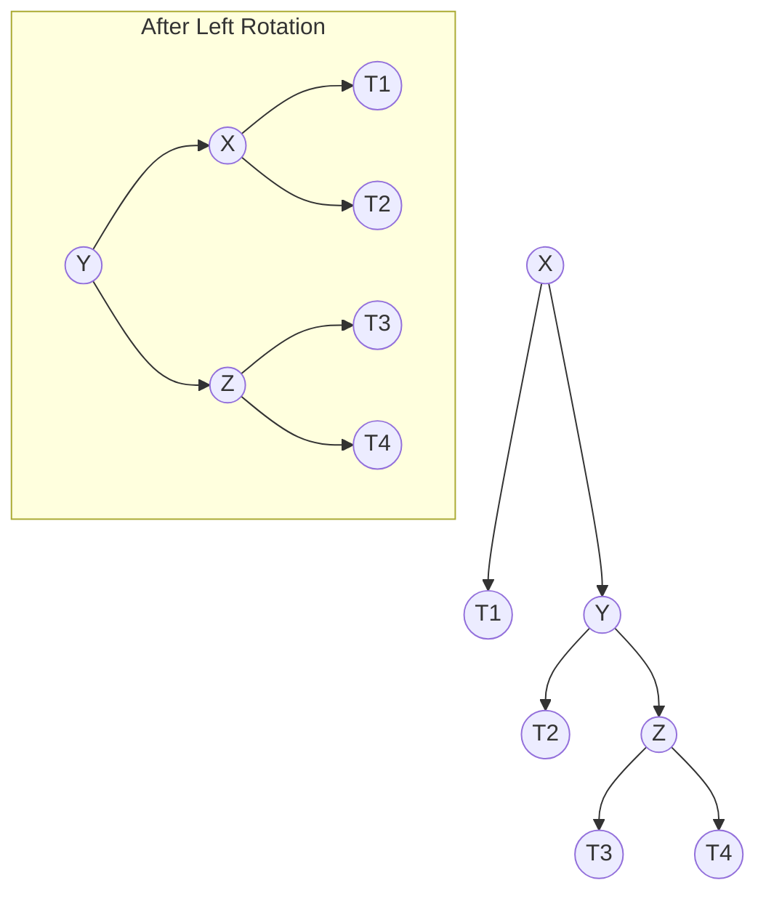
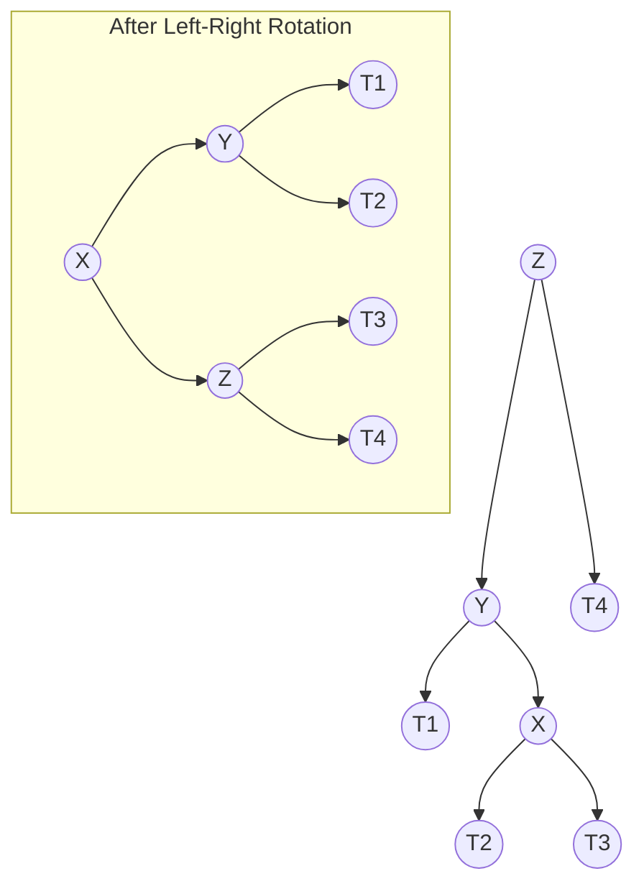
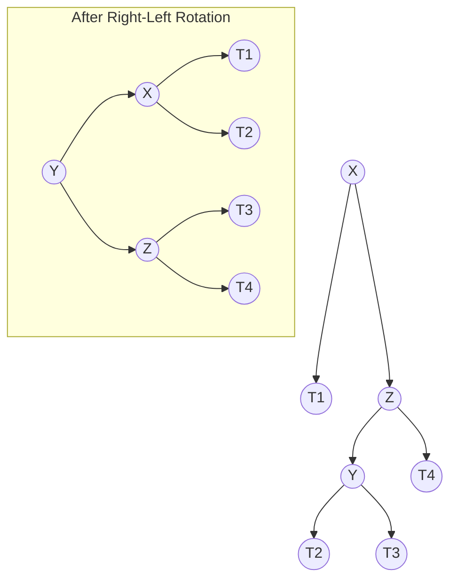

# AVL Trees

## Introduction

AVL trees, named after their inventors Adelson-Velsky and Landis, are one of the first self-balancing binary search tree structures ever invented (in 1962). They represent a crucial advancement in data structure design that addresses a fundamental limitation of regular Binary Search Trees (BSTs).

In a standard BST, operations like search, insert, and delete have a time complexity of O(h), where h is the height of the tree. Unfortunately, if insertions and deletions occur in an unfavorable order, a BST can degenerate into a linked list with a height of n (the number of nodes), resulting in O(n) operations instead of the desired O(log n).

AVL trees solve this problem by maintaining a balance condition: **for any node in the tree, the heights of its left and right subtrees can differ by at most 1**. This balance factor ensures the tree height remains approximately log(n), guaranteeing O(log n) performance for all operations.

## Core Concepts of AVL Trees

### 1. Balance Factor

The balance factor (BF) of a node is calculated as:

```
BF(node) = height(node.right) - height(node.left)
```

For an AVL tree to maintain its balance property, every node must have a balance factor of -1, 0, or 1.

- BF = -1: Left subtree is one level taller than right subtree
- BF = 0: Left and right subtrees have the same height
- BF = 1: Right subtree is one level taller than left subtree

### 2. Tree Rotations

When insertions or deletions cause imbalances (|BF| > 1), AVL trees restore balance using rotations. There are four types of rotations:

- Left Rotation (LL)
- Right Rotation (RR)
- Left-Right Rotation (LR)
- Right-Left Rotation (RL)

Let's visualize these rotations using Mermaid diagrams:

#### Left Rotation (LL)



#### Right Rotation (RR)



## Implementing an AVL Tree

Let's implement a basic AVL tree in JavaScript:

```javascript
class AVLNode {
  constructor(key) {
    this.key = key;
    this.height = 1;
    this.left = null;
    this.right = null;
  }
}

class AVLTree {
  constructor() {
    this.root = null;
  }
  
  // Get height of a node (null nodes have height 0)
  height(node) {
    return node ? node.height : 0;
  }
  
  // Get balance factor of a node
  getBalanceFactor(node) {
    return node ? this.height(node.right) - this.height(node.left) : 0;
  }
  
  // Update height of a node based on its children
  updateHeight(node) {
    node.height = Math.max(this.height(node.left), this.height(node.right)) + 1;
  }
  
  // Right rotation
  rightRotate(y) {
    const x = y.left;
    const T3 = x.right;
    
    // Perform rotation
    x.right = y;
    y.left = T3;
    
    // Update heights
    this.updateHeight(y);
    this.updateHeight(x);
    
    // Return new root
    return x;
  }
  
  // Left rotation
  leftRotate(x) {
    const y = x.right;
    const T2 = y.left;
    
    // Perform rotation
    y.left = x;
    x.right = T2;
    
    // Update heights
    this.updateHeight(x);
    this.updateHeight(y);
    
    // Return new root
    return y;
  }
  
  // Insert a key into the tree
  insert(key) {
    this.root = this._insert(this.root, key);
  }
  
  _insert(node, key) {
    // Perform standard BST insertion
    if (!node) return new AVLNode(key);
    
    if (key < node.key)
      node.left = this._insert(node.left, key);
    else if (key > node.key)
      node.right = this._insert(node.right, key);
    else // Duplicate keys not allowed
      return node;
    
    // Update height of current node
    this.updateHeight(node);
    
    // Get balance factor to check if this node became unbalanced
    const balance = this.getBalanceFactor(node);
    
    // Left Left Case
    if (balance < -1 && key < node.left.key)
      return this.rightRotate(node);
    
    // Right Right Case
    if (balance > 1 && key > node.right.key)
      return this.leftRotate(node);
    
    // Left Right Case
    if (balance < -1 && key > node.left.key) {
      node.left = this.leftRotate(node.left);
      return this.rightRotate(node);
    }
    
    // Right Left Case
    if (balance > 1 && key < node.right.key) {
      node.right = this.rightRotate(node.right);
      return this.leftRotate(node);
    }
    
    // Return the unchanged node
    return node;
  }
  
  // Inorder traversal to display the tree
  inorder() {
    const result = [];
    this._inorder(this.root, result);
    return result;
  }
  
  _inorder(node, result) {
    if (node) {
      this._inorder(node.left, result);
      result.push(node.key);
      this._inorder(node.right, result);
    }
  }
}
```

## Using the AVL Tree

Let's see our AVL tree in action with a simple example:

```javascript
// Create a new AVL tree
const avlTree = new AVLTree();

// Insert elements
console.log("Inserting elements: 10, 20, 30, 40, 50, 25");
avlTree.insert(10);
avlTree.insert(20);
avlTree.insert(30);
avlTree.insert(40);
avlTree.insert(50);
avlTree.insert(25);

// View the tree using inorder traversal
console.log("Inorder traversal (sorted order):", avlTree.inorder());
// Output: [10, 20, 25, 30, 40, 50]
```

In the example above, if we were using a regular BST and inserted in the order 10, 20, 30, 40, 50, we would get a right-skewed tree with a height of 5. However, with our AVL tree implementation, rotations ensure the tree remains balanced with a height of approximately 3.

## Understanding AVL Tree Rotations in Detail

Let's explore the four rotation scenarios in more depth:

### 1. Left Left Case (LL)

This happens when a node becomes unbalanced because of an insertion into the left subtree of its left child.

**Solution**: Perform a right rotation on the unbalanced node.



### 2. Right Right Case (RR)

This occurs when a node becomes unbalanced due to an insertion into the right subtree of its right child.

**Solution**: Perform a left rotation on the unbalanced node.



### 3. Left Right Case (LR)

This happens when a node becomes unbalanced because of an insertion into the right subtree of its left child.

**Solution**: Perform a left rotation on the left child, then a right rotation on the unbalanced node.



### 4. Right Left Case (RL)

This occurs when a node becomes unbalanced due to an insertion into the left subtree of its right child.

**Solution**: Perform a right rotation on the right child, then a left rotation on the unbalanced node.



## Deletion in AVL Trees

Deletion in AVL trees follows a similar pattern to insertion:

1. Perform a standard BST deletion
2. Update heights of nodes
3. Check balance factor
4. Perform rotations if necessary to restore balance

Let's implement the delete operation:

```javascript
// AVLTree class methods (add to previous implementation)

// Find the node with minimum key value in a tree
findMinNode(node) {
  let current = node;
  while (current.left !== null) {
    current = current.left;
  }
  return current;
}

// Delete a node with given key
delete(key) {
  this.root = this._delete(this.root, key);
}

_delete(root, key) {
  // Standard BST delete
  if (!root) return root;
  
  if (key < root.key) {
    root.left = this._delete(root.left, key);
  } else if (key > root.key) {
    root.right = this._delete(root.right, key);
  } else {
    // Node with only one child or no child
    if (!root.left) {
      return root.right;
    } else if (!root.right) {
      return root.left;
    }
    
    // Node with two children: Get inorder successor
    const successor = this.findMinNode(root.right);
    root.key = successor.key;
    
    // Delete the inorder successor
    root.right = this._delete(root.right, successor.key);
  }
  
  // If the tree had only one node
  if (!root) return root;
  
  // Update height
  this.updateHeight(root);
  
  // Get balance factor
  const balance = this.getBalanceFactor(root);
  
  // Left Left Case
  if (balance < -1 && this.getBalanceFactor(root.left) <= 0) {
    return this.rightRotate(root);
  }
  
  // Left Right Case
  if (balance < -1 && this.getBalanceFactor(root.left) > 0) {
    root.left = this.leftRotate(root.left);
    return this.rightRotate(root);
  }
  
  // Right Right Case
  if (balance > 1 && this.getBalanceFactor(root.right) >= 0) {
    return this.leftRotate(root);
  }
  
  // Right Left Case
  if (balance > 1 && this.getBalanceFactor(root.right) < 0) {
    root.right = this.rightRotate(root.right);
    return this.leftRotate(root);
  }
  
  return root;
}
```

## Example of Deletion

```javascript
// Continuing from the previous example
console.log("Original tree:", avlTree.inorder());

console.log("Deleting node with key 30");
avlTree.delete(30);
console.log("After deletion:", avlTree.inorder());
// Output: [10, 20, 25, 40, 50]

console.log("Deleting node with key 10");
avlTree.delete(10);
console.log("After deletion:", avlTree.inorder());
// Output: [20, 25, 40, 50]
```

## Real-World Applications of AVL Trees

AVL trees excel in scenarios where search, insert, and delete operations occur frequently, and maintaining optimal performance is critical.

### 1. Database Indexing

Database systems like PostgreSQL use tree structures similar to AVL trees to index data, enabling fast lookups and range queries.

```javascript
// Simplified database index example
class DatabaseIndex {
  constructor() {
    this.index = new AVLTree();
  }
  
  addEntry(key, recordPointer) {
    this.index.insert({key, recordPointer});
  }
  
  findRecord(key) {
    // Find the record pointer using the key
    // Implementation would search the AVL tree
    return "Record found for key: " + key;
  }
}
```

### 2. In-Memory Caching Systems

AVL trees can be used in caching systems to store key-value pairs for quick access.

```javascript
class CacheSystem {
  constructor(capacity) {
    this.avlTree = new AVLTree();
    this.capacity = capacity;
    this.size = 0;
  }
  
  get(key) {
    // Search for the key in the AVL tree
    // Return value if found, otherwise null
  }
  
  put(key, value) {
    // If at capacity, remove least recently used item
    if (this.size >= this.capacity) {
      // Remove LRU item (would need additional tracking)
      this.size--;
    }
    
    // Insert the new key-value pair
    this.avlTree.insert({key, value});
    this.size++;
  }
}
```

### 3. Network Routing Tables

AVL trees can optimize the storage and lookup of routing information in networking devices.

```javascript
class RoutingTable {
  constructor() {
    this.routes = new AVLTree();
  }
  
  addRoute(networkPrefix, nextHop) {
    this.routes.insert({networkPrefix, nextHop});
  }
  
  lookupRoute(ipAddress) {
    // Find the longest matching prefix in the tree
    // Return the next hop for that prefix
    return "Next hop for " + ipAddress;
  }
}
```

## Time and Space Complexity

### Time Complexity

- **Search**: O(log n)
- **Insert**: O(log n)
- **Delete**: O(log n)

The logarithmic time complexity for all operations is guaranteed by the self-balancing property, which ensures the tree height remains O(log n).

### Space Complexity

- **Space**: O(n) for storing n nodes
- **Additional per-node overhead**: Each AVL node stores extra information (height) compared to a regular BST node.

## Summary

AVL trees are self-balancing binary search trees that maintain a height balance property to ensure O(log n) performance for all operations. Key features include:

1. **Balance Factor**: Each node's left and right subtrees can differ in height by at most 1.
2. **Rotations**: Four types of rotations (LL, RR, LR, RL) are used to restore balance after insertions or deletions.
3. **Performance Guarantee**: Operations like search, insert, and delete are guaranteed to run in O(log n) time.
4. **Height Property**: An AVL tree with n nodes has a height of O(log n).

While AVL trees are more strictly balanced than alternatives like Red-Black trees (which leads to potentially faster searches), they may require more rotations during insertions and deletions. This makes AVL trees particularly suitable for applications with frequent lookups but less frequent modifications.

## Exercises

1. Implement a function that visualizes an AVL tree by printing its structure level by level.
2. Extend the AVL tree implementation to support duplicate keys by using counts.
3. Implement a range query function that returns all keys between a given minimum and maximum value.
4. Create a function that verifies if a given tree satisfies all AVL tree properties.
5. Compare the performance of AVL trees against regular BSTs for various input sequences.

## Additional Resources

- "Introduction to Algorithms" by Cormen, Leiserson, Rivest, and Stein
- "Data Structures and Algorithms in JavaScript" by Michael McMillan
- "Advanced Data Structures" by Peter Brass
- Online interactive visualizations of AVL trees
- Practice problems on platforms like LeetCode and HackerRank related to balanced tree implementations

With this knowledge of AVL trees, you now have a powerful tool in your data structure arsenal that guarantees logarithmic time complexity for operations regardless of the input sequence.