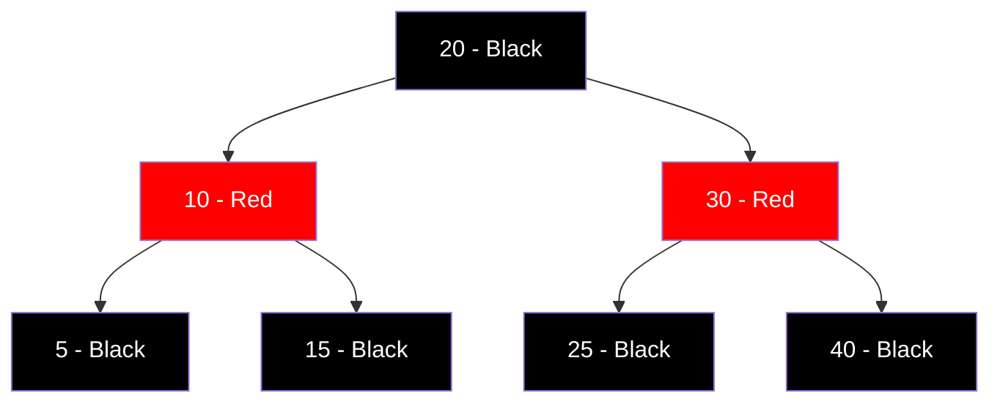
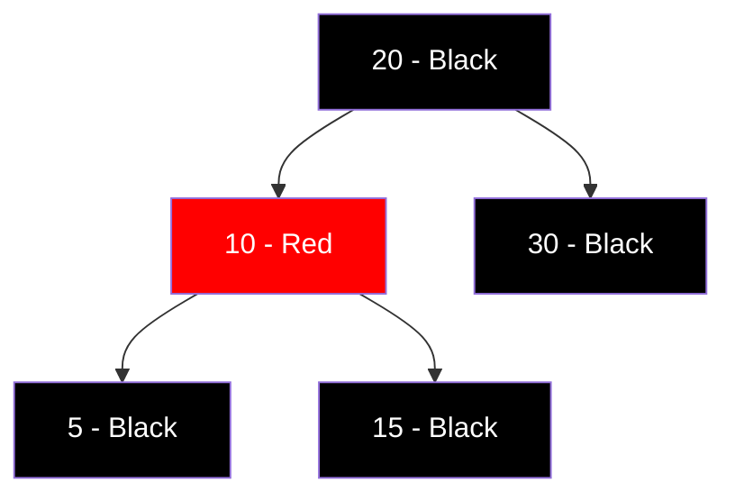
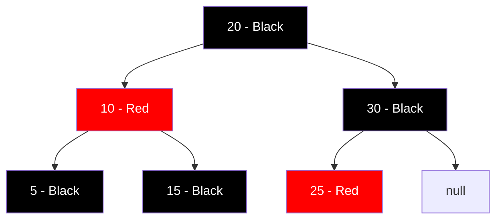

# Red Black Trees

## Introduction

Red Black Trees are a type of self-balancing binary search tree, a data structure that maintains its balance during insertions and deletions. This balance ensures operations like search, insert, and delete all have a guaranteed time complexity of O(log n), making them highly efficient for applications where data is frequently modified.

Red Black Trees get their name from the coloring system they use as part of their balancing mechanism. Each node in the tree is colored either red or black, and these colors help maintain specific properties that guarantee the tree remains relatively balanced at all times.

## Why Learn Red Black Trees?

Red Black Trees are widely used in real-world applications:

- They form the backbone of many language standard libraries (like C++'s `std::map` and Java's `TreeMap`)
- Database indexes often utilize them
- They provide guaranteed worst-case performance unlike simpler alternatives
- Understanding Red Black Trees will give you deeper insight into tree balancing techniques

## Red Black Tree Properties

A valid Red Black Tree must satisfy all of the following properties:

1. Every node is either red or black
2. The root node is always black
3. Every leaf (NIL/null node) is black
4. If a node is red, both its children must be black (no two red nodes can be adjacent)
5. For each node, all simple paths from the node to descendant leaves contain the same number of black nodes

These properties ensure that the longest path from root to any leaf is no more than twice as long as the shortest path, which guarantees logarithmic height.

## Visual Representation

Here's what a simple Red Black Tree might look like:



## Basic Operations

Let's explore the fundamental operations of Red Black Trees:

### Search Operation

The search operation in a Red Black Tree is identical to that in a regular Binary Search Tree:

```java
Node search(Node root, int key) {
    // Base case: root is null or the key is at root
    if (root == null || root.key == key)
        return root;
    
    // Key is greater than root's key
    if (root.key < key)
        return search(root.right, key);
    
    // Key is smaller than root's key
    return search(root.left, key);
}
```

The time complexity for search is O(log n) due to the balanced nature of the tree.

### Insertion Operation

Insertion is more complex in Red Black Trees because we need to maintain the tree's properties:

1. Insert the node as you would in a regular BST
2. Color the new node red
3. Fix any Red Black Tree property violations

Let's see a simplified approach:

```java
void insert(int key) {
    Node node = new Node(key);
    
    // 1. Standard BST insert
    root = bstInsert(root, node);
    
    // 2. Color the new node red
    node.color = RED;
    
    // 3. Fix Red Black Tree properties
    fixViolations(root, node);
}
```

The `fixViolations` method would handle:
- Color conflicts (red parent and red child)
- Recoloring nodes
- Rotations to maintain balance

#### Example of Insertion

Let's insert the value 25 into our sample tree:

Initial Tree:


After BST insertion (25 is added as a red node):


In this case, no violations occurred, so the tree remains valid.

### Deletion Operation

Deletion is the most complex operation in Red Black Trees:

1. Perform standard BST deletion
2. If the removed node was black, there's a "black deficit" that needs to be fixed
3. Apply a series of rotations and recolorings to restore the properties

This operation requires multiple cases and is beyond a simple code example, but follows the same principle of preserving the five Red Black Tree properties.

## Rotations in Red Black Trees

Rotations are fundamental operations used to rebalance the tree. There are two types:

### Left Rotation

```java
void leftRotate(Node x) {
    Node y = x.right;
    x.right = y.left;
    
    if (y.left != null)
        y.left.parent = x;
    
    y.parent = x.parent;
    
    if (x.parent == null)
        root = y;
    else if (x == x.parent.left)
        x.parent.left = y;
    else
        x.parent.right = y;
    
    y.left = x;
    x.parent = y;
}
```

### Right Rotation

```java
void rightRotate(Node y) {
    Node x = y.left;
    y.left = x.right;
    
    if (x.right != null)
        x.right.parent = y;
    
    x.parent = y.parent;
    
    if (y.parent == null)
        root = x;
    else if (y == y.parent.left)
        y.parent.left = x;
    else
        y.parent.right = x;
    
    x.right = y;
    y.parent = x;
}
```

## Complete Implementation

Here's a more complete implementation of a Red Black Tree in Java:

```java
public class RedBlackTree {
    private static final boolean RED = true;
    private static final boolean BLACK = false;
    
    private class Node {
        int key;
        Node left, right, parent;
        boolean color; // true for red, false for black
        
        Node(int key) {
            this.key = key;
            this.color = RED; // New nodes are always red
            this.left = this.right = this.parent = null;
        }
    }
    
    private Node root;
    
    // Standard BST insertion
    private Node bstInsert(Node root, Node pt) {
        if (root == null) return pt;
        
        if (pt.key < root.key) {
            root.left = bstInsert(root.left, pt);
            root.left.parent = root;
        } else if (pt.key > root.key) {
            root.right = bstInsert(root.right, pt);
            root.right.parent = root;
        }
        
        return root;
    }
    
    // Function to insert a new node with given key
    public void insert(int key) {
        Node pt = new Node(key);
        
        // Do a standard BST insert
        root = bstInsert(root, pt);
        
        // Fix Red Black Tree violations
        fixViolations(pt);
    }
    
    private void fixViolations(Node pt) {
        Node parent = null;
        Node grandParent = null;
        
        while ((pt != root) && (pt.color == RED) && (pt.parent.color == RED)) {
            parent = pt.parent;
            grandParent = parent.parent;
            
            // Case A: Parent is left child of grandparent
            if (parent == grandParent.left) {
                Node uncle = grandParent.right;
                
                // Case 1: Uncle is red - recolor
                if (uncle != null && uncle.color == RED) {
                    grandParent.color = RED;
                    parent.color = BLACK;
                    uncle.color = BLACK;
                    pt = grandParent;
                } else {
                    // Case 2: pt is right child - Left rotation
                    if (pt == parent.right) {
                        leftRotate(parent);
                        pt = parent;
                        parent = pt.parent;
                    }
                    
                    // Case 3: pt is left child - Right rotation
                    rightRotate(grandParent);
                    boolean tempColor = parent.color;
                    parent.color = grandParent.color;
                    grandParent.color = tempColor;
                    pt = parent;
                }
            }
            // Case B: Parent is right child of grandparent
            else {
                Node uncle = grandParent.left;
                
                // Case 1: Uncle is red - recolor
                if (uncle != null && uncle.color == RED) {
                    grandParent.color = RED;
                    parent.color = BLACK;
                    uncle.color = BLACK;
                    pt = grandParent;
                } else {
                    // Case 2: pt is left child - Right rotation
                    if (pt == parent.left) {
                        rightRotate(parent);
                        pt = parent;
                        parent = pt.parent;
                    }
                    
                    // Case 3: pt is right child - Left rotation
                    leftRotate(grandParent);
                    boolean tempColor = parent.color;
                    parent.color = grandParent.color;
                    grandParent.color = tempColor;
                    pt = parent;
                }
            }
        }
        
        root.color = BLACK;
    }
    
    private void leftRotate(Node x) {
        Node y = x.right;
        x.right = y.left;
        
        if (y.left != null)
            y.left.parent = x;
        
        y.parent = x.parent;
        
        if (x.parent == null)
            root = y;
        else if (x == x.parent.left)
            x.parent.left = y;
        else
            x.parent.right = y;
        
        y.left = x;
        x.parent = y;
    }
    
    private void rightRotate(Node y) {
        Node x = y.left;
        y.left = x.right;
        
        if (x.right != null)
            x.right.parent = y;
        
        x.parent = y.parent;
        
        if (y.parent == null)
            root = x;
        else if (y == y.parent.left)
            y.parent.left = x;
        else
            y.parent.right = x;
        
        x.right = y;
        y.parent = x;
    }
    
    // Method to perform an inorder traversal and print the tree
    public void inorder() {
        inorderHelper(root);
    }
    
    private void inorderHelper(Node node) {
        if (node != null) {
            inorderHelper(node.left);
            System.out.print(node.key + (node.color == RED ? "(R) " : "(B) "));
            inorderHelper(node.right);
        }
    }
}
```

## Example Usage

Let's see how to use the Red Black Tree implementation:

```java
public static void main(String[] args) {
    RedBlackTree tree = new RedBlackTree();
    
    // Insert values
    tree.insert(10);
    tree.insert(20);
    tree.insert(30);
    tree.insert(15);
    tree.insert(25);
    tree.insert(5);
    
    // Print the tree (inorder traversal)
    System.out.println("Inorder traversal of the tree:");
    tree.inorder();
}
```

Output:
```
Inorder traversal of the tree:
5(B) 10(R) 15(B) 20(B) 25(R) 30(B)
```

## Time Complexity Analysis

Let's analyze the time complexity of Red Black Tree operations:

| Operation | Average Case | Worst Case |
|-----------|--------------|------------|
| Search    | O(log n)     | O(log n)   |
| Insert    | O(log n)     | O(log n)   |
| Delete    | O(log n)     | O(log n)   |
| Space     | O(n)         | O(n)       |

This guaranteed O(log n) performance for all operations is what makes Red Black Trees so valuable in practice.

## Real-world Applications

Red Black Trees have many practical applications:

1. **Java's TreeMap and TreeSet**: These standard library collections use Red Black Trees for implementation.

2. **Linux Kernel**: The completely fair scheduler uses Red Black Trees to track processes.

3. **Database Indexing**: Many databases use Red Black Trees for efficient indexing structures.

4. **C++ Standard Template Library**: The `std::map`, `std::multimap`, `std::set`, and `std::multiset` are often implemented using Red Black Trees.

5. **Computational Geometry**: Many algorithms in this field use Red Black Trees for efficient point location.

## Comparison with Other Trees

| Tree Type | Guaranteed Height | Insert/Delete | Special Feature |
|-----------|-------------------|---------------|----------------|
| Binary Search Tree | O(n) in worst case | Simple | No balancing |
| AVL Tree | O(log n) | Complex | Strictly balanced (height difference ≤ 1) |
| Red Black Tree | O(log n) | Moderately complex | Less strictly balanced but fewer rotations |
| B-Tree | O(log n) | Complex | Multi-way branching, disk-friendly |

Red Black Trees offer a good balance between the rigid balance requirements of AVL trees and the simpler but potentially unbalanced nature of regular BSTs.

## Common Interview Questions

1. **What is the maximum possible height of a Red Black Tree with n nodes?**
   - Answer: 2 log₂(n+1)

2. **Why do we color the newly inserted node red?**
   - Answer: Coloring a new node red may potentially violate property #4 (red nodes can't have red children), but it won't violate property #5 (black height). This makes fixing violations easier, as we only need to worry about adjacent red nodes.

3. **Can a Red Black Tree's root be colored red?**
   - Answer: No, by property #2, the root must always be black.

## Summary

Red Black Trees are self-balancing binary search trees that maintain balance using node coloring and specific properties. They guarantee O(log n) performance for search, insert, and delete operations, making them highly efficient for applications requiring frequent modifications.

The key to understanding Red Black Trees is recognizing how their properties work together to maintain balance without being as strict as AVL trees. The coloring system and rotation operations work together to ensure the tree remains balanced after modifications.

## Further Learning and Exercises

### Exercises

1. Implement a method to count the number of black nodes in any path from root to leaf.
2. Add a `delete` method to the Red Black Tree implementation above.
3. Create a function to verify that a given tree satisfies all Red Black Tree properties.
4. Compare the performance of your Red Black Tree implementation with a standard BST by inserting values in increasing order.

### Additional Resources

- "Introduction to Algorithms" by Cormen, Leiserson, Rivest, and Stein (often called CLRS) has an excellent chapter on Red Black Trees.
- [Visualgo](https://visualgo.net/en/bst) provides excellent visualizations of tree operations.
- The original paper: "A Dichromatic Framework for Balanced Trees" by Guibas and Sedgewick.

---

With Red Black Trees in your algorithmic toolkit, you now understand one of the most widely used balanced tree structures in computer science. This knowledge will serve you well when designing efficient systems that need to maintain sorted data with frequent modifications.