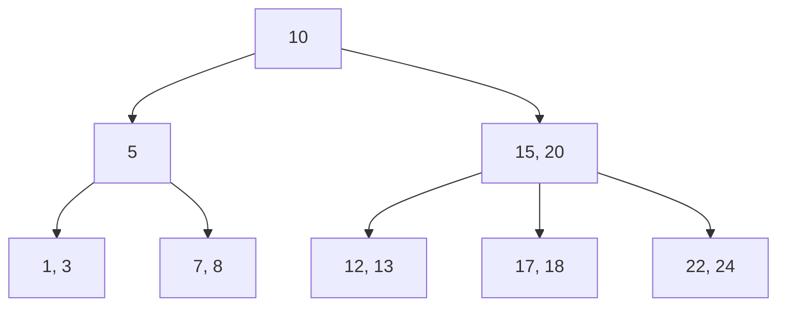

# B-Trees

## Introduction

B-Trees are balanced tree data structures that are widely used in databases and file systems. Unlike binary trees where each node has at most two children, B-Trees allow nodes to have multiple keys and children, making them particularly efficient for reading and writing large blocks of data, such as in disk storage systems.

Invented by Rudolf Bayer and Edward M. McCreight in 1972, B-Trees are optimized for systems that read and write large blocks of data. They're a perfect example of a data structure designed with practical hardware constraints in mind.

## What Makes B-Trees Special?

B-Trees are defined by the following properties:

1. Each node can have multiple keys, sorted in ascending order
2. All leaf nodes are at the same level (the tree is always perfectly balanced)
3. A non-leaf node with k keys has k+1 children
4. The tree grows and shrinks from the root (unlike binary search trees)
5. They maintain their balance automatically during insertions and deletions

## Understanding B-Tree Structure

A B-Tree of order m (or degree m) has the following properties:

- Every node has at most m children
- Every non-leaf node (except the root) has at least ⌈m/2⌉ children
- The root has at least 2 children if it's not a leaf node
- All leaves appear at the same level
- A non-leaf node with k children contains k-1 keys

Let's visualize a simple B-Tree of order 3 (also called a 2-3 tree):



In this 2-3 tree:
- Each node has at most 3 children
- Non-leaf nodes have at least 2 children
- All leaf nodes are at the same depth

## B-Tree Operations

### Searching in a B-Tree

Searching in a B-Tree is similar to searching in a binary search tree but extended to handle multiple keys per node.

```javascript
function search(x, k) {
    // x is a node, k is the key we're searching for
    let i = 0;
    
    // Find the first key greater than or equal to k
    while (i < x.n && k > x.keys[i]) {
        i++;
    }
    
    // If the key is found at this node
    if (i < x.n && k === x.keys[i]) {
        return { node: x, index: i }; // Found
    }
    
    // If this is a leaf node, the key isn't in the tree
    if (x.leaf) {
        return null; // Not found
    }
    
    // Recursively search in the appropriate child
    return search(x.children[i], k);
}
```

**Time Complexity:** O(log n), where n is the number of keys in the tree.

### Insertion in a B-Tree

Insertion in a B-Tree is more complex as it needs to maintain the B-Tree properties. Here's a simplified explanation of the process:

1. Find the leaf node where the key should be inserted
2. Insert the key into the node, keeping keys in sorted order
3. If the node exceeds its maximum capacity, split it into two nodes and move the middle key up to the parent
4. If needed, continue splitting up to the root

Here's a basic implementation for inserting into a B-Tree:

```javascript
function insert(T, k) {
    let r = T.root;
    
    // If the root is full, create a new root
    if (r.n === 2 * T.t - 1) {
        let s = createNode(true);
        T.root = s;
        s.children[0] = r;
        splitChild(s, 0);
        insertNonFull(s, k);
    } else {
        insertNonFull(r, k);
    }
}

function insertNonFull(x, k) {
    let i = x.n - 1;
    
    if (x.leaf) {
        // Find position for new key and shift all greater keys
        while (i >= 0 && k < x.keys[i]) {
            x.keys[i + 1] = x.keys[i];
            i--;
        }
        
        // Insert the new key
        x.keys[i + 1] = k;
        x.n++;
    } else {
        // Find child where key should go
        while (i >= 0 && k < x.keys[i]) {
            i--;
        }
        i++;
        
        // If child is full, split it
        if (x.children[i].n === 2 * T.t - 1) {
            splitChild(x, i);
            
            if (k > x.keys[i]) {
                i++;
            }
        }
        
        insertNonFull(x.children[i], k);
    }
}
```

**Time Complexity:** O(log n), where n is the number of keys in the tree.

### Deletion in a B-Tree

Deletion is the most complex operation in a B-Tree. The key steps are:

1. Find the key to delete
2. If the key is in a leaf node, simply remove it
3. If the key is in an internal node, replace it with its predecessor or successor
4. Ensure all nodes maintain the minimum number of keys
5. Merge nodes if necessary to maintain B-Tree properties

Due to its complexity, I'll provide a high-level algorithm without full implementation:

1. Find the node containing the key
2. If the key is in a leaf node:
   - Remove the key
   - If the leaf has fewer than t-1 keys, rebalance
3. If the key is in an internal node:
   - Replace with predecessor or successor
   - Delete predecessor/successor from leaf
   - Rebalance if necessary

**Time Complexity:** O(log n), where n is the number of keys in the tree.

## Practical Example: Database Index Implementation

Let's look at a simplified example of how B-Trees might be used in a database index:

```javascript
class BTreeIndex {
    constructor(order = 3) {
        this.root = new Node(true);
        this.t = order; // Minimum degree
    }
    
    // Search for a key
    search(key) {
        return this._search(this.root, key);
    }
    
    _search(node, key) {
        let i = 0;
        while (i < node.keys.length && key > node.keys[i].key) {
            i++;
        }
        
        // Found the key
        if (i < node.keys.length && key === node.keys[i].key) {
            return node.keys[i].value;
        }
        
        // Key not found in leaf node
        if (node.leaf) {
            return null;
        }
        
        // Search in child
        return this._search(node.children[i], key);
    }
    
    // Insert a key-value pair
    insert(key, value) {
        // Implementation similar to the insert algorithm above
        // with keys storing both key and value
    }
    
    // Example usage in a simple database query
    query(condition) {
        // Use B-Tree index to efficiently find matching records
        // This is a simplified example
        const key = condition.extractKey();
        return this.search(key);
    }
}

// Example usage
const userIndex = new BTreeIndex(4);

// Insert records
userIndex.insert(1, { id: 1, name: "Alice", age: 28 });
userIndex.insert(5, { id: 5, name: "Bob", age: 35 });
userIndex.insert(3, { id: 3, name: "Charlie", age: 22 });

// Query
const user = userIndex.search(3); // Returns Charlie's record efficiently
console.log(user); // { id: 3, name: "Charlie", age: 22 }
```

## Real-World Applications of B-Trees

B-Trees are foundational in many systems we use daily:

1. **Databases**: Both SQL and NoSQL databases (like MySQL, PostgreSQL, MongoDB) use B-Trees and their variants for indexing.

2. **File Systems**: Many file systems like NTFS, HFS+, and ext4 use B-Trees to organize directory structures and file locations.

3. **Search Engines**: B-Trees help in the efficient storage and retrieval of indexed web content.

4. **Geospatial Databases**: Specialized B-Tree variants are used for spatial indexing.

### Example: How Databases Use B-Trees for Indexing

When you create an index in a database like:

```sql
CREATE INDEX idx_user_id ON users(id);
```

The database likely creates a B-Tree structure where:
- Each key is a user ID from the users table
- Each value is a pointer to the full row data in the table
- The B-Tree structure enables O(log n) lookups

This allows queries like `SELECT * FROM users WHERE id = 5` to run in logarithmic time rather than requiring a full table scan.

## B-Tree Variants

Several important variants of B-Trees exist:

1. **B+ Tree**: The most common variant where:
   - All data is stored in leaf nodes
   - Leaf nodes are linked, enabling efficient range queries
   - Internal nodes only store keys (no data), allowing more keys per node

2. **B* Tree**: A variant where:
   - Nodes are kept at least 2/3 full (instead of 1/2)
   - Rebalancing requires fewer splits and merges

3. **2-3 Tree**: A B-Tree where each node has either 2 or 3 children

4. **2-3-4 Tree**: A B-Tree where each node has between 2 and 4 children

## Performance Characteristics

B-Trees excel at the following:

- **Balanced structure**: Guarantees O(log n) operations
- **Disk-friendly**: Large nodes map well to disk blocks
- **Range queries**: Efficient for retrieving ranges of keys
- **Self-balancing**: No explicit rebalancing needed

Time complexities:
- Search: O(log n)
- Insert: O(log n)
- Delete: O(log n)
- Space: O(n)

## Summary

B-Trees are versatile, self-balancing data structures that excel in systems that read and write large blocks of data. Their ability to maintain balance while allowing nodes to have many children makes them ideal for database indexes and file systems.

Key takeaways:
- B-Trees allow multiple keys per node, making them efficient for disk-based systems
- They remain balanced automatically during insertions and deletions
- They provide O(log n) performance for search, insert, and delete operations
- B-Trees and their variants (B+, B*) form the backbone of most database systems

## Exercises

1. Implement a basic B-Tree with search, insert, and delete operations
2. Compare the performance of a B-Tree vs. a Binary Search Tree for different data sizes
3. Design a simple key-value store using B-Trees for indexing
4. Implement a B+ Tree and compare its performance with a regular B-Tree for range queries
5. Analyze how changing the order (degree) of a B-Tree affects its performance on different operations

## Additional Resources

- "Introduction to Algorithms" by Cormen, Leiserson, Rivest, and Stein has an excellent chapter on B-Trees
- Database system implementations (like SQLite, InnoDB) have open-source B-Tree implementations
- The original paper "Organization and Maintenance of Large Ordered Indices" by Bayer and McCreight
- "Database Management Systems" by Ramakrishnan and Gehrke provides a practical perspective on B-Trees in database systems

By understanding B-Trees, you gain insight into how most modern data storage systems work under the hood!