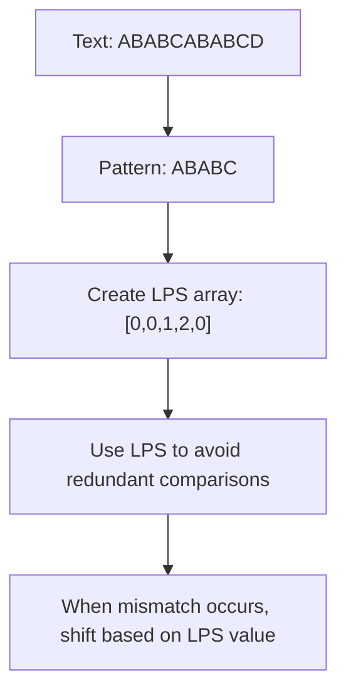

# String Matching

## Introduction

String matching is a fundamental problem in computer science that involves finding occurrences of a pattern within a larger text. It's the digital equivalent of finding a needle in a haystack - given a short string (the pattern) and a longer string (the text), we need to find all occurrences of the pattern within the text.

This problem appears frequently in various applications:
- Text editors searching for words
- Plagiarism detection systems
- DNA sequence analysis
- Web search engines
- Spam filters

In this tutorial, we'll explore various string matching algorithms, starting from the naive approach and moving towards more sophisticated techniques.

## The Problem Statement

Before diving into different algorithms, let's formally define the string matching problem:

- **Input**: A text string `T` of length `n` and a pattern string `P` of length `m`
- **Output**: All positions in `T` where `P` matches

For example, if `T = "ABABCABABCD"` and `P = "ABABC"`, the output should be position 0 and 5 (assuming 0-based indexing).

## 1. Naive String Matching

The simplest approach is to check every possible position in the text where the pattern might occur.

### Algorithm:

1. Slide the pattern over the text one by one
2. For each position, check if the pattern matches the text at that position

### Implementation:

```python
def naive_string_match(text, pattern):
    n = len(text)
    m = len(pattern)
    results = []
    
    # Check for pattern at each position of the text
    for i in range(n - m + 1):
        match = True
        
        # Check if pattern matches at current position
        for j in range(m):
            if text[i + j] != pattern[j]:
                match = False
                break
        
        # If pattern matches, record the position
        if match:
            results.append(i)
    
    return results

# Example usage
text = "ABABCABABCD"
pattern = "ABABC"
matches = naive_string_match(text, pattern)
print(f"Pattern found at positions: {matches}")
```

**Output:**
```
Pattern found at positions: [0, 5]
```

### Time Complexity:
- Worst case: O(n × m) - When characters of pattern and text match, but the last character doesn't match
- Best case: O(n) - When the first character of the pattern doesn't match with any characters in the text

### Advantages and Disadvantages:

**Advantages:**
- Simple to understand and implement
- Works well for small texts or patterns
- No preprocessing required

**Disadvantages:**
- Very inefficient for large texts
- Repeatedly examines the same characters in the text

## 2. Knuth-Morris-Pratt (KMP) Algorithm

The KMP algorithm optimizes the naive approach by avoiding unnecessary comparisons. It uses the previous match information to determine how much the pattern can be shifted when a mismatch occurs.

### Key Insight:

When a mismatch occurs after matching some characters, we already know part of the text. We can use this information to avoid re-checking characters we've already examined.

### Algorithm:

1. Preprocess the pattern to construct a "failure function" or "LPS" (Longest Proper Prefix which is also Suffix)
2. Use this function to determine how much to shift the pattern when a mismatch occurs

### Implementation:

```python
def kmp_string_match(text, pattern):
    n = len(text)
    m = len(pattern)
    
    # Create the LPS array for pattern
    lps = compute_lps(pattern)
    
    results = []
    i = 0  # Index for text
    j = 0  # Index for pattern
    
    while i < n:
        # Matching characters
        if pattern[j] == text[i]:
            i += 1
            j += 1
        
        # If we found a complete match
        if j == m:
            results.append(i - j)
            j = lps[j - 1]
        # Mismatch after j matches
        elif i < n and pattern[j] != text[i]:
            if j != 0:
                j = lps[j - 1]
            else:
                i += 1
    
    return results

def compute_lps(pattern):
    m = len(pattern)
    lps = [0] * m
    
    length = 0
    i = 1
    
    while i < m:
        if pattern[i] == pattern[length]:
            length += 1
            lps[i] = length
            i += 1
        else:
            if length != 0:
                length = lps[length - 1]
            else:
                lps[i] = 0
                i += 1
    
    return lps

# Example usage
text = "ABABCABABCD"
pattern = "ABABC"
matches = kmp_string_match(text, pattern)
print(f"Pattern found at positions: {matches}")
```

**Output:**
```
Pattern found at positions: [0, 5]
```

### Time Complexity:
- Preprocessing: O(m)
- Matching: O(n)
- Overall: O(m + n)

### How KMP Works:

The key to KMP is the LPS array which tells us the length of the longest proper prefix that is also a suffix up to that point in the pattern. When a mismatch happens, instead of starting over, we can skip ahead based on this information.



## 3. Boyer-Moore Algorithm

The Boyer-Moore algorithm is one of the most efficient string matching algorithms, especially for large alphabets and texts.

### Key Insights:

1. **Bad Character Heuristic**: When a mismatch occurs, align the pattern such that the mismatched character in the text matches its rightmost occurrence in the pattern.
2. **Good Suffix Heuristic**: When a mismatch occurs after some matches, shift the pattern based on the occurrence of already matched suffix in the pattern.

### Implementation (Simplified with Bad Character Heuristic):

```python
def boyer_moore_string_match(text, pattern):
    n = len(text)
    m = len(pattern)
    
    if m == 0:
        return []
    
    # Preprocessing: Bad Character Heuristic
    bad_char = {}
    for i in range(m):
        bad_char[pattern[i]] = i
    
    results = []
    s = 0  # Shift of the pattern with respect to text
    
    while s <= n - m:
        j = m - 1
        
        # Keep reducing j while characters of pattern and text match
        while j >= 0 and pattern[j] == text[s + j]:
            j -= 1
        
        # If the pattern is found
        if j < 0:
            results.append(s)
            s += 1  # Shift to find next occurrence
        else:
            # Shift the pattern so that the bad character in text aligns with its last occurrence in pattern
            # If the bad character is not in pattern, shift the pattern past it completely
            bad_char_shift = j - bad_char.get(text[s + j], -1)
            s += max(1, bad_char_shift)
    
    return results

# Example usage
text = "ABABCABABCD"
pattern = "ABABC"
matches = boyer_moore_string_match(text, pattern)
print(f"Pattern found at positions: {matches}")
```

**Output:**
```
Pattern found at positions: [0, 5]
```

### Time Complexity:
- Best case: O(n/m) - When the pattern rarely occurs in the text
- Worst case: O(n×m) - With pathological cases
- Average case: O(n) - For many practical scenarios

### Boyer-Moore Advantages:

1. Often requires fewer comparisons than other algorithms
2. Performs better the larger the pattern is
3. Very efficient for natural language text

## 4. Rabin-Karp Algorithm

The Rabin-Karp algorithm uses hashing to find the pattern in the text.

### Key Idea:

1. Compute the hash value of the pattern
2. Compute the hash values of all m-length substrings of the text
3. Compare the hash values first, and only if they match, compare the actual strings

### Implementation:

```python
def rabin_karp_string_match(text, pattern):
    n = len(text)
    m = len(pattern)
    p = 31  # Prime number for hashing
    mod = 10**9 + 9  # Large prime for modulo
    
    # Calculate hash for pattern
    pattern_hash = 0
    for i in range(m):
        pattern_hash = (pattern_hash + ord(pattern[i]) * pow(p, i, mod)) % mod
    
    # Calculate hash for the first window of text
    text_hash = 0
    for i in range(m):
        text_hash = (text_hash + ord(text[i]) * pow(p, i, mod)) % mod
    
    results = []
    
    # Check for match at beginning
    if pattern_hash == text_hash and text[:m] == pattern:
        results.append(0)
    
    # Calculate rolling hash for remaining windows
    for i in range(1, n - m + 1):
        # Remove leading digit, add trailing digit
        text_hash = (text_hash - ord(text[i-1])) % mod
        text_hash = (text_hash // p) % mod  # Divide by p
        text_hash = (text_hash + ord(text[i+m-1]) * pow(p, m-1, mod)) % mod
        
        # Check if hashes match
        if pattern_hash == text_hash:
            # Verify the match to handle hash collisions
            if text[i:i+m] == pattern:
                results.append(i)
    
    return results

# Example usage
text = "ABABCABABCD"
pattern = "ABABC"
matches = rabin_karp_string_match(text, pattern)
print(f"Pattern found at positions: {matches}")
```

**Output:**
```
Pattern found at positions: [0, 5]
```

### Time Complexity:
- Average and best case: O(n + m)
- Worst case: O(n × m) - When there are many hash collisions

### Advantages of Rabin-Karp:
- Efficient for multiple pattern matching
- Good for finding patterns that share similarities
- Works well in practice for many types of inputs

## Real-World Applications

Let's look at some practical applications of string matching algorithms:

### 1. Plagiarism Detection

Plagiarism detection tools use string matching to find similar passages between documents:

```python
def check_plagiarism(document, reference_documents):
    """
    Check if document contains passages from reference documents
    """
    matches = []
    for ref_doc in reference_documents:
        # Extract meaningful phrases from reference document
        phrases = extract_phrases(ref_doc)
        
        for phrase in phrases:
            if len(phrase) > 10:  # Only check substantial phrases
                # Use Boyer-Moore for efficiency
                positions = boyer_moore_string_match(document, phrase)
                if positions:
                    matches.append({
                        'phrase': phrase,
                        'positions': positions
                    })
    
    return matches
```

### 2. DNA Sequence Analysis

Bioinformatics frequently uses string matching to find patterns in DNA sequences:

```python
def find_gene_sequence(dna_strand, gene_pattern):
    """
    Find occurrences of a gene pattern in DNA
    """
    # DNA is composed of A, C, G, T characters
    # Use KMP for large sequences
    matches = kmp_string_match(dna_strand, gene_pattern)
    
    if matches:
        print(f"Gene pattern found at positions: {matches}")
        return True
    else:
        print("Gene pattern not found")
        return False
```

### 3. Search Features in Text Editors

Text editors use string matching to implement their search functionality:

```python
class TextEditor:
    def __init__(self, document):
        self.document = document
    
    def find_all(self, pattern):
        """Find all occurrences of pattern in document"""
        return boyer_moore_string_match(self.document, pattern)
    
    def find_and_replace(self, find_pattern, replace_with):
        """Replace all occurrences of pattern"""
        positions = self.find_all(find_pattern)
        
        # Start replacing from end to avoid position shifting
        for pos in sorted(positions, reverse=True):
            before = self.document[:pos]
            after = self.document[pos + len(find_pattern):]
            self.document = before + replace_with + after
        
        return len(positions)  # Return number of replacements
```

### 4. Spam Filtering

Email filters use string matching to identify spam patterns:

```python
def is_spam(email_content, spam_patterns):
    """
    Check if email contains spam patterns
    """
    for pattern in spam_patterns:
        if rabin_karp_string_match(email_content.lower(), pattern.lower()):
            return True
    return False
```

## Performance Comparison

Let's compare the performance characteristics of the string matching algorithms:

| Algorithm | Preprocessing Time | Matching Time (Worst Case) | Matching Time (Avg Case) | Space Complexity |
|-----------|-------------------|---------------------------|--------------------------|-----------------|
| Naive     | None              | O(n × m)                  | O(n × m)                 | O(1)            |
| KMP       | O(m)              | O(n)                      | O(n)                     | O(m)            |
| Boyer-Moore | O(m + σ)          | O(n × m)                  | O(n/m) (often sublinear) | O(m + σ)        |
| Rabin-Karp | O(m)              | O(n × m)                  | O(n + m)                 | O(1)            |

Where:
- n is the length of the text
- m is the length of the pattern
- σ is the size of the alphabet

## When to Use Each Algorithm

- **Naive Algorithm**: When the pattern and text are small, or for educational purposes
- **KMP Algorithm**: When space is not a concern and you need guaranteed linear time performance
- **Boyer-Moore Algorithm**: For long patterns and large texts, especially natural language texts
- **Rabin-Karp Algorithm**: When searching for multiple patterns simultaneously or when looking for plagiarism

## Summary

String matching is a fundamental problem with applications across many domains of computer science. In this tutorial, we explored:

1. **Naive String Matching**: Simple but inefficient
2. **Knuth-Morris-Pratt (KMP)**: Uses prefix information to avoid redundant comparisons
3. **Boyer-Moore**: Often the fastest in practice by skipping characters
4. **Rabin-Karp**: Uses hashing for efficient comparison

Each algorithm has its strengths and suitable use cases. Understanding these algorithms provides you with powerful tools for solving text processing problems efficiently.

## Exercises

1. Implement the full Boyer-Moore algorithm with both bad character and good suffix heuristics.
2. Modify the Rabin-Karp algorithm to find multiple patterns simultaneously.
3. Compare the performance of all four algorithms on large texts.
4. Implement a simple spell-checker using string matching.
5. Use string matching to detect palindromes in a large text.
6. Write a function that counts the frequency of each word in a document using string matching.

## Additional Resources

- "Introduction to Algorithms" by Cormen, Leiserson, Rivest, and Stein
- "Algorithms on Strings, Trees, and Sequences" by Dan Gusfield
- Online courses like Stanford's Algorithms specialization on Coursera
- Practice problems on platforms like LeetCode, HackerRank, and Codeforces

Remember that proficiency in string matching algorithms comes with practice. Start implementing these algorithms and apply them to real-world problems to deepen your understanding.