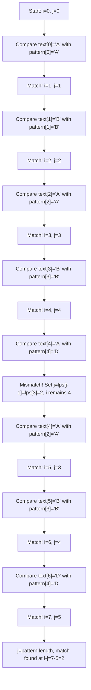

# KMP Algorithm

## Introduction

The Knuth-Morris-Pratt (KMP) algorithm is an efficient string-matching algorithm that uses information about the pattern itself to minimize comparisons. Developed by Donald Knuth, James H. Morris, and Vaughan Pratt in 1977, this algorithm significantly improves upon the naïve approach to string pattern matching.

When searching for a pattern within a text, the naïve approach might repeatedly compare characters that we already know match, especially when we encounter partial matches. KMP avoids these redundant comparisons by using a preprocessed array called the "failure function" or "prefix table", which tells us how much of the pattern we can skip when a mismatch occurs.

## Why Do We Need KMP?

Consider searching for the pattern "ABABD" in the text "ABABABD":

- Using the naïve approach, we compare characters one by one.
- When a mismatch occurs, we shift the pattern just one position to the right and start comparing from the beginning.
- This leads to many redundant comparisons, especially for patterns with repeated subpatterns.

The KMP algorithm introduces efficiency by avoiding these redundant comparisons, resulting in a linear time complexity of O(n+m), where n is the length of the text and m is the length of the pattern.

## Understanding the KMP Algorithm

KMP works in two phases:

1. **Preprocessing phase**: Build a prefix table (also called a failure function or LPS - Longest Proper Prefix which is also Suffix array)
2. **Search phase**: Use the prefix table to efficiently find the pattern in the text

### Preprocessing Phase: Building the Prefix Table

The prefix table tells us how much of the pattern we can skip when a mismatch occurs. It's based on the principle that if we have a partial match, and we know that certain characters in the pattern repeat, we can avoid re-comparing those repeated characters.

For each position in the pattern, the prefix table stores the length of the longest proper prefix that is also a suffix ending at that position.

Let's understand how to build this table:

```javascript
function buildPrefixTable(pattern) {
    // Initialize the prefix table
    const lps = new Array(pattern.length).fill(0);
    
    // Length of the previous longest prefix suffix
    let len = 0;
    let i = 1;
    
    // The loop calculates lps[i] for i = 1 to pattern.length-1
    while (i < pattern.length) {
        if (pattern[i] === pattern[len]) {
            // Found a match, increment the length
            len++;
            lps[i] = len;
            i++;
        } else {
            // No match
            if (len !== 0) {
                // Try matching with the previous longest prefix
                len = lps[len - 1];
            } else {
                // No previous match
                lps[i] = 0;
                i++;
            }
        }
    }
    
    return lps;
}
```

### Example of Building the Prefix Table

Let's build the prefix table for pattern "ABABD":

1. Start with `lps = [0, 0, 0, 0, 0]`
2. Compare characters at positions 0 and 1:
   - Pattern[0] = 'A', Pattern[1] = 'B', no match
   - `lps[1] = 0`
3. Compare characters at positions 0 and 2:
   - Pattern[0] = 'A', Pattern[2] = 'A', match
   - `lps[2] = 1`
4. Compare characters at positions 1 and 3:
   - Pattern[1] = 'B', Pattern[3] = 'B', match
   - `lps[3] = 2`
5. Compare characters at positions 2 and 4:
   - Pattern[2] = 'A', Pattern[4] = 'D', no match
   - Try matching with the previous longest prefix
   - `len = lps[len - 1] = lps[1] = 0`
   - Compare Pattern[0] with Pattern[4], no match
   - `lps[4] = 0`

Final prefix table: `[0, 0, 1, 2, 0]`

### Search Phase

Now that we have our prefix table, we can use it to efficiently search for the pattern in the text:

```javascript
function kmpSearch(text, pattern) {
    if (pattern.length === 0) return 0;
    if (pattern.length > text.length) return -1;
    
    // Build the prefix table
    const lps = buildPrefixTable(pattern);
    
    let i = 0; // Index for text
    let j = 0; // Index for pattern
    const matches = [];
    
    // Search through the text
    while (i < text.length) {
        if (pattern[j] === text[i]) {
            i++;
            j++;
        }
        
        // Pattern found
        if (j === pattern.length) {
            matches.push(i - j); // Add the starting index
            j = lps[j - 1]; // Look for the next match
        } else if (i < text.length && pattern[j] !== text[i]) {
            // Mismatch after j matches
            if (j !== 0) {
                j = lps[j - 1];
            } else {
                i++;
            }
        }
    }
    
    return matches;
}
```

## Complete Implementation

Let's put everything together:

```javascript
function kmpAlgorithm(text, pattern) {
    function buildPrefixTable(pattern) {
        const lps = new Array(pattern.length).fill(0);
        let len = 0;
        let i = 1;
        
        while (i < pattern.length) {
            if (pattern[i] === pattern[len]) {
                len++;
                lps[i] = len;
                i++;
            } else {
                if (len !== 0) {
                    len = lps[len - 1];
                } else {
                    lps[i] = 0;
                    i++;
                }
            }
        }
        
        return lps;
    }
    
    function search(text, pattern) {
        if (pattern.length === 0) return [0];
        if (pattern.length > text.length) return [];
        
        const lps = buildPrefixTable(pattern);
        let i = 0;
        let j = 0;
        const matches = [];
        
        while (i < text.length) {
            if (pattern[j] === text[i]) {
                i++;
                j++;
            }
            
            if (j === pattern.length) {
                matches.push(i - j);
                j = lps[j - 1];
            } else if (i < text.length && pattern[j] !== text[i]) {
                if (j !== 0) {
                    j = lps[j - 1];
                } else {
                    i++;
                }
            }
        }
        
        return matches;
    }
    
    return search(text, pattern);
}

// Example usage
const text = "ABABDABACDABABCABAB";
const pattern = "ABABD";
const matches = kmpAlgorithm(text, pattern);
console.log(`Pattern found at positions: ${matches.join(', ')}`);
// Output: "Pattern found at positions: 0"
```

## Step-by-step Trace of KMP in Action

Let's trace through the KMP algorithm for searching "ABABD" in "ABABABD":

1. Build prefix table for "ABABD": `[0, 0, 1, 2, 0]`
2. Start comparing:
   - i=0, j=0: text[0]='A' matches pattern[0]='A', increment i and j
   - i=1, j=1: text[1]='B' matches pattern[1]='B', increment i and j
   - i=2, j=2: text[2]='A' matches pattern[2]='A', increment i and j
   - i=3, j=3: text[3]='B' matches pattern[3]='B', increment i and j
   - i=4, j=4: text[4]='A' doesn't match pattern[4]='D'
   - j is not 0, so set j = lps[j-1] = lps[3] = 2
   - i=4, j=2: text[4]='A' matches pattern[2]='A', increment i and j
   - i=5, j=3: text[5]='B' matches pattern[3]='B', increment i and j
   - i=6, j=4: text[6]='D' matches pattern[4]='D', increment i and j
   - j=5 equals pattern.length, so we found a match at i-j = 6-5 = 1



## Time and Space Complexity

- **Time Complexity**: 
  - Preprocessing: O(m) where m is the pattern length
  - Search: O(n) where n is the text length
  - Overall: O(n + m)

- **Space Complexity**:
  - O(m) for the prefix table

This is significantly better than the naïve approach, which has a worst-case time complexity of O(n×m).

## Practical Applications

KMP is widely used in:

1. **Text editors**: For implementing search functionality
2. **Bioinformatics**: For DNA pattern matching
3. **Intrusion detection systems**: To find patterns of suspicious activity
4. **Spell checkers**: To suggest corrections
5. **Data compression**: In algorithms like LZ77

### Real-world Example: DNA Sequence Matching

```javascript
function findDnaSequence(genome, targetSequence) {
    const positions = kmpAlgorithm(genome, targetSequence);
    
    if (positions.length === 0) {
        return "Sequence not found in the genome.";
    } else {
        return `Target sequence found at positions: ${positions.join(', ')}`;
    }
}

// Example
const genome = "ACGTACGTACGTACGTACGTACGT";
const targetSequence = "ACGTACGT";
console.log(findDnaSequence(genome, targetSequence));
// Output: "Target sequence found at positions: 0, 8, 16"
```

### Real-world Example: Log File Analysis

```javascript
function analyzeLogFile(logContents, errorPattern) {
    const lines = logContents.split('\n');
    const errorLines = [];
    
    for (let i = 0; i < lines.length; i++) {
        const matches = kmpAlgorithm(lines[i], errorPattern);
        if (matches.length > 0) {
            errorLines.push({ lineNumber: i + 1, line: lines[i] });
        }
    }
    
    return errorLines;
}

// Example
const logContents = `2023-09-01 12:00:00 INFO  Server started
2023-09-01 12:05:13 ERROR Connection refused
2023-09-01 12:10:45 INFO  Processing data
2023-09-01 12:15:22 ERROR Connection refused`;

const errorPattern = "ERROR Connection refused";
console.log(analyzeLogFile(logContents, errorPattern));
/* Output:
[
  { lineNumber: 2, line: '2023-09-01 12:05:13 ERROR Connection refused' },
  { lineNumber: 4, line: '2023-09-01 12:15:22 ERROR Connection refused' }
]
*/
```

## Common Pitfalls and Considerations

1. **Empty strings**: Make sure your implementation handles edge cases like empty patterns or texts.
2. **Character encoding**: Be aware that character encoding can affect string comparisons, especially when dealing with non-ASCII characters.
3. **Preprocessing overhead**: For short texts and patterns, the preprocessing overhead might outweigh the benefits of KMP over simpler algorithms.
4. **Memory usage**: While the space complexity is O(m), keep in mind that for very large patterns, memory usage can still be significant.

## Summary

The KMP algorithm is a powerful technique for efficient string pattern matching:

- It avoids redundant comparisons by using information from previous matches.
- It has a linear time complexity of O(n+m).
- It works in two phases: preprocessing (building the prefix table) and searching.
- The key to its efficiency is the prefix table, which tells us how much of the pattern can be skipped when a mismatch occurs.
- It has various practical applications in text processing, bioinformatics, and more.

With its linear time complexity and clever use of pattern properties, KMP remains one of the fundamental string-matching algorithms in computer science.

## Exercises

1. Implement the KMP algorithm in your preferred programming language.
2. Modify the KMP algorithm to find all occurrences of a pattern in a text.
3. Compare the performance of KMP with the naïve approach for various inputs.
4. Implement a function that uses KMP to determine if a string is a rotation of another string.
5. Use KMP to find the longest prefix of a string that is also a suffix.

## Additional Resources

- Original paper: Knuth, D. E., Morris, J. H., & Pratt, V. R. (1977). Fast pattern matching in strings.
- "Introduction to Algorithms" by Cormen, Leiserson, Rivest, and Stein
- "Algorithms" by Robert Sedgewick and Kevin Wayne

Happy coding! 🚀