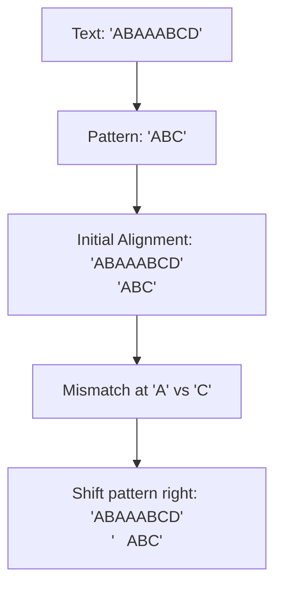
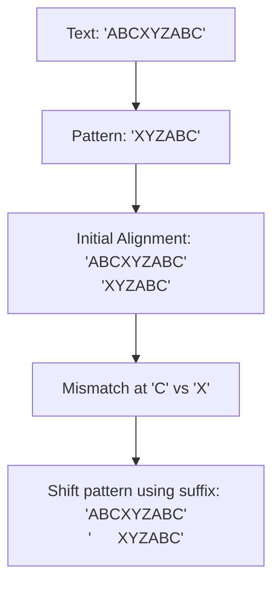

# Boyer-Moore Algorithm

## Introduction

The Boyer-Moore algorithm is a powerful string-searching algorithm that has been the standard benchmark for practical string search literature. Developed by Robert S. Boyer and J Strother Moore in 1977, it's particularly efficient when the pattern being searched for is relatively long, making it ideal for applications like text editors, search engines, and DNA sequence analysis.

Unlike other string matching algorithms that compare characters from left to right, Boyer-Moore takes a unique approach: it starts comparing characters from the **end** of the pattern, working its way backward. This approach, combined with two clever heuristics, allows it to skip sections of the text, making it much faster than naive approaches.

In this tutorial, we'll explore how the Boyer-Moore algorithm works, implement it step by step, and see some real-world applications where it shines.

## How Boyer-Moore Algorithm Works

The Boyer-Moore algorithm uses two key heuristics to determine how many characters it can safely skip when a mismatch occurs:

1. **Bad Character Heuristic** - When a mismatch occurs, shift the pattern so that the mismatched character in the text aligns with the rightmost occurrence of that character in the pattern.

2. **Good Suffix Heuristic** - If a mismatch occurs, shift the pattern so that the already matched suffix of the pattern aligns with its next occurrence in the pattern.

The algorithm uses whichever heuristic suggests the larger shift.

### The Bad Character Heuristic

When a mismatch occurs at a particular position, the bad character heuristic works as follows:

1. Identify the character in the text that caused the mismatch (let's call it `x`).
2. Find the rightmost occurrence of `x` in the pattern to the left of the current mismatch position.
3. Shift the pattern so that this occurrence aligns with the mismatched character in the text.
4. If `x` doesn't occur in the pattern, shift the pattern entirely past this character.

Let's understand with a diagram:



### The Good Suffix Heuristic

When a partial match is found before a mismatch, the good suffix heuristic:

1. Identifies the matching suffix of the pattern.
2. Finds the next occurrence of this suffix in the pattern.
3. Shifts the pattern to align this occurrence with the matching text.



## Implementation of Boyer-Moore Algorithm

Let's implement the Boyer-Moore algorithm step by step. We'll focus on the bad character heuristic for simplicity, but a complete implementation would use both heuristics.

```python
def build_bad_char_table(pattern):
    """
    Build the bad character table.
    Returns a dictionary mapping each character to its rightmost position in the pattern.
    """
    table = {}
    pattern_length = len(pattern)
    
    # Initialize all entries to -1 (not found)
    for i in range(256):  # Assuming ASCII characters
        table[chr(i)] = -1
        
    # Fill the actual positions
    for i in range(pattern_length):
        table[pattern[i]] = i
        
    return table

def boyer_moore_search(text, pattern):
    """
    Implement the Boyer-Moore string search algorithm.
    Returns the index of the first occurrence of pattern in text, or -1 if not found.
    """
    s = 0  # s is the shift of the pattern relative to the text
    pattern_length = len(pattern)
    text_length = len(text)
    
    if pattern_length == 0:
        return 0  # Empty pattern matches at position 0
    
    # Preprocess the pattern
    bad_char = build_bad_char_table(pattern)
    
    # Search
    while s <= text_length - pattern_length:
        j = pattern_length - 1
        
        # Check the pattern from right to left
        while j >= 0 and pattern[j] == text[s + j]:
            j -= 1
            
        if j < 0:
            # Found a match
            return s
        else:
            # Shift the pattern based on the bad character heuristic
            # Calculate how much to shift
            char_in_text = text[s + j]
            shift = j - bad_char.get(char_in_text, -1)
            s += max(1, shift)
            
    return -1  # Not found
```

### Example Usage

Let's see how to use our implementation:

```python
# Example 1: Find a pattern in text
text = "ABAAABCD"
pattern = "ABC"
position = boyer_moore_search(text, pattern)
print(f"Pattern found at position: {position}")  # Output: Pattern found at position: 5

# Example 2: Pattern not in text
text = "ABCDEFG"
pattern = "XYZ"
position = boyer_moore_search(text, pattern)
print(f"Pattern found at position: {position}")  # Output: Pattern found at position: -1
```

## Step-by-Step Trace Through

Let's walk through an example to see how the Boyer-Moore algorithm works in action:

**Text**: "ABAAABCD"  
**Pattern**: "ABC"

First, let's build our bad character table:
- 'A' -> 0 (updated to 0 as it's the rightmost occurrence of 'A')
- 'B' -> 1
- 'C' -> 2

Now, let's trace the algorithm:

1. Initial alignment (s = 0):
   ```
   Text:    ABAAABCD
   Pattern: ABC
            ^
   ```
   Compare 'C' in pattern with 'A' in text: Mismatch!
   Using bad character heuristic, shift by: j - bad_char['A'] = 2 - 0 = 2

2. New alignment (s = 2):
   ```
   Text:    ABAAABCD
   Pattern:   ABC
              ^
   ```
   Compare 'C' in pattern with 'A' in text: Mismatch!
   Using bad character heuristic, shift by: j - bad_char['A'] = 2 - 0 = 2

3. New alignment (s = 4):
   ```
   Text:    ABAAABCD
   Pattern:     ABC
                ^
   ```
   Compare 'C' in pattern with 'B' in text: Mismatch!
   Using bad character heuristic, shift by: j - bad_char['B'] = 2 - 1 = 1

4. New alignment (s = 5):
   ```
   Text:    ABAAABCD
   Pattern:      ABC
                 ^^^
   ```
   All characters match! Return position 5.

## Time and Space Complexity

**Time Complexity**: 
- Best case: O(n/m) where n is the length of the text and m is the length of the pattern
- Worst case: O(nm) in rare cases, but typically much better in practice

**Space Complexity**: 
- O(k) where k is the size of the alphabet (constant for fixed alphabet like ASCII)

## Real-World Applications

The Boyer-Moore algorithm shines in several practical applications:

### 1. Text Editors

Many text editors use variants of the Boyer-Moore algorithm for their "find" functionality. When a user searches for a phrase, especially a long one, Boyer-Moore's efficiency makes the search operations nearly instantaneous.

### 2. Plagiarism Detection Systems

Plagiarism detection tools need to compare documents against vast databases of existing content. Fast string matching algorithms like Boyer-Moore help make these comparisons efficiently.

### 3. DNA Sequence Analysis

In bioinformatics, researchers often need to find specific patterns in DNA sequences. With DNA sequences consisting of billions of base pairs, efficient algorithms like Boyer-Moore are crucial.

```python
# Example: DNA Pattern Matching
dna_sequence = "ACGTACGTACGTAGTAGCTAGCTAGCTAGCTAGCTA"
motif = "CTAGCTA"

position = boyer_moore_search(dna_sequence, motif)
if position != -1:
    print(f"Found DNA motif at position {position}")
else:
    print("DNA motif not found")

# Output: Found DNA motif at position 14
```

### 4. Network Intrusion Detection

Security systems scan network packets for signatures of known attacks. Boyer-Moore's efficiency allows these systems to scan large amounts of traffic with minimal delay.

## Optimizations and Variants

While the basic Boyer-Moore algorithm is already fast, several variations have been developed to optimize it further:

1. **Boyer-Moore-Horspool**: This simplification uses only the bad character rule and is often faster for shorter patterns.

2. **Turbo Boyer-Moore**: This variant adds an additional optimization to avoid redundant comparisons when shifting the pattern.

3. **Boyer-Moore-Sunday**: This algorithm (also known as the Quick Search algorithm) considers the character immediately after the current pattern window to determine shifts.

## Summary

The Boyer-Moore algorithm is a sophisticated string matching technique that achieves its efficiency by:

1. Scanning the pattern from right to left
2. Using the bad character heuristic to skip unnecessary comparisons
3. Employing the good suffix heuristic for additional skipping

This makes it especially efficient for long patterns and large texts, which is why it remains a popular choice in many applications despite being developed decades ago.

## Exercises

1. Modify the Boyer-Moore implementation to include the good suffix heuristic.
2. Compare the performance of the Boyer-Moore algorithm against other string matching algorithms like naive search, KMP, and Rabin-Karp for different pattern and text combinations.
3. Implement the Boyer-Moore-Horspool variant and compare its performance with the original algorithm.
4. Build a simple text editor's search function using the Boyer-Moore algorithm.
5. Use the algorithm to find all occurrences of a pattern in a text, not just the first one.

## Additional Resources

- The original paper: "A Fast String Searching Algorithm" by Robert S. Boyer and J Strother Moore
- "Algorithms on Strings, Trees, and Sequences" by Dan Gusfield
- "Introduction to Algorithms" by Cormen, Leiserson, Rivest, and Stein includes a section on string matching algorithms

The Boyer-Moore algorithm's clever approach to string matching demonstrates how rethinking a problem can lead to significant performance improvements. By learning to recognize when and how to apply it, you'll have a powerful tool in your algorithmic toolkit.