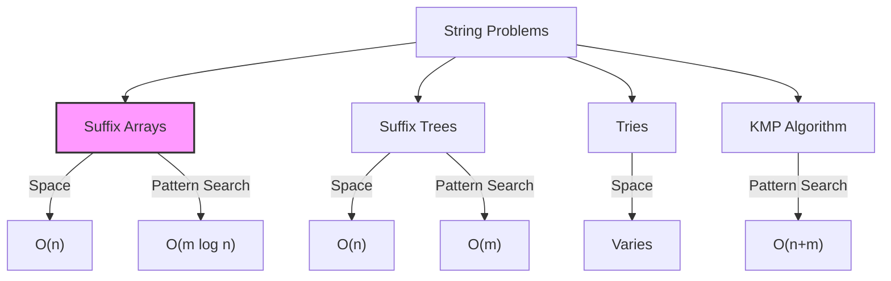

# Suffix Arrays

## Introduction

A suffix array is a powerful data structure used in string processing that enables efficient substring searches, pattern matching, and other string operations. At its core, a suffix array is a sorted array of all suffixes of a string.

For beginners, think of a suffix as any substring that starts somewhere in the original string and continues to the end. A suffix array contains these suffixes in lexicographical (dictionary) order, but instead of storing the actual substrings, it stores their starting positions to save memory.

Suffix arrays were introduced as a space-efficient alternative to suffix trees, providing many of the same capabilities while being simpler to implement and requiring less memory.

## Why Learn Suffix Arrays?

- **Pattern matching**: Find occurrences of a pattern in a text in O(m log n) time
- **String problems**: Solve various string problems efficiently
- **Bioinformatics**: Analyze DNA sequences and find repeating patterns
- **Data compression**: Used in algorithms like Burrows-Wheeler Transform
- **Text indexing**: Create efficient indexes for text documents

## Basic Concept

Let's understand suffix arrays through a simple example:

Consider the string `banana`.

The suffixes of `banana` are:
- `banana` (starts at position 0)
- `anana` (starts at position 1)
- `nana` (starts at position 2)
- `ana` (starts at position 3)
- `na` (starts at position 4)
- `a` (starts at position 5)

When we sort these suffixes lexicographically, we get:
1. `a` (position 5)
2. `ana` (position 3)
3. `anana` (position 1)
4. `banana` (position 0)
5. `na` (position 4)
6. `nana` (position 2)

The suffix array for `banana` would be: `[5, 3, 1, 0, 4, 2]`

This array gives us the starting positions of each suffix in sorted order.

## Building a Suffix Array

Let's implement a basic suffix array construction algorithm:

```python
def build_suffix_array(text):
    # Create a list of all suffixes with their starting positions
    suffixes = [(text[i:], i) for i in range(len(text))]
    
    # Sort the suffixes lexicographically
    suffixes.sort()
    
    # Extract just the positions to form the suffix array
    suffix_array = [pos for (_, pos) in suffixes]
    
    return suffix_array

# Example usage
text = "banana"
suffix_array = build_suffix_array(text)
print(f"Text: {text}")
print(f"Suffix Array: {suffix_array}")
```

Output:
```
Text: banana
Suffix Array: [5, 3, 1, 0, 4, 2]
```

This naive implementation has O(n² log n) time complexity because string comparison takes O(n) time and we're sorting n strings. For practical applications, more efficient algorithms like the SA-IS (Suffix Array Induced Sorting) algorithm are used, which can build suffix arrays in O(n) time.

## Efficient Implementation

For larger strings, the naive approach becomes inefficient. Here's a more efficient approach using Python's built-in sorting with key functions:

```python
def build_suffix_array_efficient(text):
    # Create list of indices
    indices = list(range(len(text)))
    
    # Sort indices by the suffixes they point to
    indices.sort(key=lambda i: text[i:])
    
    return indices

# Example usage
text = "mississippi"
suffix_array = build_suffix_array_efficient(text)
print(f"Text: {text}")
print(f"Suffix Array: {suffix_array}")

# Print the sorted suffixes for verification
for i in suffix_array:
    print(f"{i}: {text[i:]}")
```

Output:
```
Text: mississippi
Suffix Array: [10, 7, 4, 1, 0, 9, 8, 6, 3, 5, 2]

10: i
7: ippi
4: issippi
1: ississippi
0: mississippi
9: pi
8: ppi
6: sippi
3: sissippi
5: ssippi
2: ssissippi
```

## Applications of Suffix Arrays

### 1. Pattern Matching

One of the most common applications of suffix arrays is pattern matching. We can find all occurrences of a pattern in the text using binary search:

```python
def find_pattern(text, pattern, suffix_array):
    n = len(text)
    m = len(pattern)
    
    # Binary search for the lower bound
    left, right = 0, n-1
    while left <= right:
        mid = (left + right) // 2
        suffix = text[suffix_array[mid]:]
        if suffix[:m] < pattern:
            left = mid + 1
        else:
            right = mid - 1
    
    lower_bound = left
    
    # If we didn't find the pattern
    if not text[suffix_array[lower_bound]:].startswith(pattern):
        return []
    
    # Binary search for the upper bound
    left, right = 0, n-1
    while left <= right:
        mid = (left + right) // 2
        suffix = text[suffix_array[mid]:]
        if suffix[:m] <= pattern:
            left = mid + 1
        else:
            right = mid - 1
    
    upper_bound = right
    
    # Return all occurrences
    return [suffix_array[i] for i in range(lower_bound, upper_bound + 1)]

# Example usage
text = "mississippi"
pattern = "issi"
suffix_array = build_suffix_array_efficient(text)
occurrences = find_pattern(text, pattern, suffix_array)
print(f"Pattern '{pattern}' found at positions: {occurrences}")
```

Output:
```
Pattern 'issi' found at positions: [1]
```

### 2. Longest Common Prefix (LCP) Array

The LCP array stores the length of the longest common prefix between adjacent suffixes in the suffix array. It's often used alongside suffix arrays for various string algorithms:

```python
def build_lcp_array(text, suffix_array):
    n = len(text)
    lcp = [0] * n
    
    # Compute rank array (inverse of suffix array)
    rank = [0] * n
    for i in range(n):
        rank[suffix_array[i]] = i
    
    # Compute LCP values
    k = 0  # Length of previous LCP
    for i in range(n):
        if rank[i] == n - 1:
            k = 0
            continue
        
        j = suffix_array[rank[i] + 1]  # Next suffix in suffix array
        
        # Extend the previous LCP
        while i + k < n and j + k < n and text[i + k] == text[j + k]:
            k += 1
            
        lcp[rank[i]] = k
        
        # Update k for the next iteration
        if k > 0:
            k -= 1
    
    return lcp

# Example usage
text = "banana"
suffix_array = build_suffix_array_efficient(text)
lcp_array = build_lcp_array(text, suffix_array)
print(f"Text: {text}")
print(f"Suffix Array: {suffix_array}")
print(f"LCP Array: {lcp_array}")
```

Output:
```
Text: banana
Suffix Array: [5, 3, 1, 0, 4, 2]
LCP Array: [0, 1, 3, 0, 0, 2]
```

### 3. Finding the Longest Repeated Substring

Using the LCP array, we can find the longest repeated substring efficiently:

```python
def longest_repeated_substring(text):
    suffix_array = build_suffix_array_efficient(text)
    lcp_array = build_lcp_array(text, suffix_array)
    
    # Find the maximum value in LCP array
    max_lcp = 0
    max_idx = 0
    for i, lcp in enumerate(lcp_array):
        if lcp > max_lcp:
            max_lcp = lcp
            max_idx = i
    
    # If no repeating substrings found
    if max_lcp == 0:
        return ""
    
    # Return the longest repeated substring
    start = suffix_array[max_idx]
    return text[start:start + max_lcp]

# Example usage
text = "bananaban"
longest = longest_repeated_substring(text)
print(f"Longest repeated substring in '{text}': '{longest}'")
```

Output:
```
Longest repeated substring in 'bananaban': 'ban'
```

### 4. Real-world Application: DNA Sequence Analysis

In bioinformatics, suffix arrays are used to analyze DNA sequences:

```python
def find_common_substrings(seq1, seq2, min_length=3):
    # Concatenate sequences with a separator
    combined = seq1 + "#" + seq2
    
    # Build suffix array and LCP array
    suffix_array = build_suffix_array_efficient(combined)
    lcp_array = build_lcp_array(combined, suffix_array)
    
    n1 = len(seq1)
    common_substrings = []
    
    # Look for common substrings by checking adjacent suffixes
    for i in range(len(combined) - 1):
        # Check if adjacent suffixes are from different sequences
        pos1 = suffix_array[i]
        pos2 = suffix_array[i + 1]
        
        if (pos1 < n1 and pos2 > n1) or (pos1 > n1 and pos2 < n1):
            # Common substring with minimum length
            if lcp_array[i] >= min_length:
                start = min(pos1, pos2)
                common_substrings.append(combined[start:start + lcp_array[i]])
    
    return list(set(common_substrings))  # Remove duplicates

# Example with DNA sequences
dna1 = "ACGTACGT"
dna2 = "TACGTAC"
common = find_common_substrings(dna1, dna2)
print(f"Common substrings between sequences:")
for i, substring in enumerate(common):
    print(f"{i+1}. {substring}")
```

Output:
```
Common substrings between sequences:
1. ACGT
2. CGT
3. ACG
```

## Performance and Optimizations

Suffix arrays have several advantages over other string data structures:

1. **Space efficiency**: Requires O(n) space compared to O(n) for suffix trees but with smaller constants
2. **Cache efficiency**: Simple arrays have better cache locality than tree structures
3. **Construction time**: Advanced algorithms can build suffix arrays in O(n) time

However, the implementations we've shown are simplified for educational purposes. In practice, there are more efficient algorithms for constructing suffix arrays:

- **SA-IS (Suffix Array Induced Sorting)**: O(n) time complexity
- **DC3/Skew algorithm**: O(n) time complexity
- **Prefix Doubling**: O(n log n) time complexity

For very large strings (like genomes), specialized implementations using external memory algorithms may be needed.

## Comparison with Other String Data Structures



## Summary

Suffix arrays are a powerful and memory-efficient data structure for string processing that provide:

1. **Efficient pattern matching**: Find occurrences of patterns in O(m log n) time
2. **Lexicographical ordering**: Access all suffixes in sorted order
3. **Space efficiency**: Requires only O(n) space
4. **Versatility**: Solve various string problems efficiently

When combined with the LCP array, suffix arrays can solve complex string problems like finding the longest repeated substring, longest common substring, and much more.

## Practice Exercises

1. Implement a function to find all occurrences of a pattern in a text using a suffix array.
2. Build a function to find the longest common substring between two strings using suffix arrays.
3. Implement the SA-IS algorithm for efficient suffix array construction.
4. Use suffix arrays to find the longest palindromic substring in a text.
5. Implement a function to compute the Burrows-Wheeler Transform using suffix arrays.

## Additional Resources

- **Algorithms on Strings, Trees, and Sequences** by Dan Gusfield
- **Suffix Arrays: A New Method for On-Line String Searches** by Manber & Myers
- **Linear Work Suffix Array Construction** by Kärkkäinen & Sanders
- Online resources:
  - [Stanford CS166 Lecture Notes](https://web.stanford.edu/class/cs166/)
  - [CP-Algorithms: Suffix Array](https://cp-algorithms.com/string/suffix-array.html)

By mastering suffix arrays, you'll have a powerful tool for solving a wide range of string problems efficiently, which is especially valuable in fields like bioinformatics, data compression, and information retrieval.