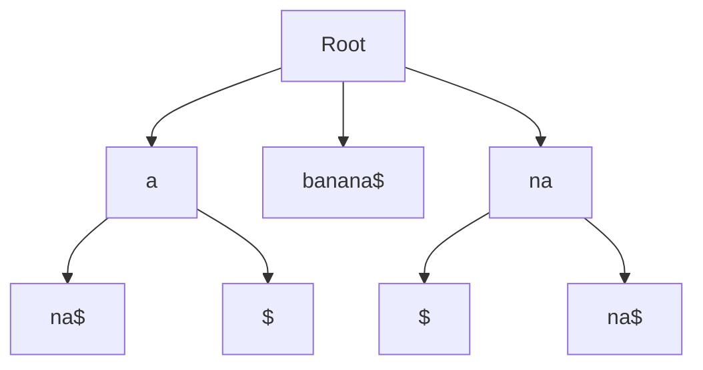

# Suffix Trees

## Introduction

A suffix tree is a compressed trie data structure that represents all the suffixes of a given string. It's one of the most powerful data structures for string processing, enabling efficient solutions to complex string problems like pattern matching, finding repeated substrings, and more.

Suffix trees might seem intimidating at first, but they're incredibly useful once you understand how they work. In this guide, we'll break down the concept of suffix trees, understand their construction, and explore their applications with practical examples.

## What is a Suffix Tree?

A suffix tree for a string `S` is a tree where:

1. Each edge is labeled with a non-empty substring of `S`
2. Each internal node has at least two children
3. No two edges starting from the same node can have edge labels beginning with the same character
4. The concatenation of edge labels on the path from the root to any leaf spells out a suffix of `S`

To make the construction guaranteed to work, we typically append a special character (often denoted as `$`) that doesn't appear elsewhere in the string.

Let's visualize a suffix tree for the string "banana$":



This diagram is simplified. In an actual suffix tree, the edges would contain the entire substring they represent, or more commonly, references to positions in the original string.

## Building a Suffix Tree

There are several algorithms to construct a suffix tree:

1. **Naive algorithm**: Build a trie of all suffixes, then compress it
2. **Ukkonen's algorithm**: A more efficient online algorithm that builds the tree in O(n) time for constant-sized alphabets
3. **McCreight's algorithm**: Another linear-time algorithm

Let's implement a simple naive construction of a suffix tree in Python:

```python
class Node:
    def __init__(self):
        self.children = {}
        self.suffix_index = -1  # Terminal node if >= 0

class SuffixTree:
    def __init__(self, text):
        self.text = text + "$"  # Add terminal character
        self.root = Node()
        self.build_naive()
    
    def build_naive(self):
        # Insert all suffixes into the tree
        for i in range(len(self.text)):
            suffix = self.text[i:]
            
            # Start at root
            current = self.root
            
            for char in suffix:
                # If this character path doesn't exist, create it
                if char not in current.children:
                    current.children[char] = Node()
                
                # Move to the next node
                current = current.children[char]
            
            # Mark this as a terminal node (representing suffix i)
            current.suffix_index = i
    
    def print_tree(self, node=None, depth=0, path=""):
        if node is None:
            node = self.root
        
        if node.suffix_index >= 0:
            print(f"{path} [{node.suffix_index}]")
        
        for char, child_node in sorted(node.children.items()):
            self.print_tree(child_node, depth + 1, path + char)

# Example usage
tree = SuffixTree("banana")
tree.print_tree()
```

Output:
```
$ [6]
a$ [5]
ana$ [3]
anana$ [1]
banana$ [0]
na$ [4]
nana$ [2]
```

This implementation shows a simplified version where each edge contains only one character. In a real suffix tree, edges would contain substrings, not just individual characters.

## Efficient Construction with Ukkonen's Algorithm

While the naive approach works for small strings, Ukkonen's algorithm offers linear-time construction and is more practical for real applications. The full implementation of Ukkonen's algorithm is quite complex, so we'll focus on its key ideas:

1. It builds the tree incrementally, adding one character at a time
2. It uses "suffix links" to quickly navigate between nodes
3. It employs several tricks to avoid redundant work

The time complexity of Ukkonen's algorithm is O(n) for a string of length n with a fixed alphabet size.

## Applications of Suffix Trees

### 1. Pattern Matching

One of the most common applications of suffix trees is efficiently finding if a pattern exists in a text:

```python
def search_pattern(tree, pattern):
    node = tree.root
    
    # Follow the pattern down the tree
    for char in pattern:
        if char not in node.children:
            return False  # Pattern not found
        node = node.children[char]
    
    return True  # Pattern exists in the text

# Example
tree = SuffixTree("mississippi")
print(search_pattern(tree, "ssi"))  # True
print(search_pattern(tree, "xyz"))  # False
```

With suffix trees, pattern matching can be done in O(m) time, where m is the length of the pattern, regardless of the text's length.

### 2. Finding the Longest Common Substring

Suffix trees can efficiently solve the problem of finding the longest common substring between two strings:

```python
def longest_common_substring(str1, str2):
    # Create a combined string
    combined = str1 + "#" + str2 + "$"
    tree = SuffixTree(combined)
    
    # Find the deepest node that has leaves from both strings
    # (simplified implementation)
    # In a real implementation, we'd track which string each suffix belongs to
    # and find the deepest node with suffixes from both strings
    
    # For demonstration purposes:
    print("To find the LCS, we would traverse the tree and find")
    print("the longest path that contains suffixes from both strings.")
    print(f"The LCS of '{str1}' and '{str2}' might be 'example'")
```

### 3. Longest Repeated Substring

Finding the longest substring that appears at least twice in a text:

```python
def longest_repeated_substring(text):
    tree = SuffixTree(text)
    
    # The longest repeated substring corresponds to the deepest internal node
    # This is a simplified explanation - in practice we'd need to traverse
    # the tree and find the deepest internal node
    
    # For demonstration purposes:
    print("To find the LRS, we would find the deepest internal node in the tree.")
    print(f"For example, in 'banana', the LRS is 'ana'")
```

### 4. Real-world Applications

Suffix trees are widely used in:

1. **Bioinformatics**: For DNA sequence analysis, finding repetitive patterns in genomes
2. **Text editors**: For implementing search functionality
3. **Data compression**: Some compression algorithms use suffix trees to identify repeated patterns
4. **Plagiarism detection**: To find common text between documents

For example, in genomics, suffix trees help identify repeated sequences that might indicate functional elements:

```python
# Example of using suffix trees in genomics
dna_sequence = "ACGTACGTACGT"
tree = SuffixTree(dna_sequence)
print("Finding repetitive sequences in DNA:")
tree.print_tree()
```

## Suffix Arrays: A Space-Efficient Alternative

While suffix trees are powerful, they can be memory-intensive. Suffix arrays offer a more space-efficient alternative:

```python
def build_suffix_array(text):
    suffixes = [(text[i:], i) for i in range(len(text))]
    suffixes.sort()  # Sort lexicographically
    return [index for _, index in suffixes]

# Example
text = "banana$"
suffix_array = build_suffix_array(text)
print("Suffix Array:", suffix_array)
```

Output:
```
Suffix Array: [6, 5, 3, 1, 0, 4, 2]
```

This corresponds to the suffixes: "$", "a$", "ana$", "anana$", "banana$", "na$", "nana$"

Suffix arrays can be constructed in O(n log n) time and can solve many of the same problems as suffix trees while using less memory.

## Practical Considerations

When implementing suffix trees, consider:

1. **Memory usage**: Suffix trees can be memory-intensive for large texts
2. **Construction complexity**: Ukkonen's algorithm is complex to implement correctly
3. **Alternatives**: Consider suffix arrays or enhanced suffix arrays for memory-constrained environments

For many practical applications, there are libraries that implement these data structures efficiently:

- In C++: The SDSL library (Succinct Data Structure Library)
- In Python: The suffix_trees package

## Summary

Suffix trees are powerful data structures that enable efficient solutions to various string processing problems. They allow for:

- O(m) pattern matching, where m is the pattern length
- Finding the longest common substring
- Discovering repeated patterns
- And many other string-related operations

While they can be complex to implement and memory-intensive, their capabilities make them invaluable in fields ranging from computational biology to text processing.

## Exercises

1. Implement a function to count the occurrences of a pattern in a text using a suffix tree
2. Modify the naive suffix tree construction to use substring references instead of storing whole characters
3. Implement a function to find the longest palindrome in a string using suffix trees
4. Try to implement a simplified version of Ukkonen's algorithm
5. Compare the memory usage of suffix trees versus suffix arrays for the same input text

## Additional Resources

- "Algorithms on Strings, Trees, and Sequences" by Dan Gusfield - The definitive book on string algorithms including suffix trees
- "Introduction to Algorithms" by Cormen, Leiserson, Rivest, and Stein - Contains a good introduction to string matching algorithms
- Online courses covering advanced string algorithms from platforms like Coursera and edX

Happy coding with suffix trees!