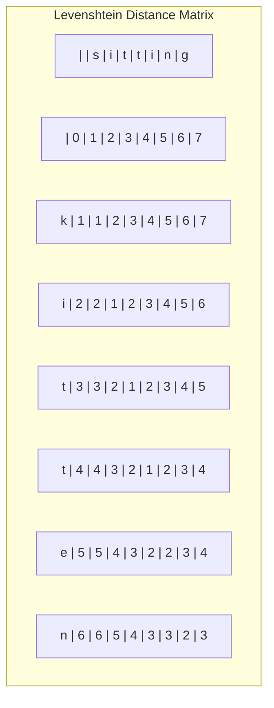

# Levenshtein Distance

## Introduction

Levenshtein distance, also known as **edit distance**, is a string metric for measuring the difference between two sequences. It calculates the minimum number of single-character operations (insertions, deletions, or substitutions) required to change one string into another.

Named after Vladimir Levenshtein, who developed it in 1965, this algorithm has become fundamental in various applications including:

- Spell checking and correction
- DNA sequence analysis
- Plagiarism detection
- Fuzzy string matching
- Speech recognition

In this tutorial, we'll explore the concept of Levenshtein distance, understand how it works, and implement it in code.

## Understanding Levenshtein Distance

The Levenshtein distance between two strings `a` and `b` is the minimum number of operations needed to transform string `a` into string `b`, where the allowed operations are:

1. **Insertion**: Add a character to string `a`
2. **Deletion**: Remove a character from string `a`
3. **Substitution**: Replace a character in string `a` with a different character

Let's look at a simple example:

Consider the strings `"kitten"` and `"sitting"`:
- Replace 'k' with 's': "**s**itten"
- Replace 'e' with 'i': "sitt**i**n"
- Insert 'g' at the end: "sittin**g**"

The Levenshtein distance between "kitten" and "sitting" is 3, as we need at least 3 operations to transform one into the other.

## The Algorithm

The Levenshtein algorithm uses dynamic programming to calculate the minimum edit distance. We'll build a matrix where each cell `[i][j]` represents the Levenshtein distance between the first `i` characters of string `a` and the first `j` characters of string `b`.

The algorithm follows these steps:

1. Create a matrix of size `(len(a)+1) x (len(b)+1)`
2. Initialize the first row and column with incremental values (0, 1, 2, ...)
3. For each cell `[i][j]` in the matrix (excluding the first row and column):
   - If the characters `a[i-1]` and `b[j-1]` match, the cost is 0; otherwise, the cost is 1
   - Calculate the minimum of:
     - The value above plus 1 (deletion)
     - The value to the left plus 1 (insertion)
     - The value diagonally above-left plus the cost (substitution)
4. The bottom-right cell contains the Levenshtein distance between the two strings

Let's visualize this with a matrix for "kitten" and "sitting":



The final value in the bottom-right corner (3) is the Levenshtein distance.

## Implementation in JavaScript

Let's implement the Levenshtein distance algorithm in JavaScript:

```javascript
function levenshteinDistance(str1, str2) {
  // Create a matrix of size (str1.length+1) x (str2.length+1)
  const dp = Array(str1.length + 1)
    .fill(null)
    .map(() => Array(str2.length + 1).fill(null));

  // Initialize first row and column
  for (let i = 0; i <= str1.length; i++) {
    dp[i][0] = i;
  }
  for (let j = 0; j <= str2.length; j++) {
    dp[0][j] = j;
  }

  // Fill the matrix
  for (let i = 1; i <= str1.length; i++) {
    for (let j = 1; j <= str2.length; j++) {
      // If characters match, cost is 0, otherwise 1
      const cost = str1[i - 1] === str2[j - 1] ? 0 : 1;
      
      dp[i][j] = Math.min(
        dp[i - 1][j] + 1,      // deletion
        dp[i][j - 1] + 1,      // insertion
        dp[i - 1][j - 1] + cost // substitution
      );
    }
  }

  // Return the bottom-right cell
  return dp[str1.length][str2.length];
}

// Example usage
console.log(levenshteinDistance("kitten", "sitting"));  // Output: 3
console.log(levenshteinDistance("hello", "hallo"));    // Output: 1
console.log(levenshteinDistance("algorithm", "logarithm")); // Output: 3
```

Let's also implement it in Python for comparison:

```python
def levenshtein_distance(str1, str2):
    # Create a matrix of size (len(str1)+1) x (len(str2)+1)
    dp = [[0 for _ in range(len(str2) + 1)] for _ in range(len(str1) + 1)]
    
    # Initialize first row and column
    for i in range(len(str1) + 1):
        dp[i][0] = i
    for j in range(len(str2) + 1):
        dp[0][j] = j
        
    # Fill the matrix
    for i in range(1, len(str1) + 1):
        for j in range(1, len(str2) + 1):
            # If characters match, cost is 0, otherwise 1
            cost = 0 if str1[i-1] == str2[j-1] else 1
            
            dp[i][j] = min(
                dp[i-1][j] + 1,      # deletion
                dp[i][j-1] + 1,      # insertion
                dp[i-1][j-1] + cost  # substitution
            )
    
    # Return the bottom-right cell
    return dp[len(str1)][len(str2)]

# Example usage
print(levenshtein_distance("kitten", "sitting"))  # Output: 3
print(levenshtein_distance("hello", "hallo"))    # Output: 1
print(levenshtein_distance("algorithm", "logarithm")) # Output: 3
```

## Time and Space Complexity

- **Time Complexity**: O(m × n), where m and n are the lengths of the two strings. This is because we need to fill a matrix of size (m+1) × (n+1).
- **Space Complexity**: O(m × n) for the same reason.

## Optimizations

### Space Optimization

Since we only need the current and previous rows to calculate the new values, we can optimize the space complexity to O(min(m, n)):

```javascript
function levenshteinDistanceOptimized(str1, str2) {
  // Make sure str1 is the shorter string for space optimization
  if (str1.length > str2.length) {
    [str1, str2] = [str2, str1];
  }

  let prevRow = Array(str1.length + 1).fill(0);
  let currRow = Array(str1.length + 1).fill(0);
  
  // Initialize the first row
  for (let i = 0; i <= str1.length; i++) {
    prevRow[i] = i;
  }
  
  // Fill the matrix one row at a time
  for (let j = 1; j <= str2.length; j++) {
    currRow[0] = j;
    
    for (let i = 1; i <= str1.length; i++) {
      const cost = str1[i - 1] === str2[j - 1] ? 0 : 1;
      currRow[i] = Math.min(
        prevRow[i] + 1,      // deletion
        currRow[i - 1] + 1,  // insertion
        prevRow[i - 1] + cost // substitution
      );
    }
    
    // Swap rows for next iteration
    [prevRow, currRow] = [currRow, prevRow];
  }
  
  return prevRow[str1.length];
}
```

## Real-world Applications

### 1. Spell Checker

A spell checker can use Levenshtein distance to suggest corrections for misspelled words. Here's a simple example:

```javascript
function spellChecker(word, dictionary, maxDistance = 2) {
  const suggestions = [];
  
  for (const dictWord of dictionary) {
    const distance = levenshteinDistance(word, dictWord);
    if (distance <= maxDistance) {
      suggestions.push({ word: dictWord, distance });
    }
  }
  
  return suggestions.sort((a, b) => a.distance - b.distance);
}

// Example
const dictionary = ["apple", "banana", "orange", "pear", "apricot", "application"];
console.log(spellChecker("appel", dictionary));
// Output: [{ word: "apple", distance: 1 }]
```

### 2. DNA Sequence Analysis

Biologists use Levenshtein distance to measure the similarity between DNA sequences:

```javascript
function dnaSequenceSimilarity(seq1, seq2) {
  const distance = levenshteinDistance(seq1, seq2);
  // Calculate similarity as a percentage
  const maxLength = Math.max(seq1.length, seq2.length);
  const similarity = ((maxLength - distance) / maxLength) * 100;
  return similarity.toFixed(2) + '%';
}

// Example
const dna1 = "ACGTACGT";
const dna2 = "ACGTTCGT";
console.log(dnaSequenceSimilarity(dna1, dna2));
// Output: "87.50%"
```

### 3. Fuzzy Search

Implement a simple fuzzy search system that finds entries in a database that are similar to a query:

```javascript
function fuzzySearch(query, items, threshold = 3) {
  return items.filter(item => 
    levenshteinDistance(query.toLowerCase(), item.toLowerCase()) <= threshold
  );
}

// Example
const fruits = ["apple", "banana", "blueberry", "cherry", "dragonfruit", "grape"];
console.log(fuzzySearch("banan", fruits));
// Output: ["banana"]
```

## Summary

The Levenshtein distance algorithm is a powerful tool for measuring the similarity between strings. It works by calculating the minimum number of single-character edits required to transform one string into another.

Key points to remember:

1. The algorithm uses dynamic programming to build a solution incrementally
2. The three allowed operations are insertion, deletion, and substitution
3. The time complexity is O(m × n) and space complexity is O(m × n), but we can optimize the space to O(min(m, n))
4. It has numerous real-world applications including spell checking, DNA analysis, and fuzzy string matching

## Exercises

1. Implement the Levenshtein distance algorithm in your preferred programming language.
2. Extend the algorithm to output not just the distance but the actual sequence of operations needed to transform one string into another.
3. Create a more sophisticated spell checker that uses the Levenshtein distance.
4. Compare the performance of the standard Levenshtein algorithm with the space-optimized version for very long strings.
5. Modify the algorithm to assign different costs to different operations (e.g., make substitution cost 2, while insertion and deletion cost 1).

## Additional Resources

- [Wikipedia: Levenshtein Distance](https://en.wikipedia.org/wiki/Levenshtein_distance)
- [Interactive Levenshtein Visualization](http://www.let.rug.nl/~kleiweg/lev/)
- [Dynamic Programming Explained](https://www.geeksforgeeks.org/dynamic-programming/)

Understanding the Levenshtein distance algorithm is a solid foundation for exploring more complex string matching and comparison techniques. It's a great example of how dynamic programming can efficiently solve problems that would otherwise require exponential time to compute.