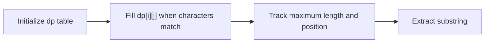

# Longest Common Substring

## Introduction

The Longest Common Substring (LCS) problem is a fundamental string algorithm that finds the longest string that is a substring of two or more strings. Unlike the Longest Common Subsequence problem, which allows for non-consecutive characters, the Longest Common Substring requires characters to be consecutive in both original strings.

This algorithm has numerous practical applications in:
- Text comparison and plagiarism detection
- DNA sequence analysis in bioinformatics
- Search engine functionality
- File comparison tools
- Spell checkers and auto-correct systems

In this tutorial, we'll explore the concept of the Longest Common Substring, understand how to implement it using different approaches, and look at some practical applications.

## Understanding the Problem

Given two strings, we want to find the longest string that appears as a substring in both of them.

For example:
- For strings "ABCDEF" and "XYZABCPQR", the longest common substring is "ABC" with a length of 3.
- For strings "programming" and "gaming", the longest common substring is "ming" with a length of 4.

## Naive Approach

Before diving into optimized solutions, let's understand a simple approach. We could check all possible substrings of the first string and see if they exist in the second string.

```javascript
function naiveLCS(str1, str2) {
    let longest = "";
    
    // Try all possible substrings of str1
    for (let i = 0; i < str1.length; i++) {
        for (let j = i + 1; j <= str1.length; j++) {
            const substring = str1.substring(i, j);
            
            // Check if this substring is in str2 and longer than our current longest
            if (str2.includes(substring) && substring.length > longest.length) {
                longest = substring;
            }
        }
    }
    
    return longest;
}

// Example usage
const string1 = "ABCDEF";
const string2 = "XYZABCPQR";
console.log(`Longest common substring: ${naiveLCS(string1, string2)}`);
// Output: "ABC"
```

This approach works, but it's highly inefficient with a time complexity of O(n³), where n is the maximum length of the input strings. For larger strings, we need a more efficient algorithm.

## Dynamic Programming Approach

The most efficient way to solve the Longest Common Substring problem is using dynamic programming. We create a table where each cell dp[i][j] represents the length of the longest common substring ending at positions i in the first string and j in the second string.

Here's the step-by-step approach:

1. Create a 2D table with dimensions (len(str1) + 1) × (len(str2) + 1).
2. Initialize all values to 0.
3. For each pair of characters that match, set dp[i][j] = dp[i-1][j-1] + 1.
4. Keep track of the maximum value and its position in the table.
5. Use the position to extract the substring from either string.

```javascript
function dynamicProgrammingLCS(str1, str2) {
    const m = str1.length;
    const n = str2.length;
    
    // Create a table for dynamic programming
    const dp = Array(m + 1).fill().map(() => Array(n + 1).fill(0));
    
    let maxLength = 0;
    let endPosition = 0;
    
    for (let i = 1; i <= m; i++) {
        for (let j = 1; j <= n; j++) {
            if (str1[i - 1] === str2[j - 1]) {
                dp[i][j] = dp[i - 1][j - 1] + 1;
                
                if (dp[i][j] > maxLength) {
                    maxLength = dp[i][j];
                    endPosition = i;
                }
            }
        }
    }
    
    // Extract the substring from str1
    return str1.substring(endPosition - maxLength, endPosition);
}

// Example usage
console.log(`Longest common substring: ${dynamicProgrammingLCS("ABCDEF", "XYZABCPQR")}`);
// Output: "ABC"
```

Let's visualize how the dp table gets filled for our example strings "ABCDEF" and "XYZABCPQR":



Here's the resulting DP table (partially shown for clarity) for "ABCDEF" and "XYZABCPQR":

| dp[i][j] |   | X | Y | Z | A | B | C | P | Q | R |
|----------|---|---|---|---|---|---|---|---|---|---|
|          | 0 | 0 | 0 | 0 | 0 | 0 | 0 | 0 | 0 | 0 |
| A        | 0 | 0 | 0 | 0 | 1 | 0 | 0 | 0 | 0 | 0 |
| B        | 0 | 0 | 0 | 0 | 0 | 2 | 0 | 0 | 0 | 0 |
| C        | 0 | 0 | 0 | 0 | 0 | 0 | 3 | 0 | 0 | 0 |
| D        | 0 | 0 | 0 | 0 | 0 | 0 | 0 | 0 | 0 | 0 |
| E        | 0 | 0 | 0 | 0 | 0 | 0 | 0 | 0 | 0 | 0 |
| F        | 0 | 0 | 0 | 0 | 0 | 0 | 0 | 0 | 0 | 0 |

The maximum value in the table is 3, which corresponds to the length of the longest common substring "ABC".

## Time and Space Complexity

- **Time Complexity**: O(m×n), where m and n are the lengths of the two input strings.
- **Space Complexity**: O(m×n) for the DP table.

## Space-Optimized Approach

Since we only need the previous row's values to calculate the current row, we can optimize the space complexity to O(min(m, n)):

```javascript
function spacedOptimizedLCS(str1, str2) {
    // Make sure str1 is the shorter string to minimize space
    if (str1.length > str2.length) {
        [str1, str2] = [str2, str1];
    }
    
    const m = str1.length;
    const n = str2.length;
    
    // Create a single-row DP array
    let currentRow = Array(m + 1).fill(0);
    
    let maxLength = 0;
    let endPosition = 0;
    
    for (let i = 1; i <= n; i++) {
        // Previous row becomes current row, and we create a new row
        const previousRow = [...currentRow];
        currentRow = Array(m + 1).fill(0);
        
        for (let j = 1; j <= m; j++) {
            if (str2[i - 1] === str1[j - 1]) {
                currentRow[j] = previousRow[j - 1] + 1;
                
                if (currentRow[j] > maxLength) {
                    maxLength = currentRow[j];
                    endPosition = j;
                }
            }
        }
    }
    
    // Extract the substring from str1
    return str1.substring(endPosition - maxLength, endPosition);
}

// Example usage
console.log(`Longest common substring: ${spacedOptimizedLCS("ABCDEF", "XYZABCPQR")}`);
// Output: "ABC"
```

This approach reduces the space complexity to O(min(m, n)) while maintaining the same time complexity.

## Practical Applications

### 1. DNA Sequence Analysis

In bioinformatics, finding common substrings in DNA sequences can help identify shared genetic patterns:

```javascript
function findCommonGeneticMarkers(dnaSequence1, dnaSequence2) {
    const commonSequence = dynamicProgrammingLCS(dnaSequence1, dnaSequence2);
    return {
        marker: commonSequence,
        length: commonSequence.length,
        positionInSeq1: dnaSequence1.indexOf(commonSequence),
        positionInSeq2: dnaSequence2.indexOf(commonSequence)
    };
}

// Example usage
const dna1 = "ACGTACGTACGT";
const dna2 = "GTACGTACGTAA";
console.log(findCommonGeneticMarkers(dna1, dna2));
// Output: { marker: "TACGTACGT", length: 9, positionInSeq1: 3, positionInSeq2: 1 }
```

### 2. Plagiarism Detection

A simplified approach to detect potential plagiarism between documents:

```javascript
function checkPlagiarism(document1, document2, threshold = 0.5) {
    // Normalize text
    const text1 = document1.toLowerCase();
    const text2 = document2.toLowerCase();
    
    const commonText = dynamicProgrammingLCS(text1, text2);
    const similarityRatio = commonText.length / Math.min(text1.length, text2.length);
    
    return {
        commonText,
        similarityRatio,
        potentialPlagiarism: similarityRatio > threshold
    };
}

// Example usage
const essay1 = "The quick brown fox jumps over the lazy dog.";
const essay2 = "A quick brown fox jumped over a lazy dog recently.";
console.log(checkPlagiarism(essay1, essay2));
/* Output: {
    commonText: "quick brown fox jump",
    similarityRatio: 0.62,
    potentialPlagiarism: true
} */
```

### 3. Implementing a "Did You Mean" Feature

Here's a simple implementation of a feature that suggests correct spellings:

```javascript
function didYouMean(userInput, dictionary) {
    let bestMatch = "";
    let maxCommonLength = 0;
    
    for (const word of dictionary) {
        const common = dynamicProgrammingLCS(userInput, word);
        
        if (common.length > maxCommonLength) {
            maxCommonLength = common.length;
            bestMatch = word;
        }
    }
    
    return bestMatch;
}

// Example usage
const userTyped = "progrming";
const dictionary = ["programming", "program", "progressing", "probing"];
console.log(`Did you mean: ${didYouMean(userTyped, dictionary)}`);
// Output: "programming"
```

## Extension: Finding LCS Among Multiple Strings

To find the longest common substring among more than two strings, we can extend our approach:

```javascript
function longestCommonSubstringMultiple(strings) {
    if (strings.length === 0) return "";
    if (strings.length === 1) return strings[0];
    
    let result = strings[0];
    
    for (let i = 1; i < strings.length; i++) {
        result = dynamicProgrammingLCS(result, strings[i]);
        if (result === "") return "";  // No common substring
    }
    
    return result;
}

// Example usage
const multipleStrings = ["ABCDEFG", "XYZABCP", "LPABCQR"];
console.log(`LCS among multiple strings: ${longestCommonSubstringMultiple(multipleStrings)}`);
// Output: "ABC"
```

## Summary

The Longest Common Substring algorithm is a powerful tool for string processing with applications across various domains. In this tutorial, we explored:

- The basic concept and problem statement of LCS
- A naive approach with its limitations
- An efficient dynamic programming solution
- A space-optimized implementation
- Real-world applications in bioinformatics, plagiarism detection, and text processing
- An extension for multiple strings

The dynamic programming approach provides an efficient solution with O(m×n) time complexity, and the space-optimized variant reduces the space requirement to O(min(m, n)).

## Practice Exercises

1. Modify the LCS algorithm to return all longest common substrings if there are multiple with the same length.
2. Implement a version that finds the longest common substring between two files.
3. Create a function that highlights all occurrences of the longest common substring in both input strings.
4. Extend the algorithm to find the k-longest common substrings between two strings.
5. Implement a suffix tree approach for solving the LCS problem and compare its performance with the DP approach.

## Additional Resources

- For deeper understanding of dynamic programming: [Introduction to Dynamic Programming](https://www.geeksforgeeks.org/dynamic-programming/)
- For related string algorithms: [Longest Common Subsequence](https://www.geeksforgeeks.org/longest-common-subsequence-dp-4/)
- For advanced applications: [Bioinformatics Algorithms](https://www.ncbi.nlm.nih.gov/pmc/articles/PMC5830252/)

Happy coding!