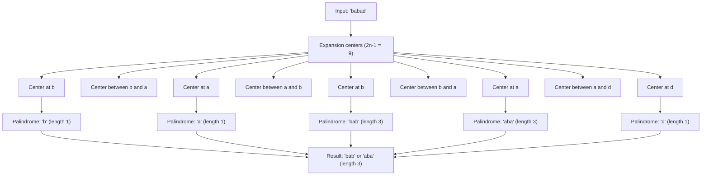

# Longest Palindromic Substring

## Introduction

A palindrome is a sequence that reads the same backward as forward. For example, "madam" and "racecar" are palindromes. The **Longest Palindromic Substring** problem asks us to find the longest substring within a string that is a palindrome.

This is a classic string problem in computer science with applications in text processing, bioinformatics, and computational linguistics. Understanding how to solve it efficiently will strengthen your algorithmic thinking and provide insights into dynamic programming and string manipulation techniques.

## What is a Palindromic Substring?

Before diving into algorithms, let's clarify what we're looking for:

- A **substring** is a contiguous sequence of characters within a string
- A **palindromic substring** is a substring that is also a palindrome

For example, in the string "babad":
- Palindromic substrings include: "b", "a", "d", "bab", "aba"
- The longest palindromic substrings are "bab" and "aba" (both length 3)

## Approaches to Solve the Problem

Let's explore different methods to find the longest palindromic substring, from the simplest to the most efficient.

### 1. Brute Force Approach

The most straightforward approach is to check every possible substring to determine if it's a palindrome.

```javascript
function longestPalindromeBruteForce(s) {
  if (!s || s.length === 0) return "";
  
  let longest = "";
  
  // Check all possible substrings
  for (let i = 0; i < s.length; i++) {
    for (let j = i; j < s.length; j++) {
      const substring = s.substring(i, j + 1);
      
      // Check if the substring is a palindrome and longer than our current longest
      if (isPalindrome(substring) && substring.length > longest.length) {
        longest = substring;
      }
    }
  }
  
  return longest;
}

function isPalindrome(s) {
  for (let i = 0, j = s.length - 1; i < j; i++, j--) {
    if (s[i] !== s[j]) return false;
  }
  return true;
}
```

**Time Complexity**: O(n³) where n is the length of the string
- O(n²) to generate all possible substrings
- O(n) to check if each substring is a palindrome

**Space Complexity**: O(1) as we only store the longest palindromic substring found

### 2. Dynamic Programming Approach

We can use dynamic programming to solve this problem more efficiently. The key observation is that a string is a palindrome if its first and last characters match and the substring between them is a palindrome.

```javascript
function longestPalindromeDynamic(s) {
  if (!s || s.length === 0) return "";
  
  const n = s.length;
  // dp[i][j] will be true if the substring from index i to j is a palindrome
  const dp = Array(n).fill().map(() => Array(n).fill(false));
  
  let start = 0;  // Starting index of the longest palindromic substring
  let maxLength = 1;  // Length of the longest palindromic substring
  
  // All substrings of length 1 are palindromes
  for (let i = 0; i < n; i++) {
    dp[i][i] = true;
  }
  
  // Check for substrings of length 2
  for (let i = 0; i < n - 1; i++) {
    if (s[i] === s[i + 1]) {
      dp[i][i + 1] = true;
      start = i;
      maxLength = 2;
    }
  }
  
  // Check for substrings of length > 2
  for (let len = 3; len <= n; len++) {
    for (let i = 0; i <= n - len; i++) {
      const j = i + len - 1;  // Ending index of the substring
      
      // Check if the current substring is a palindrome
      if (s[i] === s[j] && dp[i + 1][j - 1]) {
        dp[i][j] = true;
        
        if (len > maxLength) {
          start = i;
          maxLength = len;
        }
      }
    }
  }
  
  return s.substring(start, start + maxLength);
}
```

**Time Complexity**: O(n²)
**Space Complexity**: O(n²) for the dp table

### 3. Expand Around Center Approach

This approach is based on the observation that a palindrome can be expanded from its center. There are 2n-1 centers to consider: each character and each space between characters.

```javascript
function longestPalindromeExpandAroundCenter(s) {
  if (!s || s.length === 0) return "";
  
  let start = 0, maxLength = 0;
  
  for (let i = 0; i < s.length; i++) {
    // Expand around center for odd-length palindromes (single character center)
    const len1 = expandAroundCenter(s, i, i);
    
    // Expand around center for even-length palindromes (between two characters)
    const len2 = expandAroundCenter(s, i, i + 1);
    
    // Get the maximum length from both cases
    const len = Math.max(len1, len2);
    
    // Update the longest palindrome found if necessary
    if (len > maxLength) {
      maxLength = len;
      start = i - Math.floor((len - 1) / 2);
    }
  }
  
  return s.substring(start, start + maxLength);
}

function expandAroundCenter(s, left, right) {
  while (left >= 0 && right < s.length && s[left] === s[right]) {
    left--;
    right++;
  }
  return right - left - 1;  // Length of the palindrome
}
```

**Time Complexity**: O(n²)
**Space Complexity**: O(1)

### 4. Manacher's Algorithm

For the most efficient solution, we can use Manacher's Algorithm, which finds the longest palindromic substring in linear time O(n).

```javascript
function longestPalindromeManacher(s) {
  if (!s || s.length === 0) return "";
  
  // Preprocess the string to handle even-length palindromes
  const T = preprocess(s);
  const n = T.length;
  const P = Array(n).fill(0);  // P[i] = radius of palindrome centered at i
  
  let center = 0, right = 0;
  
  for (let i = 1; i < n - 1; i++) {
    // Mirror of i with respect to center
    const mirror = 2 * center - i;
    
    // If i is within the right boundary, we can use previously computed values
    if (right > i) {
      P[i] = Math.min(right - i, P[mirror]);
    }
    
    // Attempt to expand palindrome centered at i
    while (T[i + 1 + P[i]] === T[i - 1 - P[i]]) {
      P[i]++;
    }
    
    // If palindrome centered at i expands past right,
    // update center and right boundary
    if (i + P[i] > right) {
      center = i;
      right = i + P[i];
    }
  }
  
  // Find the maximum palindrome length and its center
  let maxLen = 0, centerIndex = 0;
  for (let i = 1; i < n - 1; i++) {
    if (P[i] > maxLen) {
      maxLen = P[i];
      centerIndex = i;
    }
  }
  
  // Extract the longest palindromic substring
  const start = Math.floor((centerIndex - maxLen) / 2);
  return s.substring(start, start + maxLen);
}

function preprocess(s) {
  // Add special characters to handle even-length palindromes
  let result = "^";
  for (let i = 0; i < s.length; i++) {
    result += "#" + s[i];
  }
  result += "#$";
  return result;
}
```

**Time Complexity**: O(n)
**Space Complexity**: O(n)

## Visualizing the Expand Around Center Approach

Let's visualize how the "expand around center" approach works with an example:



## Practical Applications

### 1. Text Analysis and Processing

The longest palindromic substring algorithm is useful in text analysis for identifying patterns and symmetries in text, which can be important in natural language processing tasks.

```javascript
function analyzeText(text) {
  const words = text.toLowerCase().split(/\W+/).filter(word => word.length > 0);
  const palindromes = words.filter(word => isPalindrome(word));
  
  console.log(`Found ${palindromes.length} palindromic words:`);
  console.log(palindromes);
  
  const longestPalindrome = longestPalindromeExpandAroundCenter(text.toLowerCase().replace(/[^a-z]/g, ''));
  console.log(`Longest palindromic substring: "${longestPalindrome}"`);
}

// Example usage
analyzeText("A man, a plan, a canal, Panama. Race car drivers level up quickly.");
```

### 2. DNA Sequence Analysis

In bioinformatics, palindromic sequences in DNA (sequences that read the same forward and backward on complementary strands) play important roles in biological processes.

```javascript
function findDNAPalindromes(sequence) {
  const palindromes = [];
  
  for (let i = 0; i < sequence.length; i++) {
    for (let j = i; j < sequence.length; j++) {
      const substr = sequence.substring(i, j + 1);
      if (isPalindromicDNA(substr) && substr.length >= 4) {
        palindromes.push({
          sequence: substr,
          position: i,
          length: substr.length
        });
      }
    }
  }
  
  return palindromes;
}

function isPalindromicDNA(seq) {
  const complement = {
    'A': 'T',
    'T': 'A',
    'G': 'C',
    'C': 'G'
  };
  
  for (let i = 0, j = seq.length - 1; i < j; i++, j--) {
    if (seq[i] !== complement[seq[j]]) {
      return false;
    }
  }
  
  return true;
}

// Example usage
const dnaSequence = "GAATTC";
console.log(findDNAPalindromes(dnaSequence));
// Output: [{ sequence: "GAATTC", position: 0, length: 6 }]
```

### 3. String Manipulation in Text Editors

Text editors can implement the longest palindromic substring algorithm to help users identify and manipulate palindromes in their text:

```javascript
function highlightPalindromes(text) {
  let result = text;
  const minLength = 3;  // Only highlight palindromes of length 3 or more
  
  for (let i = 0; i < text.length; i++) {
    // Check odd-length palindromes
    let len1 = expandAndHighlight(text, i, i, minLength);
    
    // Check even-length palindromes
    let len2 = expandAndHighlight(text, i, i + 1, minLength);
  }
  
  return result;
}

function expandAndHighlight(text, left, right, minLength) {
  while (left >= 0 && right < text.length && text[left] === text[right]) {
    left--;
    right++;
  }
  
  const length = right - left - 1;
  if (length >= minLength) {
    console.log(`Found palindrome: "${text.substring(left + 1, right)}"`);
  }
  
  return length;
}
```

## Summary

The Longest Palindromic Substring problem is a classic string algorithm with multiple approaches:

1. **Brute Force**: Check every substring (O(n³) time complexity)
2. **Dynamic Programming**: Build a table of palindromic substrings (O(n²) time and space)
3. **Expand Around Center**: Expand from each possible center (O(n²) time, O(1) space)
4. **Manacher's Algorithm**: Linear time solution (O(n) time, O(n) space)

Each approach has its own trade-offs between simplicity, time complexity, and space usage. For most practical applications, the Expand Around Center approach provides a good balance of efficiency and simplicity.

## Exercises

1. Modify the algorithms to return all the longest palindromic substrings if there are multiple with the same length.
2. Implement a function to find the longest palindromic subsequence (not substring) in a string.
3. Optimize the dynamic programming approach to use O(n) space instead of O(n²).
4. Implement a function that counts the number of palindromic substrings in a given string.
5. Write a function that, given a string, adds the minimum number of characters to make it a palindrome.

## Additional Resources

- [LeetCode Problem: Longest Palindromic Substring](https://leetcode.com/problems/longest-palindromic-substring/)
- [GeeksforGeeks: Manacher's Algorithm](https://www.geeksforgeeks.org/manachers-algorithm-linear-time-longest-palindromic-substring-part-1/)
- [Introduction to Algorithms (CLRS)](https://mitpress.mit.edu/books/introduction-algorithms-third-edition) - For deeper understanding of dynamic programming

Remember that understanding the problem's structure and thinking through the algorithms methodically is key to mastering string manipulation problems like this one.