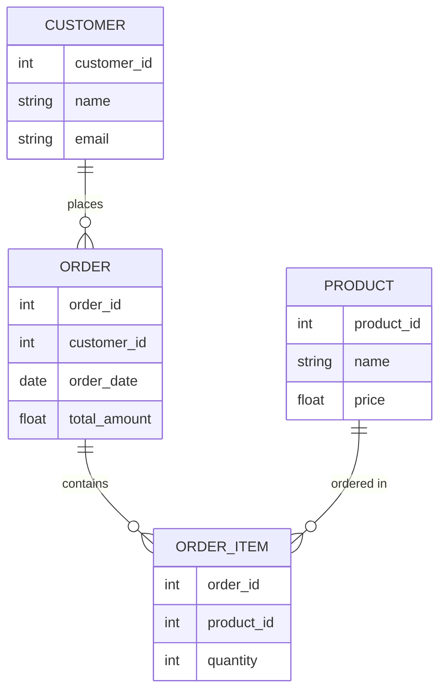

# Introduction to Databases

## What is a Database?

A database is an organized collection of structured information or data, typically stored electronically in a computer system. Databases are designed to efficiently store, retrieve, manage, and update data.

Think of a database as a digital filing cabinet that allows you to:
- Store large amounts of information in an organized way
- Find specific pieces of information quickly
- Update information easily
- Establish relationships between different pieces of data
- Ensure data accuracy and consistency

## Why Do We Need Databases?

Before diving deeper, let's understand why databases are essential in modern computing:

1. **Data Volume**: Applications today handle massive amounts of data that would be impossible to manage with simple file systems
2. **Data Integrity**: Databases help maintain accuracy and consistency of data
3. **Data Security**: They provide mechanisms to control who can access or modify data
4. **Concurrent Access**: Multiple users can access and modify data simultaneously
5. **Efficient Queries**: Databases allow for complex data retrieval operations

## Database Management Systems (DBMS)

A Database Management System (DBMS) is software that interacts with users, applications, and the database itself to capture and analyze data. It provides an interface between the database and its end users or programs.

Common DBMS software includes:
- MySQL
- PostgreSQL
- Oracle Database
- Microsoft SQL Server
- MongoDB
- SQLite

## Types of Databases

Databases come in several types, each designed for specific use cases.

### Relational Databases

Relational databases organize data into tables (or relations) with rows and columns. Each table can be linked to other tables using keys, creating relationships between data.



Key concepts in relational databases:
- **Tables**: Structured sets of data elements
- **Rows**: Individual records in a table
- **Columns**: Data categories/attributes
- **Primary Keys**: Unique identifiers for each record
- **Foreign Keys**: Fields that link to primary keys in other tables

#### Example: Creating a Simple Table in SQL

```sql
CREATE TABLE users (
    user_id INT PRIMARY KEY,
    username VARCHAR(50) UNIQUE NOT NULL,
    email VARCHAR(100) UNIQUE NOT NULL,
    created_at TIMESTAMP DEFAULT CURRENT_TIMESTAMP
);
```

#### Example: Inserting Data

```sql
INSERT INTO users (user_id, username, email)
VALUES (1, 'johndoe', 'john@example.com');
```

#### Example: Querying Data

```sql
SELECT username, email FROM users WHERE user_id = 1;
```

Output:
```
username | email
---------+-----------------
johndoe  | john@example.com
```

### NoSQL Databases

NoSQL (Not Only SQL) databases provide a mechanism for storage and retrieval of data that is modeled differently from the tabular relations used in relational databases.

Types of NoSQL databases:

1. **Document Databases**: Store data in JSON-like documents (MongoDB, CouchDB)
2. **Key-Value Stores**: Simple databases that store values indexed by keys (Redis, DynamoDB)
3. **Wide-Column Stores**: Store data in tables, rows, and dynamic columns (Cassandra, HBase)
4. **Graph Databases**: Store data in nodes and edges (Neo4j, Amazon Neptune)

#### Example: Document in MongoDB

```javascript
// MongoDB document
{
  "_id": ObjectId("5f8d0e0dcb5f8f1b3c8b4567"),
  "username": "johndoe",
  "email": "john@example.com",
  "profile": {
    "firstName": "John",
    "lastName": "Doe",
    "age": 28
  },
  "interests": ["programming", "databases", "web development"],
  "created_at": ISODate("2023-09-15T12:00:00Z")
}
```

## Database Design Principles

Good database design is crucial for building efficient and maintainable systems. Here are some key principles:

### Normalization

Normalization is the process of organizing data to reduce redundancy and improve data integrity. It involves dividing large tables into smaller ones and defining relationships between them.

The most common normalization forms:

1. **First Normal Form (1NF)**: Eliminate duplicate columns and create separate tables for related data
2. **Second Normal Form (2NF)**: Meet 1NF requirements and establish relationships using primary and foreign keys
3. **Third Normal Form (3NF)**: Meet 2NF requirements and remove columns not dependent on the primary key

### Data Integrity

Data integrity ensures that data remains accurate and consistent throughout its lifecycle. This is maintained through:

- **Entity Integrity**: Each row has a unique identifier (primary key)
- **Referential Integrity**: Foreign key values must match a primary key value in the referenced table
- **Domain Integrity**: Values must conform to defined formats, ranges, or rules

## Basic Database Operations (CRUD)

Most database operations fall into four categories, commonly known as CRUD:

1. **Create**: Add new records to a database
2. **Read**: Retrieve or query data from a database
3. **Update**: Modify existing records
4. **Delete**: Remove records from a database

### Example: CRUD Operations in SQL

```sql
-- Create (Insert)
INSERT INTO products (product_name, price, category)
VALUES ('Laptop XPS 13', 1299.99, 'Electronics');

-- Read (Select)
SELECT product_name, price FROM products WHERE category = 'Electronics';

-- Update
UPDATE products SET price = 1199.99 WHERE product_name = 'Laptop XPS 13';

-- Delete
DELETE FROM products WHERE product_name = 'Laptop XPS 13';
```

## Real-World Applications

Databases are the backbone of most modern applications. Here are some examples:

### E-commerce Platforms

An online store uses databases to manage:
- Product inventory and details
- Customer information
- Order history and processing
- Shopping carts
- Product reviews and ratings

### Social Media Applications

Social platforms use databases to store:
- User profiles and authentication data
- Posts, comments, and reactions
- Friend/follower relationships
- Media content references
- User engagement analytics

### Banking Systems

Financial institutions rely on databases for:
- Account information
- Transaction records
- Loan and credit management
- Customer profiles
- Regulatory compliance data

## Getting Started with Databases

If you're new to databases, here's how you can start learning:

1. **Choose a DBMS to learn**: SQLite or MySQL are great for beginners
2. **Install the database software**: Most have simple installation processes
3. **Learn basic SQL**: For relational databases, SQL is the standard query language
4. **Design a simple database**: Try creating tables for a personal project
5. **Perform CRUD operations**: Practice inserting, querying, updating, and deleting data

### Example: Creating a Simple Database for a Blog

```sql
-- Create tables for a simple blog
CREATE TABLE authors (
    author_id INT PRIMARY KEY,
    name VARCHAR(100) NOT NULL,
    email VARCHAR(100) UNIQUE NOT NULL,
    bio TEXT
);

CREATE TABLE posts (
    post_id INT PRIMARY KEY,
    author_id INT NOT NULL,
    title VARCHAR(200) NOT NULL,
    content TEXT NOT NULL,
    published_date TIMESTAMP DEFAULT CURRENT_TIMESTAMP,
    FOREIGN KEY (author_id) REFERENCES authors(author_id)
);

CREATE TABLE comments (
    comment_id INT PRIMARY KEY,
    post_id INT NOT NULL,
    name VARCHAR(100) NOT NULL,
    email VARCHAR(100) NOT NULL,
    content TEXT NOT NULL,
    comment_date TIMESTAMP DEFAULT CURRENT_TIMESTAMP,
    FOREIGN KEY (post_id) REFERENCES posts(post_id)
);
```

## Challenges and Considerations

When working with databases, be aware of:

1. **Performance**: As data grows, query performance can become a concern
2. **Scalability**: Systems need to handle growth in data volume and user numbers
3. **Security**: Protecting data from unauthorized access and SQL injection attacks
4. **Backup and Recovery**: Implementing strategies to prevent data loss

## Summary

Databases are essential components of modern software systems, providing structured ways to store, retrieve, and manage data. Key takeaways:

- Databases organize and manage large amounts of structured data
- Relational databases use tables with relationships, while NoSQL databases offer flexible data models
- Database design principles like normalization help create efficient systems
- CRUD operations form the foundation of database interactions
- Different types of databases suit different applications and use cases

As you continue your programming journey, understanding databases will be crucial for building robust, data-driven applications.

## Exercises

1. Design a database schema for a library management system with books, members, and borrowing records.
2. Write SQL queries to perform basic CRUD operations on your schema.
3. Compare the pros and cons of using a relational database versus a NoSQL database for an online store.
4. Implement a simple database using SQLite and connect to it from a programming language of your choice.

## Additional Resources

- **Books**:
  - "Database Design for Mere Mortals" by Michael J. Hernandez
  - "SQL Queries for Mere Mortals" by John L. Viescas and Michael J. Hernandez

- **Online Tutorials**:
  - W3Schools SQL Tutorial
  - PostgreSQL Official Documentation
  - MongoDB University

- **Practice Platforms**:
  - SQLZoo
  - LeetCode Database Problems
  - HackerRank SQL Challenges