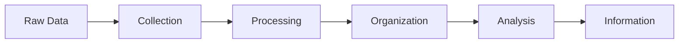

# Data vs Information

## Introduction

When beginning your journey into database fundamentals, one of the first distinctions you need to understand is between **data** and **information**. While these terms are often used interchangeably in everyday conversation, they represent fundamentally different concepts in the field of computing and database systems.

This article will clarify these differences, explain how raw data transforms into meaningful information, and demonstrate why understanding this distinction is crucial for effective database design and implementation.

## What is Data?

**Data** refers to raw, unprocessed facts, figures, and symbols that have no context or meaning on their own. Think of data as the individual building blocks that, when properly arranged and interpreted, can create something useful.

### Characteristics of Data:

- Raw and unprocessed
- No inherent meaning
- Collected through observations or recordings
- Can be structured or unstructured
- Typically stored in databases

### Examples of Data:

```
42
"John"
true
2023-05-15
98.6
```

These examples don't tell us much on their own. We see numbers, text, a boolean value, and a date, but without context, they're just isolated pieces of data.

## What is Information?

**Information** is data that has been processed, organized, structured, or presented in a way that makes it meaningful and useful. Information provides context and answers questions like "who," "what," "where," "when," or "how."

### Characteristics of Information:

- Processed and refined data
- Has context and meaning
- Organized for a specific purpose
- Valuable for decision-making
- Can be communicated and understood

### Example of Transformation:

Let's see how raw data transforms into information:

```
// Raw Data
42
"John"
true
2023-05-15
98.6

// Transformed into Information
Student ID: 42
Name: John
Active Status: true
Enrollment Date: 2023-05-15
Temperature: 98.6°F
```

Now we have context! We understand that these values describe a student named John who is actively enrolled, and possibly has a normal body temperature.

## The Data-to-Information Process

The transformation from data to information involves several steps:



1. **Collection**: Gathering raw data from various sources
2. **Processing**: Cleaning and validating the data
3. **Organization**: Structuring the data in a meaningful way
4. **Analysis**: Interpreting the data to extract meaning
5. **Presentation**: Displaying the results in a comprehensible format

## Practical Database Examples

Let's examine how this distinction applies in database contexts:

### Example 1: E-commerce Database

**Raw Data in Tables:**

```sql
// Customers Table
CustomerId: 1001
FirstName: "Emma"
LastName: "Johnson"
Email: "emma.j@example.com"

// Orders Table
OrderId: 5003
CustomerId: 1001
Date: "2023-10-15"
Total: 129.99

// Products Table
ProductId: 101
Name: "Wireless Headphones"
Price: 79.99
```

**Information Derived:**

```
Customer Emma Johnson (emma.j@example.com) placed an order (#5003) 
on October 15, 2023, spending $129.99 on items including Wireless Headphones.
```

### Example 2: Weather Data

**Raw Data:**

```
Location: "NYC"
Date: "2023-11-01"
Temp_Morning: 45
Temp_Noon: 62
Temp_Evening: 51
Precipitation: 0.2
Wind_Speed: 8
```

**Information Derived:**

```
Weather Report: New York City experienced a mild day on November 1, 2023, 
with temperatures rising from 45°F in the morning to 62°F by noon, 
then dropping to 51°F in the evening. Light rain (0.2 inches) 
was recorded with moderate winds (8 mph).
```

## Importance in Database Design

Understanding the difference between data and information directly impacts how we design databases:

1. **Schema Design**: We structure tables to store raw data efficiently.
2. **Queries**: We write SQL queries to transform data into information.
3. **Reporting**: We create views and reports to present information to users.
4. **Data Integrity**: We ensure data accuracy so that derived information is reliable.

Let's see a simple example of how SQL transforms data into information:

```sql
-- This query transforms raw customer and order data into meaningful information
SELECT 
    c.FirstName + ' ' + c.LastName AS CustomerName,
    COUNT(o.OrderId) AS OrderCount,
    SUM(o.Total) AS TotalSpent,
    MAX(o.Date) AS LastOrderDate
FROM 
    Customers c
JOIN 
    Orders o ON c.CustomerId = o.CustomerId
GROUP BY 
    c.CustomerId, c.FirstName, c.LastName
HAVING 
    COUNT(o.OrderId) > 5
ORDER BY 
    TotalSpent DESC;
```

This query takes raw data from multiple tables and creates a report showing high-value customers, how many orders they've placed, their total spending, and when they last ordered.

## Data vs. Information in Real-World Systems

Let's explore how this distinction applies in different domains:

### Healthcare Systems

**Data**: Patient vitals, lab results, medication codes<br />
**Information**: Diagnostic reports, treatment recommendations, health trends

### Financial Applications

**Data**: Transaction amounts, account numbers, timestamps<br />
**Information**: Monthly statements, spending patterns, investment performance

### Educational Platforms

**Data**: Test scores, completion dates, lesson IDs<br />
**Information**: Progress reports, learning analytics, achievement certificates

## Common Misconceptions

1. **Myth**: Data and information are the same thing.<br />
   **Reality**: Data is raw facts; information is processed data with context and meaning.

2. **Myth**: More data always means better information.<br />
   **Reality**: Quality and relevance of data matter more than quantity.

3. **Myth**: The transformation from data to information is automatic.<br />
   **Reality**: It requires proper processing, context, and interpretation.

## Summary

Understanding the distinction between data and information is fundamental to working with databases:

- **Data** is raw, unprocessed facts without context
- **Information** is processed data that has meaning and value
- The transformation from data to information involves collection, processing, organization, and analysis
- Database systems are designed to store data efficiently and provide mechanisms to transform it into useful information
- Effective database design requires understanding what raw data needs to be stored and what information users need to extract

## Exercises

1. Identify which of the following are data and which are information:
   - The string "California"
   - "The average temperature in California in July is 85°F"
   - The number 42
   - "42% of users completed the survey"

2. For the following raw data, describe what information could be derived:
   ```
   UserID: 501
   LoginTime: "2023-11-01 08:30:22"
   LogoutTime: "2023-11-01 10:15:45"
   PagesVisited: 23
   DownloadsMade: 3
   ```

3. Design a simple database table to store student grades, then write a SQL query that would transform this data into information about each student's performance.

## Additional Resources

- Explore database normalization to understand how to structure data efficiently
- Learn about data visualization techniques to present information effectively
- Study data warehousing concepts to see how organizations manage the data-to-information pipeline at scale