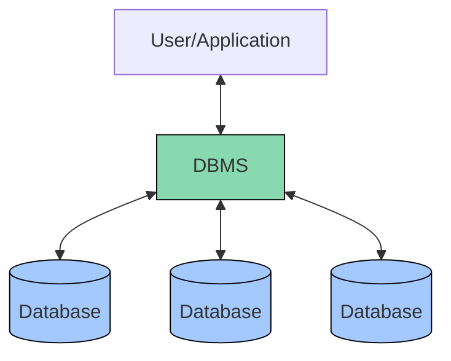
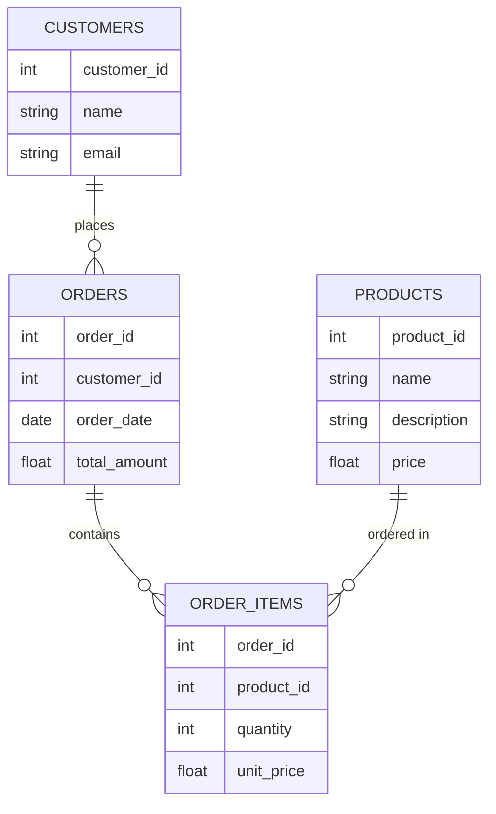
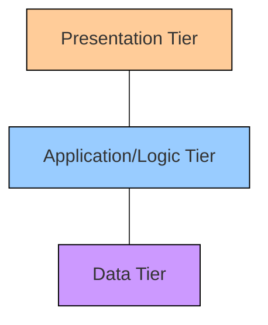

# Database Management Systems (DBMS)

## Introduction

A Database Management System (DBMS) is specialized software designed to create, manipulate, and manage databases. Think of it as a sophisticated filing system for your digital data that provides an organized way to store, retrieve, and manage information.

In today's data-driven world, DBMSs are the backbone of virtually all software applications - from simple mobile apps to complex enterprise systems. Whether you're checking your social media feed, making an online purchase, or using a banking app, a DBMS is working behind the scenes to handle the data.

## What is a DBMS?

A Database Management System acts as an intermediary between users and the database itself, providing a set of tools and functions that allow users to:

- **Define** databases and their structure
- **Construct** databases on physical storage media
- **Manipulate** data through operations like insertion, updating, deletion, and retrieval
- **Share** data among multiple users and applications
- **Protect** data from system failures and unauthorized access



## Key Components of a DBMS

### 1. Data Definition Language (DDL)

DDL allows database administrators to define the database schema, structure, and constraints.

```sql
CREATE TABLE employees (
  employee_id INT PRIMARY KEY,
  first_name VARCHAR(50) NOT NULL,
  last_name VARCHAR(50) NOT NULL,
  hire_date DATE,
  department VARCHAR(50)
);
```

### 2. Data Manipulation Language (DML)

DML enables users to manipulate data within the database.

```sql
-- Insert a new employee
INSERT INTO employees (employee_id, first_name, last_name, hire_date, department)
VALUES (1001, 'John', 'Smith', '2023-01-15', 'Engineering');

-- Update employee information
UPDATE employees
SET department = 'Product Development'
WHERE employee_id = 1001;

-- Delete an employee record
DELETE FROM employees
WHERE employee_id = 1001;
```

### 3. Query Language

The most common query language is SQL (Structured Query Language), which allows users to retrieve specific data.

```sql
-- Basic query to retrieve all employees
SELECT * FROM employees;

-- Query with conditions
SELECT first_name, last_name, department
FROM employees
WHERE hire_date > '2022-01-01'
ORDER BY last_name;
```

**Output:**
```
first_name | last_name | department
---------------------------------------
John       | Smith     | Product Development
Sarah      | Jones     | Marketing
Michael    | Brown     | Engineering
```

### 4. Transaction Management

Transactions ensure that database operations are atomic, consistent, isolated, and durable (ACID properties).

```sql
-- Start a transaction
BEGIN TRANSACTION;

-- Transfer $100 from account1 to account2
UPDATE accounts SET balance = balance - 100 WHERE account_id = 'account1';
UPDATE accounts SET balance = balance + 100 WHERE account_id = 'account2';

-- If everything is successful, commit the changes
COMMIT;

-- If there's a problem, roll back the changes
-- ROLLBACK;
```

## Types of DBMS

### 1. Relational DBMS (RDBMS)

Stores data in tables with predefined relationships. Examples include MySQL, PostgreSQL, Oracle, and SQL Server.



### 2. NoSQL DBMS

Designed for distributed data stores with large-scale data storage needs. Types include:

- **Document databases** (MongoDB, CouchDB)
- **Key-value stores** (Redis, DynamoDB)
- **Column-family stores** (Cassandra, HBase)
- **Graph databases** (Neo4j, ArangoDB)

Example of document storage in MongoDB:

```javascript
// Document representing a customer in MongoDB
{
  "_id": ObjectId("60a6e8edf2f58e001c9ad73a"),
  "name": "John Smith",
  "email": "john.smith@example.com",
  "address": {
    "street": "123 Main St",
    "city": "Boston",
    "state": "MA",
    "zip": "02101"
  },
  "orders": [
    {
      "order_id": "ORD-2023-001",
      "date": ISODate("2023-03-15"),
      "items": [
        { "product": "Laptop", "quantity": 1, "price": 1200 },
        { "product": "Mouse", "quantity": 1, "price": 25 }
      ]
    }
  ]
}
```

### 3. Object-Oriented DBMS

Stores data in the form of objects, as used in object-oriented programming.

### 4. NewSQL DBMS

Combines the ACID guarantees of traditional RDBMS with the scalability of NoSQL systems.

## DBMS Architecture

Most DBMS follow a three-tier architecture:



1. **Presentation Tier** - User interface that allows users to interact with the database
2. **Application/Logic Tier** - Contains business logic and communicates between the presentation and data tiers
3. **Data Tier** - Actual database and DBMS that stores and manages data

## Advantages of DBMS

1. **Data Independence** - Changes to the physical storage don't affect the application
2. **Efficient Data Access** - Optimized query processing
3. **Data Integrity and Security** - Controls for access and validation
4. **Data Consistency** - Ensures accurate and reliable data
5. **Concurrent Access** - Multiple users can access the database simultaneously
6. **Backup and Recovery** - Built-in mechanisms to prevent data loss

## Real-World Example: Student Registration System

Let's design a simple student registration system to demonstrate DBMS concepts:

```sql
-- Create tables for our student registration system
CREATE TABLE students (
  student_id INT PRIMARY KEY,
  first_name VARCHAR(50) NOT NULL,
  last_name VARCHAR(50) NOT NULL,
  email VARCHAR(100) UNIQUE,
  date_of_birth DATE,
  enrollment_date DATE DEFAULT CURRENT_DATE
);

CREATE TABLE courses (
  course_id VARCHAR(10) PRIMARY KEY,
  title VARCHAR(100) NOT NULL,
  credits INT,
  department VARCHAR(50)
);

CREATE TABLE enrollments (
  enrollment_id INT PRIMARY KEY,
  student_id INT,
  course_id VARCHAR(10),
  enrollment_date DATE,
  grade VARCHAR(2),
  FOREIGN KEY (student_id) REFERENCES students(student_id),
  FOREIGN KEY (course_id) REFERENCES courses(course_id)
);
```

Let's insert some sample data:

```sql
-- Insert students
INSERT INTO students (student_id, first_name, last_name, email, date_of_birth)
VALUES 
(1001, 'Anna', 'Johnson', 'anna.j@example.edu', '2000-05-12'),
(1002, 'Carlos', 'Rodriguez', 'carlos.r@example.edu', '2001-02-28');

-- Insert courses
INSERT INTO courses (course_id, title, credits, department)
VALUES 
('CS101', 'Introduction to Programming', 3, 'Computer Science'),
('MATH201', 'Calculus I', 4, 'Mathematics');

-- Enroll students in courses
INSERT INTO enrollments (enrollment_id, student_id, course_id, enrollment_date)
VALUES 
(1, 1001, 'CS101', '2023-08-30'),
(2, 1001, 'MATH201', '2023-08-30'),
(3, 1002, 'CS101', '2023-08-31');
```

Now we can retrieve information with queries:

```sql
-- Get all courses a student is enrolled in
SELECT s.first_name, s.last_name, c.course_id, c.title
FROM students s
JOIN enrollments e ON s.student_id = e.student_id
JOIN courses c ON e.course_id = c.course_id
WHERE s.student_id = 1001;
```

**Output:**
```
first_name | last_name | course_id | title
-----------------------------------------------
Anna       | Johnson   | CS101     | Introduction to Programming
Anna       | Johnson   | MATH201   | Calculus I
```

## Practical Usage in Web Applications

In a real-world web application, we might use a DBMS through an ORM (Object-Relational Mapping) library. Here's an example using Node.js with Sequelize ORM:

```javascript
// Define a Student model
const Student = sequelize.define('Student', {
  student_id: {
    type: DataTypes.INTEGER,
    primaryKey: true
  },
  first_name: {
    type: DataTypes.STRING(50),
    allowNull: false
  },
  last_name: {
    type: DataTypes.STRING(50),
    allowNull: false
  },
  email: {
    type: DataTypes.STRING(100),
    unique: true
  },
  date_of_birth: {
    type: DataTypes.DATE
  },
  enrollment_date: {
    type: DataTypes.DATE,
    defaultValue: DataTypes.NOW
  }
});

// Create a new student
async function createStudent() {
  try {
    const newStudent = await Student.create({
      student_id: 1003,
      first_name: 'Maria',
      last_name: 'Garcia',
      email: 'maria.g@example.edu',
      date_of_birth: '2001-09-15'
    });
    console.log('Student created:', newStudent.toJSON());
  } catch (error) {
    console.error('Error creating student:', error);
  }
}
```

## Summary

Database Management Systems are essential tools in modern software development that provide robust mechanisms for storing, retrieving, and managing data. Key points to remember:

- A DBMS serves as an interface between users/applications and the actual data
- Different types of DBMS exist to suit different needs (RDBMS, NoSQL, etc.)
- DBMSs provide data independence, security, and integrity
- SQL is the standard language for relational database operations
- Modern applications often use ORMs to interact with databases

## Practice Exercises

1. Design a database schema for a simple e-commerce platform with customers, products, and orders.
2. Write SQL queries to:
   - Find all products ordered by a specific customer
   - Calculate the total revenue for each product
   - Identify the top 5 best-selling products
3. Compare the advantages and disadvantages of RDBMS vs. NoSQL for a social media application.

## Additional Resources

- Learn more about specific DBMS: MySQL, PostgreSQL, MongoDB
- Explore database design principles and normalization
- Practice with online SQL exercises and challenges
- Investigate database performance tuning and optimization techniques