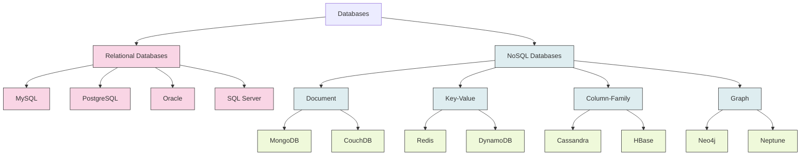
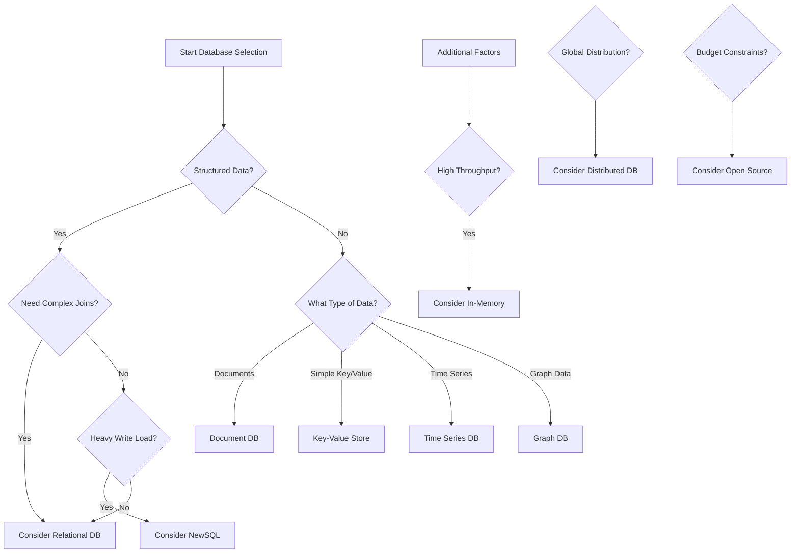

# Types of Databases

## Introduction

Databases are organized collections of data stored and accessed electronically. They form the backbone of most software applications, from simple mobile apps to complex enterprise systems. Choosing the right type of database for your application is crucial as it affects performance, scalability, and functionality.

In this guide, we'll explore various types of databases, their characteristics, advantages, and common use cases to help you make informed decisions when building your applications.

## Relational Databases (RDBMS)

Relational databases store data in tables with rows and columns, establishing relationships between tables using keys. They use Structured Query Language (SQL) for defining and manipulating the data.

### Key Characteristics

- **Structured Schema**: Data must conform to a predefined schema
- **ACID Compliance**: Ensures data validity despite errors or system failures
- **Relationships**: Supports primary keys, foreign keys, and complex joins
- **Normalization**: Reduces data redundancy and improves integrity

### Popular Examples

- MySQL
- PostgreSQL
- Oracle Database
- Microsoft SQL Server
- SQLite

### Sample SQL Code

```sql
-- Creating a table
CREATE TABLE users (
    id INT PRIMARY KEY,
    username VARCHAR(50) NOT NULL UNIQUE,
    email VARCHAR(100) NOT NULL,
    created_at TIMESTAMP DEFAULT CURRENT_TIMESTAMP
);

-- Inserting data
INSERT INTO users (id, username, email) 
VALUES (1, 'johndoe', 'john@example.com');

-- Querying data
SELECT username, email FROM users WHERE id = 1;
```

### Real-world Applications

- **Banking Systems**: Where transaction integrity is critical
- **E-commerce Platforms**: Managing products, orders, and customer data
- **Enterprise Applications**: Handling complex business rules and data relationships

## NoSQL Databases

NoSQL ("Not Only SQL") databases emerged as alternatives to relational databases to handle large volumes of unstructured or semi-structured data with flexible schemas.

### Types of NoSQL Databases

#### 1. Document Databases

Store data in flexible, JSON-like documents with dynamic schemas.

**Examples**: MongoDB, CouchDB, Firebase Firestore

**Sample Code (MongoDB with Node.js)**:

```javascript
// Connecting to MongoDB
const { MongoClient } = require('mongodb');
const uri = "mongodb://localhost:27017";
const client = new MongoClient(uri);

async function createUser() {
  try {
    await client.connect();
    const database = client.db("myApp");
    const users = database.collection("users");
    
    // Document to insert (no rigid schema)
    const user = {
      username: "johndoe",
      email: "john@example.com",
      preferences: {
        theme: "dark",
        notifications: true
      },
      tags: ["beginner", "programming"]
    };
    
    // Insert the document
    const result = await users.insertOne(user);
    console.log(`User created with _id: ${result.insertedId}`);
  } finally {
    await client.close();
  }
}

createUser();
```

**Use Cases**: Content management systems, mobile applications, real-time analytics

#### 2. Key-Value Stores

Simple databases that store data as key-value pairs, optimized for high-speed retrieval.

**Examples**: Redis, Amazon DynamoDB, Riak

**Sample Code (Redis with Node.js)**:

```javascript
// Using Redis with Node.js
const redis = require('redis');
const client = redis.createClient();

// Setting a key-value pair
client.set('user:1:username', 'johndoe');
client.set('user:1:email', 'john@example.com');

// Getting a value
client.get('user:1:username', (err, reply) => {
  console.log(reply); // Output: johndoe
});

// Setting with expiration (5 minutes)
client.set('session:123', 'active', 'EX', 300);
```

**Use Cases**: Caching, session management, real-time leaderboards, message queues

#### 3. Column-Family Stores

Store data in column families, optimized for queries over large datasets.

**Examples**: Apache Cassandra, HBase, ScyllaDB

**Sample Code (Cassandra CQL)**:

```sql
-- Creating a keyspace
CREATE KEYSPACE IF NOT EXISTS example_app
  WITH REPLICATION = { 
    'class' : 'SimpleStrategy', 
    'replication_factor' : 3 
  };

-- Creating a table
CREATE TABLE example_app.users (
  user_id UUID PRIMARY KEY,
  username TEXT,
  email TEXT,
  created_at TIMESTAMP
);

-- Inserting data
INSERT INTO example_app.users 
  (user_id, username, email, created_at)
VALUES 
  (uuid(), 'johndoe', 'john@example.com', toTimestamp(now()));
```

**Use Cases**: Time-series data, recommendation engines, IoT applications, large-scale data analytics

#### 4. Graph Databases

Designed for data whose relationships are well-represented as a graph (nodes, edges, and properties).

**Examples**: Neo4j, Amazon Neptune, ArangoDB

**Sample Code (Neo4j Cypher Query)**:

```cypher
// Create nodes
CREATE (john:Person {name: 'John Doe', age: 28})
CREATE (jane:Person {name: 'Jane Smith', age: 27})
CREATE (post:Post {title: 'Learning Databases', content: 'Databases are essential...'})

// Create relationships
CREATE (john)-[:WROTE]->(post)
CREATE (jane)-[:LIKED]->(post)
CREATE (john)-[:FOLLOWS]->(jane)

// Query relationships
MATCH (p:Person)-[:WROTE]->(post:Post)<-[:LIKED]-(liker:Person)
RETURN p.name as author, post.title as post, liker.name as likedBy
```

**Use Cases**: Social networks, fraud detection, recommendation engines, network diagrams

## Diagram: Database Types Comparison



## NewSQL Databases

NewSQL databases combine the ACID guarantees of traditional relational databases with the scalability of NoSQL systems.

### Key Characteristics

- Distributed architecture for horizontal scaling
- SQL support
- ACID compliance
- Sharding capabilities for large datasets

### Examples

- Google Spanner
- CockroachDB
- VoltDB
- MemSQL (now SingleStore)

### Sample Code (CockroachDB)

```sql
-- Creating a table with distribution
CREATE TABLE users (
    id UUID PRIMARY KEY DEFAULT gen_random_uuid(),
    username STRING NOT NULL UNIQUE,
    email STRING NOT NULL,
    created_at TIMESTAMP DEFAULT current_timestamp()
) PARTITION BY RANGE (created_at) (
    PARTITION q1_2023 VALUES FROM ('2023-01-01') TO ('2023-04-01'),
    PARTITION q2_2023 VALUES FROM ('2023-04-01') TO ('2023-07-01')
);

-- Adding an index that will be distributed
CREATE INDEX user_email_idx ON users (email);
```

**Use Cases**: Global applications requiring high availability, financial systems, large-scale OLTP workloads

## Time-Series Databases

Specialized databases optimized for time-stamped or time-series data.

### Key Characteristics

- Efficient storage of timestamped data
- Fast range queries by time intervals
- Built-in functions for time-based aggregations
- Data retention policies

### Examples

- InfluxDB
- TimescaleDB
- Prometheus
- QuestDB

### Sample Code (InfluxDB)

```javascript
// Using InfluxDB with Node.js
const {InfluxDB, Point} = require('@influxdata/influxdb-client');

// Create a write client
const client = new InfluxDB({url: 'http://localhost:8086', token: 'my-token'});
const writeApi = client.getWriteApi('my-org', 'temperature_sensors');

// Create a point and write it
const point = new Point('room_temp')
  .tag('location', 'living_room')
  .floatField('value', 23.5)
  .timestamp(new Date());

writeApi.writePoint(point);
writeApi.close().then(() => console.log('Data written successfully'));

// Query example (using Flux query language)
const queryApi = client.getQueryApi('my-org');
const query = `
  from(bucket: "temperature_sensors")
    |> range(start: -1h)
    |> filter(fn: (r) => r.location == "living_room")
    |> mean()
`;

queryApi.queryRows(query, {
  next(row, tableMeta) {
    const o = tableMeta.toObject(row);
    console.log(`Average temperature: ${o._value}`);
  },
  error(error) {
    console.error(error);
  },
  complete() {
    console.log('Query completed');
  },
});
```

**Use Cases**: IoT device monitoring, financial trading systems, application monitoring, weather data

## In-Memory Databases

Databases that primarily store data in memory for faster access.

### Key Characteristics

- Extremely fast data retrieval
- Optional disk persistence for durability
- Lower latency compared to disk-based databases
- Often used as caching layers

### Examples

- Redis
- Memcached
- SAP HANA
- Apache Ignite

### Sample Code (Redis)

```javascript
// Using Redis as an in-memory database
const redis = require('redis');
const client = redis.createClient();

// Store complex data using hash
client.hset('user:1001', 'username', 'johndoe');
client.hset('user:1001', 'email', 'john@example.com');
client.hset('user:1001', 'visits', 1);

// Increment a counter (atomic operation)
client.hincrby('user:1001', 'visits', 1);

// Get all fields
client.hgetall('user:1001', (err, object) => {
  console.log(object);
  // Output: { username: 'johndoe', email: 'john@example.com', visits: '2' }
});
```

**Use Cases**: Caching, session management, real-time analytics, gaming leaderboards

## Database Selection Factors

When choosing a database for your application, consider these factors:

1. **Data Structure**: Is your data structured, semi-structured, or unstructured?
2. **Scale Requirements**: How much data will you store and how many users will access it?
3. **Query Patterns**: What types of queries will be most common?
4. **Consistency Needs**: Do you need strong consistency or is eventual consistency acceptable?
5. **Transaction Support**: Do you need ACID transactions?
6. **Performance Requirements**: What are your latency and throughput requirements?
7. **Development Experience**: What databases are your team familiar with?

## Database Decision Flowchart



## Summary

Database systems have evolved significantly to address diverse data storage and processing needs. While relational databases remain popular for structured data with complex relationships, NoSQL databases provide flexibility for unstructured data and high scalability. Specialized databases like time-series and graph databases address specific use cases with optimized performance.

The right choice depends on your specific requirements including data structure, query patterns, consistency needs, and scale. Many modern applications use multiple database types together in a polyglot persistence architecture to leverage the strengths of each system.

## Exercises for Practice

1. **Database Identification**: For each of the following scenarios, identify the most suitable database type:
   - A social network application with complex user relationships
   - An IoT platform collecting sensor readings every second
   - An e-commerce website with product catalog and order processing
   - A caching layer for frequently accessed data

2. **Schema Design**: Create a simple schema for a blog application with users, posts, and comments in:
   - A relational database
   - A document database
   - A graph database

3. **Database Comparison**: Research and compare two specific database implementations (e.g., PostgreSQL vs. MongoDB) for a specific use case of your choice.

## Additional Resources

- **Books**:
  - "Database Internals" by Alex Petrov
  - "NoSQL Distilled" by Martin Fowler and Pramod Sadalage
  - "Designing Data-Intensive Applications" by Martin Kleppmann

- **Online Courses**:
  - Database Design on major learning platforms
  - Database-specific courses for PostgreSQL, MongoDB, etc.

- **Documentation**:
  - Each database system has comprehensive documentation that includes tutorials, best practices, and references