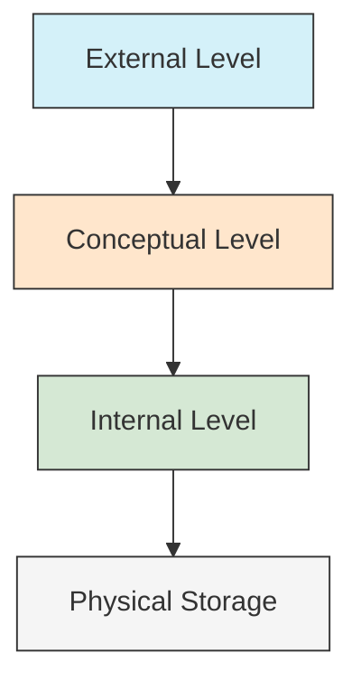
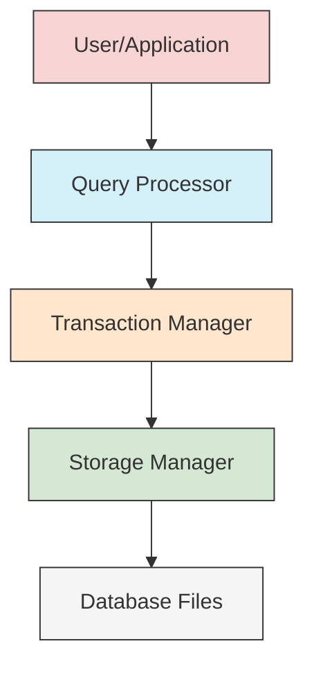
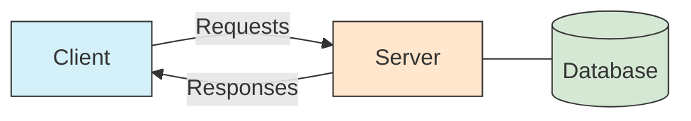
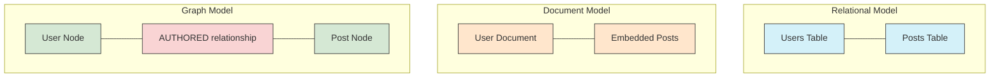
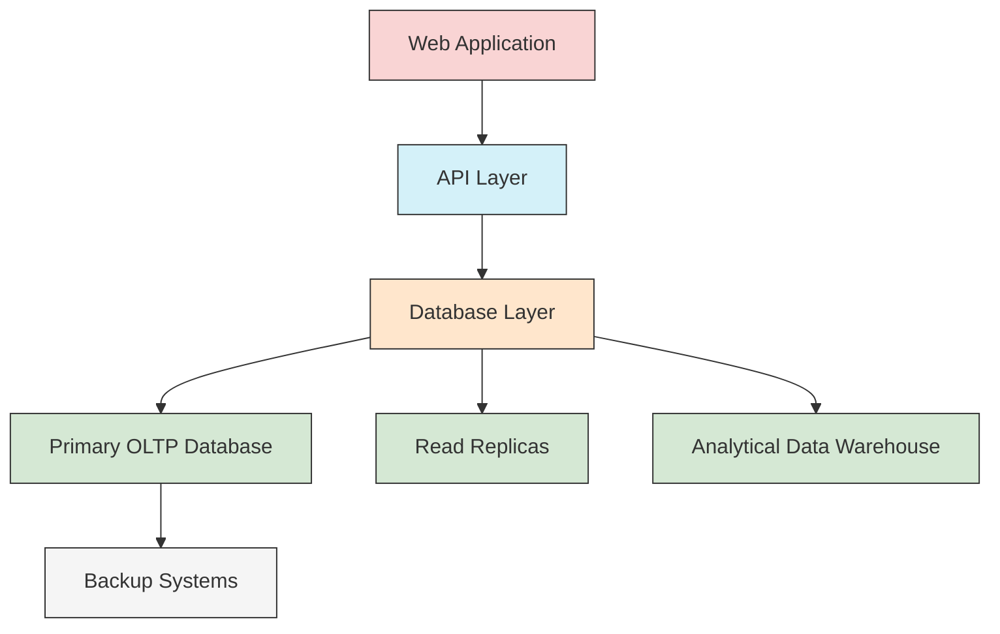

# Database Architecture

## Introduction

Database architecture forms the foundation of how data is stored, organized, and accessed in modern applications. It's like the blueprint for your data house - determining how sturdy, flexible, and efficient your data storage will be. Understanding database architecture is crucial for anyone looking to work with data systems, whether you're building a simple mobile app or a large-scale enterprise solution.

In this guide, we'll explore the core components of database architecture, different architectural models, and how these concepts apply to real-world scenarios. By the end, you'll have a solid understanding of how databases are structured and the considerations that go into designing them.

## Core Components of Database Architecture

Database architecture typically consists of three main levels:

1. **External Level** (User View): How end-users see and interact with the data
2. **Conceptual Level** (Logical View): The logical structure that defines relationships
3. **Internal Level** (Physical View): How data is physically stored on disk

Let's visualize these layers with a diagram:



### Example: Three-Level Architecture in Practice

Imagine a banking application:

- **External Level**: Customer views their account balance and transactions
- **Conceptual Level**: The system understands relationships between accounts, customers, and transactions
- **Internal Level**: Data is stored in optimized formats with indexes for quick retrieval

## Database Management System (DBMS) Architecture

The DBMS is the software that manages the database. Its architecture includes several key components:

### 1. Query Processor

The query processor interprets and executes database queries.

```
User Query → Parser → Optimizer → Execution Engine → Result
```

### 2. Storage Manager

Handles how data is physically stored and retrieved.

### 3. Transaction Manager

Ensures that transactions maintain database integrity.

Let's look at how these components interact:



## Common Database Architecture Models

### 1. Centralized Architecture

All database components reside on a single system.

**Pros**: Simple to manage
**Cons**: Limited scalability, single point of failure

### 2. Client-Server Architecture

Database server handles storage and query processing, while clients request services.



### 3. Distributed Architecture

Data is stored across multiple physical locations.

**Pros**: High availability, scalability
**Cons**: Complex to manage, potential consistency issues

## Schema Design in Database Architecture

A database schema is the blueprint that defines the structure, relationships, and constraints of your database.

### Example: Creating a Simple Schema

Here's how you might define a simple database schema for a blog:

```sql
CREATE TABLE Users (
    user_id INT PRIMARY KEY,
    username VARCHAR(50) UNIQUE NOT NULL,
    email VARCHAR(100) UNIQUE NOT NULL,
    created_at TIMESTAMP DEFAULT CURRENT_TIMESTAMP
);

CREATE TABLE Posts (
    post_id INT PRIMARY KEY,
    user_id INT,
    title VARCHAR(200) NOT NULL,
    content TEXT,
    published_at TIMESTAMP,
    FOREIGN KEY (user_id) REFERENCES Users(user_id)
);
```

The schema above establishes:
- A Users table to store user information
- A Posts table for blog posts
- A relationship between users and posts (one user can have many posts)

## Data Models in Database Architecture

Data models define how data is structured and related. Let's explore the most common ones:

### 1. Relational Model

Data is organized into tables with rows and columns, with relationships defined by keys.

**Example**: MySQL, PostgreSQL, SQL Server

### 2. Document Model

Data is stored in flexible, semi-structured documents, usually in JSON or BSON format.

**Example**: MongoDB, CouchDB

```javascript
// Example document in MongoDB
{
  "_id": ObjectId("60a2f042c0d6e426a4fc9215"),
  "username": "jane_doe",
  "email": "jane@example.com",
  "posts": [
    {
      "title": "Getting Started with Databases",
      "content": "Here's how to get started...",
      "published_at": ISODate("2023-05-15T10:30:00Z")
    }
  ]
}
```

### 3. Key-Value Model

Data is stored as simple key-value pairs.

**Example**: Redis, DynamoDB

```
SET user:1:username "john_smith"
SET user:1:email "john@example.com"
```

### 4. Graph Model

Data and relationships are represented as nodes and edges in a graph.

**Example**: Neo4j, Amazon Neptune

Let's visualize the differences:



## Physical Database Architecture

Physical database architecture deals with how data is actually stored on disk and accessed.

### Storage Structures

1. **Files**: Raw data files organized in specific formats
2. **Indexes**: Additional structures to speed up data retrieval
3. **Partitions**: Breaking large tables into smaller, more manageable pieces

### Example: Creating an Index for Performance

```sql
-- Creating an index on the email column to speed up user lookups
CREATE INDEX idx_user_email ON Users(email);
```

Before index:
```
Query: SELECT * FROM Users WHERE email = 'jane@example.com'
Execution: Full table scan (checks every row) - Slow for large tables
```

After index:
```
Query: SELECT * FROM Users WHERE email = 'jane@example.com'
Execution: Index lookup (directly finds matching rows) - Much faster
```

## Database Architecture Patterns

### 1. OLTP (Online Transaction Processing)

Optimized for day-to-day operational tasks with many small transactions.

**Example**: Banking system processing deposits and withdrawals

### 2. OLAP (Online Analytical Processing)

Optimized for complex analytical queries across large datasets.

**Example**: Business intelligence dashboard analyzing sales trends

### 3. Hybrid (HTAP - Hybrid Transaction/Analytical Processing)

Combines elements of both OLTP and OLAP.

## Real-World Database Architecture Example

Let's examine how an e-commerce platform might structure its database architecture:



In this architecture:
- OLTP database handles customer orders and inventory updates
- Read replicas provide scalability for read-heavy operations
- Data warehouse enables complex analytics without impacting operational systems

## Implementing a Simple Database Architecture

Let's walk through setting up a simple database architecture using SQLite for a to-do list application:

```javascript
// Example: Creating a to-do list database using Node.js and SQLite

const sqlite3 = require('sqlite3').verbose();

// Open database connection
const db = new sqlite3.Database('./todo.db', (err) => {
  if (err) {
    console.error('Error opening database', err.message);
  } else {
    console.log('Connected to the SQLite database');
    
    // Create tables
    db.run(`
      CREATE TABLE IF NOT EXISTS users (
        id INTEGER PRIMARY KEY AUTOINCREMENT,
        username TEXT UNIQUE NOT NULL,
        email TEXT UNIQUE NOT NULL
      )
    `);
    
    db.run(`
      CREATE TABLE IF NOT EXISTS tasks (
        id INTEGER PRIMARY KEY AUTOINCREMENT,
        user_id INTEGER NOT NULL,
        title TEXT NOT NULL,
        description TEXT,
        due_date TEXT,
        completed INTEGER DEFAULT 0,
        FOREIGN KEY (user_id) REFERENCES users (id)
      )
    `);
  }
});

// Example: Adding a user
function addUser(username, email) {
  const sql = `INSERT INTO users (username, email) VALUES (?, ?)`;
  db.run(sql, [username, email], function(err) {
    if (err) {
      return console.error('Error adding user:', err.message);
    }
    console.log(`User added with ID: ${this.lastID}`);
  });
}

// Example: Adding a task
function addTask(userId, title, description, dueDate) {
  const sql = `INSERT INTO tasks (user_id, title, description, due_date) 
               VALUES (?, ?, ?, ?)`;
  db.run(sql, [userId, title, description, dueDate], function(err) {
    if (err) {
      return console.error('Error adding task:', err.message);
    }
    console.log(`Task added with ID: ${this.lastID}`);
  });
}

// Close connection when done
// db.close();
```

## Scalability Considerations in Database Architecture

As your application grows, your database architecture needs to scale accordingly:

### 1. Vertical Scaling (Scaling Up)

Adding more resources (CPU, RAM) to your existing database server.

**Pros**: Simple, no application changes needed
**Cons**: Hardware limits, potential downtime during upgrades

### 2. Horizontal Scaling (Scaling Out)

Adding more database servers to distribute the load.

**Pros**: Nearly unlimited scalability, high availability
**Cons**: More complex to implement and manage

### Example: Implementing Connection Pooling

Connection pooling is a technique to efficiently manage database connections:

```javascript
// Example: Connection pooling in Node.js with pg-pool
const { Pool } = require('pg');

const pool = new Pool({
  user: 'dbuser',
  host: 'database.server.com',
  database: 'myapp',
  password: 'secretpassword',
  port: 5432,
  max: 20, // Maximum connections in the pool
  idleTimeoutMillis: 30000 // Connection timeout
});

// Using the pool for queries
async function getUserById(id) {
  const client = await pool.connect();
  try {
    const result = await client.query('SELECT * FROM users WHERE id = $1', [id]);
    return result.rows[0];
  } finally {
    client.release(); // Return connection to the pool
  }
}
```

## Security in Database Architecture

Security is a critical aspect of database architecture:

1. **Authentication**: Verifying user identity
2. **Authorization**: Controlling access to resources
3. **Encryption**: Protecting sensitive data
4. **Auditing**: Tracking who did what and when

### Example: Implementing Role-Based Access Control

```sql
-- Create roles
CREATE ROLE readonly;
CREATE ROLE readwrite;

-- Grant permissions
GRANT SELECT ON ALL TABLES IN SCHEMA public TO readonly;
GRANT SELECT, INSERT, UPDATE, DELETE ON ALL TABLES IN SCHEMA public TO readwrite;

-- Create users and assign roles
CREATE USER analyst WITH PASSWORD 'secure_password';
GRANT readonly TO analyst;

CREATE USER app_user WITH PASSWORD 'very_secure_password';
GRANT readwrite TO app_user;
```

## Disaster Recovery Planning

Every robust database architecture needs a disaster recovery plan:

1. **Backups**: Regular data backups (full and incremental)
2. **Replication**: Maintaining duplicate copies of your database
3. **Point-in-Time Recovery**: Ability to restore to a specific moment

### Example: Setting Up Automated Backups

```bash
# Example: Automated PostgreSQL backup script (Linux/Unix)
#!/bin/bash

DB_NAME="myapp"
BACKUP_DIR="/var/backups/postgres"
DATE=$(date +%Y-%m-%d_%H-%M-%S)
FILENAME="${BACKUP_DIR}/${DB_NAME}_${DATE}.sql"

# Create backup
pg_dump -U postgres $DB_NAME > $FILENAME

# Compress backup
gzip $FILENAME

# Delete backups older than 30 days
find $BACKUP_DIR -name "${DB_NAME}_*.sql.gz" -mtime +30 -delete
```

## Summary

Database architecture is a multifaceted discipline that encompasses how data is organized, stored, and accessed. We've covered:

- The three levels of database architecture (external, conceptual, internal)
- Common database architecture models and patterns
- Data models (relational, document, key-value, graph)
- Physical storage considerations
- Performance optimization techniques
- Scalability strategies
- Security implementation
- Disaster recovery planning

Understanding these concepts will give you a solid foundation for making informed decisions when designing and implementing database systems for your applications.

## Exercises and Practice Activities

1. **Design Exercise**: Create a database schema for a library management system.
2. **Implementation Exercise**: Set up a simple database with tables, relationships, and indexes using SQLite or PostgreSQL.
3. **Performance Exercise**: Create and compare the performance of queries with and without appropriate indexes.
4. **Architecture Decision**: For a social media application, decide which database model would be most appropriate and justify your choice.
5. **Scaling Plan**: Design a scalability strategy for a database that needs to handle increasing load.

## Additional Resources

- **Books**:
  - "Database System Concepts" by Silberschatz, Korth, and Sudarshan
  - "Designing Data-Intensive Applications" by Martin Kleppmann

- **Online Courses**:
  - Stanford's "Introduction to Databases"
  - MIT OpenCourseWare's "Database Systems"

- **Documentation**:
  - PostgreSQL official documentation
  - MongoDB manual
  - Redis documentation

Remember that database architecture is not just a theoretical concept but a practical discipline that requires hands-on experience. The best way to learn is by building real systems and solving real problems.