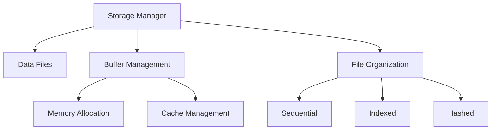
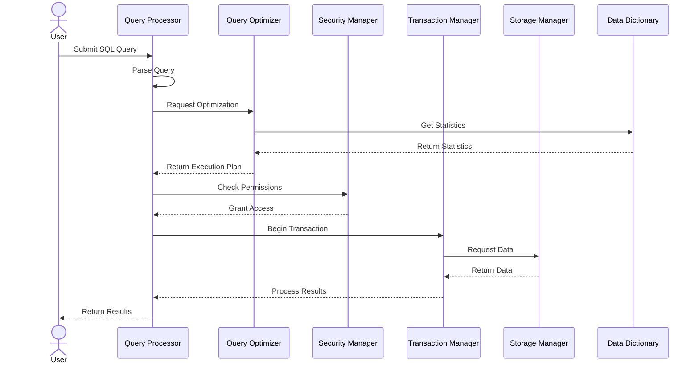

# DBMS Components

## Introduction

A Database Management System (DBMS) is sophisticated software designed to create, manage, and interact with databases. Understanding the components of a DBMS is crucial for anyone looking to work with databases effectively. In this tutorial, we'll break down the key components that make up a DBMS and explain how they work together to provide efficient data management capabilities.

Think of a DBMS as a complex machine with multiple parts working in harmony - each component has a specific responsibility, and together they ensure that data is stored securely, accessed efficiently, and manipulated effectively.

## Core DBMS Components

Let's explore the essential components that form the architecture of a modern DBMS:

### 1. Query Processor

The query processor is the component responsible for interpreting and executing database queries. When you run a SQL statement, the query processor takes that instruction and determines the most efficient way to retrieve or modify the requested data.

The query processor typically consists of:

- **Query Parser**: Validates syntax and converts SQL statements into an internal format
- **Query Optimizer**: Determines the most efficient execution plan
- **Query Executor**: Carries out the execution plan to retrieve or modify data

For example, when you execute a simple query:

```sql
SELECT first_name, last_name FROM customers WHERE city = 'New York';
```

The query processor:
1. Validates the SQL syntax
2. Determines the best way to access the data (using indexes, table scans, etc.)
3. Executes the plan and returns the results

### 2. Storage Manager

The storage manager handles the physical storage of data on disk. It's responsible for:

- **Data Files**: Managing how data is physically stored on disk
- **Buffer Management**: Controlling memory usage for efficient data access
- **File Organization**: Determining how records are arranged within files

For instance, when a database is created, the storage manager allocates space and organizes the database structure on disk. When data is inserted, updated, or deleted, the storage manager handles the physical modifications to the data files.



### 3. Transaction Manager

The transaction manager ensures that database transactions are processed reliably, maintaining the ACID properties (Atomicity, Consistency, Isolation, Durability). It's responsible for:

- **Concurrency Control**: Managing multiple simultaneous user access
- **Recovery Management**: Handling system failures and restoring data integrity
- **Logging**: Recording all database changes for potential recovery

Consider this simple transaction:

```sql
BEGIN TRANSACTION;
    UPDATE accounts SET balance = balance - 500 WHERE account_id = 1001;
    UPDATE accounts SET balance = balance + 500 WHERE account_id = 1002;
COMMIT;
```

The transaction manager ensures that either both updates occur or neither occurs, preventing partial updates that could leave the database in an inconsistent state.

### 4. Data Dictionary (System Catalog)

The data dictionary, sometimes called the system catalog, is a metadata repository that stores information about:

- Database structure (tables, columns, data types)
- Constraints (primary keys, foreign keys, etc.)
- User access privileges
- Database statistics used for query optimization

Think of the data dictionary as the "database about the database." When you create a table like:

```sql
CREATE TABLE products (
    product_id INT PRIMARY KEY,
    product_name VARCHAR(100) NOT NULL,
    price DECIMAL(10,2)
);
```

Information about this table structure is stored in the data dictionary.

To view metadata in many database systems, you can use commands like:

```sql
-- In MySQL/PostgreSQL
DESCRIBE products;
-- Or
\d products
```

### 5. Query Optimizer

While part of the query processor, the query optimizer deserves special attention as it significantly impacts database performance. The optimizer:

- Analyzes SQL queries
- Evaluates multiple execution strategies
- Selects the most efficient execution plan based on statistics and cost estimates

For example, when joining multiple tables, the optimizer decides:
- The order to join tables
- Which join algorithm to use (nested loops, hash join, merge join)
- Whether to use available indexes

### 6. Security Manager

The security manager controls access to database objects by:

- Authentication: Verifying user identities
- Authorization: Enforcing access privileges
- Encryption: Protecting sensitive data

For example, granting specific permissions:

```sql
GRANT SELECT, INSERT ON customers TO user_john;
REVOKE DELETE ON customers FROM user_john;
```

The security manager ensures that user_john can only perform SELECT and INSERT operations on the customers table but cannot delete records.

## How DBMS Components Work Together

Let's walk through a simplified example of how these components interact when executing a database query:

1. User submits a SQL query to retrieve customer data
2. **Query Processor** parses and validates the query
3. **Query Optimizer** determines the best execution plan using statistics from the **Data Dictionary**
4. **Security Manager** verifies the user has permission to access the data
5. **Transaction Manager** begins a transaction (if needed)
6. **Storage Manager** accesses the physical data from disk
7. Data is processed according to the query
8. **Transaction Manager** ensures ACID properties
9. Results are returned to the user



## Practical Example: University Database System

To demonstrate how these components work in a real-world scenario, let's consider a university database system:

1. **Query Processor & Optimizer** handle a complex query joining student, course, and enrollment tables to generate class rosters.

2. **Storage Manager** organizes student records for efficient retrieval, possibly storing frequently accessed data (current students) differently than archival data (alumni).

3. **Transaction Manager** ensures that when a student registers for a course:
   - Course enrollment count increases
   - Student's schedule is updated
   - Billing system is notified
   - All changes succeed or fail together

4. **Data Dictionary** stores metadata about tables like:
   - Students (name, ID, major, etc.)
   - Courses (code, title, credits, etc.)
   - Enrollments (student ID, course ID, semester, grade)

5. **Security Manager** enforces access rules:
   - Students can view only their own records
   - Professors can view grades for their courses
   - Administrators have broader access privileges

Let's look at a sample query that might be executed during course registration:

```sql
BEGIN TRANSACTION;
    -- Check if course has available seats
    SELECT seats_available FROM courses WHERE course_id = 'CS101';
    
    -- If available, enroll student (in application logic)
    INSERT INTO enrollments (student_id, course_id, semester, status)
    VALUES (12345, 'CS101', 'Fall 2025', 'Enrolled');
    
    -- Update available seats
    UPDATE courses SET seats_available = seats_available - 1 
    WHERE course_id = 'CS101';
COMMIT;
```

The DBMS components work together to ensure this transaction is processed correctly, maintains data integrity, and is optimized for performance.

## Summary

In this tutorial, we've explored the key components that make up a Database Management System:

- **Query Processor**: Parses and executes SQL statements
- **Storage Manager**: Handles physical data storage and retrieval
- **Transaction Manager**: Ensures data integrity during transactions
- **Data Dictionary**: Stores metadata about database objects
- **Query Optimizer**: Determines efficient execution strategies
- **Security Manager**: Controls access to database resources

Understanding these components helps you grasp how databases function internally and can guide better database design and query optimization decisions. As you work with databases, remember that each component plays a crucial role in maintaining the balance between data integrity, security, and performance.

## Exercises

1. Draw a diagram showing the interaction between DBMS components when inserting new records into a table.
2. Explain how the query optimizer might handle two different approaches to the same query, and which factors would influence its decision.
3. Design a simple database schema for a library system and describe how each DBMS component would be involved in a book checkout process.
4. Research how different DBMS products (MySQL, PostgreSQL, Oracle, SQL Server) implement these components and note any significant differences.
5. Write a transaction that transfers funds between two bank accounts and explain the role of the transaction manager in maintaining data integrity.

## Additional Resources

- Database System Concepts (textbook by Silberschatz, Korth, and Sudarshan)
- [Database Fundamentals tutorial series](https://yourwebsite.com/database-fundamentals)
- [SQL Query Optimization techniques](https://yourwebsite.com/sql-optimization)
- [Understanding ACID Properties in Database Transactions](https://yourwebsite.com/acid-properties)