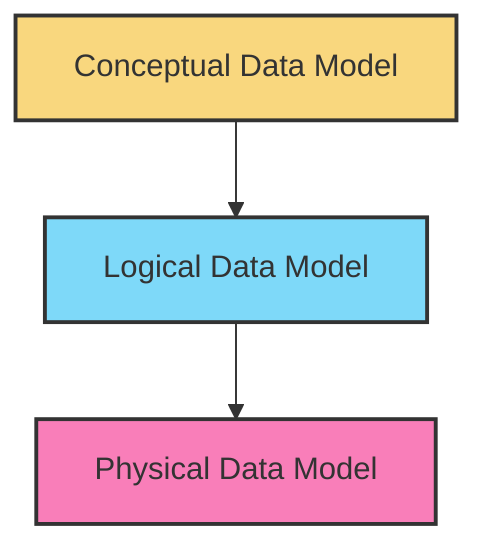
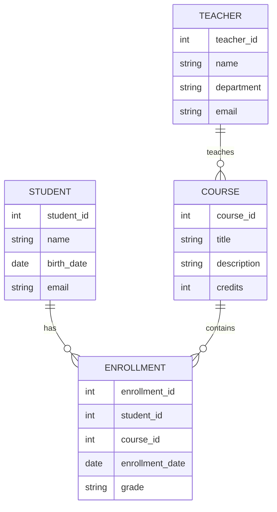
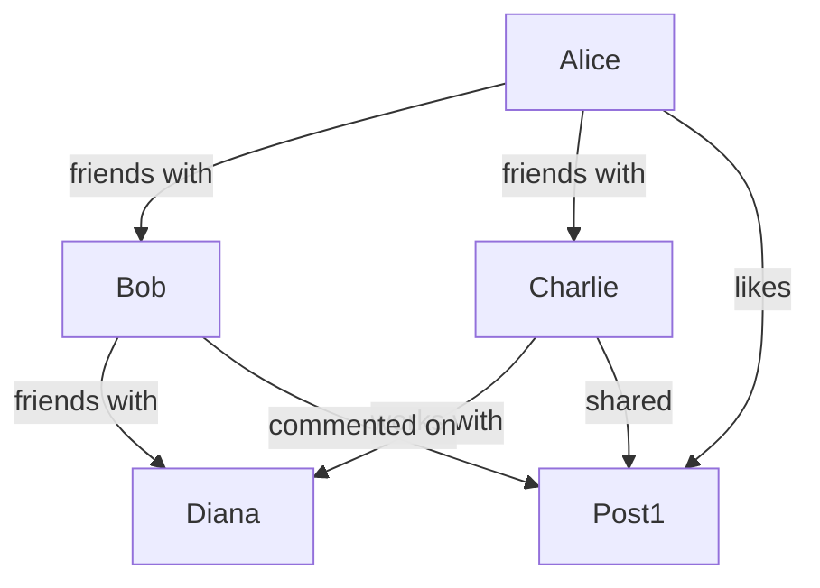

# Data Models Overview

## Introduction

Data models are the blueprint for designing and organizing data in a database system. They define how data is connected, how it can be processed and stored, and the structure of the data itself. Understanding data models is crucial for anyone working with databases as they form the foundation upon which databases are built.

A well-designed data model ensures efficiency, data integrity, and scalability in your database applications. In this guide, we'll explore the main types of data models, their characteristics, advantages, and real-world applications.

## What Are Data Models?

A data model is an abstract representation that organizes data elements and standardizes how they relate to one another. Think of it as a map that guides how data is stored and accessed.

Data models serve three key purposes:
1. They help to **conceptualize** the structure of a database
2. They provide a **blueprint** for implementing a database
3. They establish a **common vocabulary** for database designers, developers, and users

## Levels of Data Models

Data models typically exist at three different levels of abstraction:



### Conceptual Data Model

The highest level of abstraction that describes what data the system contains. This model is created by business stakeholders and data architects.

**Characteristics:**
- Represents entity classes, not specific entities
- Focuses on what data exists, not how it's processed or stored
- Independent of hardware or software constraints
- Uses simple diagrams and business language

**Example:**
A social media application might have a conceptual model showing entities like `User`, `Post`, `Comment`, and `Friend` with relationships between them.

### Logical Data Model

The middle level that describes data in as much detail as possible, without regard to how they will be implemented.

**Characteristics:**
- Derived from the conceptual model
- Includes all entities and relationships
- Specifies attributes for each entity
- Indicates primary keys, foreign keys, and constraints
- Database-agnostic (not tied to specific database systems)

**Example:**
In our social media application, a logical model would define User attributes like `user_id` (primary key), `username`, `email`, etc., and specify relationships like "User creates Post" and their cardinality.

### Physical Data Model

The lowest level of abstraction that describes how data is physically stored in a database.

**Characteristics:**
- Implementation-specific details
- Defines tables, columns, data types, and indexes
- Includes performance optimizations
- Specific to the target database system

**Example:**
The physical model for our social media application would include SQL statements to create tables, specify indexing strategies, partitioning, and other database-specific optimizations.

## Types of Data Models

Now, let's explore the main types of data models used in database systems:

### 1. Hierarchical Data Model

One of the earliest data models, organizing data in a tree-like structure.

**Characteristics:**
- Parent-child relationships (one-to-many)
- Each child has only one parent
- Top-down or bottom-up access

**Advantages:**
- Simple and intuitive structure
- Fast access to data if the hierarchy is known

**Limitations:**
- Doesn't support many-to-many relationships naturally
- Can be inefficient for complex queries
- Data redundancy issues

**Example:**
File systems are a classic example of hierarchical models, with directories containing subdirectories and files.

```
/
├── Users/
│   ├── john/
│   │   ├── documents/
│   │   └── pictures/
│   └── sarah/
└── System/
    └── Applications/
```

**Real-world usage:**
IBM's Information Management System (IMS) and XML databases often use hierarchical models.

### 2. Network Data Model

An extension of the hierarchical model that allows many-to-many relationships.

**Characteristics:**
- Records connected through links or pointers
- A child can have multiple parents
- Complex web-like structure

**Advantages:**
- More flexible than hierarchical models
- Can represent complex relationships
- Efficient for navigating connected data

**Limitations:**
- Complex implementation
- Difficult to modify structure once implemented

**Example:**
In a manufacturing database, a part can be used in multiple products, and a product can use multiple parts - a many-to-many relationship that network models handle well.

**Real-world usage:**
Integrated Database Management System (IDMS) and network databases.

### 3. Relational Data Model

The most widely used data model today, organizing data into tables (relations) with rows and columns.

**Characteristics:**
- Data stored in tables (relations)
- Tables connected through keys
- Based on relational algebra and set theory
- Adheres to ACID properties (Atomicity, Consistency, Isolation, Durability)

**Advantages:**
- Simple, intuitive structure
- Flexible query capabilities using SQL
- Data independence
- Built-in data integrity

**Limitations:**
- Can be inefficient for highly connected data
- Performance challenges with very large datasets
- Object-relational impedance mismatch

**Example:**
Let's create a simple relational model for a library database:

Table: `Books`
```
| book_id | title                   | author_id | publication_year |
|---------|-------------------------|-----------|------------------|
| 1       | To Kill a Mockingbird   | 101       | 1960             |
| 2       | 1984                    | 102       | 1949             |
| 3       | The Great Gatsby        | 103       | 1925             |
```

Table: `Authors`
```
| author_id | name           | birth_year | nationality |
|-----------|----------------|------------|-------------|
| 101       | Harper Lee     | 1926       | American    |
| 102       | George Orwell  | 1903       | British     |
| 103       | F. Scott Fitzgerald | 1896  | American    |
```

Table: `Borrowings`
```
| borrowing_id | book_id | member_id | borrow_date | return_date |
|--------------|---------|-----------|-------------|-------------|
| 1001         | 1       | 5001      | 2023-01-15  | 2023-01-30  |
| 1002         | 3       | 5002      | 2023-02-05  | 2023-02-20  |
```

**SQL Example to query books and their authors:**

```sql
SELECT b.title, a.name AS author, b.publication_year
FROM Books b
JOIN Authors a ON b.author_id = a.author_id
ORDER BY b.publication_year;
```

Output:
```
| title                 | author               | publication_year |
|-----------------------|----------------------|------------------|
| The Great Gatsby      | F. Scott Fitzgerald  | 1925             |
| 1984                  | George Orwell        | 1949             |
| To Kill a Mockingbird | Harper Lee           | 1960             |
```

**Real-world usage:**
MySQL, PostgreSQL, Oracle, SQL Server, and most enterprise database systems.

### 4. Entity-Relationship Model

A conceptual data model used in database design to represent the relationships between entities.

**Characteristics:**
- Entities (objects or concepts)
- Attributes (properties of entities)
- Relationships (connections between entities)
- Cardinality constraints (one-to-one, one-to-many, many-to-many)

**Example ER Diagram for a School Database:**



**Real-world usage:**
ER models are primarily used in the database design phase before implementing a physical database, often translated into relational database schemas.

### 5. Object-Oriented Data Model

Models data as objects, similar to object-oriented programming languages.

**Characteristics:**
- Encapsulates data and behavior
- Supports inheritance, polymorphism
- Complex objects can contain other objects
- Object identity is maintained

**Advantages:**
- Natural mapping to object-oriented programming
- Handles complex data types well
- Reduces object-relational impedance mismatch

**Limitations:**
- Less standardized than relational models
- May have performance overhead
- Typically more complex to implement

**Example (Pseudo-code):**

```javascript
class Book {
  constructor(id, title, publicationYear) {
    this.id = id;
    this.title = title;
    this.publicationYear = publicationYear;
    this.authors = [];
    this.borrowings = [];
  }
  
  addAuthor(author) {
    this.authors.push(author);
  }
  
  borrow(member, date) {
    const borrowing = new Borrowing(this, member, date);
    this.borrowings.push(borrowing);
    return borrowing;
  }
}

class Author {
  constructor(id, name, birthYear) {
    this.id = id;
    this.name = name;
    this.birthYear = birthYear;
    this.books = [];
  }
  
  writeBook(title, year) {
    const book = new Book(generateId(), title, year);
    book.addAuthor(this);
    this.books.push(book);
    return book;
  }
}
```

**Real-world usage:**
Object-oriented databases (OODBMS) like ObjectDB, db4o, and object features in databases like PostgreSQL.

### 6. Document Data Model

Stores data in document-like structures, typically in formats like JSON or BSON.

**Characteristics:**
- Schema-less design
- Hierarchical document structure
- Each document can have different fields
- Documents grouped into collections

**Advantages:**
- Flexible schema
- Intuitive data representation
- Good for heterogeneous data
- Easy horizontal scaling

**Limitations:**
- Limited support for complex transactions and joins
- Potential for data redundancy
- May require data denormalization

**Example (JSON Document):**

```json
{
  "_id": "book123",
  "title": "To Kill a Mockingbird",
  "author": {
    "name": "Harper Lee",
    "birthYear": 1926,
    "nationality": "American"
  },
  "publicationYear": 1960,
  "genres": ["Fiction", "Coming-of-age", "Southern Gothic"],
  "ratings": [
    { "user": "user1", "score": 4.5, "review": "A classic that still resonates today" },
    { "user": "user2", "score": 5.0, "review": "Powerful storytelling" }
  ],
  "available": true
}
```

**Real-world usage:**
MongoDB, Couchbase, Firebase Firestore.

### 7. Graph Data Model

Designed for data whose relationships are best represented as a graph consisting of nodes and edges.

**Characteristics:**
- Nodes represent entities
- Edges represent relationships
- Properties can be added to both nodes and edges
- Focuses on the connections between data points

**Advantages:**
- Efficient for highly connected data
- Natural representation of networks
- Powerful for relationship-centric queries
- Flexible schema

**Limitations:**
- Steeper learning curve
- Not ideal for transactional data
- Can be complex to scale for very large graphs

**Example (Social Network Graph):**



**Query example (in Cypher for Neo4j):**

```cypher
// Find friends of friends for Alice
MATCH (alice:Person {name: 'Alice'})-[:FRIENDS_WITH]->(friend)-[:FRIENDS_WITH]->(friendOfFriend)
WHERE friendOfFriend <> alice
RETURN DISTINCT friendOfFriend.name
```

**Real-world usage:**
Neo4j, Amazon Neptune, JanusGraph, and social networks, recommendation engines, fraud detection systems.

### 8. Columnar Data Model

Stores data in column-oriented rather than row-oriented format.

**Characteristics:**
- Data stored by columns rather than rows
- Optimized for analytical queries
- Highly compressible
- Efficient for reading specific columns

**Advantages:**
- Excellent for analytical processing (OLAP)
- High compression ratios
- Efficient for aggregating large datasets
- Good for parallel processing

**Limitations:**
- Less efficient for transactional processing (OLTP)
- Complex to update individual records
- Not ideal for row-oriented operations

**Example:**
Traditional row-based storage:
```
| customer_id | name  | email           | last_login         |
|-------------|-------|-----------------|---------------------|
| 1           | Alice | alice@email.com | 2023-03-15 14:30:00 |
| 2           | Bob   | bob@email.com   | 2023-03-14 09:45:00 |
| 3           | Carol | carol@email.com | 2023-03-16 11:20:00 |
```

Column-based storage (conceptually):
```
customer_id: [1, 2, 3]
name: ["Alice", "Bob", "Carol"]
email: ["alice@email.com", "bob@email.com", "carol@email.com"]
last_login: ["2023-03-15 14:30:00", "2023-03-14 09:45:00", "2023-03-16 11:20:00"]
```

**Real-world usage:**
Apache Cassandra, Apache HBase, Google BigQuery, Amazon Redshift, and data warehousing solutions.

## Choosing the Right Data Model

The choice of data model depends on several factors:

1. **Nature of your data**:
   - Is your data highly structured or unstructured?
   - How often will your schema change?

2. **Types of queries and operations**:
   - Will you perform complex joins or simple lookups?
   - Are you building an OLTP or OLAP system?

3. **Scalability requirements**:
   - How much data will you store?
   - How will your system grow over time?

4. **Development context**:
   - Are you using object-oriented programming?
   - What's your team's expertise?

5. **Industry and application type**:
   - Financial applications often use relational models for ACID compliance
   - Social networks often use graph models for relationship queries
   - IoT applications might use time-series models for sensor data

## Hybrid Approaches: Polyglot Persistence

Modern applications often use multiple data models for different parts of their data, known as polyglot persistence.

**Example:**
A social media application might use:
- Relational database (PostgreSQL) for user accounts and authentication
- Document database (MongoDB) for user-generated content
- Graph database (Neo4j) for the social network connections
- Key-value store (Redis) for caching and session management

This approach leverages the strengths of each data model for specific data requirements.

## Summary

Data models are fundamental to database design and development. They provide the structure for organizing, storing, and retrieving data efficiently. The main types of data models include:

- Hierarchical model: Tree-like parent-child structure
- Network model: Complex web-like structure with many-to-many relationships
- Relational model: Tables with rows and columns connected by keys
- Entity-Relationship model: Conceptual design approach
- Object-Oriented model: Encapsulates data and behavior as objects
- Document model: Flexible, schema-less documents
- Graph model: Focuses on relationships between entities
- Columnar model: Column-oriented storage for analytics

Understanding these models enables you to make informed decisions about database design based on your specific requirements and constraints.

## Exercises

1. **Design a Relational Schema**: Create a relational schema for a simple e-commerce system with customers, products, orders, and reviews.

2. **Document Model Practice**: Convert your relational e-commerce schema to a document model. What are the advantages and disadvantages of this approach?

3. **Model Selection**: For each of the following applications, identify the most appropriate data model and justify your choice:
   - Banking system
   - Social media platform
   - Healthcare patient records
   - Traffic routing application

4. **Hands-on Implementation**: Choose a data model and implement a simple database for a library management system using appropriate technology.

## Additional Resources

- **Books**:
  - "Database Design for Mere Mortals" by Michael J. Hernandez
  - "NoSQL Distilled" by Pramod J. Sadalage and Martin Fowler
  - "Data Modeling Made Simple" by Steve Hoberman

- **Online Tutorials**:
  - Stanford's Database Course
  - MongoDB University
  - Neo4j Graph Academy

- **Communities**:
  - Stack Overflow's Database Administrators community
  - Reddit's r/DatabaseHelp
  - Database Professionals on LinkedIn

By understanding these different data models, you'll be better equipped to choose the right approach for your specific database needs and build more efficient, scalable applications.