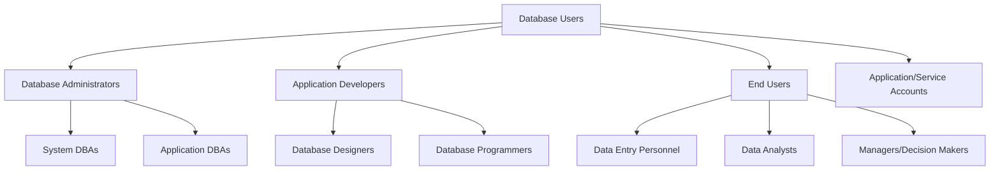
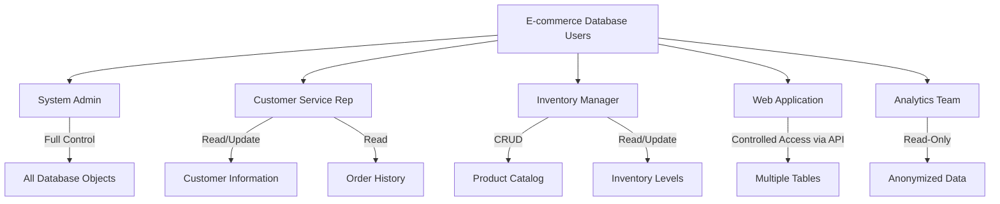

# Database Users

## Introduction

Database systems are designed to be accessed by multiple individuals or applications, each with different needs and responsibilities. Understanding who accesses your database and how to manage their permissions is crucial for maintaining both functionality and security. This guide explores the concept of database users, their roles, and how to effectively manage database access.

## What Are Database Users?

Database users are accounts that can connect to and interact with a database system. Each user account:

- Has a unique identifier (username)
- Requires authentication (typically a password)
- Is granted specific permissions for database operations
- Can be associated with roles or groups for easier management

Think of database users like employees in a company - each has an ID card (username), a PIN code (password), and permissions to access certain rooms (database objects) based on their job role.

## Types of Database Users

Database systems typically involve several categories of users:



### 1. Database Administrators (DBAs)

DBAs have the highest level of privileges and are responsible for:

- Creating and managing database objects
- Managing user accounts and permissions
- Monitoring performance and tuning
- Implementing backup and recovery strategies
- Ensuring database security

**Example DBA tasks:**

```sql
-- Creating a new user
CREATE USER john_smith WITH PASSWORD 'secure_password123';

-- Granting administrative privileges
GRANT ALL PRIVILEGES ON DATABASE customer_data TO john_smith;

-- Revoking access
REVOKE ALL PRIVILEGES ON TABLE sensitive_info FROM outdated_user;
```

### 2. Application Developers

Developers need access to design, build, and test database components:

- Creating and modifying database schemas
- Writing and optimizing queries
- Building stored procedures and functions
- Testing database operations

During development, they typically need wider access, but this should be restricted in production environments.

### 3. End Users

These are the individuals who interact with the database through applications:

- Data entry personnel who create and update records
- Analysts who query data and create reports
- Managers who view summarized information for decision-making

End users rarely interact with the database directly - they usually access it through applications with predefined operations.

### 4. Application/Service Accounts

These are non-human users that applications use to connect to databases:

- Web applications
- Mobile apps
- Batch processing systems
- Integration services

**Example connection string in a Node.js application:**

```javascript
const connection = mysql.createConnection({
  host: 'localhost',
  user: 'webapp_service_account',
  password: 'app_specific_password',
  database: 'customer_portal'
});
```

## Database Access Control

### Authentication vs. Authorization

There are two key aspects to database security:

1. **Authentication**: Verifying the identity of a user (Who are you?)
2. **Authorization**: Determining what actions a user can perform (What can you do?)

### Privileges and Permissions

Database systems use granular permissions to control what users can do:

| Permission Type | Examples |
|----------------|----------|
| Object privileges | SELECT, INSERT, UPDATE, DELETE, EXECUTE |
| System privileges | CREATE USER, CREATE TABLE, CREATE VIEW |
| Role assignment | Assign predefined sets of permissions |

**Example of granting specific permissions:**

```sql
-- Grant read-only access to a specific table
GRANT SELECT ON customer_info TO reporting_user;

-- Grant ability to modify data but not structure
GRANT SELECT, INSERT, UPDATE, DELETE ON product_catalog TO inventory_manager;

-- Grant ability to execute a specific stored procedure
GRANT EXECUTE ON calculate_statistics TO analyst_role;
```

## Role-Based Access Control (RBAC)

Rather than assigning permissions directly to users, modern database systems use roles:

1. Create roles that represent job functions
2. Assign appropriate permissions to each role
3. Assign users to roles

This approach makes permission management more scalable and maintainable.

**Example of role-based access implementation:**

```sql
-- Create a role
CREATE ROLE reporting_staff;

-- Assign permissions to the role
GRANT SELECT ON schema_analytics.* TO reporting_staff;
GRANT EXECUTE ON PROCEDURE generate_monthly_report TO reporting_staff;

-- Assign users to the role
GRANT reporting_staff TO sarah, james, marketing_team;
```

## Best Practices for Database User Management

### 1. Principle of Least Privilege

Only grant users the minimum permissions they need to perform their specific tasks. This limits potential damage from compromised accounts or insider threats.

### 2. Regular Access Reviews

Periodically review user access rights to ensure they align with current job responsibilities. Remove permissions when they're no longer needed.

```sql
-- Query to review user permissions (PostgreSQL example)
SELECT grantee, table_schema, table_name, privilege_type
FROM information_schema.table_privileges
WHERE grantee = 'specific_user';
```

### 3. Strong Password Policies

Enforce strong passwords and regular password rotation for database accounts.

```sql
-- Setting password policies (Oracle example)
ALTER PROFILE default LIMIT
  PASSWORD_LIFE_TIME 90
  FAILED_LOGIN_ATTEMPTS 5
  PASSWORD_LOCK_TIME 1/24
  PASSWORD_VERIFY_FUNCTION verify_function;
```

### 4. Use Connection Pooling

For application access, implement connection pooling to reuse database connections rather than creating new ones for each user action.

```javascript
// Example using a connection pool in Node.js
const pool = mysql.createPool({
  host: 'localhost',
  user: 'app_service_account',
  password: 'secure_service_password',
  database: 'product_database',
  connectionLimit: 10
});

// Get a connection from the pool
pool.getConnection((err, connection) => {
  if (err) throw err;
  
  // Use the connection
  connection.query('SELECT * FROM products', (error, results) => {
    // Release the connection back to the pool
    connection.release();
    
    if (error) throw error;
    console.log(results);
  });
});
```

### 5. Separate Database Environments

Maintain separate database environments with different access controls:

- Development: More permissive for testing
- Testing/QA: Mimics production permissions with test data
- Production: Strictest permissions with real data

### 6. Monitor Database Activity

Implement auditing to track who is accessing what data and when:

```sql
-- Enable auditing (SQL Server example)
CREATE SERVER AUDIT DataAccessAudit
TO FILE (FILEPATH = 'C:\AuditLogs\');

CREATE DATABASE AUDIT SPECIFICATION CustomerDataAudit
FOR SERVER AUDIT DataAccessAudit
ADD (SELECT, UPDATE, INSERT, DELETE ON Customer.CustomerInfo BY public);
```

## Real-World Application: E-commerce Database

Let's examine how user roles might be set up in an e-commerce database:



### Implementation Example:

```sql
-- Create user roles
CREATE ROLE system_admin;
CREATE ROLE customer_service;
CREATE ROLE inventory_manager;
CREATE ROLE web_application;
CREATE ROLE analytics;

-- Grant permissions to roles
GRANT ALL PRIVILEGES ON DATABASE ecommerce TO system_admin;

GRANT SELECT, UPDATE ON customers TO customer_service;
GRANT SELECT ON orders TO customer_service;

GRANT SELECT, INSERT, UPDATE, DELETE ON products TO inventory_manager;
GRANT SELECT, UPDATE ON inventory TO inventory_manager;

-- Application permissions through stored procedures
GRANT EXECUTE ON PROCEDURE create_order TO web_application;
GRANT EXECUTE ON PROCEDURE update_customer TO web_application;
GRANT EXECUTE ON PROCEDURE check_inventory TO web_application;

-- Analytics with access to anonymized views
GRANT SELECT ON anonymized_sales_data TO analytics;
GRANT SELECT ON product_performance TO analytics;

-- Assign users to roles
GRANT system_admin TO jane_tech_lead;
GRANT customer_service TO support_team;
GRANT inventory_manager TO warehouse_staff;
GRANT web_application TO ecommerce_app_service;
GRANT analytics TO data_science_team;
```

## Common Issues and Troubleshooting

### Permission Errors

If a user encounters "permission denied" errors:

1. Verify the user has explicit permissions for the operation
2. Check if the user is assigned to the correct roles
3. Ensure the user is connecting to the correct database

**Debugging permissions (PostgreSQL example):**

```sql
-- Check granted permissions
SELECT table_catalog, table_schema, table_name, privilege_type
FROM information_schema.table_privileges
WHERE grantee = 'problem_user';

-- Check role membership
SELECT r.rolname, m.member, m.grantor, m.admin_option
FROM pg_auth_members m
JOIN pg_roles r ON m.roleid = r.oid
JOIN pg_roles u ON m.member = u.oid
WHERE u.rolname = 'problem_user';
```

### Connection Issues

If users can't connect to the database:

1. Verify authentication details (username/password)
2. Check network access and firewall rules
3. Ensure the database server is running
4. Verify the user's account isn't locked

## Summary

Database users are the gateway to your data, making proper user management essential for both security and functionality. By understanding the different types of users, implementing role-based access control, and following security best practices, you can build a robust and secure database system.

Remember these key points:
- Different users need different levels of access
- Use roles to group permissions
- Follow the principle of least privilege
- Regularly audit and review permissions
- Monitor database activity
- Use strong authentication mechanisms

## Exercises

1. **User Creation Exercise**: Write SQL commands to create three users with different permission levels: an administrator, a read-only analyst, and an application service account.

2. **Role Design Challenge**: Design an appropriate role structure for a healthcare database that needs to protect patient privacy while allowing doctors, nurses, billing staff, and researchers appropriate access.

3. **Security Audit**: Write a SQL query that would help you identify which users have DELETE permissions on important tables in your database.

4. **Permissions Troubleshooting**: A user reports they can SELECT from a table but not INSERT. List the steps you would take to diagnose and resolve this issue.

## Additional Resources

- [PostgreSQL Documentation on User Management](https://www.postgresql.org/docs/current/user-manag.html)
- [MySQL User and Privilege System](https://dev.mysql.com/doc/refman/8.0/en/access-control.html)
- [SQL Server Security Documentation](https://docs.microsoft.com/en-us/sql/relational-databases/security/security-center-for-sql-server-database-engine-and-azure-sql-database)
- [OWASP Database Security Cheat Sheet](https://cheatsheetseries.owasp.org/cheatsheets/Database_Security_Cheat_Sheet.html)