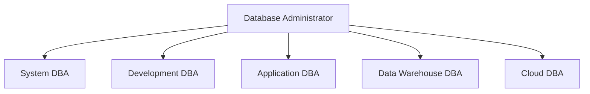

# Database Administrator Roles

## Introduction

Database Administrators (DBAs) play a crucial role in any organization that relies on data for its operations. They are the guardians of an organization's most valuable asset: its data. As businesses increasingly depend on data-driven decision making, the role of a DBA has become more critical than ever.

This guide explores the various responsibilities and specializations within the database administration field, helping beginners understand what DBAs do and why their role is essential in modern IT environments.

## Core Responsibilities of a DBA

Database Administrators shoulder a wide range of responsibilities that ensure databases operate efficiently, securely, and reliably. Let's explore these core duties:

### 1. Database Design and Implementation

DBAs are often involved in the initial design phase of databases. They work closely with stakeholders to:

- Translate business requirements into database structures
- Design efficient schema with properly related tables
- Implement appropriate indexing strategies
- Choose the right database management system (DBMS) for the task

```sql
-- Example of a schema design a DBA might create
CREATE TABLE customers (
    customer_id INT PRIMARY KEY,
    first_name VARCHAR(50) NOT NULL,
    last_name VARCHAR(50) NOT NULL,
    email VARCHAR(100) UNIQUE NOT NULL,
    created_at TIMESTAMP DEFAULT CURRENT_TIMESTAMP
);

CREATE TABLE orders (
    order_id INT PRIMARY KEY,
    customer_id INT NOT NULL,
    order_date DATE NOT NULL,
    total_amount DECIMAL(10,2) NOT NULL,
    FOREIGN KEY (customer_id) REFERENCES customers(customer_id)
);

-- Creating an index to improve query performance
CREATE INDEX idx_customer_email ON customers(email);
```

### 2. Performance Monitoring and Optimization

One of the most critical responsibilities of a DBA is ensuring optimal database performance:

- Monitoring query execution times
- Identifying and resolving bottlenecks
- Optimizing slow-running queries
- Implementing proper indexing strategies
- Configuring database parameters for optimal performance

```sql
-- Example of a query a DBA might use to identify slow queries
SELECT query, 
       calls, 
       total_time, 
       min_time, 
       max_time, 
       mean_time, 
       rows
FROM pg_stat_statements
ORDER BY total_time DESC
LIMIT 10;
```

### 3. Security Management

DBAs are the frontline defenders of an organization's data:

- Managing user access and permissions
- Implementing authentication mechanisms
- Auditing database access
- Ensuring compliance with data protection regulations
- Implementing encryption for sensitive data

```sql
-- Example of granting specific permissions to users
CREATE ROLE reporting_users;
GRANT SELECT ON sales_data TO reporting_users;

CREATE USER analyst1 WITH PASSWORD 'secure_password';
GRANT reporting_users TO analyst1;

-- Restricting access to sensitive columns
CREATE VIEW customer_safe AS
SELECT customer_id, first_name, last_name 
FROM customers;
-- Note: email and other sensitive data are excluded

GRANT SELECT ON customer_safe TO reporting_users;
```

### 4. Backup and Recovery

Data loss can be catastrophic for businesses. DBAs implement:

- Regular backup schedules
- Multiple backup strategies (full, differential, incremental)
- Testing of restoration procedures
- Disaster recovery planning
- Point-in-time recovery capabilities

```bash
# Example of a PostgreSQL backup script a DBA might create
#!/bin/bash
DATE=$(date +%Y-%m-%d_%H-%M-%S)
pg_dump -U postgres -d customer_database -F c -f /backup/customer_db_$DATE.backup

# Keep only the last 30 daily backups
find /backup/ -name "customer_db_*" -type f -mtime +30 -delete
```

### 5. Database Upgrades and Migrations

As technology evolves, databases need to be updated or migrated:

- Planning version upgrades
- Testing upgrades in non-production environments
- Developing migration strategies
- Minimizing downtime during transitions
- Ensuring data integrity throughout the process

## Types of Database Administrator Roles

As organizations grow and technology becomes more complex, the DBA role has evolved into several specialized positions:



### System DBA

System DBAs focus on the physical aspects of database administration:

- Installing and configuring DBMS software
- Managing database servers
- Planning capacity and growth
- Monitoring system health
- Performance tuning at the server level

### Development DBA

Development DBAs work closely with application developers:

- Designing database schemas
- Optimizing SQL queries
- Creating stored procedures and functions
- Supporting developers with database-related questions
- Implementing database changes for new features

### Application DBA

Application DBAs specialize in specific applications that use databases:

- Supporting particular enterprise applications (e.g., SAP, Oracle E-Business Suite)
- Understanding application-specific database requirements
- Troubleshooting application-database interaction issues
- Implementing application patches and upgrades that affect the database

### Data Warehouse DBA

Data Warehouse DBAs focus on analytical database systems:

- Managing large-scale data warehouses
- Optimizing for complex analytical queries
- Implementing ETL (Extract, Transform, Load) processes
- Supporting business intelligence and reporting needs
- Handling big data technologies

### Cloud DBA

With the shift to cloud computing, Cloud DBAs have emerged:

- Managing cloud-based database services
- Implementing database-as-a-service (DBaaS) solutions
- Optimizing for cloud environments
- Managing costs of cloud database resources
- Implementing hybrid cloud strategies

## A Day in the Life of a DBA

To better understand what a DBA does, let's walk through a typical day:

8:00 AM - **Morning Checks**:
- Review overnight backup logs
- Check automated monitoring alerts
- Verify database system health

9:00 AM - **Proactive Tasks**:
- Review performance trends
- Implement planned optimizations
- Work on documentation updates

11:00 AM - **Development Support**:
- Attend sprint planning meeting
- Review database change requests
- Consult on schema design for a new feature

```sql
-- Example of reviewing and optimizing a developer's query
-- Original developer query
SELECT * FROM orders WHERE customer_id IN 
  (SELECT customer_id FROM customers WHERE state = 'California');

-- DBA optimized version
SELECT o.* 
FROM orders o
JOIN customers c ON o.customer_id = c.customer_id
WHERE c.state = 'California';
```

1:00 PM - **Administrative Tasks**:
- Apply security patches
- Update user access permissions
- Implement new backup policy

3:00 PM - **Troubleshooting**:
- Investigate performance issue reported by users
- Fix database connectivity problem
- Resolve data discrepancy issue

4:30 PM - **Planning and Communication**:
- Update team on completed tasks
- Document changes made during the day
- Plan next day's activities

## Essential Skills for Database Administrators

To succeed as a DBA, several key skills are necessary:

### Technical Skills

- Proficiency in SQL and database concepts
- Knowledge of specific DBMS technologies (Oracle, SQL Server, PostgreSQL, etc.)
- Understanding of operating systems
- Backup and recovery techniques
- Performance tuning methodologies
- Security best practices

### Soft Skills

- Problem-solving abilities
- Communication skills for explaining technical concepts
- Time management for balancing reactive and proactive tasks
- Attention to detail
- Ability to work under pressure during critical incidents
- Continuous learning attitude to keep up with evolving technologies

## Career Path and Growth

The DBA career path offers multiple growth opportunities:

1. **Junior DBA**: Learning fundamentals and assisting senior DBAs
2. **Database Administrator**: Taking on independent responsibilities
3. **Senior DBA**: Leading database initiatives and mentoring junior staff
4. **Database Architect**: Designing enterprise-wide database strategies
5. **Data Management Director**: Overseeing all aspects of an organization's data management

Alternative paths include specializing in:
- Data engineering
- Cloud architecture
- Database security
- DataOps / DevOps

## Real-World Example: E-Commerce Database Administration

To illustrate a practical application, let's consider how a DBA supports an e-commerce platform:

### Scenario: Black Friday Sale Preparation

An online retailer is preparing for Black Friday, the busiest shopping day of the year. The DBA team takes the following steps:

1. **Performance Analysis**:
   - Review previous year's database performance during peak loads
   - Identify potential bottlenecks in customer checkout processes

2. **Capacity Planning**:
   - Calculate expected transaction volume increase
   - Provision additional database resources as needed

```sql
-- Query to identify potential bottlenecks from last year
SELECT 
    substring(query, 1, 50) as query_snippet,
    count(*) as execution_count,
    avg(total_exec_time) as avg_exec_time,
    sum(total_exec_time) as total_time
FROM pg_stat_statements
WHERE query ILIKE '%order%' 
  AND query ILIKE '%insert%'
  AND calls > 100
GROUP BY query_snippet
ORDER BY total_time DESC
LIMIT 10;
```

3. **Query Optimization**:
   - Tune product search queries for faster results
   - Optimize checkout transaction procedures

4. **Redundancy Planning**:
   - Implement read replicas to distribute query load
   - Configure standby servers for failover

5. **Monitoring Setup**:
   - Create custom dashboards for real-time traffic monitoring
   - Set up alerts for critical performance thresholds

6. **Emergency Response**:
   - Develop specific procedures for database issues during the sale
   - Schedule additional DBA coverage during peak hours

This preparation ensures the database can handle the extreme load while maintaining system reliability and customer satisfaction.

## Summary

Database Administrators play a vital role in modern organizations by ensuring that data systems are reliable, performant, and secure. The role encompasses a wide range of responsibilities from technical database management to strategic planning and communication with stakeholders.

As databases continue to evolve with cloud technologies, big data, and automation, the DBA role is transforming as well. However, the core mission remains the same: protecting and optimizing an organization's most valuable asset—its data.

## Additional Resources

For those interested in learning more about database administration:

- Practice with free database systems like PostgreSQL or MySQL
- Learn SQL fundamentals thoroughly
- Explore database monitoring and performance tuning concepts
- Study backup and recovery strategies
- Understand data security principles

## Exercises

1. Install a local instance of PostgreSQL or MySQL and create a simple database schema with at least three related tables.

2. Write queries to insert, update, and delete data from your database, and practice optimizing these queries.

3. Set up a backup script that creates daily backups of your test database.

4. Create users with different permission levels and test how they can interact with your database.

5. Simulate a database failure and practice recovering your data from a backup.