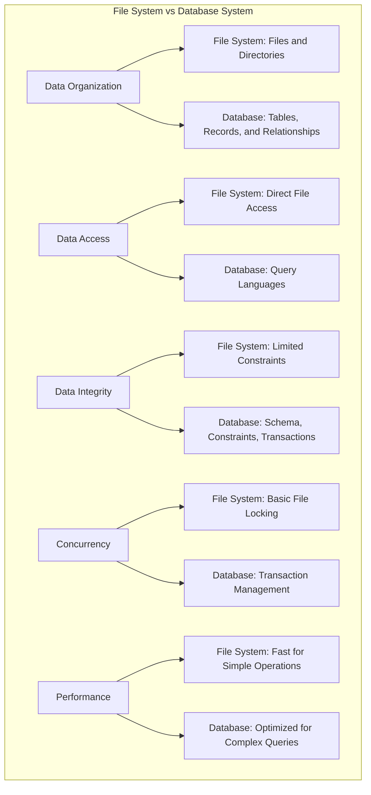

# File System vs Database System

## Introduction

When developing applications that need to store and retrieve data, one of the first architectural decisions you'll face is: should we use a simple file system or a database system? Both are methods for storing and organizing data, but they serve different purposes and offer different capabilities.

In this article, we'll explore the fundamental differences between file systems and database systems, understand their strengths and limitations, and learn when to choose one over the other.

## What is a File System?

A file system is a method and data structure that an operating system uses to control how data is stored and retrieved. It organizes data into files and directories (folders) on storage devices like hard drives, SSDs, or USB drives.

### Key Characteristics of File Systems

- **Structure**: Hierarchical organization with directories and files
- **Access Method**: Direct file access through file paths
- **Data Format**: Files can contain structured or unstructured data
- **Consistency**: Limited built-in data consistency mechanisms
- **Concurrency**: Limited support for multiple users accessing the same file
- **Security**: File-level permissions (read, write, execute)

### Example File Operations

Here's how you might work with files in a programming language like Python:

```python
# Writing data to a file
with open('users.txt', 'w') as file:
    file.write("1,John Doe,john@example.com
")
    file.write("2,Jane Smith,jane@example.com
")

# Reading data from a file
with open('users.txt', 'r') as file:
    for line in file:
        user_data = line.strip().split(',')
        user_id, name, email = user_data
        print(f"User: {name}, Email: {email}")
```

Output:
```
User: John Doe, Email: john@example.com
User: Jane Smith, Email: jane@example.com
```

## What is a Database System?

A database system (or database management system - DBMS) is specialized software designed to store, retrieve, define, and manage data in a structured way. It provides an interface between the data and the application programs, ensuring that data is consistently organized and remains easily accessible.

### Key Characteristics of Database Systems

- **Structure**: Organized data with predefined schema (in relational databases)
- **Access Method**: Query languages like SQL to manipulate data
- **Data Relationships**: Support for complex relationships between data
- **ACID Properties**: Atomicity, Consistency, Isolation, Durability
- **Concurrency Control**: Sophisticated mechanisms for handling multiple users
- **Security**: Fine-grained access control at various levels
- **Data Integrity**: Constraints to ensure data validity
- **Indexing**: Optimized data retrieval mechanisms

### Example Database Operations

Here's how you might perform similar operations using a SQL database:

```sql
-- Creating a table
CREATE TABLE users (
    id INT PRIMARY KEY,
    name VARCHAR(100),
    email VARCHAR(100)
);

-- Inserting data
INSERT INTO users (id, name, email) VALUES
(1, 'John Doe', 'john@example.com'),
(2, 'Jane Smith', 'jane@example.com');

-- Querying data
SELECT name, email FROM users;
```

Output:
```
name      | email
----------+------------------
John Doe  | john@example.com
Jane Smith| jane@example.com
```

## Key Differences: File System vs Database System

Let's compare these two approaches across several important dimensions:



### 1. Data Organization

**File System:**
- Data is stored in individual files
- No inherent structure beyond directories
- Each application defines its own file format
- Limited metadata (creation date, size, permissions)

**Database System:**
- Data is organized into tables with defined schemas
- Supports structured relationships between entities
- Consistent data format enforced by the database
- Rich metadata about tables, columns, relationships

### 2. Data Retrieval

**File System:**
- Application must know the exact file location
- Application is responsible for parsing file contents
- Must read entire file to find specific data
- No standardized query capabilities

**Database System:**
- Data can be accessed via standardized query languages (SQL)
- Can retrieve specific data without reading everything
- Supports complex queries and filtering
- Optimized search through indexing

### 3. Data Integrity and Consistency

**File System:**
- No built-in data validation mechanisms
- No automatic enforcement of data rules
- Application must implement all integrity checks
- Difficult to maintain consistency during failures

**Database System:**
- Enforces data types and constraints
- Supports transactions for atomic operations
- Ensures data consistency even during failures
- Provides referential integrity between related data

### 4. Concurrency Control

**File System:**
- Limited support for concurrent access
- Basic file locking mechanisms
- Risk of conflicts when multiple processes access the same file
- No built-in solution for the "lost update" problem

**Database System:**
- Sophisticated concurrency control mechanisms
- Transaction isolation levels
- Lock management to prevent conflicts
- Support for multiple simultaneous users

Let's look at a simple example of concurrency issues:

**File System Approach:**

```python
# Process 1
with open('counter.txt', 'r') as file:
    count = int(file.read().strip())
    
count += 1  # If Process 2 reads at this point, we have a problem!

with open('counter.txt', 'w') as file:
    file.write(str(count))
```

**Database Approach:**

```sql
-- This is automatically atomic and isolated
BEGIN TRANSACTION;
UPDATE counters SET value = value + 1 WHERE name = 'page_views';
COMMIT;
```

### 5. Security

**File System:**
- Basic permissions (read, write, execute)
- Security managed at operating system level
- All-or-nothing access to entire files
- Limited audit capabilities

**Database System:**
- Fine-grained access control (row-level, column-level)
- User authentication and authorization
- Role-based security
- Comprehensive audit logging

### 6. Scalability

**File System:**
- Simple to use for small applications
- Limited ability to handle large datasets
- Performance degrades with large files
- Distributed access is complex to implement

**Database System:**
- Designed to handle large volumes of data
- Optimized query performance through indexing
- Support for sharding and partitioning
- Built-in capabilities for clustering and replication

## Real-World Applications

### When to Use File Systems

1. **Configuration Files**:
   
   Applications often use simple configuration files to store settings:

   ```json
   {
     "app_name": "MyApp",
     "version": "1.0.0",
     "debug_mode": true,
     "max_connections": 100
   }
   ```

2. **Log Files**:
   
   Application logs are typically written to files:

   ```
   [2023-05-15 14:32:45] INFO: Application started
   [2023-05-15 14:33:12] ERROR: Failed to connect to database
   [2023-05-15 14:33:20] INFO: Retry successful
   ```

3. **Media Storage**:
   
   Images, videos, and other binary content are stored as files, with metadata potentially in a database:

   ```python
   # Save an uploaded image to the file system
   def save_profile_picture(user_id, image_data):
       filename = f"user_{user_id}_profile.jpg"
       with open(f"uploads/{filename}", "wb") as f:
           f.write(image_data)
       
       # Store the reference in a database
       db.execute("UPDATE users SET profile_picture = ? WHERE id = ?", 
                  [filename, user_id])
   ```

### When to Use Database Systems

1. **User Management System**:
   
   Storing user information with relationships:

   ```sql
   -- Create tables with relationships
   CREATE TABLE users (
     id INT PRIMARY KEY,
     username VARCHAR(50) UNIQUE,
     email VARCHAR(100) UNIQUE,
     password_hash VARCHAR(255),
     created_at TIMESTAMP DEFAULT CURRENT_TIMESTAMP
   );

   CREATE TABLE user_roles (
     user_id INT,
     role_id INT,
     PRIMARY KEY (user_id, role_id),
     FOREIGN KEY (user_id) REFERENCES users(id),
     FOREIGN KEY (role_id) REFERENCES roles(id)
   );
   ```

2. **E-commerce Platform**:
   
   Managing products, inventory, orders, and customers:

   ```sql
   -- Query to find bestselling products
   SELECT 
     p.name, 
     p.price, 
     COUNT(oi.product_id) as times_ordered
   FROM 
     products p
   JOIN 
     order_items oi ON p.id = oi.product_id
   JOIN 
     orders o ON oi.order_id = o.id
   WHERE 
     o.order_date > DATE_SUB(CURRENT_DATE, INTERVAL 30 DAY)
   GROUP BY 
     p.id
   ORDER BY 
     times_ordered DESC
   LIMIT 10;
   ```

3. **Content Management System**:
   
   Storing structured content with metadata:

   ```sql
   -- Query to find recently published articles by category
   SELECT 
     a.title, 
     a.summary, 
     a.published_date,
     u.username as author
   FROM 
     articles a
   JOIN 
     users u ON a.author_id = u.id
   JOIN 
     article_categories ac ON a.id = ac.article_id
   JOIN 
     categories c ON ac.category_id = c.id
   WHERE 
     c.name = 'Technology'
     AND a.published_date IS NOT NULL
   ORDER BY 
     a.published_date DESC
   LIMIT 5;
   ```

## Hybrid Approaches

In practice, many applications use both file systems and databases together:

```python
def upload_document(user_id, document_file, title, description):
    # Generate a unique filename
    filename = f"{uuid.uuid4()}_{document_file.filename}"
    
    # Save the physical file to the file system
    file_path = os.path.join(UPLOAD_DIRECTORY, filename)
    with open(file_path, 'wb') as f:
        f.write(document_file.read())
    
    # Store metadata in the database
    db.execute("""
        INSERT INTO documents (user_id, title, description, filename, upload_date)
        VALUES (?, ?, ?, ?, CURRENT_TIMESTAMP)
    """, [user_id, title, description, filename])
    
    return "Document uploaded successfully"
```

This approach combines the strengths of both systems:
- File system for efficient storage of large binary files
- Database for searchable metadata, permissions, and relationships

## Choosing Between File System and Database

Consider these factors when making your decision:

1. **Data Complexity**: 
   - Simple, self-contained data → File System
   - Complex, related data → Database System

2. **Query Requirements**:
   - Basic retrieval of entire files → File System
   - Complex searches and filtering → Database System

3. **Concurrency Needs**:
   - Single user or simple usage patterns → File System
   - Multiple simultaneous users → Database System

4. **Data Integrity Requirements**:
   - Basic integrity needs → File System
   - Complex constraints and relationships → Database System

5. **Performance Considerations**:
   - Simple, fast access to entire files → File System
   - Optimized queries on large datasets → Database System

6. **Development Complexity**:
   - Simplicity and quick development → File System
   - Robust, scalable solution → Database System

## Summary

File systems and database systems serve different needs in the data storage hierarchy:

- **File Systems** provide a simple, flexible way to store data in a hierarchical structure, ideal for storing documents, media, logs, and configuration files.

- **Database Systems** offer structured data storage with powerful querying capabilities, data integrity, concurrency control, and security features, making them suitable for complex applications with interrelated data.

In practice, many applications use both: databases for structured data and relationships, and file systems for storing large binary objects like images, videos, or documents.

As you design your applications, consider the trade-offs between simplicity and power, and choose the right tool for your specific data management needs.

## Exercises

1. Create a simple contact management application using:
   a) A pure file-system approach (store contacts in a CSV file)
   b) A database approach (store contacts in an SQLite database)
   Compare the implementation complexity and query capabilities of both approaches.

2. Design a blog system architecture that uses both a database and a file system. Decide what data should go where and explain your reasoning.

3. Identify three applications you use regularly and analyze whether they likely use a file system, a database, or both. Explain your reasoning.

## Additional Resources

- **Books**:
  - "Database System Concepts" by Silberschatz, Korth, and Sudarshan
  - "File System Design and Implementation" by Jan Kara

- **Online Courses**:
  - Introduction to Database Systems (various platforms)
  - Operating Systems: File System Implementation

- **Practice**:
  - Try implementing a simple data-driven application both ways
  - Experiment with different database types (SQL vs NoSQL)