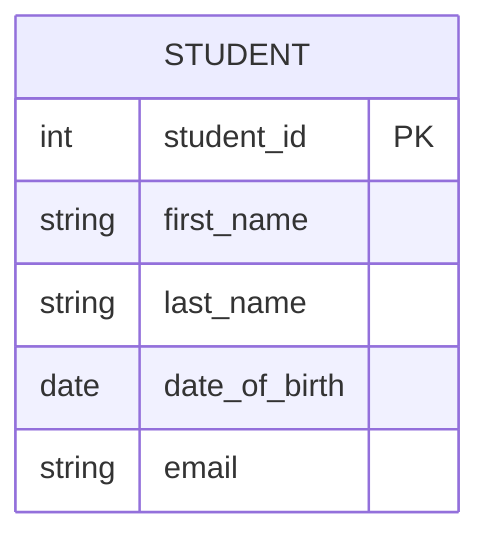
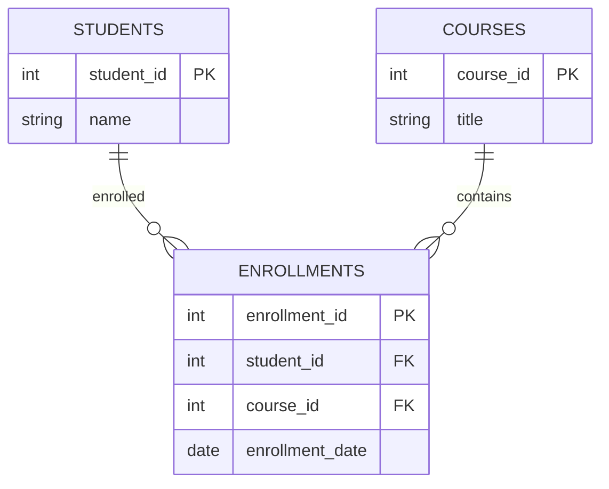
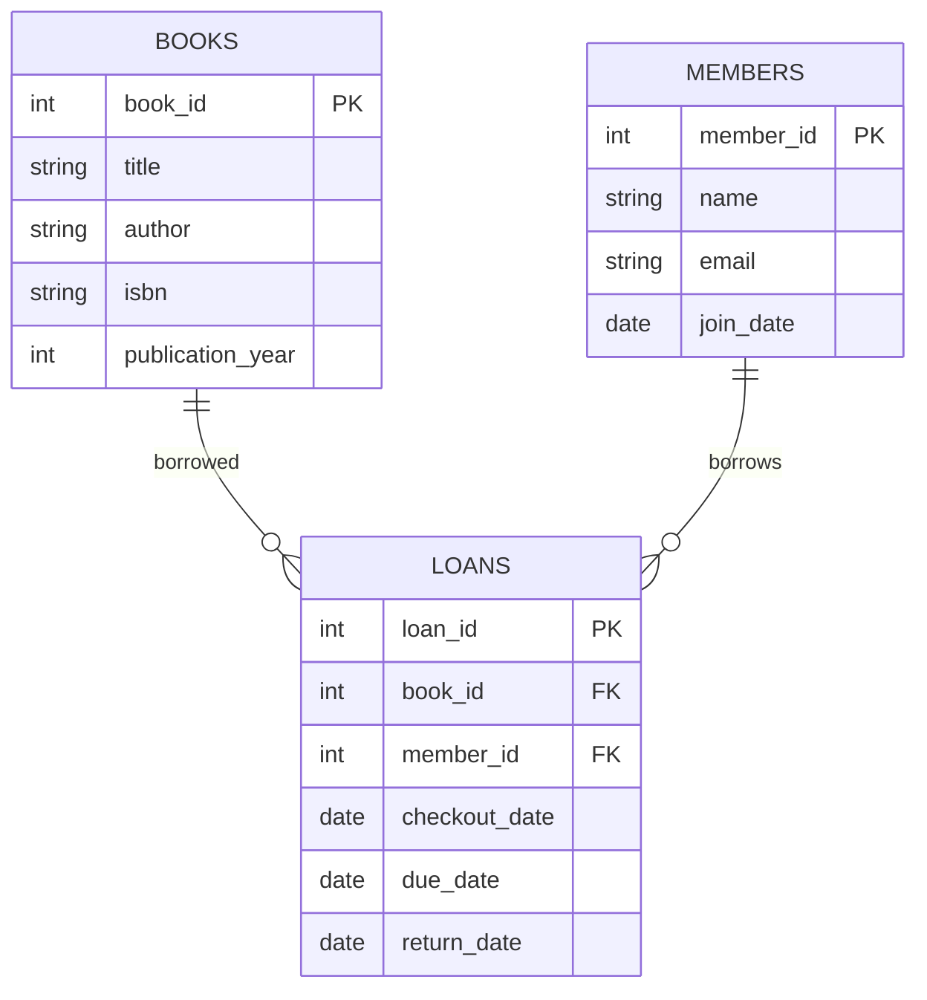

# Relational Model Basics

## Introduction

The relational model is the theoretical foundation upon which relational database management systems (RDBMS) are built. Developed by E.F. Codd at IBM in 1970, this model revolutionized database design by introducing a tabular structure that separates the logical organization of data from its physical storage implementation.

In this tutorial, we'll explore the core components of the relational model, understand its terminology, and see how these concepts translate to the databases we use every day.

## Key Components of the Relational Model

The relational model consists of three main components:

1. **Structure** - How data is organized (tables, rows, columns)
2. **Manipulation** - How data can be queried and modified
3. **Integrity** - Rules that ensure data accuracy and consistency

Let's examine each of these components in detail.

## Relational Data Structures

### Relations (Tables)

In the relational model, data is organized into **relations**, which are implemented as tables in RDBMS. A relation is a two-dimensional structure consisting of rows and columns.

Key characteristics:
- Each relation has a unique name
- Each relation contains one or more attributes (columns)
- Each relation contains zero or more tuples (rows)
- The order of rows and columns doesn't matter
- Each cell contains exactly one atomic (indivisible) value

Here's a visualization of a simple relation:



### Attributes (Columns)

**Attributes** represent properties or characteristics of the entity described by the relation. Each attribute:
- Has a unique name within its relation
- Has a defined data type (domain)
- Contains atomic values (cannot be divided further)

### Tuples (Rows)

**Tuples** represent individual records or instances within a relation. Each tuple:
- Contains one value for each attribute in the relation
- Must be unique within the relation (no duplicate rows)
- Has no inherent order (rows can be stored in any sequence)

## Example: Translating Concepts to Practice

Let's see how these theoretical concepts map to actual database implementations:

| Relational Model Term | SQL Implementation | Description |
|-----------------------|-------------------|-------------|
| Relation | Table | A named collection of related data |
| Tuple | Row | A single record in a table |
| Attribute | Column | A named property with a data type |
| Domain | Data Type | The set of allowable values for an attribute |
| Primary Key | PRIMARY KEY constraint | Uniquely identifies each row |
| Foreign Key | FOREIGN KEY constraint | References a primary key in another table |

## Creating and Manipulating Relations

In SQL, you create relations using the `CREATE TABLE` statement:

```sql
CREATE TABLE students (
    student_id INTEGER PRIMARY KEY,
    first_name VARCHAR(50) NOT NULL,
    last_name VARCHAR(50) NOT NULL,
    date_of_birth DATE,
    email VARCHAR(100) UNIQUE
);
```

Once created, you can manipulate data using SQL operations that align with relational algebra:

```sql
-- Insert a new tuple
INSERT INTO students (student_id, first_name, last_name, date_of_birth, email)
VALUES (1, 'John', 'Doe', '2000-05-15', 'john.doe@example.com');

-- Query (select) data
SELECT * FROM students WHERE date_of_birth > '2000-01-01';

-- Update existing data
UPDATE students SET email = 'john.d@example.com' WHERE student_id = 1;

-- Delete data
DELETE FROM students WHERE student_id = 1;
```

## Relational Keys

Keys are central to the relational model as they establish relationships between tables and enforce data integrity.

### Primary Key

A **primary key** is an attribute (or combination of attributes) that uniquely identifies each tuple in a relation. For example, `student_id` in the students table.

Properties of primary keys:
- Must be unique
- Cannot be null
- Should be immutable (rarely changed)
- Should be simple and compact

### Foreign Key

A **foreign key** is an attribute (or set of attributes) in one relation that references the primary key of another relation. Foreign keys establish relationships between tables.



In this diagram:
- `ENROLLMENTS.student_id` is a foreign key referencing `STUDENTS.student_id`
- `ENROLLMENTS.course_id` is a foreign key referencing `COURSES.course_id`

## Relational Integrity

The relational model defines rules to maintain data integrity:

### Entity Integrity

No primary key value can be null. This ensures that each tuple can be uniquely identified.

```sql
CREATE TABLE products (
    product_id INTEGER PRIMARY KEY, -- Cannot be NULL
    name VARCHAR(100) NOT NULL,
    price DECIMAL(10,2)
);
```

### Referential Integrity

Foreign key values must either match a primary key value in the referenced relation or be null (if allowed).

```sql
CREATE TABLE orders (
    order_id INTEGER PRIMARY KEY,
    customer_id INTEGER NOT NULL,
    order_date DATE NOT NULL,
    FOREIGN KEY (customer_id) REFERENCES customers(customer_id)
    -- customer_id must exist in the customers table
);
```

### Domain Integrity

All values in an attribute must conform to the defined domain (data type and constraints).

```sql
CREATE TABLE employees (
    employee_id INTEGER PRIMARY KEY,
    email VARCHAR(100) UNIQUE,
    salary DECIMAL(10,2) CHECK (salary > 0),
    department VARCHAR(50) CHECK (department IN ('HR', 'IT', 'Finance', 'Marketing'))
);
```

## Practical Example: Library Database

Let's design a simple library database to demonstrate the relational model in action:



This model represents:
- A many-to-many relationship between books and members
- The relationship is implemented through the loans junction table
- Each loan represents a single book borrowed by a single member

In SQL, this could be implemented as:

```sql
CREATE TABLE books (
    book_id INTEGER PRIMARY KEY,
    title VARCHAR(200) NOT NULL,
    author VARCHAR(100) NOT NULL,
    isbn VARCHAR(13) UNIQUE,
    publication_year INTEGER
);

CREATE TABLE members (
    member_id INTEGER PRIMARY KEY,
    name VARCHAR(100) NOT NULL,
    email VARCHAR(100) UNIQUE,
    join_date DATE NOT NULL
);

CREATE TABLE loans (
    loan_id INTEGER PRIMARY KEY,
    book_id INTEGER NOT NULL,
    member_id INTEGER NOT NULL,
    checkout_date DATE NOT NULL,
    due_date DATE NOT NULL,
    return_date DATE,
    FOREIGN KEY (book_id) REFERENCES books(book_id),
    FOREIGN KEY (member_id) REFERENCES members(member_id)
);
```

## Benefits of the Relational Model

The relational model offers several advantages:

1. **Data Independence**: The logical structure is separate from physical storage
2. **Simplicity**: The tabular structure is easy to understand
3. **Flexibility**: Complex queries can be performed across multiple tables
4. **Data Integrity**: Rules ensure data consistency and accuracy
5. **Security**: Access controls can be applied at various levels
6. **ACID Properties**: Transactions ensure data reliability

## Common Operations in the Relational Model

The relational model supports various operations derived from relational algebra:

### Selection (σ)

Creates a subset of rows based on a condition.

```sql
-- Find all books published after 2010
SELECT * FROM books WHERE publication_year > 2010;
```

### Projection (π)

Creates a subset of columns.

```sql
-- Get only the titles and authors of books
SELECT title, author FROM books;
```

### Join (⋈)

Combines rows from two or more tables based on related columns.

```sql
-- Get loan information with book titles and member names
SELECT l.loan_id, b.title, m.name, l.checkout_date, l.due_date
FROM loans l
JOIN books b ON l.book_id = b.book_id
JOIN members m ON l.member_id = m.member_id;
```

### Union (∪)

Combines rows from similar tables.

```sql
-- Combine fiction and non-fiction books into a single result
SELECT * FROM fiction_books
UNION
SELECT * FROM non_fiction_books;
```

## Summary

The relational model forms the theoretical foundation of modern relational database systems. Its key components include:

- **Relations (tables)** that organize data in rows and columns
- **Attributes (columns)** that define the properties of entities
- **Tuples (rows)** that represent individual records
- **Keys** that establish entity identity and relationships
- **Integrity constraints** that ensure data accuracy and consistency

Understanding these fundamentals is essential for effective database design, querying, and management in relational systems like MySQL, PostgreSQL, SQL Server, and Oracle.

## Exercises

1. Design a relational model for an online store with customers, products, orders, and order details.
2. Write SQL statements to create tables for a school database with students, teachers, courses, and enrollments.
3. Create queries to demonstrate selection, projection, and join operations on your school database.
4. Identify the primary and foreign keys in a social media database with users, posts, comments, and likes.
5. Explain how referential integrity would be maintained in a hospital database with patients, doctors, and appointments.

## Additional Resources

- **Books**:
  - "Database System Concepts" by Silberschatz, Korth, and Sudarshan
  - "An Introduction to Database Systems" by C.J. Date
  
- **Online Courses**:
  - Stanford's "Introduction to Databases"
  - MIT OpenCourseWare's "Database Systems"

- **Practice**:
  - Set up a local database using SQLite, MySQL, or PostgreSQL
  - Try creating the example databases in this tutorial
  - Practice writing complex queries that span multiple tables