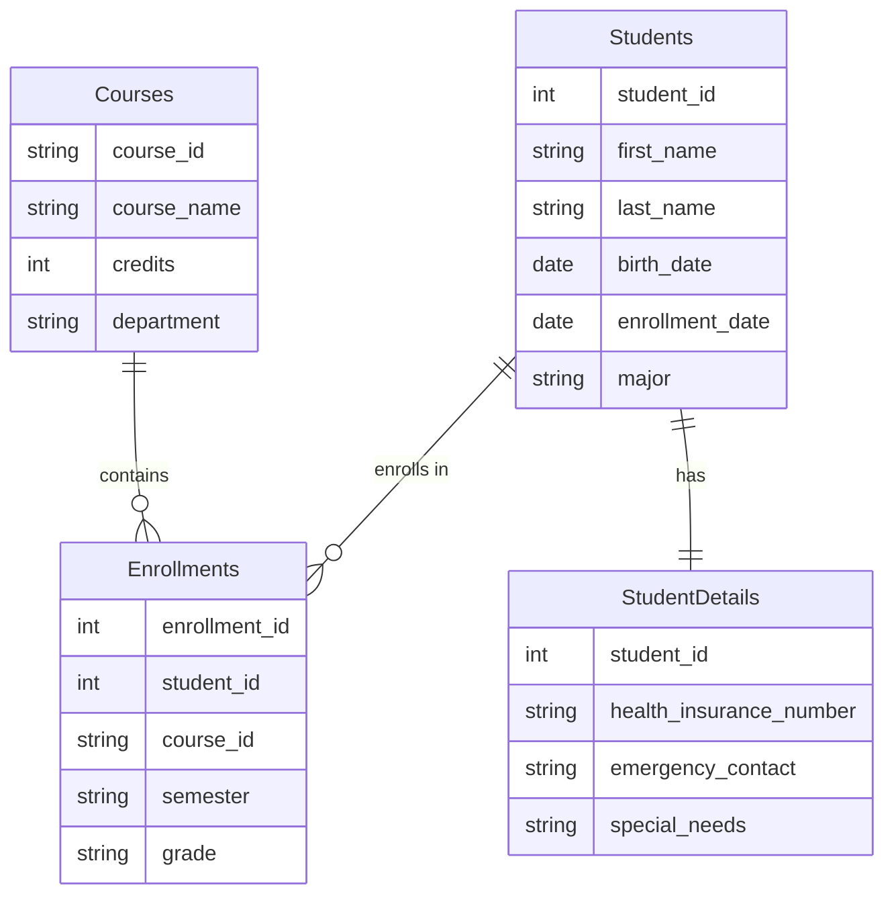

# Tables and Relations

## Introduction

At the heart of every relational database lies two fundamental concepts: **tables** and **relations**. If you've ever worked with spreadsheets, you already have an intuitive understanding of tables - they organize data into rows and columns. Relations, on the other hand, define how these tables connect with each other, creating a web of meaningful connections that make relational databases so powerful.

In this tutorial, we'll explore how tables store data, how relations link these tables together, and why this approach has become the foundation of most modern database systems.

## Understanding Tables

### What is a Table?

A table (also called a relation in formal database theory) is a collection of related data organized in rows and columns. Each table in a database represents a specific entity or concept.

- **Rows** (also called records or tuples) contain data about a specific instance of the entity
- **Columns** (also called fields or attributes) describe a particular characteristic of the entity

Let's look at a simple example of a table representing `Students`:

```sql
CREATE TABLE Students (
    student_id INT PRIMARY KEY,
    first_name VARCHAR(50),
    last_name VARCHAR(50),
    birth_date DATE,
    enrollment_date DATE,
    major VARCHAR(50)
);
```

This would create a table that might contain data like:

| student_id | first_name | last_name | birth_date  | enrollment_date | major        |
|------------|------------|-----------|-------------|-----------------|--------------|
| 1          | Maria      | Garcia    | 2001-05-12  | 2020-08-15      | Computer Science |
| 2          | John       | Smith     | 2002-03-20  | 2020-08-15      | Mathematics  |
| 3          | Aisha      | Khan      | 2001-11-08  | 2021-01-10      | Physics      |

### Table Properties

Tables in relational databases have important properties:

1. **Each row is unique** - No two rows can be identical in all values
2. **Column order doesn't matter** - The meaning of data depends on column names, not positions
3. **Row order doesn't matter** - Rows can be retrieved in any order using queries
4. **Each column has a specific data type** - Like INTEGER, VARCHAR, DATE, etc.
5. **Atomicity of values** - Each cell contains exactly one value (not a list or nested data)

## Keys: The Foundation of Relations

To establish relationships between tables, we need ways to uniquely identify and reference rows. This is where keys come in.

### Primary Keys

A **primary key** is a column (or combination of columns) that uniquely identifies each row in a table. Good primary keys should be:

- Unique across all rows
- Never null or empty
- Stable (unlikely to change)
- Simple (preferably a single column)

In our Students example, `student_id` serves as the primary key.

### Foreign Keys

A **foreign key** is a column (or columns) that refers to the primary key of another table. Foreign keys create relationships between tables.

Let's create a second table for courses:

```sql
CREATE TABLE Courses (
    course_id VARCHAR(10) PRIMARY KEY,
    course_name VARCHAR(100),
    credits INT,
    department VARCHAR(50)
);

CREATE TABLE Enrollments (
    enrollment_id INT PRIMARY KEY,
    student_id INT,
    course_id VARCHAR(10),
    semester VARCHAR(20),
    grade VARCHAR(2),
    FOREIGN KEY (student_id) REFERENCES Students(student_id),
    FOREIGN KEY (course_id) REFERENCES Courses(course_id)
);
```

In this example, the `Enrollments` table contains foreign keys that reference both the `Students` and `Courses` tables, creating relationships between them.

## Types of Relations

Relations between tables come in several forms, depending on how records in one table relate to records in another.

### One-to-One (1:1) Relations

In a one-to-one relationship, each row in the first table is linked to exactly one row in the second table, and vice versa.

For example, if we had a `StudentDetails` table that contained additional information about each student:

```sql
CREATE TABLE StudentDetails (
    student_id INT PRIMARY KEY,
    health_insurance_number VARCHAR(50),
    emergency_contact VARCHAR(100),
    special_needs TEXT,
    FOREIGN KEY (student_id) REFERENCES Students(student_id)
);
```

Each student has exactly one record in `StudentDetails` and each record in `StudentDetails` belongs to exactly one student.

### One-to-Many (1:N) Relations

In a one-to-many relationship, each row in the first table can be linked to multiple rows in the second table, but each row in the second table links to only one row in the first table.

The relationship between `Students` and `Enrollments` is one-to-many: one student can have many enrollments, but each enrollment belongs to exactly one student.

### Many-to-Many (M:N) Relations

In a many-to-many relationship, each row in the first table can be linked to multiple rows in the second table, and vice versa.

The relationship between `Students` and `Courses` is many-to-many: each student can take multiple courses, and each course can have multiple students. The `Enrollments` table serves as a **junction table** (also called a bridge table or linking table) that implements this many-to-many relationship.

We can visualize these relationships using a diagram:



## Practical Application: Building a University Database Schema

Let's apply these concepts to design a simple university database schema. Our university needs to track students, professors, departments, courses, and enrollments.

First, let's create our tables with appropriate primary and foreign keys:

```sql
-- Departments table
CREATE TABLE Departments (
    dept_id VARCHAR(5) PRIMARY KEY,
    dept_name VARCHAR(100),
    building VARCHAR(50),
    budget DECIMAL(12,2)
);

-- Professors table
CREATE TABLE Professors (
    professor_id INT PRIMARY KEY,
    first_name VARCHAR(50),
    last_name VARCHAR(50),
    dept_id VARCHAR(5),
    hire_date DATE,
    FOREIGN KEY (dept_id) REFERENCES Departments(dept_id)
);

-- Students table (we already defined this)
CREATE TABLE Students (
    student_id INT PRIMARY KEY,
    first_name VARCHAR(50),
    last_name VARCHAR(50),
    birth_date DATE,
    enrollment_date DATE,
    major VARCHAR(50)
);

-- Courses table (we already defined this)
CREATE TABLE Courses (
    course_id VARCHAR(10) PRIMARY KEY,
    course_name VARCHAR(100),
    credits INT,
    department VARCHAR(50)
);

-- Course Offerings table
CREATE TABLE CourseOfferings (
    offering_id INT PRIMARY KEY,
    course_id VARCHAR(10),
    professor_id INT,
    semester VARCHAR(20),
    year INT,
    room VARCHAR(20),
    schedule VARCHAR(50),
    FOREIGN KEY (course_id) REFERENCES Courses(course_id),
    FOREIGN KEY (professor_id) REFERENCES Professors(professor_id)
);

-- Enrollments table (modified)
CREATE TABLE Enrollments (
    enrollment_id INT PRIMARY KEY,
    student_id INT,
    offering_id INT,
    grade VARCHAR(2),
    FOREIGN KEY (student_id) REFERENCES Students(student_id),
    FOREIGN KEY (offering_id) REFERENCES CourseOfferings(offering_id)
);
```

### Querying Related Tables

The power of relational databases becomes clear when we need to query data across tables. For example, to find all courses that a student is enrolled in:

```sql
SELECT s.first_name, s.last_name, c.course_name, co.semester, co.year, e.grade
FROM Students s
JOIN Enrollments e ON s.student_id = e.student_id
JOIN CourseOfferings co ON e.offering_id = co.offering_id
JOIN Courses c ON co.course_id = c.course_id
WHERE s.student_id = 1;
```

This query joins four tables together using their relationships to produce a comprehensive result.

## Maintaining Data Integrity Through Relations

Relations help maintain data integrity through:

### Referential Integrity

Referential integrity ensures that relationships between tables remain consistent. Foreign key constraints prevent:
- Creating enrollments for non-existent students
- Deleting a department that still has professors assigned to it

For example, if we try to delete a student who has enrollments:

```sql
DELETE FROM Students WHERE student_id = 1;
```

The database would prevent this operation if there are related records in the `Enrollments` table.

### Normalization

Normalization is the process of organizing data to minimize redundancy and dependency. By splitting data into multiple related tables, we can:

1. Eliminate redundant data (store each piece of information once)
2. Ensure data consistency (update information in one place)
3. Improve query flexibility

For example, instead of storing department information in both the `Professors` and `Courses` tables, we store it once in the `Departments` table and reference it through relations.

## Common Operations with Tables and Relations

### Joining Tables

Joining is the operation of combining rows from two or more tables based on a related column.

```sql
-- Inner join (only matching rows)
SELECT Students.first_name, Students.last_name, Courses.course_name
FROM Students
INNER JOIN Enrollments ON Students.student_id = Enrollments.student_id
INNER JOIN CourseOfferings ON Enrollments.offering_id = CourseOfferings.offering_id
INNER JOIN Courses ON CourseOfferings.course_id = Courses.course_id;

-- Left join (all students, even those not enrolled)
SELECT Students.first_name, Students.last_name, Courses.course_name
FROM Students
LEFT JOIN Enrollments ON Students.student_id = Enrollments.student_id
LEFT JOIN CourseOfferings ON Enrollments.offering_id = CourseOfferings.offering_id
LEFT JOIN Courses ON CourseOfferings.course_id = Courses.course_id;
```

### Cascading Operations

We can define what happens to related records when a primary record is updated or deleted:

```sql
CREATE TABLE Enrollments (
    enrollment_id INT PRIMARY KEY,
    student_id INT,
    offering_id INT,
    grade VARCHAR(2),
    FOREIGN KEY (student_id) REFERENCES Students(student_id)
        ON DELETE CASCADE,
    FOREIGN KEY (offering_id) REFERENCES CourseOfferings(offering_id)
        ON DELETE RESTRICT
);
```

In this example:
- If a student is deleted, all their enrollments are automatically deleted (CASCADE)
- A course offering cannot be deleted if students are enrolled in it (RESTRICT)

## Summary

Tables and relations form the foundation of relational database systems. Tables organize data into structured rows and columns, while relations establish meaningful connections between these tables. Through primary and foreign keys, we can create one-to-one, one-to-many, and many-to-many relationships that reflect real-world associations between entities.

Understanding these concepts allows you to:
- Design efficient and normalized database schemas
- Maintain data integrity through proper constraints
- Query and combine data across multiple related tables
- Model complex real-world scenarios in your databases

By mastering tables and relations, you've taken an essential step toward becoming proficient with relational databases, setting the foundation for more advanced database concepts.

## Exercises

1. Design a database schema for a simple e-commerce system with customers, products, orders, and order items. Identify the primary and foreign keys and the types of relationships between tables.

2. Write SQL queries to:
   - Find all orders placed by a specific customer
   - List the most popular products based on order quantity
   - Calculate the total revenue for each product

3. Modify the university database schema to add a new entity called "Advisors" where each student can have one advisor, but each advisor can advise multiple students. What type of relationship is this?

## Additional Resources

- [Database Normalization Explained](https://www.essentialsql.com/get-ready-to-learn-sql-database-normalization-explained-in-simple-english/)
- [SQL Joins Visualized](https://joins.spathon.com/)
- [Entity-Relationship Diagram (ERD) Tutorial](https://www.lucidchart.com/pages/er-diagrams)
- [SQL Practice Exercises](https://www.w3schools.com/sql/sql_exercises.asp)