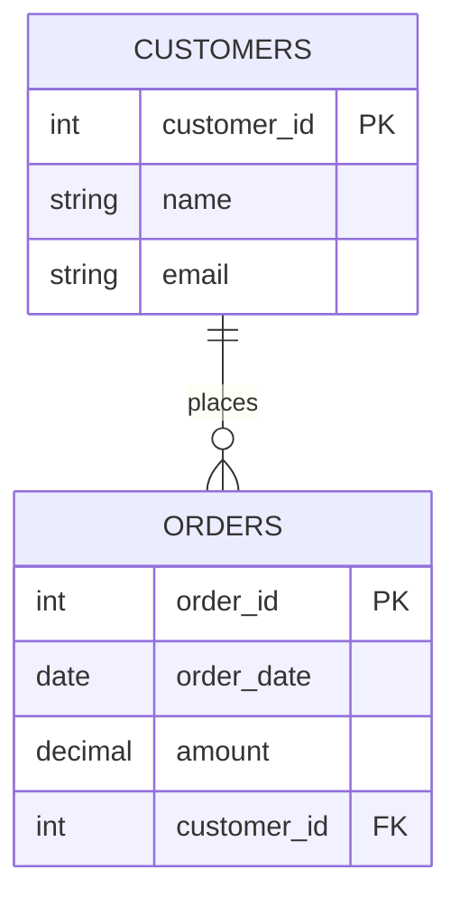

# Referential Integrity

Referential integrity is one of the most important concepts in relational database design. It ensures that relationships between tables remain consistent and helps maintain the overall quality and reliability of your data.

## What is Referential Integrity?

Referential integrity is a database concept that ensures relationships between tables remain valid. Specifically, it guarantees that references to data in one table must exist in another table.

In simple terms, it means if Table A has a reference to Table B, that reference must actually exist in Table B.

### Why is it Important?

Without referential integrity:
- Your database could contain "orphaned records" that reference non-existent data
- Data inconsistencies would be common
- The reliability of your queries and reports would be compromised
- Data analysis would produce incorrect results

## Key Concepts in Referential Integrity

### Foreign Keys

The primary mechanism for enforcing referential integrity is the **foreign key constraint**.

A foreign key is a column (or set of columns) in one table that references the primary key of another table. The table containing the foreign key is called the "child" table, while the table containing the primary key being referenced is called the "parent" table.

### Example of Foreign Key Relationship

Let's use a common example of an `orders` and `customers` relationship:

```sql
CREATE TABLE customers (
  customer_id INT PRIMARY KEY,
  name VARCHAR(100),
  email VARCHAR(100)
);

CREATE TABLE orders (
  order_id INT PRIMARY KEY,
  order_date DATE,
  amount DECIMAL(10,2),
  customer_id INT,
  FOREIGN KEY (customer_id) REFERENCES customers(customer_id)
);
```

In this example:
- `customers` is the parent table with `customer_id` as its primary key
- `orders` is the child table with `customer_id` as a foreign key referencing the `customers` table

This relationship enforces that you cannot add an order for a customer that doesn't exist in the `customers` table.

## Visualizing Referential Integrity

Let's visualize this relationship with a diagram:



The diagram shows a one-to-many relationship between customers and orders. The `||--o{` notation represents "one-to-many", meaning one customer can place many orders.

## Enforcing Referential Integrity

Relational databases enforce referential integrity through several mechanisms:

### 1. Foreign Key Constraints

As shown in our example, defining a column as a foreign key is the most common way to enforce referential integrity.

### 2. Constraint Actions

When defining a foreign key, you can specify what happens when the referenced data is updated or deleted. These are called "referential actions":

```sql
CREATE TABLE orders (
  order_id INT PRIMARY KEY,
  order_date DATE,
  amount DECIMAL(10,2),
  customer_id INT,
  FOREIGN KEY (customer_id) 
    REFERENCES customers(customer_id)
    ON DELETE CASCADE
    ON UPDATE CASCADE
);
```

Common referential actions include:

- `CASCADE`: If a customer record is deleted or updated, automatically apply the same operation to related orders
- `RESTRICT`: Prevent deletion or updates to the customer if related orders exist
- `SET NULL`: Set the foreign key to NULL if the referenced record is deleted
- `SET DEFAULT`: Set the foreign key to its default value if the referenced record is deleted

### 3. Database Triggers

For more complex integrity requirements, database triggers can be used to enforce custom rules.

## Real-World Example: Online Bookstore

Let's consider a practical example of an online bookstore database with three tables:

```sql
-- Authors table
CREATE TABLE authors (
  author_id INT PRIMARY KEY,
  name VARCHAR(100),
  birth_year INT
);

-- Books table with reference to authors
CREATE TABLE books (
  book_id INT PRIMARY KEY,
  title VARCHAR(200),
  author_id INT,
  publication_year INT,
  price DECIMAL(10,2),
  FOREIGN KEY (author_id) REFERENCES authors(author_id)
);

-- Orders table with reference to books
CREATE TABLE book_orders (
  order_id INT PRIMARY KEY,
  book_id INT,
  quantity INT,
  order_date DATE,
  FOREIGN KEY (book_id) REFERENCES books(book_id)
);
```

This schema enforces several referential integrity constraints:
1. A book cannot exist without a valid author
2. An order cannot reference a non-existent book

### What Happens Without Referential Integrity?

If we didn't enforce referential integrity:

1. We could delete an author while keeping their books in the database
2. We could have orders for books that don't exist
3. Data analysis would produce incorrect results (like total sales by author)

## Common Violations of Referential Integrity

### 1. Insert Violation

Attempting to add a record to a child table that references a non-existent parent record.

Example: Adding an order with a customer_id that doesn't exist in the customers table.

```sql
-- This will fail if customer_id 999 doesn't exist in customers table
INSERT INTO orders (order_id, order_date, amount, customer_id)
VALUES (1, '2023-05-15', 99.99, 999);
```

### 2. Update Violation

Attempting to update a foreign key to a value that doesn't exist in the parent table.

```sql
-- This will fail if customer_id 999 doesn't exist in customers table
UPDATE orders
SET customer_id = 999
WHERE order_id = 1;
```

### 3. Delete Violation

Attempting to delete a parent record that still has dependent records in a child table.

```sql
-- This will fail if RESTRICT is set and there are orders with customer_id 5
DELETE FROM customers
WHERE customer_id = 5;
```

## Implementing Referential Integrity in Different Databases

While the concept is universal, syntax varies slightly across database systems:

### MySQL

```sql
CREATE TABLE orders (
  order_id INT PRIMARY KEY,
  customer_id INT,
  FOREIGN KEY (customer_id) 
    REFERENCES customers(customer_id)
    ON DELETE RESTRICT
);
```

### PostgreSQL

```sql
CREATE TABLE orders (
  order_id INT PRIMARY KEY,
  customer_id INT REFERENCES customers(customer_id) ON DELETE RESTRICT
);
```

### SQLite

```sql
CREATE TABLE orders (
  order_id INT PRIMARY KEY,
  customer_id INT,
  FOREIGN KEY (customer_id) REFERENCES customers(customer_id) ON DELETE RESTRICT
);
```

## Best Practices for Referential Integrity

1. **Always define relationships explicitly** - Don't rely on application code to maintain integrity
2. **Choose appropriate referential actions** - Consider the business requirements when deciding between CASCADE, RESTRICT, etc.
3. **Use transactions** - When modifying related tables, wrap operations in transactions
4. **Consider the impact on performance** - Foreign key constraints add overhead, but the benefits usually outweigh the costs
5. **Document your schema design** - Make sure the team understands the relationships and constraints

## Referential Integrity vs. Application-Level Validation

While you could implement some checks in your application code, database-level referential integrity offers several advantages:

1. **Consistency** - Rules are enforced regardless of which application accesses the database
2. **Security** - Prevents accidental data corruption
3. **Efficiency** - Database engines optimize constraint checking
4. **Reliability** - Application bugs can't bypass integrity rules

## Exercises

1. Design a database schema for a school system with students, classes, and enrollments that maintains referential integrity.
2. Write SQL statements to create tables for an e-commerce platform with products, categories, and order details.
3. Experiment with different ON DELETE and ON UPDATE actions to see how they affect related records.
4. Identify potential referential integrity issues in an existing database design.

## Summary

Referential integrity is a fundamental concept in relational database design that ensures the consistency and reliability of your data. By enforcing relationships between tables through foreign key constraints, you can prevent orphaned records and maintain data quality.

Key points to remember:
- Referential integrity is enforced primarily through foreign key constraints
- It prevents invalid references between related tables
- Different referential actions (CASCADE, RESTRICT, etc.) handle different scenarios
- Database-level integrity is more reliable than application-level validation

As you build more complex database systems, maintaining referential integrity becomes increasingly important to ensure your data remains consistent and reliable.

## Additional Resources

- [SQL Tutorial: Foreign Keys](https://www.w3schools.com/sql/sql_foreignkey.asp)
- [Database Normalization Explained](https://www.essentialsql.com/get-ready-to-learn-sql-database-normalization-explained-in-simple-english/)
- [Constraints in SQL Server](https://docs.microsoft.com/en-us/sql/relational-databases/tables/create-foreign-key-relationships)