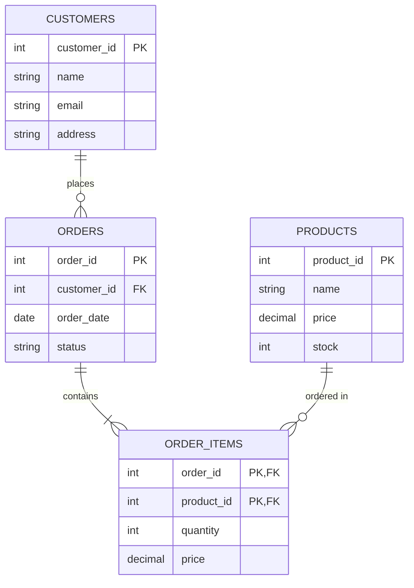

# Primary Keys

## Introduction

In the world of relational databases, primary keys are one of the most fundamental concepts you'll need to understand. A primary key is a special column or combination of columns that uniquely identifies each record in a table. Think of it as a unique ID card that every record must have - no two records can share the same ID.

Primary keys serve as the foundation for maintaining data integrity and establishing relationships between tables in a relational database system. Without primary keys, it would be nearly impossible to reliably identify and access specific records or create meaningful connections between related data.

## Understanding Primary Keys

### Definition and Purpose

A primary key is a column or set of columns in a table that:

1. Contains unique values (no duplicates allowed)
2. Cannot contain NULL values (must always have a value)
3. Uniquely identifies each row in a table

The main purposes of a primary key are:

- **Record Identification**: Provide a guaranteed way to access a specific record
- **Data Integrity**: Ensure no duplicate records exist
- **Relationship Formation**: Enable connections between tables (via foreign keys)
- **Performance**: Improve query efficiency through indexing

### Types of Primary Keys

There are two main types of primary keys:

1. **Natural Keys**: Values that already exist in your data and naturally identify an entity
   - Examples: Social Security Numbers, ISBN for books, product codes
   - Pros: Meaningful to users, already part of your data
   - Cons: May change over time, might be complex or long

2. **Surrogate Keys**: Artificially generated values solely for identification purposes
   - Examples: Auto-incrementing integers, UUIDs
   - Pros: Never change, typically simple and short
   - Cons: No inherent meaning, require extra storage

## Creating Primary Keys in SQL

Let's look at how to create primary keys in SQL. We'll use examples from different SQL database systems.

### Creating a Table with a Primary Key

When creating a new table, you can define a primary key using the `PRIMARY KEY` constraint:

```sql
CREATE TABLE customers (
  customer_id INT PRIMARY KEY,
  first_name VARCHAR(50) NOT NULL,
  last_name VARCHAR(50) NOT NULL,
  email VARCHAR(100) UNIQUE
);
```

You can also define a primary key using a separate constraint declaration:

```sql
CREATE TABLE products (
  product_id INT,
  product_name VARCHAR(100) NOT NULL,
  price DECIMAL(10, 2),
  category VARCHAR(50),
  CONSTRAINT pk_product PRIMARY KEY (product_id)
);
```

### Composite Primary Keys

Sometimes, a single column isn't enough to uniquely identify a record. In such cases, you can create a composite primary key using multiple columns:

```sql
CREATE TABLE order_items (
  order_id INT,
  product_id INT,
  quantity INT NOT NULL,
  price DECIMAL(10, 2) NOT NULL,
  PRIMARY KEY (order_id, product_id)
);
```

In this example, neither `order_id` nor `product_id` alone can uniquely identify a record, but their combination can.

### Adding a Primary Key to an Existing Table

If you already have a table without a primary key, you can add one using the `ALTER TABLE` statement:

```sql
ALTER TABLE employees
ADD PRIMARY KEY (employee_id);
```

### Auto-Incrementing Primary Keys

Most database systems provide a way to automatically generate unique values for primary keys:

**MySQL/MariaDB:**
```sql
CREATE TABLE users (
  user_id INT AUTO_INCREMENT PRIMARY KEY,
  username VARCHAR(50) UNIQUE,
  password VARCHAR(255) NOT NULL
);
```

**PostgreSQL:**
```sql
CREATE TABLE users (
  user_id SERIAL PRIMARY KEY,
  username VARCHAR(50) UNIQUE,
  password VARCHAR(255) NOT NULL
);
```

**SQL Server:**
```sql
CREATE TABLE users (
  user_id INT IDENTITY(1,1) PRIMARY KEY,
  username VARCHAR(50) UNIQUE,
  password VARCHAR(255) NOT NULL
);
```

**SQLite:**
```sql
CREATE TABLE users (
  user_id INTEGER PRIMARY KEY AUTOINCREMENT,
  username TEXT UNIQUE,
  password TEXT NOT NULL
);
```

## Primary Key Best Practices

To effectively use primary keys in your database design, consider these best practices:

1. **Choose Appropriate Data Types**:
   - Use integer types for surrogate keys (more efficient)
   - Consider UUID for distributed systems or when merging databases

2. **Keep Primary Keys Simple**:
   - Prefer single-column keys over composite keys when possible
   - Avoid using frequently changing values as primary keys

3. **Use Surrogate Keys for Flexibility**:
   - Natural keys may seem convenient but can cause issues if business rules change
   - Surrogate keys remain stable even when data evolves

4. **Consider Performance Implications**:
   - Primary keys are automatically indexed, affecting INSERT operations
   - Very wide primary keys can impact performance

5. **Naming Conventions**:
   - Use consistent naming like `id` or `[table_name]_id`
   - For composite keys, use clear constraint names

## Real-World Examples

Let's explore some real-world examples of primary keys in different scenarios:

### Example 1: E-commerce Database



In this e-commerce database:
- `customer_id` is a surrogate primary key for the CUSTOMERS table
- `order_id` uniquely identifies each order in the ORDERS table
- The ORDER_ITEMS table uses a composite primary key (order_id, product_id)
- `product_id` is the primary key for the PRODUCTS table

This structure ensures:
- Each customer has a unique identifier
- Orders are uniquely identified
- We can't add the same product to an order twice (we'd update quantity instead)
- Products have unique identifiers

### Example 2: Library Management System

Let's implement a simple library database to track books and loans:

```sql
-- Books table with ISBN as a natural primary key
CREATE TABLE books (
  isbn VARCHAR(13) PRIMARY KEY,
  title VARCHAR(200) NOT NULL,
  author VARCHAR(100) NOT NULL,
  published_year INT,
  category VARCHAR(50)
);

-- Members table with a surrogate primary key
CREATE TABLE members (
  member_id INT AUTO_INCREMENT PRIMARY KEY,
  first_name VARCHAR(50) NOT NULL,
  last_name VARCHAR(50) NOT NULL,
  email VARCHAR(100) UNIQUE,
  join_date DATE NOT NULL
);

-- Loans table with a composite primary key
CREATE TABLE loans (
  isbn VARCHAR(13),
  member_id INT,
  loan_date DATE NOT NULL,
  due_date DATE NOT NULL,
  return_date DATE,
  PRIMARY KEY (isbn, member_id, loan_date),
  FOREIGN KEY (isbn) REFERENCES books(isbn),
  FOREIGN KEY (member_id) REFERENCES members(member_id)
);
```

In this example:
- We use ISBN as a natural primary key for books
- Member IDs are auto-incrementing surrogate keys
- The loans table uses a composite primary key to track multiple loans of the same book to the same member on different dates

## Querying Data Using Primary Keys

Primary keys provide the most efficient way to access specific records. Here are examples of using primary keys in queries:

```sql
-- Retrieve a specific customer
SELECT * FROM customers WHERE customer_id = 42;

-- Update a specific product
UPDATE products SET price = 29.99 WHERE product_id = 1001;

-- Delete a specific order
DELETE FROM orders WHERE order_id = 5005;

-- Join tables using primary key relationships
SELECT o.order_id, o.order_date, c.first_name, c.last_name
FROM orders o
JOIN customers c ON o.customer_id = c.customer_id
WHERE o.order_date > '2023-01-01';
```

## Common Issues and Solutions

### Issue 1: Choosing Between Natural and Surrogate Keys

**Problem**: Should you use existing business data (like email) or generated IDs as primary keys?

**Solution**: For most applications, surrogate keys are safer because:
- They never change (unlike email addresses or names)
- They're typically smaller and more efficient
- They don't expose business data in URLs or logs

### Issue 2: Primary Key Constraints Violation

**Problem**: Getting errors like "Duplicate entry for key 'PRIMARY'"

**Solution**:
- Check for duplicate data before insertion
- Use `INSERT IGNORE` or `ON DUPLICATE KEY UPDATE` in MySQL
- Implement proper validation in your application layer

```sql
-- MySQL example: Handle duplicates gracefully
INSERT IGNORE INTO products (product_id, product_name, price)
VALUES (101, 'Wireless Mouse', 24.99);

-- Or update if exists
INSERT INTO products (product_id, product_name, price)
VALUES (101, 'Wireless Mouse', 24.99)
ON DUPLICATE KEY UPDATE 
product_name = VALUES(product_name),
price = VALUES(price);
```

### Issue 3: Performance with Large Tables

**Problem**: Queries using primary keys become slower as tables grow very large

**Solution**:
- Ensure proper database maintenance (statistics updates, regular indexing)
- Consider table partitioning for extremely large tables
- Use appropriate data types (INT vs BIGINT vs UUID)

## Summary

Primary keys are essential elements in relational database design that:

- Uniquely identify each record in a table
- Prevent duplicate data
- Form the foundation for table relationships
- Improve query performance through indexing

When designing your databases:
1. Choose between natural keys (existing meaningful data) and surrogate keys (generated values)
2. Consider performance implications of your choice
3. Follow naming conventions and best practices
4. Use auto-incrementing values or UUIDs for surrogate keys
5. Remember that primary keys should not change over time

Understanding and properly implementing primary keys will help you build robust, efficient, and maintainable database systems.

## Exercises

1. Create a database schema for a school management system with tables for students, courses, and enrollments. Implement appropriate primary keys for each table.

2. Consider a social media database. Would you use surrogate or natural keys for user profiles? Explain your reasoning.

3. Implement a composite primary key for a table that tracks employee attendance (hint: you'll need employee ID and date at minimum).

4. Research how your preferred database system handles the performance of different primary key types (integers vs. UUIDs vs. strings).

## Additional Resources

- [Database Normalization](https://en.wikipedia.org/wiki/Database_normalization)
- [SQL Constraints](https://www.w3schools.com/sql/sql_constraints.asp)
- [Indexing Strategies](https://use-the-index-luke.com/)
- [PostgreSQL Documentation on Primary Keys](https://www.postgresql.org/docs/current/ddl-constraints.html)
- [MySQL Documentation on Primary Keys](https://dev.mysql.com/doc/refman/8.0/en/primary-key-optimization.html)