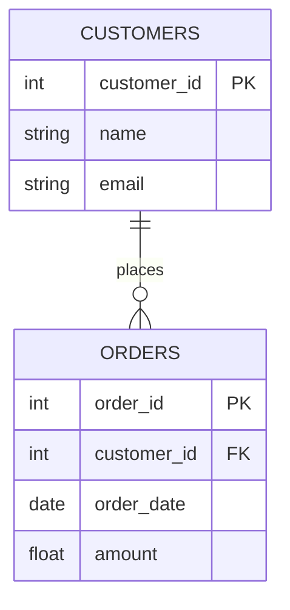
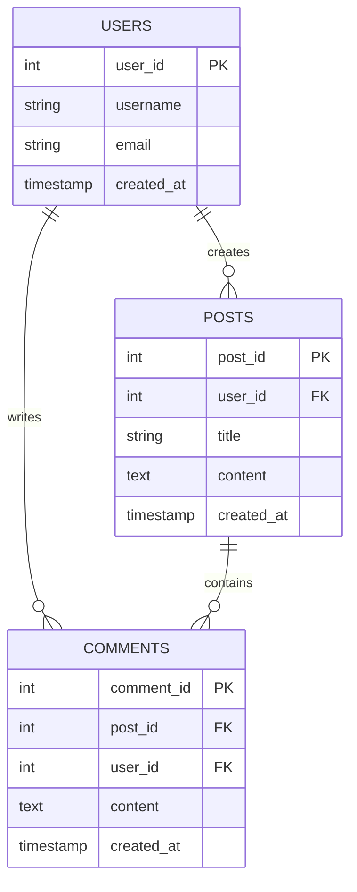

# Foreign Keys

## Introduction

Foreign keys are one of the fundamental concepts in relational database design. They create relationships between tables, allowing data to be organized logically while avoiding redundancy. If you've ever wondered how databases maintain connections between related pieces of information, foreign keys are the answer.

In this tutorial, we'll explore what foreign keys are, why they're important, and how to use them effectively in your database designs.

## What is a Foreign Key?

A foreign key is a column (or a group of columns) in one table that references the primary key of another table. This creates a link between the two tables, establishing what's called a "parent-child" or "referenced-referencing" relationship.

Let's break this down:
- The **parent table** (or referenced table) contains the primary key that is being referenced
- The **child table** (or referencing table) contains the foreign key that references the primary key of the parent table



In this diagram:
- `CUSTOMERS` is the parent table with `customer_id` as its primary key
- `ORDERS` is the child table with a foreign key `customer_id` that references the primary key of the `CUSTOMERS` table

## Why Are Foreign Keys Important?

Foreign keys serve several crucial purposes in database design:

1. **Referential Integrity**: They ensure that relationships between tables remain valid. A foreign key constraint prevents actions that would destroy these relationships.

2. **Data Organization**: They allow data to be normalized (divided into logical tables) while maintaining connections between related data.

3. **Efficient Querying**: They enable joining tables to retrieve related data across multiple tables.

4. **Prevention of Orphaned Records**: They help prevent orphaned records (records in a child table that reference a non-existent parent).

## Creating Foreign Keys in SQL

Let's look at how to create foreign keys using SQL. There are two common ways to define a foreign key: during table creation or by altering an existing table.

### During Table Creation

```sql
CREATE TABLE customers (
    customer_id INT PRIMARY KEY,
    name VARCHAR(100),
    email VARCHAR(100)
);

CREATE TABLE orders (
    order_id INT PRIMARY KEY,
    customer_id INT,
    order_date DATE,
    amount DECIMAL(10, 2),
    FOREIGN KEY (customer_id) REFERENCES customers(customer_id)
);
```

### Altering an Existing Table

```sql
ALTER TABLE orders
ADD CONSTRAINT fk_customer
FOREIGN KEY (customer_id) REFERENCES customers(customer_id);
```

### Adding a Named Constraint (Recommended)

Using named constraints makes it easier to manage your database schema:

```sql
CREATE TABLE orders (
    order_id INT PRIMARY KEY,
    customer_id INT,
    order_date DATE,
    amount DECIMAL(10, 2),
    CONSTRAINT fk_customer FOREIGN KEY (customer_id) 
    REFERENCES customers(customer_id)
);
```

## Foreign Key Constraints and Actions

When you define a foreign key, you can also specify what happens when the referenced primary key is updated or deleted. These are called "referential actions" and are specified using `ON DELETE` and `ON UPDATE` clauses.

The common options are:

1. `CASCADE`: When a primary key is updated or deleted, automatically update or delete the matching foreign keys
2. `RESTRICT`: Prevent deletion or update of the primary key if matching foreign keys exist
3. `SET NULL`: When a primary key is updated or deleted, set the foreign key values to NULL
4. `SET DEFAULT`: When a primary key is updated or deleted, set the foreign key values to their default value
5. `NO ACTION`: Similar to RESTRICT, but checked at the end of the transaction

Example with `ON DELETE CASCADE`:

```sql
CREATE TABLE orders (
    order_id INT PRIMARY KEY,
    customer_id INT,
    order_date DATE,
    amount DECIMAL(10, 2),
    CONSTRAINT fk_customer 
    FOREIGN KEY (customer_id) REFERENCES customers(customer_id)
    ON DELETE CASCADE
);
```

In this example, if a customer is deleted, all their orders will be automatically deleted as well.

## Real-World Example: A Blogging System

Let's design a simple blogging system with three tables: users, posts, and comments.

```sql
-- Users table
CREATE TABLE users (
    user_id INT PRIMARY KEY,
    username VARCHAR(50) NOT NULL UNIQUE,
    email VARCHAR(100) NOT NULL,
    created_at TIMESTAMP DEFAULT CURRENT_TIMESTAMP
);

-- Posts table
CREATE TABLE posts (
    post_id INT PRIMARY KEY,
    user_id INT NOT NULL,
    title VARCHAR(200) NOT NULL,
    content TEXT,
    created_at TIMESTAMP DEFAULT CURRENT_TIMESTAMP,
    CONSTRAINT fk_post_user 
    FOREIGN KEY (user_id) REFERENCES users(user_id)
    ON DELETE CASCADE
);

-- Comments table
CREATE TABLE comments (
    comment_id INT PRIMARY KEY,
    post_id INT NOT NULL,
    user_id INT NOT NULL,
    content TEXT NOT NULL,
    created_at TIMESTAMP DEFAULT CURRENT_TIMESTAMP,
    CONSTRAINT fk_comment_post 
    FOREIGN KEY (post_id) REFERENCES posts(post_id)
    ON DELETE CASCADE,
    CONSTRAINT fk_comment_user 
    FOREIGN KEY (user_id) REFERENCES users(user_id)
    ON DELETE CASCADE
);
```

Let's visualize these relationships:



In this model:
- A user can create multiple posts (one-to-many)
- A user can write multiple comments (one-to-many)
- A post can have multiple comments (one-to-many)

The foreign keys enforce these relationships and ensure data integrity.

## Practical Demonstration: Working with Related Data

Let's look at a practical example of how to work with foreign keys in SQL:

### Inserting Related Data

```sql
-- Insert a user
INSERT INTO users (user_id, username, email) 
VALUES (1, 'john_doe', 'john@example.com');

-- Insert a post by this user
INSERT INTO posts (post_id, user_id, title, content)
VALUES (101, 1, 'My First Post', 'This is the content of my first post.');

-- Insert a comment on this post
INSERT INTO comments (comment_id, post_id, user_id, content)
VALUES (1001, 101, 1, 'Great post, even though I wrote it myself!');
```

### Querying Related Data with Joins

```sql
-- Get all posts with their author information
SELECT p.post_id, p.title, u.username, p.created_at
FROM posts p
JOIN users u ON p.user_id = u.user_id;

-- Get all comments for a specific post, including commenter info
SELECT c.comment_id, c.content, u.username, c.created_at
FROM comments c
JOIN users u ON c.user_id = u.user_id
WHERE c.post_id = 101;
```

## Common Mistakes and Best Practices

### Common Mistakes

1. **Not Adding Indexes**: Foreign keys should generally be indexed for performance reasons.
2. **Ignoring Referential Actions**: Failing to specify what happens on update/delete.
3. **Circular References**: Creating chains of foreign keys that form a circle.
4. **Using Natural Keys Instead of Surrogate Keys**: Natural keys may change, causing cascading updates.

### Best Practices

1. **Use Meaningful Constraint Names**: Give your foreign key constraints clear names for easier maintenance.
2. **Consider Referential Actions Carefully**: Choose the appropriate ON DELETE and ON UPDATE actions.
3. **Index Foreign Key Columns**: Create indexes on foreign key columns to improve join performance.
4. **Use the Same Data Type**: Ensure the foreign key and referenced primary key use identical data types.
5. **Document Your Database Design**: Create an ERD (Entity Relationship Diagram) to visualize relationships.

Example of adding an index to a foreign key:

```sql
CREATE INDEX idx_orders_customer_id ON orders(customer_id);
```

## Composite Foreign Keys

A composite foreign key is a foreign key that consists of multiple columns. It references a composite primary key in the parent table.

```sql
CREATE TABLE order_items (
    order_id INT,
    product_id INT,
    quantity INT,
    price DECIMAL(10, 2),
    PRIMARY KEY (order_id, product_id),
    FOREIGN KEY (order_id) REFERENCES orders(order_id),
    FOREIGN KEY (product_id) REFERENCES products(product_id)
);
```

## Self-Referencing Foreign Keys

A self-referencing foreign key references the primary key in the same table. This is useful for hierarchical data structures like organization charts, category trees, etc.

```sql
CREATE TABLE employees (
    employee_id INT PRIMARY KEY,
    name VARCHAR(100),
    manager_id INT,
    FOREIGN KEY (manager_id) REFERENCES employees(employee_id)
);
```

This creates a structure where each employee can have a manager who is also an employee.

## Summary

Foreign keys are an essential component of relational database design that:

- Connect related data across different tables
- Enforce referential integrity and data consistency
- Enable efficient querying of related information
- Help maintain the logical structure of your data

Understanding foreign keys is crucial for designing robust database systems that can reliably store and manage related data. Properly implemented foreign keys ensure your database remains consistent and that relationships between entities are maintained correctly.

## Exercises

1. Create a database schema for a library system with tables for books, authors, and borrowers.
2. Write SQL queries to retrieve all books written by a specific author.
3. Implement a product catalog with categories and subcategories using self-referencing foreign keys.
4. Design a social media database schema with users, posts, comments, and likes, implementing the appropriate foreign key constraints.
