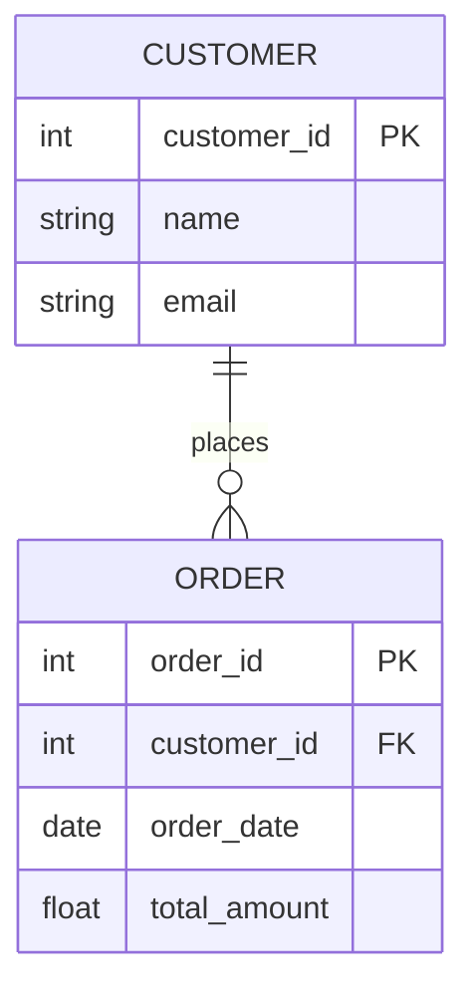
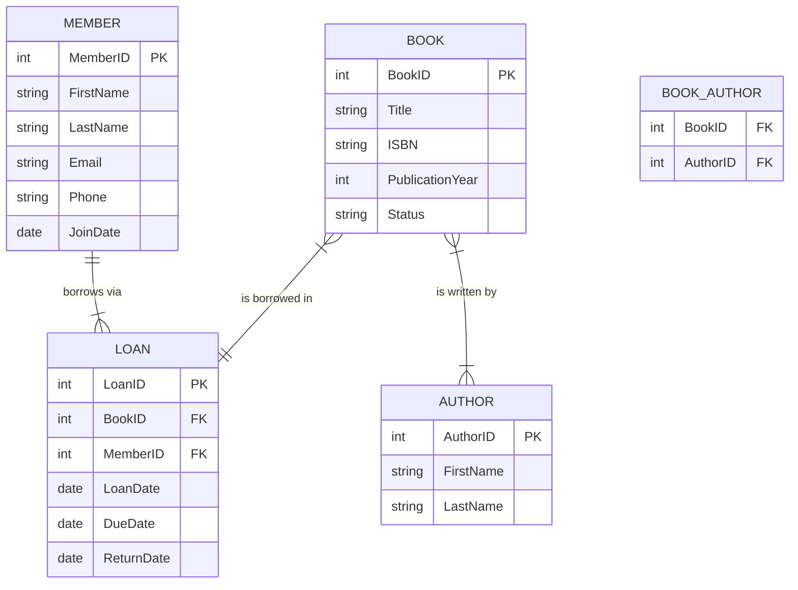
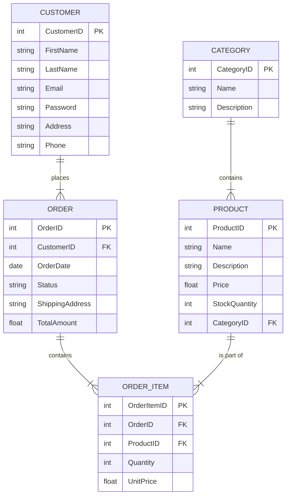

# Entity Relationship Diagrams

## Introduction

Entity Relationship Diagrams (ERDs) are visual tools that help database designers model and understand the logical structure of databases. They represent the relationships between different entities (or objects) in a system, making it easier to plan and implement relational databases effectively.

Think of an ERD as a blueprint for your database that shows:
- What types of data you need to store (entities)
- The characteristics of that data (attributes)
- How different pieces of data relate to each other (relationships)

Whether you're designing a simple application or a complex enterprise system, ERDs provide a clear visual language for communicating database designs among team members and stakeholders.

## Why ERDs Matter

Before writing a single line of SQL code, database designers typically create ERDs to:

- **Visualize data structure**: See the big picture of your data model
- **Identify entities and relationships**: Determine what data you need and how it's connected
- **Detect design flaws early**: Spot potential problems before implementation
- **Communicate with stakeholders**: Share database designs with non-technical team members
- **Guide implementation**: Use as a reference when creating actual database tables

## Basic Components of ERDs

### 1. Entities

An entity represents a real-world object, concept, or thing that we want to store information about. Examples include:

- Person (Student, Employee, Customer)
- Place (Store, Warehouse, Campus)
- Object (Product, Book, Vehicle)
- Event (Order, Enrollment, Appointment)
- Concept (Account, Course, Department)

In an ERD, entities are represented as rectangles with the entity name inside.

### 2. Attributes

Attributes are the properties or characteristics of an entity. For example, a `Student` entity might have attributes like:

- StudentID
- FirstName
- LastName
- DateOfBirth
- EmailAddress

The primary key (the attribute that uniquely identifies each instance of an entity) is typically underlined or marked with "PK".

### 3. Relationships

Relationships show how entities are connected to each other. They are represented by lines connecting entity rectangles, with symbols at each end indicating the type of relationship.

Common types of relationships include:

#### One-to-One (1:1)

Each instance of Entity A is related to exactly one instance of Entity B, and vice versa.

Example: One `Person` has one `Passport`, and each `Passport` belongs to exactly one `Person`.

#### One-to-Many (1:N)

Each instance of Entity A can be related to multiple instances of Entity B, but each instance of Entity B is related to only one instance of Entity A.

Example: One `Department` can have many `Employees`, but each `Employee` belongs to only one `Department`.

#### Many-to-Many (M:N)

Each instance of Entity A can be related to multiple instances of Entity B, and vice versa.

Example: A `Student` can enroll in multiple `Courses`, and each `Course` can have multiple `Students`.

## ERD Notation Styles

There are several notation styles for ERDs, including:

### Chen Notation

Created by Peter Chen, this original ERD notation uses:
- Rectangles for entities
- Ovals for attributes
- Diamonds for relationships
- Lines to connect them all

### Crow's Foot Notation

This popular notation uses different line endings to show relationship cardinality:
- A line with a crow's foot (three prongs) represents "many"
- A single line represents "one"
- A circle on the line represents "zero"

Here's a simple example using mermaid for a Crow's Foot diagram:



## Creating an ERD: Step by Step

Let's walk through the process of creating an ERD for a simple library management system:

### Step 1: Identify the Entities

For our library system, we might identify these entities:
- Book
- Author
- Member
- Loan

### Step 2: Determine the Attributes

For each entity, list its attributes:

**Book**:
- BookID (PK)
- Title
- ISBN
- PublicationYear
- Status

**Author**:
- AuthorID (PK)
- FirstName
- LastName

**Member**:
- MemberID (PK)
- FirstName
- LastName
- Email
- Phone
- JoinDate

**Loan**:
- LoanID (PK)
- BookID (FK)
- MemberID (FK)
- LoanDate
- DueDate
- ReturnDate

### Step 3: Establish Relationships

Now we define how these entities relate to each other:
- A Book can have multiple Authors, and an Author can write multiple Books (many-to-many)
- A Member can borrow multiple Books, and a Book can be borrowed by different Members over time (via the Loan entity)

### Step 4: Draw the ERD

Here's how our library ERD might look using mermaid:



Note that we've added a `BOOK_AUTHOR` entity to resolve the many-to-many relationship between Books and Authors.

## Practical Example: Building an E-commerce Database

Let's design an ERD for a simple e-commerce system to demonstrate a more complex real-world application.

### Entities and Attributes

**Customer**:
- CustomerID (PK)
- FirstName
- LastName
- Email
- Password
- Address
- Phone

**Product**:
- ProductID (PK)
- Name
- Description
- Price
- StockQuantity
- CategoryID (FK)

**Category**:
- CategoryID (PK)
- Name
- Description

**Order**:
- OrderID (PK)
- CustomerID (FK)
- OrderDate
- Status
- ShippingAddress
- TotalAmount

**OrderItem**:
- OrderItemID (PK)
- OrderID (FK)
- ProductID (FK)
- Quantity
- UnitPrice

### Relationships

- A Customer can place many Orders (one-to-many)
- An Order can contain many Products through OrderItems (many-to-many resolved by OrderItem)
- A Product belongs to one Category (many-to-one)

### ERD Diagram



## From ERD to Database Tables

Once you've created your ERD, you can translate it into actual database tables. Here's how the `Product` entity would become a SQL table:

```sql
CREATE TABLE Product (
    ProductID INT PRIMARY KEY AUTO_INCREMENT,
    Name VARCHAR(100) NOT NULL,
    Description TEXT,
    Price DECIMAL(10,2) NOT NULL,
    StockQuantity INT NOT NULL DEFAULT 0,
    CategoryID INT,
    FOREIGN KEY (CategoryID) REFERENCES Category(CategoryID)
);
```

For many-to-many relationships, you'll create junction tables. For example, if we had a direct many-to-many relationship between `Product` and `Tag`:

```sql
CREATE TABLE Product_Tag (
    ProductID INT,
    TagID INT,
    PRIMARY KEY (ProductID, TagID),
    FOREIGN KEY (ProductID) REFERENCES Product(ProductID),
    FOREIGN KEY (TagID) REFERENCES Tag(TagID)
);
```

## Common ERD Design Patterns

### 1. Star Schema

Used in data warehousing, this pattern has a central fact table connected to multiple dimension tables, creating a star-like structure.

### 2. Snowflake Schema

Similar to star schema but with dimension tables normalized into multiple related tables, creating a snowflake-like structure.

### 3. Bridge Tables

Used to resolve many-to-many relationships by creating an intermediate table that connects two entities.

## Best Practices for ERD Design

1. **Name entities clearly**: Use singular nouns for entity names (e.g., "Customer" not "Customers")
2. **Identify primary keys**: Every entity should have a unique identifier
3. **Normalize appropriately**: Follow normalization rules to reduce redundancy (typically to 3NF)
4. **Consider performance**: Sometimes denormalization is justified for performance reasons
5. **Document assumptions**: Add notes to your ERD explaining any design decisions
6. **Review with stakeholders**: Ensure the model captures all business requirements
7. **Iterate**: ERDs evolve as you learn more about the system requirements

## Common ERD Mistakes to Avoid

1. **Missing entities**: Forgetting to model important objects in your system
2. **Incorrect relationships**: Misrepresenting how entities relate to each other
3. **Overcomplicating**: Adding unnecessary entities or attributes
4. **Ignoring business rules**: Failing to incorporate important constraints
5. **Poor naming**: Using ambiguous or inconsistent naming conventions

## Tools for Creating ERDs

Several tools are available for creating ERDs:

- **Lucidchart**: Web-based diagramming tool with ERD templates
- **Draw.io** (diagrams.net): Free online diagram software
- **Microsoft Visio**: Professional diagramming software
- **ERDPlus**: Free online tool specifically for database modeling
- **MySQL Workbench**: Database design tool with built-in ERD capabilities
- **DbDiagram.io**: Simple, text-based ERD tool using DBML

## Summary

Entity Relationship Diagrams (ERDs) are essential tools for visualizing and planning database structures before implementation. They help you identify entities, attributes, and relationships clearly, making it easier to communicate your database design and catch potential issues early.

By understanding ERD notation and following best practices for database design, you can create efficient, maintainable database systems that accurately model your business requirements.

## Exercises

1. Create an ERD for a social media platform with entities such as User, Post, Comment, and Like.
2. Convert the following scenario into an ERD: A university has multiple departments. Each department offers several courses. Students can enroll in multiple courses, and each course can have many students enrolled.
3. Take the ERD you created in Exercise 1 and translate it into SQL CREATE TABLE statements.
4. Identify and fix the problems in this ERD snippet: A Customer entity connected to an Order entity with a many-to-many relationship, with no intermediary entity.
5. Create an ERD for a system you're interested in building (e.g., a recipe app, a workout tracker, or a personal budget manager).

## Additional Resources

- **Database Design for Mere Mortals** by Michael J. Hernandez
- **Database Systems: The Complete Book** by Hector Garcia-Molina
- **Stanford Database Course** (available online)
- W3Schools SQL Tutorial
- Khan Academy's SQL Course

Remember that ERD design is both a science and an art—while following established principles is important, the best database designs come from understanding your specific application's needs and constraints.