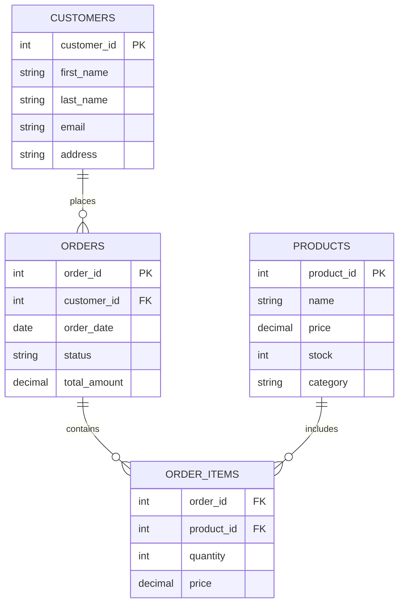

# Attributes and Domains

## Introduction

When working with relational databases, **attributes** and **domains** are fundamental concepts that form the building blocks of database design. Understanding these concepts is essential for creating efficient, consistent, and well-structured databases.

An **attribute** is a named column in a relation (table) that describes a property of the entities represented by that relation. A **domain** is the set of allowable values that an attribute can take. Together, these concepts help maintain data integrity and provide a framework for organizing information in a relational database.

## Attributes in Relational Databases

### What is an Attribute?

An attribute represents a specific characteristic or property of an entity. In database terms, attributes are the columns in a table, where each column holds data about a particular aspect of the entity represented by the table.

For example, in a `Students` table, we might have attributes such as:
- `student_id`
- `first_name`
- `last_name`
- `date_of_birth`
- `email`

Each attribute corresponds to a piece of information we want to store about students.

### Types of Attributes

Attributes can be categorized into several types:

#### 1. Simple vs. Composite Attributes

- **Simple Attribute**: Cannot be divided further.
  - Example: `student_id`

- **Composite Attribute**: Can be divided into smaller components.
  - Example: `name` might be divided into `first_name`, `middle_name`, and `last_name`

#### 2. Single-valued vs. Multi-valued Attributes

- **Single-valued Attribute**: Holds only one value for each entity instance.
  - Example: `date_of_birth`

- **Multi-valued Attribute**: Can hold multiple values for a single entity.
  - Example: `phone_numbers` (a person might have multiple phone numbers)
  
  In relational databases, multi-valued attributes are typically implemented by creating a separate table.

#### 3. Stored vs. Derived Attributes

- **Stored Attribute**: Physically stored in the database.
  - Example: `date_of_birth`

- **Derived Attribute**: Calculated from other attributes when needed.
  - Example: `age` (calculated from `date_of_birth` and current date)

#### 4. Null vs. Non-null Attributes

- **Null Attribute**: Can accept null values (meaning "unknown" or "not applicable").
  - Example: `middle_name` (not everyone has one)

- **Non-null Attribute**: Cannot accept null values, must always have a value.
  - Example: `student_id` (every student must have an ID)

## Domains in Relational Databases

### What is a Domain?

A domain is the set of allowable values that an attribute can take. It defines the valid data type and constraints for an attribute. Domains help ensure data consistency and integrity by restricting what values can be stored in the database.

### Components of a Domain

A domain typically includes:

1. **Data Type**: The fundamental type of data (integer, string, date, etc.)
2. **Length**: The size or precision of the data type
3. **Constraints**: Rules that restrict what values are valid
4. **Default Value**: The value used when no explicit value is provided

### Example of Domain Definitions

```sql
-- Create a domain for email addresses
CREATE DOMAIN Email AS VARCHAR(255)
  CHECK (VALUE ~ '^[a-zA-Z0-9._%+-]+@[a-zA-Z0-9.-]+\.[a-zA-Z]{2,}$');

-- Create a domain for US phone numbers
CREATE DOMAIN USPhoneNumber AS CHAR(12)
  CHECK (VALUE ~ '^\d{3}-\d{3}-\d{4}$');

-- Create a domain for age
CREATE DOMAIN Age AS INTEGER
  CHECK (VALUE >= 0 AND VALUE <= 120);
```

### Benefits of Using Domains

1. **Centralized Data Definition**: Define a domain once and use it across multiple tables
2. **Consistency**: Ensure the same constraints are applied wherever the domain is used
3. **Maintainability**: Change the domain definition in one place rather than updating multiple table definitions
4. **Semantic Clarity**: Domains add meaning to attribute definitions

## Relationship Between Attributes and Domains

Every attribute in a relational schema is associated with a domain. This association happens when a table is created:

```sql
CREATE TABLE Students (
  student_id INTEGER PRIMARY KEY,
  first_name VARCHAR(50) NOT NULL,
  last_name VARCHAR(50) NOT NULL,
  email Email NOT NULL,  -- using the Email domain defined earlier
  phone USPhoneNumber,   -- using the USPhoneNumber domain
  age Age                -- using the Age domain
);
```

In this example:
- The `student_id` attribute has the domain of integers
- The `first_name` and `last_name` attributes have the domain of variable character strings with a maximum length of 50
- The `email` attribute uses the custom `Email` domain
- The `phone` attribute uses the custom `USPhoneNumber` domain
- The `age` attribute uses the custom `Age` domain

## Attribute Constraints

Constraints are rules that restrict what values can be stored in the database. They help maintain data integrity and consistency.

### Types of Constraints

1. **Domain Constraints**: Restrict the attribute to values within its domain
2. **NOT NULL Constraints**: Require that an attribute must have a value
3. **UNIQUE Constraints**: Ensure all values in an attribute are distinct
4. **DEFAULT Constraints**: Provide a default value when none is specified
5. **CHECK Constraints**: Enforce a condition on the attribute's values

### Example of Constraints in SQL

```sql
CREATE TABLE Products (
  product_id INTEGER PRIMARY KEY,
  product_name VARCHAR(100) NOT NULL,
  price DECIMAL(10,2) CHECK (price >= 0),
  stock INTEGER NOT NULL DEFAULT 0 CHECK (stock >= 0),
  category VARCHAR(50) NOT NULL,
  UNIQUE (product_name)
);
```

In this example:
- `product_id` is constrained to be the primary key
- `product_name` is constrained to be not null and unique
- `price` is constrained to be non-negative
- `stock` is constrained to be not null, defaults to 0, and must be non-negative
- `category` is constrained to be not null

## Real-World Applications

### Example 1: E-commerce Database

In an e-commerce database, attributes and domains play crucial roles:



In this schema:

- The `PRODUCTS` table has attributes like `product_id`, `name`, `price`, `stock`, and `category`
- The `price` attribute might have a domain that ensures it's positive
- The `stock` attribute might have a domain that ensures it's a non-negative integer
- The `ORDERS` table has a `status` attribute with a domain limited to specific values like 'pending', 'shipped', 'delivered', etc.

### Example 2: Healthcare Database

In a healthcare system, attributes and domains help ensure data accuracy:

```sql
-- Patient table with various attributes and domain constraints
CREATE TABLE Patients (
  patient_id INTEGER PRIMARY KEY,
  first_name VARCHAR(50) NOT NULL,
  last_name VARCHAR(50) NOT NULL,
  dob DATE NOT NULL CHECK (dob <= CURRENT_DATE),
  blood_type VARCHAR(3) CHECK (blood_type IN ('A+', 'A-', 'B+', 'B-', 'AB+', 'AB-', 'O+', 'O-')),
  height_cm DECIMAL(5,2) CHECK (height_cm BETWEEN 30 AND 250),
  weight_kg DECIMAL(5,2) CHECK (weight_kg BETWEEN 0.5 AND 500)
);
```

In this example:
- The `dob` attribute has a domain constraint ensuring dates are not in the future
- The `blood_type` attribute has a domain limited to valid blood types
- The `height_cm` and `weight_kg` attributes have domains with reasonable biological ranges

## Best Practices for Attributes and Domains

1. **Choose Appropriate Data Types**: Select the most appropriate data type for each attribute to conserve storage and improve performance.

2. **Use Meaningful Names**: Give attributes clear, descriptive names that reflect their purpose.

3. **Apply Constraints**: Use constraints to enforce data integrity at the database level.

4. **Normalize Data**: Divide large tables into smaller, related tables to minimize redundancy.

5. **Document Domain Rules**: Clearly document the rules and constraints for each domain.

6. **Be Consistent**: Use the same domains for similar attributes across different tables.

7. **Consider Performance**: Be aware that complex domain constraints can impact performance.

## Summary

Attributes and domains are fundamental concepts in relational database design:

- **Attributes** are the columns in a table that represent properties of entities
- **Domains** are the sets of allowable values for attributes
- Together, they provide a framework for organizing and validating data
- Proper use of attributes and domains ensures data integrity and consistency
- Real-world applications demonstrate how these concepts are applied in practice

Understanding these concepts is essential for designing effective databases that accurately model the real world and maintain data quality.

## Exercises

1. Design a `Books` table with appropriate attributes and domains for a library database.

2. Create domain definitions for:
   - ISBN numbers
   - Email addresses
   - Credit card numbers
   - Geographic coordinates

3. Identify the types of attributes (simple/composite, single-valued/multi-valued, stored/derived) in a `Cars` table.

4. Create a schema for a social media database with appropriate attributes and domains for users, posts, and comments.

5. Modify the following table definition to include appropriate domain constraints:
   ```sql
   CREATE TABLE Employees (
     employee_id INTEGER,
     name VARCHAR(100),
     hire_date DATE,
     salary DECIMAL(10,2),
     department VARCHAR(50)
   );
   ```

## Additional Resources

- [Database Design for Mere Mortals](https://www.amazon.com/Database-Design-Mere-Mortals-Hands/dp/0321884493)
- [SQL Data Types](https://www.w3schools.com/sql/sql_datatypes.asp)
- [PostgreSQL Domain Types](https://www.postgresql.org/docs/current/domains.html)
- [Oracle Database Concepts](https://docs.oracle.com/en/database/oracle/oracle-database/19/cncpt/index.html)
- [MySQL Data Types](https://dev.mysql.com/doc/refman/8.0/en/data-types.html)