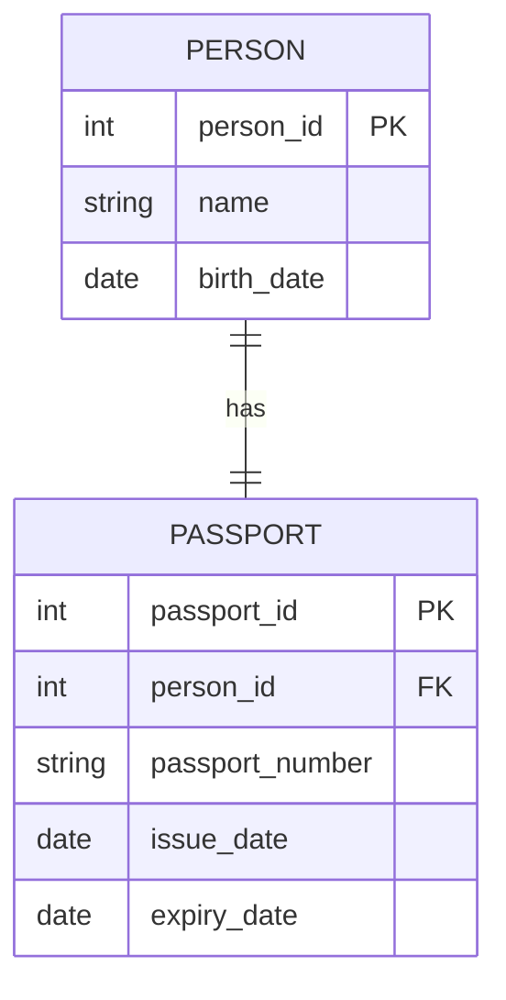
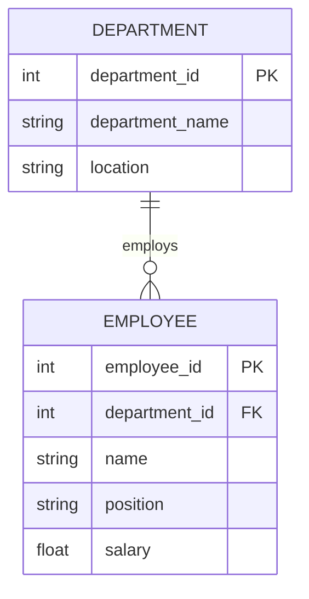
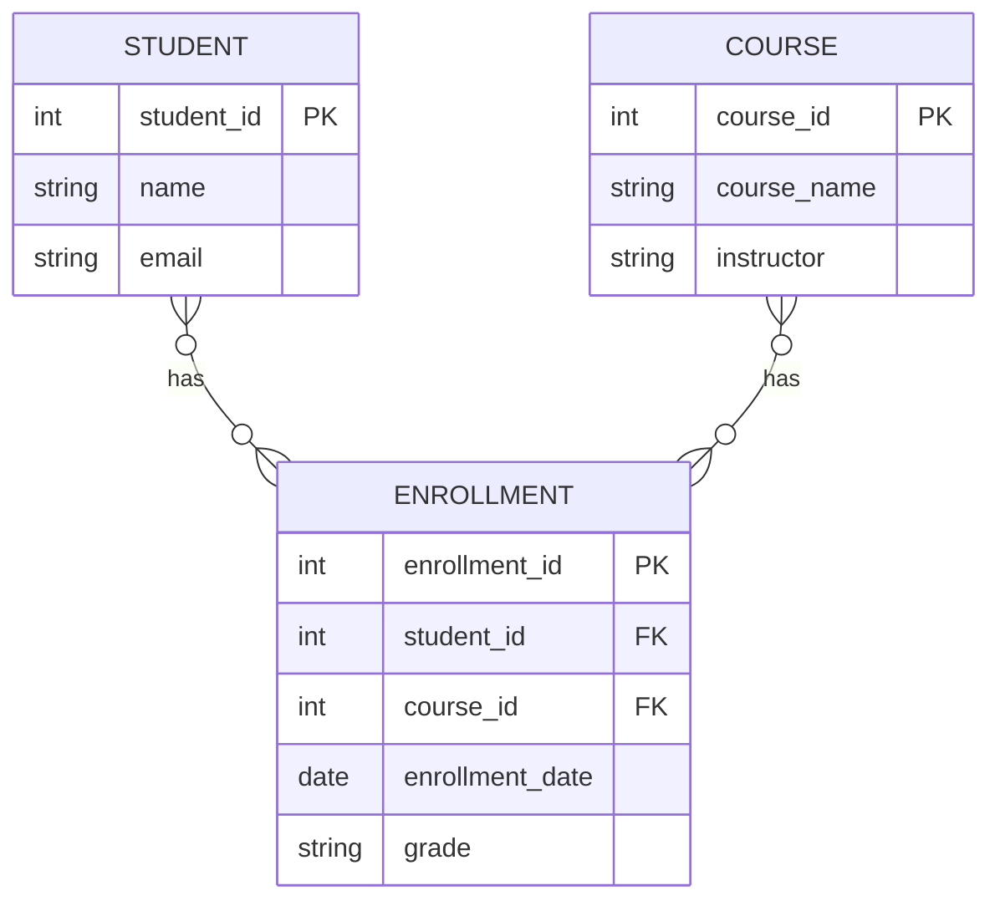
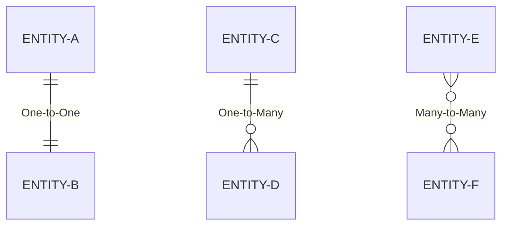
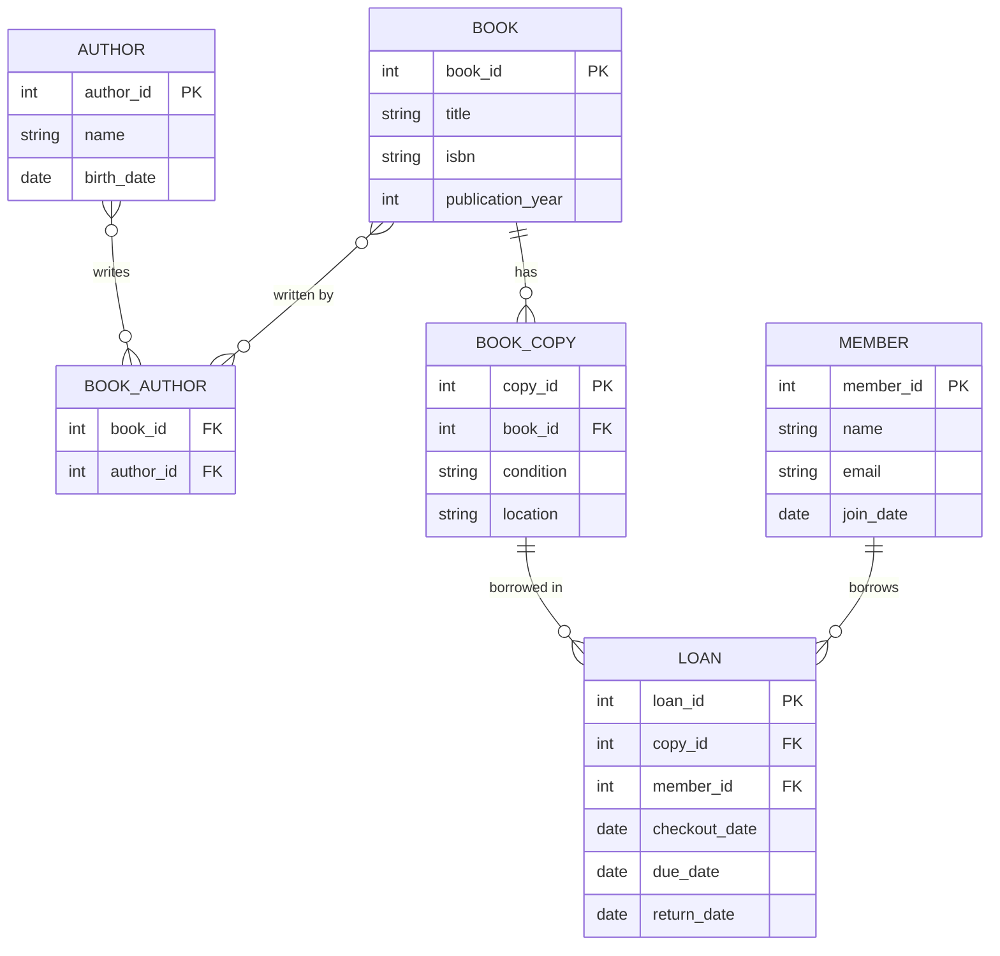

# Relationships and Cardinality

## Introduction

When designing a relational database, understanding how data entities relate to each other is crucial. These connections between entities form the foundation of relational database design, allowing us to model real-world relationships in our data structures.

In this guide, we'll explore two fundamental concepts:
- **Relationships**: How different entities connect to each other
- **Cardinality**: The numerical nature of these relationships

By the end of this tutorial, you'll understand how to identify and implement different types of relationships in your database designs, which is essential for creating efficient, logical, and maintainable database structures.

## What are Database Relationships?

A relationship in database design represents an association between entities (tables). Think of entities as nouns (things) in your system, like "Student," "Course," or "Book," and relationships as the verbs that connect them, like "enrolls in," "teaches," or "belongs to."

### Why Relationships Matter

Relationships allow us to:
- Prevent data redundancy
- Maintain data integrity
- Accurately model real-world connections
- Perform complex queries across related data

## Types of Relationships

There are three primary types of relationships in relational database design:

### 1. One-to-One (1:1)

In a one-to-one relationship, each record in Table A is related to exactly one record in Table B, and vice versa.

**Example**: A person and their passport information.



**Real-world implementation**:

```sql
CREATE TABLE Person (
    person_id INT PRIMARY KEY,
    name VARCHAR(100),
    birth_date DATE
);

CREATE TABLE Passport (
    passport_id INT PRIMARY KEY,
    person_id INT UNIQUE,
    passport_number VARCHAR(20),
    issue_date DATE,
    expiry_date DATE,
    FOREIGN KEY (person_id) REFERENCES Person(person_id)
);
```

The `UNIQUE` constraint on `person_id` in the Passport table ensures that each person can have only one passport record.

### 2. One-to-Many (1:N)

In a one-to-many relationship, each record in Table A can be related to multiple records in Table B, but each record in Table B is related to only one record in Table A.

**Example**: A department with multiple employees.



**Real-world implementation**:

```sql
CREATE TABLE Department (
    department_id INT PRIMARY KEY,
    department_name VARCHAR(100),
    location VARCHAR(100)
);

CREATE TABLE Employee (
    employee_id INT PRIMARY KEY,
    department_id INT,
    name VARCHAR(100),
    position VARCHAR(100),
    salary DECIMAL(10,2),
    FOREIGN KEY (department_id) REFERENCES Department(department_id)
);
```

### 3. Many-to-Many (N:M)

In a many-to-many relationship, each record in Table A can be related to multiple records in Table B, and each record in Table B can be related to multiple records in Table A.

**Example**: Students and courses. A student can enroll in multiple courses, and each course can have multiple students.

Many-to-many relationships require a junction table (also called a bridge or associative table) to implement properly.



**Real-world implementation**:

```sql
CREATE TABLE Student (
    student_id INT PRIMARY KEY,
    name VARCHAR(100),
    email VARCHAR(100)
);

CREATE TABLE Course (
    course_id INT PRIMARY KEY,
    course_name VARCHAR(100),
    instructor VARCHAR(100)
);

CREATE TABLE Enrollment (
    enrollment_id INT PRIMARY KEY,
    student_id INT,
    course_id INT,
    enrollment_date DATE,
    grade VARCHAR(2),
    FOREIGN KEY (student_id) REFERENCES Student(student_id),
    FOREIGN KEY (course_id) REFERENCES Course(course_id)
);
```

## Understanding Cardinality

Cardinality defines the numerical relationship between entities—how many instances of one entity relate to instances of another entity.

### Cardinality Notation

Several notations exist for representing cardinality. We'll focus on the most common ones:

#### Crow's Foot Notation



In Crow's Foot notation:
- `||` represents "exactly one"
- `o|` represents "zero or one"
- `|{` represents "one or many"
- `o{` represents "zero or many"

#### Min-Max Notation

Min-max notation specifies the minimum and maximum number of relationships:
- (0,1): Zero or one
- (1,1): Exactly one
- (0,n): Zero or many
- (1,n): One or many

### Cardinality Constraints in SQL

Database systems implement cardinality through constraints:

1. **Primary Key constraints**: Ensure uniqueness
2. **Foreign Key constraints**: Establish relationships
3. **UNIQUE constraints**: Enforce one-to-one relationships
4. **NOT NULL constraints**: Ensure required relationships

## Practical Example: Library Database

Let's design a small library database system to demonstrate relationships and cardinality.

### Entities and Relationships:
- Books and Authors (Many-to-Many): A book can have multiple authors, and an author can write multiple books.
- Books and Copies (One-to-Many): A book can have multiple physical copies in the library.
- Members and Loans (One-to-Many): A member can borrow multiple books, but each loan belongs to one member.



### SQL Implementation:

```sql
-- Books table
CREATE TABLE Book (
    book_id INT PRIMARY KEY,
    title VARCHAR(200) NOT NULL,
    isbn VARCHAR(13),
    publication_year INT
);

-- Authors table
CREATE TABLE Author (
    author_id INT PRIMARY KEY,
    name VARCHAR(100) NOT NULL,
    birth_date DATE
);

-- Many-to-many relationship between Books and Authors
CREATE TABLE Book_Author (
    book_id INT,
    author_id INT,
    PRIMARY KEY (book_id, author_id),
    FOREIGN KEY (book_id) REFERENCES Book(book_id),
    FOREIGN KEY (author_id) REFERENCES Author(author_id)
);

-- Physical copies of books (one-to-many with Book)
CREATE TABLE Book_Copy (
    copy_id INT PRIMARY KEY,
    book_id INT,
    condition VARCHAR(50),
    location VARCHAR(50),
    FOREIGN KEY (book_id) REFERENCES Book(book_id)
);

-- Library members
CREATE TABLE Member (
    member_id INT PRIMARY KEY,
    name VARCHAR(100) NOT NULL,
    email VARCHAR(100) UNIQUE,
    join_date DATE
);

-- Loans (connects Members and Book Copies)
CREATE TABLE Loan (
    loan_id INT PRIMARY KEY,
    copy_id INT,
    member_id INT,
    checkout_date DATE NOT NULL,
    due_date DATE NOT NULL,
    return_date DATE,
    FOREIGN KEY (copy_id) REFERENCES Book_Copy(copy_id),
    FOREIGN KEY (member_id) REFERENCES Member(member_id)
);
```

### Example Queries Utilizing Relationships

**Find all books written by a specific author:**

```sql
SELECT b.title, b.publication_year
FROM Book b
JOIN Book_Author ba ON b.book_id = ba.book_id
JOIN Author a ON ba.author_id = a.author_id
WHERE a.name = 'J.K. Rowling';
```

**Find all current loans for a specific member:**

```sql
SELECT b.title, l.checkout_date, l.due_date
FROM Loan l
JOIN Book_Copy bc ON l.copy_id = bc.copy_id
JOIN Book b ON bc.book_id = b.book_id
JOIN Member m ON l.member_id = m.member_id
WHERE m.name = 'John Smith'
AND l.return_date IS NULL;
```

## Common Challenges and Solutions

### Dealing with Optional Relationships

Sometimes relationships are optional (e.g., an employee might not be assigned to any project). This is handled with nullable foreign keys.

```sql
CREATE TABLE Employee (
    employee_id INT PRIMARY KEY,
    name VARCHAR(100),
    department_id INT NULL,  -- Optional relationship
    FOREIGN KEY (department_id) REFERENCES Department(department_id)
);
```

### Self-Referencing Relationships

Entities can have relationships with themselves (e.g., employees and managers).

```sql
CREATE TABLE Employee (
    employee_id INT PRIMARY KEY,
    name VARCHAR(100),
    manager_id INT,
    FOREIGN KEY (manager_id) REFERENCES Employee(employee_id)
);
```

### Recursive Relationships (Hierarchical Data)

For hierarchical data like categories and subcategories:

```sql
CREATE TABLE Category (
    category_id INT PRIMARY KEY,
    name VARCHAR(100),
    parent_category_id INT,
    FOREIGN KEY (parent_category_id) REFERENCES Category(category_id)
);
```

## Best Practices for Designing Relationships

1. **Start with entities**: Identify the main entities in your system before defining relationships.
2. **Use proper naming conventions**: Name your tables, columns, and constraints consistently.
3. **Consider performance implications**: Relationships can affect query performance.
4. **Use foreign key constraints**: These maintain referential integrity.
5. **Document your design**: Create entity-relationship diagrams for visualization.
6. **Normalize appropriately**: Use normalization techniques to reduce redundancy.
7. **Consider business rules**: Business rules often dictate relationship cardinality.

## Summary

Understanding relationships and cardinality is essential for effective database design. By correctly identifying and implementing one-to-one, one-to-many, and many-to-many relationships, you can create database structures that accurately model real-world scenarios while maintaining data integrity.

Remember these key points:
- Relationships connect entities in your database
- Cardinality defines the numerical nature of these relationships
- Foreign keys implement relationships at the database level
- Junction tables are needed for many-to-many relationships
- Proper relationship design reduces redundancy and improves data consistency

## Exercises

1. Design a database schema for an online shopping system with customers, products, orders, and categories.
2. Identify the entities, relationships, and cardinality in a school management system.
3. Convert the following real-world scenarios into proper database relationships:
   - A patient can visit multiple doctors, and doctors see multiple patients
   - Each car has one vehicle identification number (VIN)
   - A blog post can have multiple tags, and each tag can be applied to multiple posts
