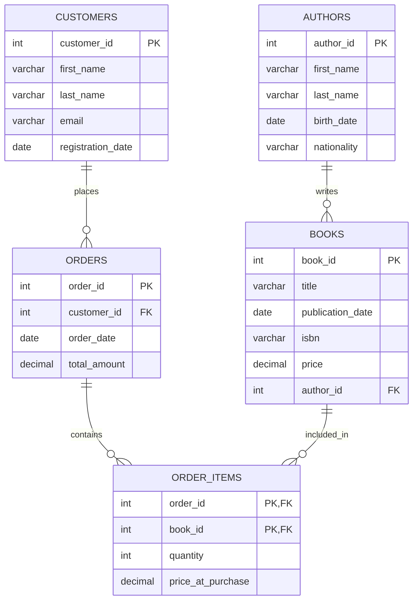

# Database Schema

## Introduction

A database schema is the blueprint or structure that defines how data is organized within a database. Think of it as the architectural plan that outlines the logical configuration of all data, the relationships between different data elements, and the constraints that should be enforced. Just as blueprints guide construction workers in building a house, a database schema guides a database management system (DBMS) in organizing and storing data.

For beginners entering the world of relational databases, understanding schemas is foundational knowledge that will help you design efficient, scalable, and maintainable database solutions.

## What is a Database Schema?

A database schema defines:

1. **Tables** - the main structures that store data
2. **Fields** - columns within tables that hold specific types of data
3. **Relationships** - how different tables connect to each other
4. **Constraints** - rules that maintain data integrity
5. **Indexes** - structures that improve query performance

The schema acts as a contract that specifies what kind of data can be stored and how it's organized, without actually containing the data itself.

## Types of Database Schemas

There are three main levels of schemas in database design:

### 1. Conceptual Schema

This is the highest-level schema that outlines the entire database structure. It focuses on what data will be stored rather than how it will be stored. This schema is often created using Entity-Relationship Diagrams (ERD).

### 2. Logical Schema

This middle-level schema defines the database structure in terms of tables, columns, relationships, and constraints, but without implementation details specific to any database system.

### 3. Physical Schema

This lowest-level schema describes how data is physically stored on the storage medium, including file organizations, indexes, and access methods. It's specific to the database management system being used.

## Creating a Database Schema

Let's walk through creating a simple database schema for an online bookstore:

```sql
-- Create a table for authors
CREATE TABLE authors (
    author_id INT PRIMARY KEY,
    first_name VARCHAR(50) NOT NULL,
    last_name VARCHAR(50) NOT NULL,
    birth_date DATE,
    nationality VARCHAR(50)
);

-- Create a table for books
CREATE TABLE books (
    book_id INT PRIMARY KEY,
    title VARCHAR(100) NOT NULL,
    publication_date DATE,
    isbn VARCHAR(13) UNIQUE,
    price DECIMAL(6,2),
    author_id INT,
    FOREIGN KEY (author_id) REFERENCES authors(author_id)
);

-- Create a table for customers
CREATE TABLE customers (
    customer_id INT PRIMARY KEY,
    first_name VARCHAR(50) NOT NULL,
    last_name VARCHAR(50) NOT NULL,
    email VARCHAR(100) UNIQUE,
    registration_date DATE
);

-- Create an orders table
CREATE TABLE orders (
    order_id INT PRIMARY KEY,
    customer_id INT,
    order_date DATE NOT NULL,
    total_amount DECIMAL(8,2),
    FOREIGN KEY (customer_id) REFERENCES customers(customer_id)
);

-- Create an order_items junction table to represent many-to-many relationship
CREATE TABLE order_items (
    order_id INT,
    book_id INT,
    quantity INT NOT NULL DEFAULT 1,
    price_at_purchase DECIMAL(6,2) NOT NULL,
    PRIMARY KEY (order_id, book_id),
    FOREIGN KEY (order_id) REFERENCES orders(order_id),
    FOREIGN KEY (book_id) REFERENCES books(book_id)
);
```

This schema creates five tables with relationships between them:
- `authors` stores information about book authors
- `books` contains book details and relates to authors
- `customers` stores customer information
- `orders` tracks customer orders
- `order_items` is a junction table that represents the many-to-many relationship between books and orders

## Schema Diagram

Let's visualize this schema using a diagram:



## Key Schema Elements

### Tables

Tables are the primary objects in a relational database. Each table represents an entity (like authors, books, customers) and consists of rows and columns.

### Columns/Fields

Columns represent attributes of an entity. For example, in the `books` table, columns include `title`, `publication_date`, and `price`.

### Data Types

Each column in a table must have a specified data type:
- `INT` for whole numbers
- `VARCHAR` for variable-length text
- `DATE` for dates
- `DECIMAL` for precise numeric values with decimal places

### Primary Keys

Primary keys uniquely identify each record in a table. In our example:
- `author_id` identifies each author
- `book_id` identifies each book
- `customer_id` identifies each customer
- `order_id` identifies each order
- The combination of `order_id` and `book_id` identifies each order item

### Foreign Keys

Foreign keys establish relationships between tables. For example, `author_id` in the `books` table references the `author_id` in the `authors` table, creating a relationship.

### Constraints

Constraints enforce rules on the data:
- `NOT NULL` ensures a column can't have a NULL value
- `UNIQUE` ensures all values in a column are distinct
- `DEFAULT` provides a default value for a column
- `CHECK` ensures that values meet specific conditions

## Schema Design Principles

When designing your schema, consider these principles:

### 1. Normalization

Normalization is the process of organizing data to reduce redundancy and improve data integrity. The most common forms are:

- **First Normal Form (1NF)**: Eliminate duplicate columns and create separate tables for related data
- **Second Normal Form (2NF)**: Meet 1NF requirements and ensure all non-key attributes depend on the entire primary key
- **Third Normal Form (3NF)**: Meet 2NF requirements and ensure all attributes depend only on the primary key

### 2. Relationships

Understand the types of relationships:
- **One-to-One**: One record in Table A relates to exactly one record in Table B
- **One-to-Many**: One record in Table A relates to many records in Table B
- **Many-to-Many**: Many records in Table A relate to many records in Table B (requires a junction table)

In our bookstore example:
- Authors to Books: One-to-Many (one author can write many books)
- Customers to Orders: One-to-Many (one customer can place many orders)
- Books to Orders: Many-to-Many (implemented via the `order_items` junction table)

### 3. Indexing

Indexes improve query performance but come with maintenance costs. Common types include:
- Primary key indexes (created automatically)
- Foreign key indexes
- Composite indexes (on multiple columns)

```sql
-- Creating an index on the ISBN column for faster lookups
CREATE INDEX idx_books_isbn ON books(isbn);
```

## Real-World Application: Library Management System

Let's explore how schemas apply to a real-world library management system:

```sql
-- Define the schema for a library management system
CREATE TABLE library_branches (
    branch_id INT PRIMARY KEY,
    branch_name VARCHAR(100) NOT NULL,
    address VARCHAR(200) NOT NULL,
    phone VARCHAR(15)
);

CREATE TABLE books (
    book_id INT PRIMARY KEY,
    title VARCHAR(200) NOT NULL,
    author VARCHAR(100) NOT NULL,
    isbn VARCHAR(13) UNIQUE,
    publication_year INT,
    genre VARCHAR(50),
    total_copies INT NOT NULL DEFAULT 0
);

CREATE TABLE book_copies (
    copy_id INT PRIMARY KEY,
    book_id INT,
    branch_id INT,
    status VARCHAR(20) CHECK (status IN ('Available', 'Checked Out', 'Under Repair')),
    FOREIGN KEY (book_id) REFERENCES books(book_id),
    FOREIGN KEY (branch_id) REFERENCES library_branches(branch_id)
);

CREATE TABLE members (
    member_id INT PRIMARY KEY,
    first_name VARCHAR(50) NOT NULL,
    last_name VARCHAR(50) NOT NULL,
    email VARCHAR(100) UNIQUE,
    join_date DATE NOT NULL,
    membership_type VARCHAR(20) DEFAULT 'Standard'
);

CREATE TABLE loans (
    loan_id INT PRIMARY KEY,
    copy_id INT,
    member_id INT,
    loan_date DATE NOT NULL,
    due_date DATE NOT NULL,
    return_date DATE,
    FOREIGN KEY (copy_id) REFERENCES book_copies(copy_id),
    FOREIGN KEY (member_id) REFERENCES members(member_id)
);
```

This schema allows the library to:
1. Track multiple branches
2. Manage book inventory across branches
3. Keep member records
4. Record book loans and returns
5. Enforce business rules (like checking if a book is available)

## Schema Evolution and Maintenance

Database schemas aren't static—they evolve as application requirements change. Common changes include:

### Adding New Columns

```sql
-- Adding a 'language' column to the books table
ALTER TABLE books ADD COLUMN language VARCHAR(50);
```

### Modifying Existing Columns

```sql
-- Changing the size of the title column
ALTER TABLE books MODIFY COLUMN title VARCHAR(300);
```

### Adding Constraints

```sql
-- Adding a check constraint to ensure publication_year is reasonable
ALTER TABLE books ADD CONSTRAINT check_pub_year CHECK (publication_year BETWEEN 1000 AND 2100);
```

### Creating New Tables

```sql
-- Adding a new table for book reviews
CREATE TABLE book_reviews (
    review_id INT PRIMARY KEY,
    book_id INT,
    member_id INT,
    rating INT CHECK (rating BETWEEN 1 AND 5),
    review_text TEXT,
    review_date DATE,
    FOREIGN KEY (book_id) REFERENCES books(book_id),
    FOREIGN KEY (member_id) REFERENCES members(member_id)
);
```

## Best Practices for Schema Design

1. **Plan before implementing**: Create ER diagrams and think through your design
2. **Use naming conventions**: Be consistent with table and column names
3. **Apply appropriate normalization**: Balance data integrity and performance
4. **Document your schema**: Keep documentation updated as the schema evolves
5. **Consider performance**: Think about query patterns and add appropriate indexes
6. **Don't forget data types**: Choose appropriate types for efficient storage
7. **Apply constraints**: Use constraints to enforce business rules
8. **Test with real data**: Validate your schema with realistic data volumes

## Schema Viewing and Management Tools

Most database management systems provide tools to view and manage schemas:

- **MySQL Workbench**: Visual tool for MySQL
- **pgAdmin**: Management tool for PostgreSQL
- **SQL Server Management Studio**: For Microsoft SQL Server
- **DBeaver**: Universal database tool supporting multiple database systems

These tools allow you to visualize relationships, modify schemas, and generate documentation.

## Common Schema Problems and Solutions

### Problem: Table with Too Many Columns

**Solution**: Split the table into multiple related tables using normalization principles.

### Problem: Performance Issues with Large Tables

**Solution**: Consider partitioning tables, adding appropriate indexes, or denormalizing specific parts for read performance.

### Problem: Difficulty Managing Schema Changes

**Solution**: Implement database migration tools like Flyway or Liquibase to track and apply schema changes systematically.

### Problem: Complex Queries Due to Too Many Joins

**Solution**: Consider if your schema is over-normalized and whether some strategic denormalization would help.

## Summary

A database schema is the foundation of your database design, defining how data is organized and related. By understanding the principles of schema design, you can create databases that are:

- Efficient in storage and queries
- Easy to maintain and extend
- Able to enforce data integrity
- Capable of supporting complex business requirements

As you gain experience, you'll develop an intuition for balancing the theoretical principles of database design with the practical needs of your applications.

## Exercises

1. Design a database schema for a social media platform with users, posts, comments, and likes.
2. Modify the bookstore schema to include book categories and support for multiple authors per book.
3. Identify potential normalization issues in this table:
   ```
   orders(order_id, customer_name, customer_email, product1_id, product1_quantity, product2_id, product2_quantity)
   ```
4. Create a schema diagram for a simple blog with users, posts, categories, and comments.

## Additional Resources

- [Database Design for Mere Mortals](https://www.informit.com/store/database-design-for-mere-mortals-a-hands-on-guide-to-9780134449401) by Michael J. Hernandez
- [SQL Antipatterns](https://pragprog.com/titles/bksqla/sql-antipatterns/) by Bill Karwin
- [Normalization of Database](https://www.geeksforgeeks.org/normal-forms-in-dbms/) on GeeksforGeeks
- [Schema Design Patterns](https://www.mongodb.com/blog/post/building-with-patterns-a-summary) (focuses on MongoDB but has useful concepts)