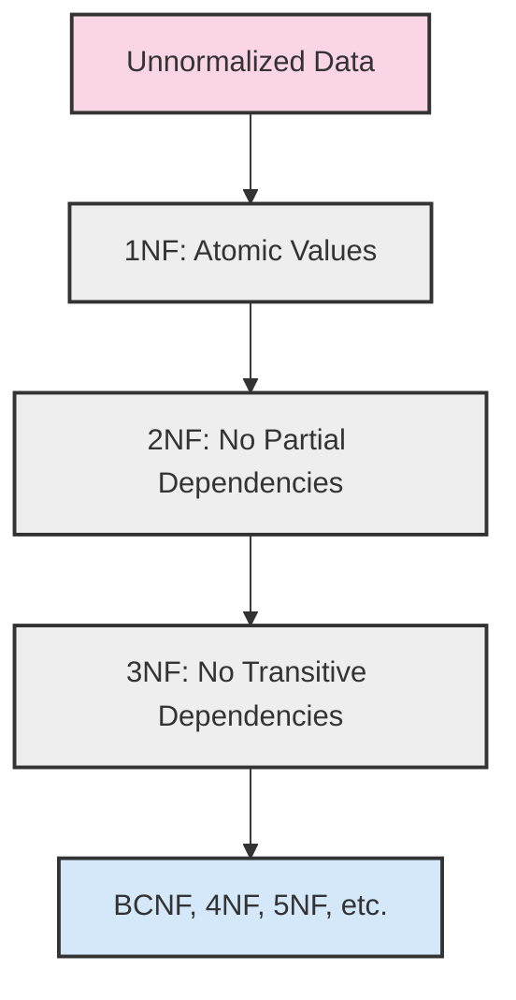

# Normalization Introduction

Database normalization is a systematic approach to organizing data in a relational database. It's a foundational concept that helps you design databases that are efficient, reduce redundancy, and minimize data anomalies. In this introduction, we'll explore what normalization is, why it matters, and the basic forms of normalization.

## What is Normalization?

Normalization is a technique for structuring relational database tables to minimize redundancy and dependency. It involves dividing large tables into smaller ones and defining relationships between them.

Think of normalization as the process of organizing your closet:
- **Unnormalized**: Throwing all your clothes in one big pile (difficult to find items, wasted space)
- **Normalized**: Organizing clothes by type, season, or color in separate drawers (efficient, organized, easy to maintain)

## Why Normalize?

Normalization offers several significant benefits:

1. **Eliminates data redundancy**: Reduces duplicate data, saving storage space
2. **Improves data integrity**: Makes it easier to maintain accurate data
3. **Simplifies data maintenance**: Updates, inserts, and deletes become more straightforward
4. **Enhances query performance**: Often improves performance for complex queries
5. **Facilitates database scalability**: Makes it easier to expand your database as needs grow

## Database Anomalies

Before diving into normalization forms, let's understand the problems that normalization solves. Poorly designed databases suffer from three types of anomalies:

### 1. Update Anomalies

When data is duplicated and only some instances are updated, inconsistencies occur.

**Example**: In an unnormalized student course table:

```sql
| StudentID | StudentName | CourseID | CourseName    | InstructorName |
|-----------|-------------|----------|---------------|----------------|
| 101       | John Smith  | CS101    | Programming   | Dr. Johnson    |
| 102       | Mary Jones  | CS101    | Programming   | Dr. Johnson    |
| 101       | John Smith  | CS102    | Databases     | Dr. Williams   |
```

If Dr. Johnson changes her name to Dr. Johnson-Smith, we'd need to update multiple rows, risking inconsistencies.

### 2. Insertion Anomalies

When you cannot add certain data without the presence of other data.

**Example**: Using the same table structure, we cannot add a new course until at least one student enrolls in it.

### 3. Deletion Anomalies

When deleting some data unintentionally causes other data to be lost.

**Example**: If Mary Jones drops out and we delete her record, we lose information about the CS101 course and its instructor.

## Normalization Forms

Normalization is typically carried out through a series of "normal forms," each building upon the previous one. Let's explore the three fundamental normal forms:

### First Normal Form (1NF)

A table is in 1NF if:
- It has a primary key
- All attributes depend on the primary key
- Each column contains atomic (indivisible) values
- No repeating groups exist

#### Before 1NF
```sql
| StudentID | Courses                         |
|-----------|----------------------------------|
| 101       | CS101, CS102, MATH101           |
| 102       | CS101, PHYS101                  |
```

#### After 1NF
```sql
| StudentID | CourseID |
|-----------|----------|
| 101       | CS101    |
| 101       | CS102    |
| 101       | MATH101  |
| 102       | CS101    |
| 102       | PHYS101  |
```

### Second Normal Form (2NF)

A table is in 2NF if:
- It is already in 1NF
- All non-key attributes are fully dependent on the entire primary key (not just part of it)

This mainly applies to tables with composite primary keys.

#### Before 2NF
```sql
| StudentID | CourseID | StudentName | CourseName    | InstructorName |
|-----------|----------|-------------|---------------|----------------|
| 101       | CS101    | John Smith  | Programming   | Dr. Johnson    |
| 101       | CS102    | John Smith  | Databases     | Dr. Williams   |
| 102       | CS101    | Mary Jones  | Programming   | Dr. Johnson    |
```

Here `StudentName` depends only on `StudentID`, not the full key `(StudentID, CourseID)`.

#### After 2NF
```sql
-- Students Table
| StudentID | StudentName |
|-----------|-------------|
| 101       | John Smith  |
| 102       | Mary Jones  |

-- Courses Table
| CourseID | CourseName    | InstructorName |
|----------|---------------|----------------|
| CS101    | Programming   | Dr. Johnson    |
| CS102    | Databases     | Dr. Williams   |

-- Enrollments Table
| StudentID | CourseID |
|-----------|----------|
| 101       | CS101    |
| 101       | CS102    |
| 102       | CS101    |
```

### Third Normal Form (3NF)

A table is in 3NF if:
- It is already in 2NF
- No non-key attribute depends on another non-key attribute (no transitive dependencies)

#### Before 3NF
```sql
| CourseID | CourseName    | InstructorID | InstructorName |
|----------|---------------|--------------|----------------|
| CS101    | Programming   | I001         | Dr. Johnson    |
| CS102    | Databases     | I002         | Dr. Williams   |
```

Here `InstructorName` depends on `InstructorID`, not directly on the primary key `CourseID`.

#### After 3NF
```sql
-- Courses Table
| CourseID | CourseName    | InstructorID |
|----------|---------------|--------------|
| CS101    | Programming   | I001         |
| CS102    | Databases     | I002         |

-- Instructors Table
| InstructorID | InstructorName |
|--------------|----------------|
| I001         | Dr. Johnson    |
| I002         | Dr. Williams   |
```

## Visualizing Normalization

Here's a diagram showing the progression of normalization:



## Real-World Example: Online Bookstore

Let's design a normalized database for an online bookstore:

### Unnormalized Table
```sql
| OrderID | CustomerName | CustomerEmail       | BookTitle          | Author        | Price | OrderDate  |
|---------|--------------|---------------------|-------------------|---------------|-------|------------|
| 1001    | John Smith   | john@example.com    | Database Design   | E.F. Codd     | 29.99 | 2023-01-15 |
| 1002    | Mary Jones   | mary@example.com    | SQL Basics        | C.J. Date     | 24.99 | 2023-01-16 |
| 1003    | John Smith   | john@example.com    | SQL Basics        | C.J. Date     | 24.99 | 2023-01-17 |
```

### Normalized Tables (3NF)

```sql
-- Customers Table
| CustomerID | CustomerName | CustomerEmail       |
|------------|--------------|---------------------|
| C001       | John Smith   | john@example.com    |
| C002       | Mary Jones   | mary@example.com    |

-- Books Table
| BookID | BookTitle          | Author        | Price |
|--------|-------------------|---------------|-------|
| B001   | Database Design   | E.F. Codd     | 29.99 |
| B002   | SQL Basics        | C.J. Date     | 24.99 |

-- Orders Table
| OrderID | CustomerID | OrderDate  |
|---------|------------|------------|
| 1001    | C001       | 2023-01-15 |
| 1002    | C002       | 2023-01-16 |
| 1003    | C001       | 2023-01-17 |

-- OrderDetails Table
| OrderID | BookID | Quantity |
|---------|--------|----------|
| 1001    | B001   | 1        |
| 1002    | B002   | 1        |
| 1003    | B002   | 1        |
```

This normalized design:
- Eliminates redundant data (customer info stored only once)
- Makes updates easier (changing a book's price only updates one row)
- Allows for more flexible queries (easily find all books by an author)
- Enables more complex relationships (customers can buy multiple books, books can be in multiple orders)

## Denormalization: When to Break the Rules

While normalization is generally beneficial, sometimes deliberately introducing some redundancy (denormalization) can improve performance for specific read-heavy scenarios. This is an advanced topic, but it's worth knowing that normalization isn't always the end goal.

## Summary

Normalization is a critical database design technique that:
- Organizes data efficiently by dividing information into related tables
- Reduces redundancy and dependency, saving storage space
- Improves data integrity by eliminating update, insertion, and deletion anomalies
- Follows a structured approach through normal forms (1NF, 2NF, 3NF, etc.)

As you design databases, aim for at least Third Normal Form (3NF) to ensure a solid foundation, but be aware that higher normal forms (BCNF, 4NF, 5NF) exist for more complex scenarios.

## Exercises

1. Identify the normal form of this table and explain why:
   ```sql
   | EmployeeID | Department | DepartmentPhone |
   |------------|------------|-----------------|
   | E001       | Sales      | 555-1234        |
   | E002       | Marketing  | 555-5678        |
   | E003       | Sales      | 555-1234        |
   ```

2. Convert this unnormalized table to 3NF:
   ```sql
   | StudentID | StudentName | Course | Professor | ProfessorOffice |
   |-----------|-------------|--------|-----------|-----------------|
   | S1        | John        | Math   | Dr. Smith | Room 101        |
   | S2        | Mary        | Science| Dr. Jones | Room 102        |
   | S1        | John        | Science| Dr. Jones | Room 102        |
   ```

3. Design a normalized database (3NF) for a library with books, authors, members, and loans.

## Additional Resources

- **Books**:
  - "Database Design for Mere Mortals" by Michael J. Hernandez
  - "SQL Antipatterns" by Bill Karwin

- **Online Tutorials**:
  - W3Schools SQL Tutorial
  - Khan Academy's SQL course

Remember that normalization is as much an art as it is a science. With practice, you'll develop an intuition for good database design that balances theoretical purity with practical considerations.