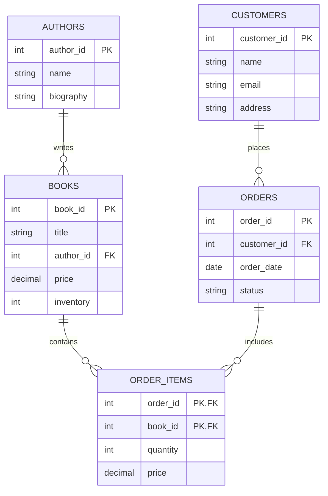

# Integrity Constraints in Relational Databases

## Introduction

Integrity constraints are rules that help maintain the accuracy and consistency of data in a relational database. They act as a safeguard against accidental data corruption due to user errors, application bugs, or system failures. By enforcing these constraints, databases ensure that data adheres to the business rules and remains reliable over time.

Think of integrity constraints as the guardrails that keep your data on the right track. Just as guardrails prevent vehicles from going off the road, integrity constraints prevent invalid data from entering your database.

## Why Integrity Constraints Matter

Before diving into the types of constraints, let's understand why they're essential:

1. **Data Quality**: They ensure that data remains accurate and follows defined rules.
2. **Error Prevention**: They catch mistakes before they corrupt your database.
3. **Business Rules Enforcement**: They translate business requirements into technical controls.
4. **Data Consistency**: They maintain logical relationships between tables and records.

## Types of Integrity Constraints

Let's explore the main types of integrity constraints in relational databases:

### 1. Domain Constraints

Domain constraints specify the allowed values for a column. They define the "domain" or set of valid values that a column can hold.

#### Example:

```sql
CREATE TABLE Students (
    age INTEGER CHECK (age > 0 AND age < 120),
    grade CHAR(1) CHECK (grade IN ('A', 'B', 'C', 'D', 'F'))
);
```

In this example:
- The `age` column must contain values between 1 and 119.
- The `grade` column can only contain one of the specified letters.

### 2. Entity Integrity (Primary Key Constraint)

Entity integrity ensures that each row in a table is uniquely identifiable. It's implemented through primary keys, which must be unique and non-null.

#### Example:

```sql
CREATE TABLE Students (
    student_id INTEGER PRIMARY KEY,
    first_name VARCHAR(50) NOT NULL,
    last_name VARCHAR(50) NOT NULL
);
```

Here, `student_id` serves as the primary key. No two students can have the same ID, and it cannot be null.

### 3. Referential Integrity (Foreign Key Constraint)

Referential integrity maintains consistency among related tables. It ensures that a foreign key in one table refers to a valid primary key in another table.

#### Example:

```sql
CREATE TABLE Courses (
    course_id INTEGER PRIMARY KEY,
    course_name VARCHAR(100) NOT NULL
);

CREATE TABLE Enrollments (
    student_id INTEGER,
    course_id INTEGER,
    enrollment_date DATE,
    PRIMARY KEY (student_id, course_id),
    FOREIGN KEY (student_id) REFERENCES Students(student_id),
    FOREIGN KEY (course_id) REFERENCES Courses(course_id)
);
```

In this example:
- The `Enrollments` table has foreign keys that reference the primary keys in both the `Students` and `Courses` tables.
- You can only enroll a student if they exist in the `Students` table.
- You can only enroll in a course if it exists in the `Courses` table.

### 4. Key Constraints

Key constraints identify columns or combinations of columns that uniquely identify rows in a table.

#### Example:

```sql
CREATE TABLE Employees (
    employee_id INTEGER PRIMARY KEY,
    email VARCHAR(100) UNIQUE,
    ssn VARCHAR(11) UNIQUE
);
```

In this table:
- `employee_id` is the primary key.
- `email` and `ssn` are unique keys, meaning no two employees can have the same email or SSN.

### 5. NOT NULL Constraints

NOT NULL constraints ensure that a column cannot contain null values.

#### Example:

```sql
CREATE TABLE Orders (
    order_id INTEGER PRIMARY KEY,
    customer_id INTEGER NOT NULL,
    order_date DATE NOT NULL,
    shipping_address VARCHAR(200) NOT NULL
);
```

In this table, `customer_id`, `order_date`, and `shipping_address` must always contain values.

### 6. CHECK Constraints

CHECK constraints allow you to define custom validation rules for your data.

#### Example:

```sql
CREATE TABLE Products (
    product_id INTEGER PRIMARY KEY,
    product_name VARCHAR(100) NOT NULL,
    price DECIMAL(10,2) CHECK (price > 0),
    discount_percentage DECIMAL(5,2) CHECK (discount_percentage >= 0 AND discount_percentage <= 100)
);
```

This ensures that:
- Product prices are always positive.
- Discount percentages are between 0 and 100.

## Real-World Application: Online Bookstore Database

Let's see how integrity constraints work together in a practical example of an online bookstore database:



Now, let's implement this schema with appropriate integrity constraints:

```sql
-- Authors table
CREATE TABLE Authors (
    author_id INTEGER PRIMARY KEY,
    name VARCHAR(100) NOT NULL,
    biography TEXT
);

-- Books table
CREATE TABLE Books (
    book_id INTEGER PRIMARY KEY,
    title VARCHAR(200) NOT NULL,
    author_id INTEGER NOT NULL,
    price DECIMAL(10,2) CHECK (price > 0),
    inventory INTEGER CHECK (inventory >= 0),
    FOREIGN KEY (author_id) REFERENCES Authors(author_id)
);

-- Customers table
CREATE TABLE Customers (
    customer_id INTEGER PRIMARY KEY,
    name VARCHAR(100) NOT NULL,
    email VARCHAR(100) UNIQUE NOT NULL,
    address VARCHAR(200) NOT NULL
);

-- Orders table
CREATE TABLE Orders (
    order_id INTEGER PRIMARY KEY,
    customer_id INTEGER NOT NULL,
    order_date DATE NOT NULL DEFAULT CURRENT_DATE,
    status VARCHAR(20) CHECK (status IN ('Pending', 'Shipped', 'Delivered', 'Cancelled')),
    FOREIGN KEY (customer_id) REFERENCES Customers(customer_id)
);

-- Order_Items table
CREATE TABLE Order_Items (
    order_id INTEGER,
    book_id INTEGER,
    quantity INTEGER CHECK (quantity > 0),
    price DECIMAL(10,2) CHECK (price > 0),
    PRIMARY KEY (order_id, book_id),
    FOREIGN KEY (order_id) REFERENCES Orders(order_id),
    FOREIGN KEY (book_id) REFERENCES Books(book_id)
);
```

In this example:

1. **Domain Constraints**: 
   - `price` must be positive
   - `inventory` cannot be negative
   - `status` must be one of the specified values

2. **Entity Integrity**:
   - Each table has a primary key

3. **Referential Integrity**:
   - `Books` references `Authors`
   - `Orders` references `Customers`
   - `Order_Items` references both `Orders` and `Books`

4. **NOT NULL Constraints**:
   - Essential fields like `name`, `email`, `title`, etc. cannot be null

5. **UNIQUE Constraints**:
   - Customer emails must be unique

## How Constraints Are Enforced

What happens when someone tries to violate a constraint? Let's look at some examples:

### Violating a Primary Key Constraint

```sql
-- This will succeed
INSERT INTO Authors (author_id, name) VALUES (1, 'J.K. Rowling');

-- This will fail with a primary key violation
INSERT INTO Authors (author_id, name) VALUES (1, 'George Orwell');
```

The second insert fails because author_id 1 already exists.

### Violating a Foreign Key Constraint

```sql
-- This will fail with a foreign key violation
INSERT INTO Books (book_id, title, author_id, price, inventory)
VALUES (1, '1984', 999, 12.99, 50);
```

This fails because there is no author with author_id 999.

### Violating a CHECK Constraint

```sql
-- This will fail with a check constraint violation
INSERT INTO Books (book_id, title, author_id, price, inventory)
VALUES (1, 'Harry Potter', 1, -10.99, 100);
```

This fails because the price is negative, violating the CHECK constraint.

## Modifying Constraints

You can add, modify, or drop constraints after table creation:

### Adding a Constraint

```sql
-- Adding a CHECK constraint to an existing table
ALTER TABLE Customers
ADD CONSTRAINT check_email_format
CHECK (email LIKE '%@%.%');
```

### Dropping a Constraint

```sql
-- Dropping a constraint
ALTER TABLE Customers
DROP CONSTRAINT check_email_format;
```

## Performance Considerations

While constraints are crucial for data integrity, they do have performance implications:

1. **Insert/Update Overhead**: Each constraint is checked during data modifications.
2. **Index Requirements**: Foreign keys typically require indexes for efficient enforcement.
3. **Cascading Effects**: ON DELETE CASCADE or ON UPDATE CASCADE can affect multiple tables.

For large-scale systems, you might need to balance integrity needs with performance requirements.

## Summary

Integrity constraints are essential tools for maintaining data quality and consistency in relational databases. They enforce business rules at the database level, preventing invalid data from corrupting your system.

The main types of constraints include:

- Domain constraints (CHECK)
- Entity integrity (PRIMARY KEY)
- Referential integrity (FOREIGN KEY)
- Key constraints (UNIQUE)
- NOT NULL constraints
- Custom CHECK constraints

By implementing these constraints appropriately, you ensure that your database remains reliable and accurately represents your business domain.

## Exercises

1. Design a database schema for a school management system with appropriate integrity constraints.
2. Identify potential integrity violations in a given database schema and fix them.
3. Write SQL statements to add appropriate constraints to an existing table.
4. Analyze a real-world scenario and determine which integrity constraints would be necessary.

## Additional Resources

- [SQL Constraints Documentation](https://www.postgresql.org/docs/current/ddl-constraints.html)
- [Database Design Fundamentals](https://www.oracle.com/database/what-is-database/)
- [Normalization and Data Integrity](https://www.ibm.com/docs/en/informix-servers/14.10?topic=design-normalization)