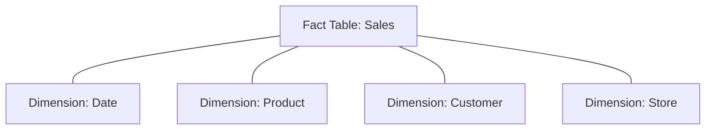
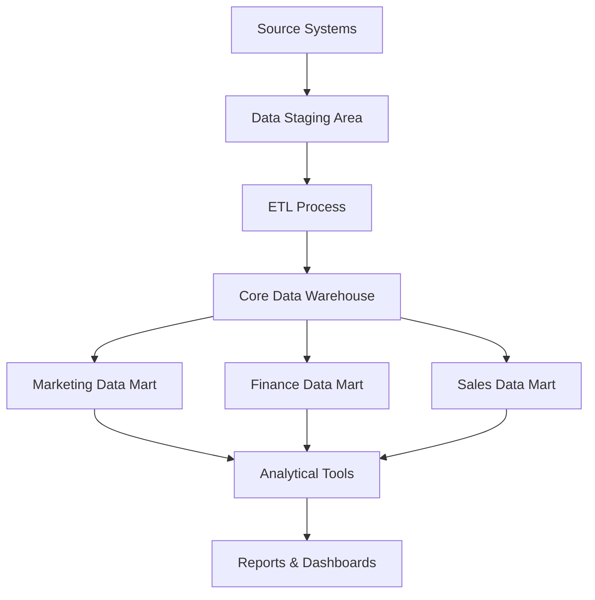

# Data Warehouse Concepts

## Introduction

A data warehouse is a central repository of integrated data from one or more disparate sources. It stores current and historical data that can be used for creating analytical reports for knowledge workers throughout an enterprise. The data stored in the warehouse is uploaded from operational systems such as marketing, sales, etc.

Data warehouses are designed to enable business intelligence (BI) activities: they support data analysis, reporting, and decision-making processes. Unlike operational databases that are optimized for transaction processing, data warehouses are optimized for query performance and data analysis.

## Core Concepts

### Dimensional Modeling

Dimensional modeling is a technique used in data warehouse design. It uses the concepts of **facts** and **dimensions** to organize data in a way that is intuitive and performs well for analytical queries.

- **Fact Tables**: Contain business metrics or measurements (like sales amount, quantity sold)
- **Dimension Tables**: Contain descriptive attributes (like product details, customer information, time periods)

This structure is often referred to as a **star schema** because of its shape when diagrammed:



### ETL Process

ETL stands for **Extract, Transform, Load** - the process used to collect data from various sources, transform it to suit business needs, and load it into the data warehouse.

1. **Extract**: Data is collected from source systems
2. **Transform**: Data is cleaned, standardized, and integrated
3. **Load**: Processed data is loaded into the data warehouse

Here's a simple example of an ETL process in Python using pandas:

```python
import pandas as pd

# Extract - Read data from multiple sources
sales_data = pd.read_csv('sales.csv')
product_data = pd.read_excel('products.xlsx')

# Transform - Clean and integrate data
# Convert date strings to datetime objects
sales_data['date'] = pd.to_datetime(sales_data['date'])

# Join sales data with product information
merged_data = sales_data.merge(
    product_data, 
    left_on='product_id', 
    right_on='id',
    how='left'
)

# Calculate additional metrics
merged_data['total_profit'] = merged_data['quantity'] * merged_data['profit_margin']

# Load - Save to data warehouse (simulated with CSV in this example)
merged_data.to_csv('data_warehouse_sales.csv', index=False)
```

### OLTP vs. OLAP

Two primary database system types serve different purposes:

| OLTP (Online Transaction Processing) | OLAP (Online Analytical Processing) |
|-------------------------------------|-------------------------------------|
| Handles day-to-day transactions | Handles complex queries for analysis |
| Optimized for INSERT, UPDATE, DELETE | Optimized for SELECT operations |
| Current data | Historical and current data |
| Normalized schema | Denormalized schema |
| Example: Order processing system | Example: Data warehouse |

## Data Warehouse Architecture

A typical data warehouse architecture has several components:

### 1. Source Systems

These are the operational systems that generate the data to be stored in the warehouse:
- Transaction processing systems
- CRM systems
- ERP systems
- External data sources

### 2. Data Staging Area

Before loading data into the warehouse, it's processed in a staging area:
- Data is extracted from source systems
- Transformations are applied
- Quality checks are performed

### 3. Core Data Warehouse

The central repository where data is stored in a structured format:
- Contains historical data
- Organized in dimensional models
- Optimized for query performance

### 4. Data Marts

Subsets of the data warehouse focused on specific business areas:
- Marketing data mart
- Finance data mart
- Sales data mart

### 5. Analytical Tools

Applications that connect to the data warehouse to generate insights:
- Reporting tools
- BI dashboards
- Data mining tools
- Ad-hoc query tools

Here's a visual representation of a typical data warehouse architecture:



## Types of Data Warehouses

### 1. Enterprise Data Warehouse (EDW)

A centralized warehouse that provides decision support service across the enterprise:
- Contains all corporate data
- Provides a unified view of the organization
- Requires significant investment and planning

### 2. Operational Data Store (ODS)

A database designed to integrate data from multiple sources:
- Contains current (not historical) data
- Used for operational reporting
- Refreshed in near real-time

### 3. Data Mart

A subset of a data warehouse that focuses on a specific business line or department:
- Smaller in scope and size than an EDW
- Faster to implement
- Often used as building blocks for larger warehouses

## Real-World Example: Retail Data Warehouse

Let's consider a retail company that wants to analyze its sales data across multiple stores and regions.

### Source Systems
- Point-of-Sale (POS) systems in each store
- Inventory management system
- Customer loyalty program database

### Fact Table: Sales
```
sale_id | date_key | product_key | store_key | customer_key | quantity | amount
--------|----------|-------------|-----------|--------------|----------|-------
1001    | 20230101 | 5001        | 302       | 10045        | 2        | 159.98
1002    | 20230101 | 6098        | 302       | 10087        | 1        | 49.99
```

### Dimension Tables

**Product Dimension:**
```
product_key | product_id | product_name     | category      | brand    | unit_price
------------|------------|------------------|---------------|----------|----------
5001        | SKU78901   | 4K Smart TV 55"  | Electronics   | TechPro  | 799.99
6098        | SKU45678   | Coffee Maker     | Home Appliances| HomeEase | 49.99
```

**Store Dimension:**
```
store_key | store_id | store_name      | city      | state | region
----------|----------|-----------------|-----------|-------|-------
302       | ST-4589  | Downtown Central| New York  | NY    | East
303       | ST-4590  | Westside Plaza  | Los Angeles| CA   | West
```

### Example Analytical Query

Using this structure, business analysts can easily answer questions like:
"What were the total sales by product category in the East region for the first quarter of 2023?"

```sql
SELECT 
    p.category,
    SUM(f.amount) as total_sales
FROM 
    fact_sales f
JOIN 
    dim_date d ON f.date_key = d.date_key
JOIN 
    dim_product p ON f.product_key = p.product_key
JOIN 
    dim_store s ON f.store_key = s.store_key
WHERE 
    s.region = 'East'
    AND d.quarter = 1
    AND d.year = 2023
GROUP BY 
    p.category
ORDER BY 
    total_sales DESC;
```

## Best Practices for Data Warehouse Design

1. **Start with business requirements**
   - Understand the questions that need answering
   - Identify key performance indicators (KPIs)

2. **Choose the right grain**
   - Define the appropriate level of detail for fact tables
   - Balance between detail and performance

3. **Design for scalability**
   - Plan for data growth
   - Consider partitioning large tables

4. **Implement slowly changing dimensions (SCDs)**
   - Type 1: Overwrite old data
   - Type 2: Maintain history by adding new rows
   - Type 3: Add new columns for specific attributes

5. **Establish data governance**
   - Define data ownership
   - Implement quality controls
   - Document metadata

## Challenges in Data Warehousing

1. **Data quality issues**
   - Inconsistent formats across source systems
   - Missing or duplicate data
   - Conflicting information

2. **Performance optimization**
   - Managing query performance as data volumes grow
   - Balancing between real-time needs and batch processing

3. **Changing business requirements**
   - Adapting the warehouse structure to new needs
   - Adding new dimensions or measures

4. **Integration complexity**
   - Dealing with diverse source systems
   - Handling different data formats and semantics

## Modern Data Warehouse Trends

### 1. Cloud Data Warehouses

Cloud-based solutions that offer scalability and reduced maintenance:
- Amazon Redshift
- Google BigQuery
- Snowflake
- Azure Synapse Analytics

Example: Setting up a simple connection to Snowflake in Python:

```python
import snowflake.connector

# Connect to Snowflake
conn = snowflake.connector.connect(
    user='username',
    password='password',
    account='account_identifier',
    warehouse='compute_warehouse',
    database='retail_dw',
    schema='public'
)

# Create a cursor object
cur = conn.cursor()

# Execute a query
cur.execute("SELECT category, SUM(amount) FROM fact_sales JOIN dim_product ON fact_sales.product_key = dim_product.product_key GROUP BY category")

# Fetch the results
for row in cur.fetchall():
    print(row)

# Close the connection
conn.close()
```

### 2. Data Lakes and Data Lakehouses

Newer architectures that combine the flexibility of data lakes with the structure of data warehouses:
- Store raw data in its native format
- Process data on-demand
- Support both structured and unstructured data

### 3. Real-Time Data Warehousing

Reducing the latency between transaction systems and analytical systems:
- Stream processing
- Change data capture (CDC)
- Near real-time analytics

## Summary

Data warehouses serve as the backbone of business intelligence by providing a centralized, structured repository for analytical data. They differ from operational databases in their design, purpose, and optimization techniques.

Key concepts we've covered include:
- Dimensional modeling with fact and dimension tables
- The ETL process for data integration
- Data warehouse architecture and components
- Types of data warehouses
- Best practices and challenges
- Modern trends in data warehousing

By understanding these fundamental concepts, you'll be well-equipped to start exploring data warehouse implementations and contribute to analytics projects in your organization.

## Exercises

1. Design a simple star schema for an e-commerce business with facts about orders and dimensions for customers, products, and time.

2. Write SQL queries to answer these business questions using the retail data warehouse example:
   - Which product categories have the highest profit margins?
   - Who are the top 10 customers by total purchase amount?
   - How do sales vary by day of week across different regions?

3. Create a simple ETL process using Python to extract data from a CSV file, transform it (e.g., clean missing values, format dates), and load it into a SQLite database.

## Additional Resources

- Books:
  - "The Data Warehouse Toolkit" by Ralph Kimball
  - "Building the Data Warehouse" by W.H. Inmon

- Online Courses:
  - Data Warehousing for Business Intelligence (Coursera)
  - Data Warehouse Concepts, Design, and Data Integration (Udemy)

- Tools to Explore:
  - Apache Airflow for ETL orchestration
  - dbt (data build tool) for transformation
  - Modern cloud data warehouses (Snowflake, BigQuery, Redshift)