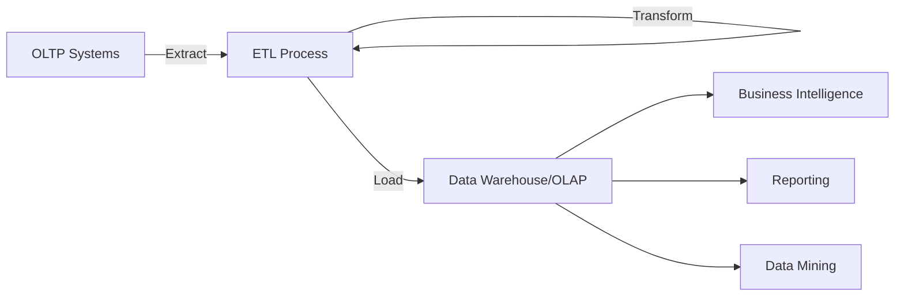

# OLTP vs OLAP

## Introduction

Database systems serve different purposes in an organization's data infrastructure. Two of the most important paradigms are **Online Transaction Processing (OLTP)** and **Online Analytical Processing (OLAP)**. These systems have different goals, architectures, and use cases, making them complementary rather than competitive technologies.

In this guide, we'll explore the fundamental differences between OLTP and OLAP systems, when to use each, and how they work together in modern data ecosystems.

## What is OLTP?

**Online Transaction Processing (OLTP)** refers to systems designed to manage transaction-oriented applications. These are the databases that power day-to-day operations of businesses.

### Key Characteristics of OLTP

- **Transaction-focused**: Handles large numbers of small, discrete transactions
- **Real-time processing**: Optimized for quick response times
- **Current data**: Works with current, operational data
- **Normalized structure**: Uses highly normalized database schemas
- **Row-oriented**: Data is stored and processed row by row
- **Concurrent users**: Supports many users executing transactions simultaneously

### Common OLTP Use Cases

- E-commerce websites (processing orders)
- Banking systems (account transactions)
- Airline reservation systems
- Inventory management
- Customer Relationship Management (CRM) systems

## What is OLAP?

**Online Analytical Processing (OLAP)** refers to systems designed for data analysis and business intelligence. These databases are optimized for complex queries that analyze large volumes of historical data.

### Key Characteristics of OLAP

- **Analysis-focused**: Designed for complex analytical queries
- **Batch processing**: Often processes data in scheduled batches
- **Historical data**: Works with historical data spanning months or years
- **Denormalized structure**: Often uses star or snowflake schemas
- **Column-oriented**: Frequently uses column-based storage for efficient analysis
- **Fewer users**: Supports fewer users running complex analytical queries

### Common OLAP Use Cases

- Business intelligence dashboards
- Sales trend analysis
- Financial planning and budgeting
- Market research
- Forecasting and predictive analytics

## Key Differences: OLTP vs OLAP

Let's compare these systems across several key dimensions:

| Characteristic | OLTP | OLAP |
|----------------|------|------|
| Primary Purpose | Process transactions | Analyze data |
| Data Scope | Current operational data | Historical data |
| Database Design | Highly normalized | Often denormalized (star/snowflake schema) |
| Query Type | Simple, standardized queries | Complex analytical queries |
| Processing Speed | Milliseconds | Seconds to minutes |
| Data Updates | Frequent, small updates | Periodic batch updates |
| Space Requirements | Generally smaller (GBs) | Much larger (TBs or PBs) |
| Backup/Recovery | Critical, frequent backups | Important but less time-sensitive |
| User Audience | Operational staff, customers | Analysts, executives, data scientists |

## Database Schema Examples

### OLTP Schema Example

In an OLTP system for an e-commerce platform, you might have normalized tables like:

```sql
CREATE TABLE Customers (
    customer_id INT PRIMARY KEY,
    name VARCHAR(100),
    email VARCHAR(100),
    address VARCHAR(200),
    created_at TIMESTAMP
);

CREATE TABLE Products (
    product_id INT PRIMARY KEY,
    name VARCHAR(100),
    description TEXT,
    price DECIMAL(10,2),
    stock_quantity INT
);

CREATE TABLE Orders (
    order_id INT PRIMARY KEY,
    customer_id INT,
    order_date TIMESTAMP,
    total_amount DECIMAL(10,2),
    status VARCHAR(50),
    FOREIGN KEY (customer_id) REFERENCES Customers(customer_id)
);

CREATE TABLE OrderItems (
    order_item_id INT PRIMARY KEY,
    order_id INT,
    product_id INT,
    quantity INT,
    unit_price DECIMAL(10,2),
    FOREIGN KEY (order_id) REFERENCES Orders(order_id),
    FOREIGN KEY (product_id) REFERENCES Products(product_id)
);
```

### OLAP Schema Example

In contrast, an OLAP system might use a star schema for the same e-commerce data:

```sql
CREATE TABLE DimCustomer (
    customer_key INT PRIMARY KEY,
    customer_id INT, -- original ID from source system
    name VARCHAR(100),
    email VARCHAR(100),
    city VARCHAR(50),
    state VARCHAR(50),
    country VARCHAR(50),
    customer_since_date DATE
);

CREATE TABLE DimProduct (
    product_key INT PRIMARY KEY,
    product_id INT, -- original ID from source system
    name VARCHAR(100),
    category VARCHAR(50),
    subcategory VARCHAR(50),
    price_tier VARCHAR(20),
    manufacturer VARCHAR(100)
);

CREATE TABLE DimDate (
    date_key INT PRIMARY KEY,
    full_date DATE,
    day_of_week VARCHAR(10),
    day_of_month INT,
    month INT,
    month_name VARCHAR(10),
    quarter INT,
    year INT,
    is_holiday BOOLEAN
);

CREATE TABLE FactSales (
    sale_key INT PRIMARY KEY,
    customer_key INT,
    product_key INT,
    date_key INT,
    order_id INT,
    quantity INT,
    unit_price DECIMAL(10,2),
    discount_amount DECIMAL(10,2),
    sales_amount DECIMAL(10,2),
    profit_amount DECIMAL(10,2),
    FOREIGN KEY (customer_key) REFERENCES DimCustomer(customer_key),
    FOREIGN KEY (product_key) REFERENCES DimProduct(product_key),
    FOREIGN KEY (date_key) REFERENCES DimDate(date_key)
);
```

## Data Flow Between OLTP and OLAP

In a typical organization, data flows from OLTP systems to OLAP systems through a process called ETL (Extract, Transform, Load):



1. **Extract**: Data is extracted from one or more OLTP systems
2. **Transform**: Data is cleaned, validated, and transformed to fit the OLAP schema
3. **Load**: Transformed data is loaded into the OLAP system (data warehouse)

## Practical Example: E-commerce Analytics

Let's look at how OLTP and OLAP work together in an e-commerce context:

### OLTP Query Example

Finding current inventory for a product (operational task):

```sql
SELECT product_id, name, stock_quantity
FROM Products
WHERE product_id = 1234;
```

Processing a new order (transactional):

```sql
BEGIN TRANSACTION;

-- Insert order record
INSERT INTO Orders (customer_id, order_date, total_amount, status)
VALUES (101, CURRENT_TIMESTAMP, 129.99, 'Processing');

-- Get the new order_id
SET @new_order_id = LAST_INSERT_ID();

-- Insert order items
INSERT INTO OrderItems (order_id, product_id, quantity, unit_price)
VALUES 
    (@new_order_id, 1234, 2, 49.99),
    (@new_order_id, 5678, 1, 30.01);

-- Update inventory
UPDATE Products
SET stock_quantity = stock_quantity - 2
WHERE product_id = 1234;

UPDATE Products
SET stock_quantity = stock_quantity - 1
WHERE product_id = 5678;

COMMIT;
```

### OLAP Query Example

Analyzing sales trends over time (analytical task):

```sql
SELECT 
    d.year,
    d.quarter,
    dp.category,
    SUM(fs.sales_amount) as total_sales,
    COUNT(DISTINCT fs.customer_key) as unique_customers
FROM 
    FactSales fs
    JOIN DimDate d ON fs.date_key = d.date_key
    JOIN DimProduct dp ON fs.product_key = dp.product_key
WHERE 
    d.year BETWEEN 2020 AND 2023
GROUP BY 
    d.year, d.quarter, dp.category
ORDER BY 
    d.year, d.quarter, total_sales DESC;
```

Finding the top-performing products by profit margin:

```sql
SELECT 
    dp.name as product_name,
    dp.category,
    SUM(fs.sales_amount) as total_sales,
    SUM(fs.profit_amount) as total_profit,
    (SUM(fs.profit_amount) / SUM(fs.sales_amount)) * 100 as profit_margin_percentage
FROM 
    FactSales fs
    JOIN DimProduct dp ON fs.product_key = dp.product_key
    JOIN DimDate d ON fs.date_key = d.date_key
WHERE 
    d.year = 2023
GROUP BY 
    dp.product_key, dp.name, dp.category
ORDER BY 
    profit_margin_percentage DESC
LIMIT 10;
```

## Real-world Implementation Considerations

When implementing OLTP and OLAP systems, consider:

### OLTP Systems

- Use database systems optimized for transactions (MySQL, PostgreSQL, SQL Server)
- Implement proper indexing for quick lookups
- Design for high concurrency and minimal locking
- Regular backups and disaster recovery plans
- Prioritize data integrity with constraints and validation

### OLAP Systems

- Consider specialized analytical databases (Snowflake, Redshift, BigQuery)
- Implement proper partitioning strategies for large tables
- Optimize for read performance with columnar storage
- Plan for scalability as data volumes grow
- Create materialized views for common analytical queries

## Modern Trends: Bridging OLTP and OLAP

Recent developments are blurring the line between OLTP and OLAP:

1. **HTAP (Hybrid Transactional/Analytical Processing)**: Systems designed to handle both transaction processing and analytical workloads
2. **Real-time analytics**: Reducing the delay between transaction processing and data analysis
3. **Data lakehouse architecture**: Combining data warehouse capabilities with the flexibility of data lakes

Examples of HTAP systems include:

- SingleStore (formerly MemSQL)
- SAP HANA
- Oracle Database In-Memory
- Apache Pinot

## Summary

OLTP and OLAP systems serve different but complementary purposes in a data ecosystem:

- **OLTP systems** manage the day-to-day operational transactions that keep a business running
- **OLAP systems** provide the analytical capabilities to derive insights from historical data

Understanding the differences and relationships between these systems is crucial for designing effective data architectures that support both operational efficiency and analytical capabilities.

## Exercises

1. **Design Exercise**: Create an OLTP schema for a library management system, then design the corresponding OLAP star schema for analyzing lending patterns.

2. **Query Exercise**: Write sample OLTP and OLAP queries for the library system you designed above.

3. **ETL Exercise**: Outline the steps you would take to transfer data from your OLTP library system to the OLAP system, including any transformations needed.

4. **Analysis Exercise**: For the library OLAP system, write analytical queries that would help librarians make decisions about book acquisitions.

5. **Research Exercise**: Investigate a modern HTAP system and describe how it attempts to combine OLTP and OLAP capabilities.
