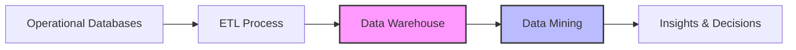

# Data Mining Introduction

## What is Data Mining?

Data mining is the process of discovering patterns, correlations, and insights from large datasets. It combines techniques from statistics, machine learning, and database systems to extract valuable information that can help in decision-making processes.

Think of data mining as panning for gold in a river - you're sifting through large amounts of raw material (data) to find valuable nuggets (insights) that were previously hidden.

## Why Data Mining is Important

In today's digital world, organizations collect vast amounts of data every day. Without proper tools to analyze this data, its value remains locked away. Data mining helps to:

- Discover hidden patterns and relationships
- Predict future trends and behaviors
- Make data-driven business decisions
- Automate the process of finding critical information
- Transform raw data into business intelligence

## The Relationship Between Data Warehousing and Data Mining



Data warehousing and data mining are complementary technologies:

- **Data Warehousing**: Focuses on collecting, integrating, and storing data from various sources in a structured, accessible format
- **Data Mining**: Focuses on analyzing that data to discover meaningful patterns and generate insights

A data warehouse provides the consolidated, clean data that makes effective data mining possible.

## The Data Mining Process

Data mining follows a structured process:

1. **Business Understanding**: Define objectives and requirements
2. **Data Understanding**: Collect and explore initial data
3. **Data Preparation**: Clean, transform, and format data
4. **Modeling**: Apply data mining techniques and algorithms
5. **Evaluation**: Assess the results against business objectives
6. **Deployment**: Implement the findings into business processes

### Data Preparation for Mining

Before applying data mining techniques, data must be properly prepared:

```python
# Example of data preparation using pandas
import pandas as pd
import numpy as np

# Load the dataset
data = pd.read_csv('sales_data.csv')

# 1. Handle missing values
data.fillna(data.mean(), inplace=True)

# 2. Remove outliers
def remove_outliers(df, column):
    Q1 = df[column].quantile(0.25)
    Q3 = df[column].quantile(0.75)
    IQR = Q3 - Q1
    lower_bound = Q1 - 1.5 * IQR
    upper_bound = Q3 + 1.5 * IQR
    return df[(df[column] >= lower_bound) & (df[column] <= upper_bound)]

data = remove_outliers(data, 'purchase_amount')

# 3. Normalize numerical features
data['purchase_amount_normalized'] = (data['purchase_amount'] - data['purchase_amount'].min()) / (data['purchase_amount'].max() - data['purchase_amount'].min())

# 4. Encode categorical variables
data = pd.get_dummies(data, columns=['category', 'payment_method'])

print("Data ready for mining!")
```

## Common Data Mining Techniques

### 1. Classification

Classification predicts categorical class labels based on past observations. It's widely used for:
- Spam detection
- Customer churn prediction
- Credit approval

**Example: Decision Tree for Customer Churn Prediction**

```python
from sklearn.tree import DecisionTreeClassifier
from sklearn.model_selection import train_test_split
from sklearn.metrics import accuracy_score

# Prepare features and target
X = data.drop('churned', axis=1)
y = data['churned']

# Split data
X_train, X_test, y_train, y_test = train_test_split(X, y, test_size=0.3, random_state=42)

# Create and train the model
dt_model = DecisionTreeClassifier(max_depth=5)
dt_model.fit(X_train, y_train)

# Make predictions
y_pred = dt_model.predict(X_test)

# Evaluate the model
accuracy = accuracy_score(y_test, y_pred)
print(f"Accuracy: {accuracy:.2f}")

# Output:
# Accuracy: 0.87
```

### 2. Clustering

Clustering groups similar objects together based on their characteristics. Unlike classification, it doesn't use predefined classes.

**Example: K-Means Clustering for Customer Segmentation**

```python
from sklearn.cluster import KMeans
import matplotlib.pyplot as plt

# Select features for clustering
X = data[['annual_income', 'spending_score']]

# Find optimal number of clusters using the Elbow method
wcss = []
for i in range(1, 11):
    kmeans = KMeans(n_clusters=i, init='k-means++', random_state=42)
    kmeans.fit(X)
    wcss.append(kmeans.inertia_)

# Apply K-means with the optimal number of clusters
kmeans = KMeans(n_clusters=5, init='k-means++', random_state=42)
y_kmeans = kmeans.fit_predict(X)

# Adding cluster labels to original data
data['cluster'] = y_kmeans

# Print the characteristics of each cluster
for cluster in range(5):
    print(f"Cluster {cluster}:")
    print(data[data['cluster'] == cluster][['annual_income', 'spending_score']].mean())
    print("-" * 30)

# Output:
# Cluster 0:
# annual_income    86532.15
# spending_score      82.13
# ------------------------------
# ...
```

### 3. Association Rule Mining

Association rule mining discovers interesting relationships between variables in large datasets. It's commonly used for market basket analysis.

**Example: Apriori Algorithm for Market Basket Analysis**

```python
from mlxtend.frequent_patterns import apriori, association_rules

# Convert transaction data to one-hot encoded format
basket_encoded = pd.get_dummies(transactions)

# Apply Apriori algorithm to find frequent itemsets
frequent_itemsets = apriori(basket_encoded, min_support=0.05, use_colnames=True)

# Generate association rules
rules = association_rules(frequent_itemsets, metric="lift", min_threshold=1.0)

# Display top rules by lift
print(rules.sort_values('lift', ascending=False).head())

# Output:
#   antecedents consequents  support  confidence  lift
# 0  (bread)     (butter)    0.21      0.67      3.14
# ...
```

### 4. Regression

Regression predicts continuous numerical values based on input features.

**Example: Linear Regression for Sales Prediction**

```python
from sklearn.linear_model import LinearRegression
import numpy as np
import matplotlib.pyplot as plt

# Create sample data
X = data[['advertising_spend']].values
y = data['sales'].values

# Split data
X_train, X_test, y_train, y_test = train_test_split(X, y, test_size=0.2, random_state=42)

# Create and train the model
model = LinearRegression()
model.fit(X_train, y_train)

# Make predictions
y_pred = model.predict(X_test)

# Calculate R-squared
r_squared = model.score(X_test, y_test)
print(f"R-squared: {r_squared:.2f}")
print(f"Coefficient: {model.coef_[0]:.2f}")
print(f"Intercept: {model.intercept_:.2f}")

# Output:
# R-squared: 0.73
# Coefficient: 0.85
# Intercept: 12.43
```

## Real-World Applications of Data Mining

### E-Commerce Recommendations

Online retailers like Amazon use data mining to analyze customer purchasing patterns and browsing behavior to recommend products.

```python
# Simplified recommendation system using collaborative filtering
from sklearn.metrics.pairwise import cosine_similarity

# User-item matrix
user_item_matrix = pd.pivot_table(
    ratings_data, 
    values='rating',
    index='user_id',
    columns='product_id'
).fillna(0)

# Calculate similarity between users
user_similarity = cosine_similarity(user_item_matrix)

# Function to get top recommendations for a user
def get_recommendations(user_id, top_n=5):
    user_idx = list(user_item_matrix.index).index(user_id)
    
    # Get similar users
    similar_users = list(enumerate(user_similarity[user_idx]))
    similar_users = sorted(similar_users, key=lambda x: x[1], reverse=True)[1:]
    
    # Get items that similar users liked but target user hasn't rated
    recommendations = {}
    for similar_user_idx, similarity_score in similar_users:
        similar_user_id = user_item_matrix.index[similar_user_idx]
        
        # Get items rated highly by this similar user
        similar_user_ratings = ratings_data[ratings_data['user_id'] == similar_user_id]
        
        for _, row in similar_user_ratings.iterrows():
            product_id = row['product_id']
            rating = row['rating']
            
            # Skip if target user already rated this item
            if user_item_matrix.loc[user_id, product_id] > 0:
                continue
                
            # Add to recommendations with weighted score
            if product_id not in recommendations:
                recommendations[product_id] = similarity_score * rating
    
    # Sort and return top N recommendations
    top_recommendations = sorted(recommendations.items(), key=lambda x: x[1], reverse=True)[:top_n]
    return top_recommendations

# Example usage
print(get_recommendations(user_id=42))
```

### Healthcare Diagnostics

Data mining helps in early disease detection, patient segmentation, and treatment optimization:

- Analyzing patterns in patient data to identify risk factors
- Clustering patients with similar health profiles
- Predicting disease outbreaks based on geographical and temporal data

### Fraud Detection in Financial Services

Banks and credit card companies use data mining to identify suspicious transactions:

```python
# Simplified anomaly detection for fraud
from sklearn.ensemble import IsolationForest

# Prepare features for fraud detection
features = transactions[['amount', 'time_since_last_transaction', 'distance_from_home']]

# Train isolation forest model
model = IsolationForest(contamination=0.01, random_state=42)
model.fit(features)

# Score transactions (negative scores indicate anomalies)
transactions['anomaly_score'] = model.decision_function(features)
transactions['is_anomaly'] = model.predict(features)

# Flag potential fraud
potential_fraud = transactions[transactions['is_anomaly'] == -1]
print(f"Number of potentially fraudulent transactions detected: {len(potential_fraud)}")
```

## Challenges in Data Mining

While data mining offers significant benefits, it also comes with challenges:

1. **Data Quality Issues**: Incomplete, noisy, or inconsistent data can lead to incorrect results
2. **Privacy Concerns**: Mining personal data raises ethical and legal questions
3. **Scalability**: Processing extremely large datasets requires significant computational resources
4. **Selecting Appropriate Techniques**: Different problems require different algorithms
5. **Interpreting Results**: Translating complex patterns into actionable insights

## Data Mining Tools and Technologies

Several tools are available for data mining:

- **Python Libraries**: scikit-learn, pandas, NumPy
- **R Packages**: dplyr, ggplot2, caret
- **Commercial Software**: SAS, IBM SPSS Modeler, RapidMiner
- **Big Data Platforms**: Apache Spark MLlib, Hadoop

## Summary

Data mining is a powerful process for discovering hidden patterns and insights in large datasets. It combines techniques from statistics, machine learning, and database systems to transform raw data into valuable business intelligence.

Key points to remember:
- Data mining works best with properly prepared data from a data warehouse
- Common techniques include classification, clustering, association rule mining, and regression
- Real-world applications span e-commerce, healthcare, finance, and many other domains
- Effective data mining requires addressing challenges related to data quality, privacy, and interpretation

## Exercises

1. **Beginner**: Download a small dataset (e.g., Iris dataset) and practice data preparation steps like handling missing values and normalization.

2. **Intermediate**: Implement a k-means clustering algorithm on customer transaction data to identify distinct customer segments.

3. **Advanced**: Build a complete data mining pipeline for a specific business problem, including data preparation, model selection, evaluation, and interpretation.

## Additional Resources

- **Books**:
  - "Data Mining: Concepts and Techniques" by Jiawei Han and Micheline Kamber
  - "Python for Data Analysis" by Wes McKinney

- **Online Courses**:
  - Stanford's "Mining Massive Datasets" course
  - Coursera's "Data Mining Specialization"

- **Communities**:
  - Kaggle (www.kaggle.com)
  - Cross Validated (stats.stackexchange.com)