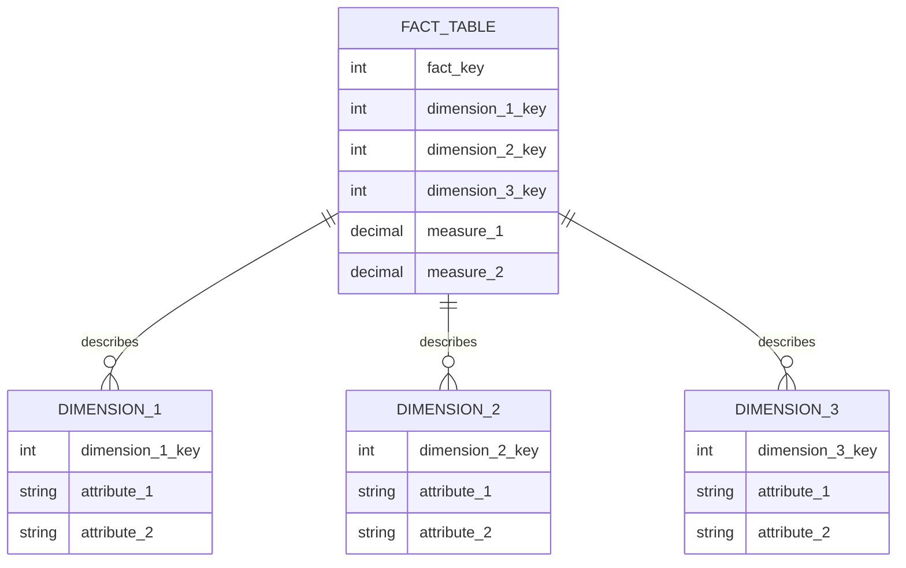
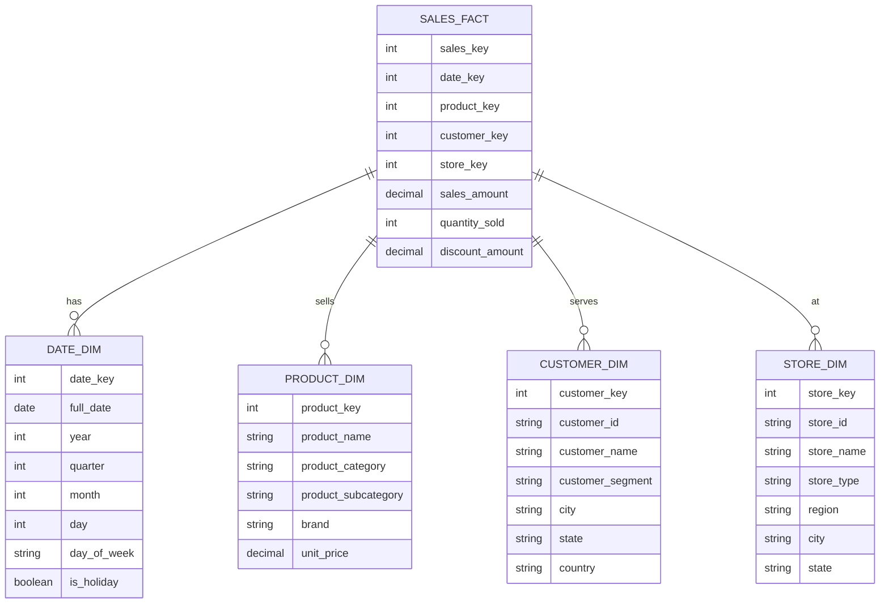
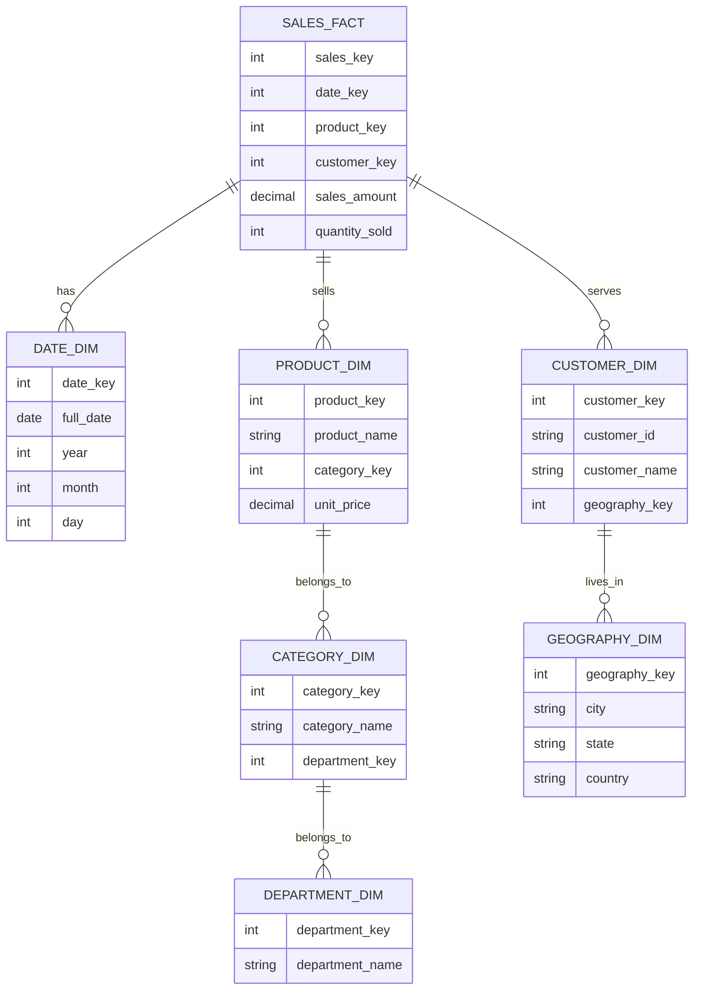
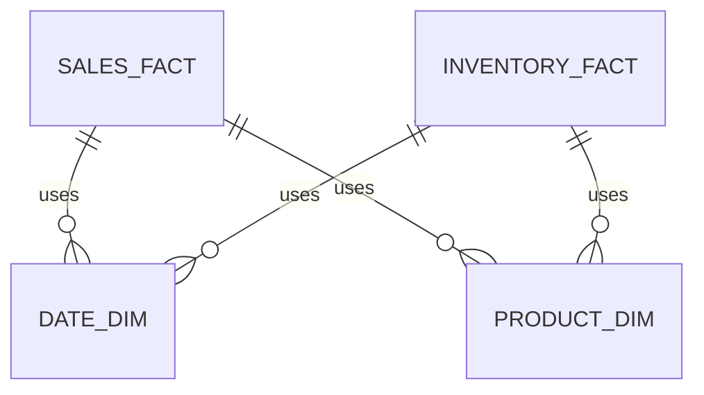

# Dimensional Modeling

## Introduction

Dimensional modeling is a database design technique that optimizes database structures for analytical queries and reporting. Unlike traditional entity-relationship modeling, which focuses on eliminating data redundancy, dimensional modeling prioritizes query performance and user understanding. It's a cornerstone concept in data warehousing that structures data in a way that's intuitive for business users while ensuring fast query execution.

In this guide, we'll explore the fundamental concepts of dimensional modeling, learn how to implement various schemas, and see real-world applications of these principles.

## Key Concepts of Dimensional Modeling

### The Business Process Perspective

Dimensional modeling starts with identifying business processes (like sales, orders, or inventory) that generate measurable events (facts). These facts become the focal points for analysis.

### Fact Tables and Dimension Tables

The two primary components of dimensional models are:

1. **Fact Tables**: Store quantitative metrics (measurements) of business processes
2. **Dimension Tables**: Provide the context for facts through descriptive attributes

Let's visualize this relationship:



## Types of Schemas in Dimensional Modeling

### Star Schema

The star schema is the simplest and most common form of dimensional modeling. It consists of one central fact table connected to multiple dimension tables, resembling a star pattern.



### Snowflake Schema

The snowflake schema is a variation of the star schema where dimension tables are normalized into multiple related tables, creating a snowflake pattern.



## Fact Table Types

### 1. Transaction Fact Tables

These capture events at a specific point in time (e.g., individual sales transactions).

**Example schema:**

```sql
CREATE TABLE sales_fact (
    sales_key INT PRIMARY KEY,
    date_key INT REFERENCES date_dim(date_key),
    product_key INT REFERENCES product_dim(product_key),
    customer_key INT REFERENCES customer_dim(customer_key),
    store_key INT REFERENCES store_dim(store_key),
    sales_amount DECIMAL(10,2),
    quantity_sold INT,
    discount_amount DECIMAL(10,2)
);
```

### 2. Periodic Snapshot Fact Tables

These capture the state of metrics at regular intervals (e.g., monthly inventory levels).

**Example schema:**

```sql
CREATE TABLE inventory_snapshot_fact (
    inventory_snapshot_key INT PRIMARY KEY,
    date_key INT REFERENCES date_dim(date_key),
    product_key INT REFERENCES product_dim(product_key),
    warehouse_key INT REFERENCES warehouse_dim(warehouse_key),
    quantity_on_hand INT,
    quantity_on_order INT,
    inventory_value DECIMAL(12,2)
);
```

### 3. Accumulating Snapshot Fact Tables

These track the progress of a process with multiple milestones (e.g., order processing).

**Example schema:**

```sql
CREATE TABLE order_pipeline_fact (
    order_key INT PRIMARY KEY,
    order_date_key INT REFERENCES date_dim(date_key),
    customer_key INT REFERENCES customer_dim(customer_key),
    product_key INT REFERENCES product_dim(product_key),
    order_placed_date_key INT REFERENCES date_dim(date_key),
    order_approved_date_key INT REFERENCES date_dim(date_key),
    shipped_date_key INT REFERENCES date_dim(date_key),
    delivered_date_key INT REFERENCES date_dim(date_key),
    order_amount DECIMAL(10,2),
    shipping_amount DECIMAL(10,2)
);
```

## Dimension Table Techniques

### 1. Slowly Changing Dimensions (SCDs)

Dimensions that change over time require special handling. Here are the most common approaches:

#### Type 1 SCD: Overwrite

Simply update the dimension attribute with the new value, losing historical information.

```sql
UPDATE customer_dim
SET customer_address = '123 New Street'
WHERE customer_key = 1001;
```

#### Type 2 SCD: Add New Row

Create a new row with the updated information, preserving history.

```sql
-- Original row (now expired)
-- customer_key = 1001, customer_id = 'C001', customer_address = '456 Old Road', 
-- valid_from = '2023-01-01', valid_to = '2023-06-14', is_current = false

-- New row (current)
INSERT INTO customer_dim (
    customer_key, customer_id, customer_address, valid_from, valid_to, is_current
) VALUES (
    1002, 'C001', '123 New Street', '2023-06-15', NULL, true
);
```

#### Type 3 SCD: Add New Attribute

Add new columns to track current and previous values.

```sql
-- Schema with previous value columns
CREATE TABLE customer_dim (
    customer_key INT PRIMARY KEY,
    customer_id VARCHAR(10),
    current_address VARCHAR(100),
    previous_address VARCHAR(100),
    address_change_date DATE
);

-- Updating with Type 3 approach
UPDATE customer_dim
SET 
    previous_address = current_address,
    current_address = '123 New Street',
    address_change_date = '2023-06-15'
WHERE customer_key = 1001;
```

### 2. Conformed Dimensions

Dimensions shared across multiple fact tables to ensure consistent analysis.



### 3. Role-Playing Dimensions

A single dimension table that appears multiple times in a fact table with different roles.

```sql
CREATE TABLE date_dim (
    date_key INT PRIMARY KEY,
    full_date DATE,
    year INT,
    month INT,
    day INT
);

CREATE TABLE order_fact (
    order_key INT PRIMARY KEY,
    order_date_key INT REFERENCES date_dim(date_key),  -- Order date role
    ship_date_key INT REFERENCES date_dim(date_key),   -- Ship date role
    delivery_date_key INT REFERENCES date_dim(date_key), -- Delivery date role
    customer_key INT REFERENCES customer_dim(customer_key),
    order_amount DECIMAL(10,2)
);
```

## Practical Implementation Example

Let's implement a simple dimensional model for an e-commerce sales analysis system.

### Step 1: Identify the Business Process

We'll model the sales process, which measures product sales to customers.

### Step 2: Define Granularity

We'll track individual line items in sales orders.

### Step 3: Identify Dimensions and Facts

**Dimensions**:
- Date (when)
- Product (what)
- Customer (who)
- Location (where)
- Promotion (how)

**Facts**:
- Quantity sold
- Sale amount
- Discount amount
- Net amount

### Step 4: Create the Schema

```sql
-- Dimension tables
CREATE TABLE dim_date (
    date_key INT PRIMARY KEY,
    full_date DATE,
    day_of_week VARCHAR(10),
    day_num_in_month INT,
    month_name VARCHAR(10),
    month_num INT,
    quarter INT,
    year INT,
    is_weekend BOOLEAN,
    is_holiday BOOLEAN
);

CREATE TABLE dim_product (
    product_key INT PRIMARY KEY,
    product_id VARCHAR(20),
    product_name VARCHAR(100),
    description TEXT,
    category VARCHAR(50),
    subcategory VARCHAR(50),
    brand VARCHAR(50),
    unit_cost DECIMAL(10,2),
    unit_price DECIMAL(10,2),
    launch_date DATE
);

CREATE TABLE dim_customer (
    customer_key INT PRIMARY KEY,
    customer_id VARCHAR(20),
    first_name VARCHAR(50),
    last_name VARCHAR(50),
    email VARCHAR(100),
    phone VARCHAR(20),
    address TEXT,
    city VARCHAR(50),
    state VARCHAR(50),
    country VARCHAR(50),
    postal_code VARCHAR(20),
    join_date DATE,
    customer_segment VARCHAR(20)
);

CREATE TABLE dim_location (
    location_key INT PRIMARY KEY,
    store_id VARCHAR(20),
    store_name VARCHAR(100),
    address TEXT,
    city VARCHAR(50),
    state VARCHAR(50),
    country VARCHAR(50),
    postal_code VARCHAR(20),
    region VARCHAR(50),
    store_type VARCHAR(20),
    open_date DATE
);

CREATE TABLE dim_promotion (
    promotion_key INT PRIMARY KEY,
    promotion_id VARCHAR(20),
    promotion_name VARCHAR(100),
    description TEXT,
    discount_type VARCHAR(20),
    discount_value DECIMAL(10,2),
    start_date DATE,
    end_date DATE,
    campaign VARCHAR(50)
);

-- Fact table
CREATE TABLE fact_sales (
    sales_key INT PRIMARY KEY,
    order_id VARCHAR(20),
    line_number INT,
    date_key INT REFERENCES dim_date(date_key),
    product_key INT REFERENCES dim_product(product_key),
    customer_key INT REFERENCES dim_customer(customer_key),
    location_key INT REFERENCES dim_location(location_key),
    promotion_key INT REFERENCES dim_promotion(promotion_key),
    quantity INT,
    unit_price DECIMAL(10,2),
    extended_price DECIMAL(10,2),
    discount_amount DECIMAL(10,2),
    net_amount DECIMAL(10,2),
    tax_amount DECIMAL(10,2),
    total_amount DECIMAL(10,2)
);
```

### Step 5: Sample Queries

Here's how business users might query this dimensional model:

**1. Monthly Sales by Product Category**

```sql
SELECT 
    d.year,
    d.month_name,
    p.category,
    SUM(f.net_amount) AS total_sales
FROM 
    fact_sales f
    JOIN dim_date d ON f.date_key = d.date_key
    JOIN dim_product p ON f.product_key = p.product_key
GROUP BY 
    d.year,
    d.month_name,
    p.category
ORDER BY 
    d.year,
    d.month_num,
    p.category;
```

**2. Sales by Customer Segment and Store Region**

```sql
SELECT 
    c.customer_segment,
    l.region,
    COUNT(DISTINCT f.order_id) AS num_orders,
    SUM(f.quantity) AS total_items,
    SUM(f.net_amount) AS total_sales
FROM 
    fact_sales f
    JOIN dim_customer c ON f.customer_key = c.customer_key
    JOIN dim_location l ON f.location_key = l.location_key
GROUP BY 
    c.customer_segment,
    l.region
ORDER BY 
    total_sales DESC;
```

**3. Promotion Effectiveness**

```sql
SELECT 
    p.promotion_name,
    COUNT(DISTINCT f.order_id) AS num_orders,
    SUM(f.quantity) AS total_items,
    SUM(f.discount_amount) AS total_discount,
    SUM(f.net_amount) AS total_sales,
    (SUM(f.discount_amount) / SUM(f.extended_price)) * 100 AS discount_percentage
FROM 
    fact_sales f
    JOIN dim_promotion p ON f.promotion_key = p.promotion_key
WHERE 
    f.promotion_key != 0  -- Exclude non-promotional sales
GROUP BY 
    p.promotion_name
ORDER BY 
    total_discount DESC;
```

## Real-World Applications

### Retail Analytics

A retail company can use dimensional modeling to analyze:
- Sales performance by product, store, and time
- Inventory levels and turnover rates
- Customer purchasing behaviors
- Promotion effectiveness

### Financial Services

A bank can use dimensional modeling to analyze:
- Transaction patterns by account type and customer segment
- Loan performance over time
- Branch productivity metrics
- Customer profitability

### Healthcare

A healthcare organization can use dimensional modeling to analyze:
- Patient admission patterns
- Treatment outcomes by procedure and physician
- Resource utilization
- Insurance claim processing efficiency

## Best Practices for Dimensional Modeling

1. **Start with business requirements**: Design your model based on the actual questions business users need to answer.

2. **Use surrogate keys**: Implement system-generated integer keys instead of relying on business keys.

3. **Denormalize dimension tables**: Add redundant attributes to dimension tables to simplify queries and improve performance.

4. **Use conformed dimensions**: Standardize shared dimensions across the enterprise for consistent analysis.

5. **Define clear naming conventions**: Develop naming standards for tables, columns, and relationships.

6. **Design for extensibility**: Anticipate future additions of dimensions and facts.

7. **Consider query patterns**: Optimize for the most common and important queries.

8. **Document everything**: Maintain comprehensive metadata about your dimensional model.

## Summary

Dimensional modeling is a powerful approach to designing data warehouses that prioritizes query performance and user understanding. By organizing data into fact and dimension tables, typically in star or snowflake schemas, dimensional models support intuitive business analysis.

Key concepts we covered include:
- Fact tables (containing measurable business events)
- Dimension tables (providing descriptive context)
- Star and snowflake schemas
- Different types of fact tables (transaction, periodic snapshot, accumulating snapshot)
- Dimension table techniques (SCDs, conformed dimensions, role-playing dimensions)

By following dimensional modeling principles, you can create data warehouses that are both performance-optimized and user-friendly, enabling business users to extract meaningful insights from their data.

## Exercises

1. Design a star schema for tracking student performance in an online learning platform. Identify the relevant fact and dimension tables.

2. For a given product dimension table, implement Type 1, Type 2, and Type 3 slowly changing dimension approaches to handle changes in product categories.

3. Design an accumulating snapshot fact table for an order processing system that tracks orders from placement to delivery.

4. Create a dimensional model to analyze website traffic, including dimensions for time, page, referrer, and visitor.

5. Write SQL queries for a dimensional model to answer these business questions:
   - Which products had the highest growth in sales over the last year?
   - Which customer segments are most responsive to promotions?
   - What are the sales trends by region and season?

## Additional Resources

- **Books**:
  - "The Data Warehouse Toolkit" by Ralph Kimball
  - "Star Schema: The Complete Reference" by Christopher Adamson
  - "Agile Data Warehouse Design" by Lawrence Corr

- **Online Courses**:
  - Data Warehousing fundamentals courses on major learning platforms
  - Dimensional modeling workshops

- **Tools**:
  - Data modeling tools like ER/Studio, PowerDesigner, or Erwin
  - Modern data warehousing platforms like Snowflake, BigQuery, and Redshift